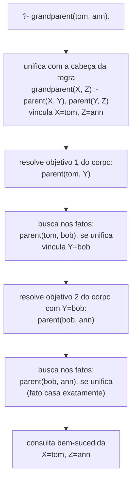

## Objetivos de Aprendizagem

- Descrever um programa lógico como um banco de dados de fatos e regras, e distinguir um fato de uma regra sintática e semanticamente.
- Rastrear como uma consulta se resolve contra uma base de fatos através de unificação, incluindo como variáveis são vinculadas passo a passo.
- Escrever uma pequena regra estilo Prolog que deriva um novo relacionamento (ex: `grandparent`) a partir de fatos armazenados mais básicos (ex: `parent`).
- Explicar por que programação lógica é considerada declarativa, uma consulta enuncia qual relacionamento está sendo perguntado, não o procedimento de busca usado para encontrá-lo.
- Enunciar honestamente onde programação lógica se situa no currículo moderno de CC em relação a programação orientada a objetos e funcional.

## Contexto e Motivação

Você já conheceu o vocabulário de lógica de predicados, um predicado como `parent(x, y)` é um modelo de enunciado que se torna verdadeiro ou falso só depois que suas variáveis são fixadas, e quantificadores como ∀ e ∃ permitem dizer "para todo x" ou "existe um y" sem listar casos um de cada vez. Aquela maquinaria era, até agora, algo que *você* usava com lápis e papel para enunciar e avaliar afirmações. Programação lógica é a ideia de entregar essa mesma maquinaria a uma *máquina* e pedir a ela para fazer a busca por você: um programa se torna uma coleção de fatos e regras de lógica de predicados, e uma pergunta que você faz ao programa, uma consulta, é respondida por um procedimento de busca automático chamado **unificação**, que tenta casar a consulta contra o que está armazenado, vinculando variáveis conforme avança, até encontrar uma resposta ou esgotar as possibilidades.

Esta é uma forma genuinamente diferente de dizer a um computador o que fazer. Em todo paradigma coberto em outro lugar nesta disciplina, imperativo, orientado a objetos, funcional, você ainda está, de uma forma ou de outra, descrevendo um *procedimento*: uma sequência de passos, um conjunto de chamadas de método, uma cadeia de aplicações de função, que a máquina executa para produzir um resultado. Em programação lógica, você descreve *relacionamentos*, `parent(tom, bob)` é verdadeiro, `grandparent(X, Z)` vale sempre que algum `Y` existe com `parent(X, Y)` e `parent(Y, Z)`, e você nunca escreve o algoritmo de busca que encontra um `Z` satisfazendo uma consulta. O motor de inferência embutido da linguagem faz isso uniformemente, para todo programa, sem você especificar como a busca deve proceder. Esta é a primeira realização em larga escala da ideia de "o quê, não como" que reaparece depois nesta disciplina sob o nome de programação declarativa, programação lógica é de fato a ancestral mais antiga e mais literal da programação declarativa, precedendo SQL em mais de uma década.

Vale a pena ser honesto sobre onde isso se situa hoje. Programação lógica, e Prolog especificamente, foi um grande eixo de pesquisa e aplicações nos anos 1970 e 80, sistemas especialistas, análise de linguagem natural, e boa parte da IA simbólica inicial foram construídos exatamente sobre essa ideia, e ela permanece genuinamente importante para a história tanto de linguagens de programação quanto de inteligência artificial. Mas não permaneceu igualmente central. As diretrizes curriculares ACM/IEEE CS2013 listam programação lógica como um tópico *eletivo* dentro da Área de Conhecimento de Linguagens de Programação, vale a pena conhecer, não obrigatório, em contraste explícito com programação orientada a objetos e funcional, que são tratadas como centrais. Uma pesquisa de ementas contemporâneas de cursos de "Linguagens de Programação" para esta disciplina não encontrou presença consistente de programação lógica de forma alguma; algumas a cobrem brevemente como um paradigma entre vários, pelo menos uma não mostrou evidência de cobri-la de forma alguma. Então o enquadramento honesto é: programação lógica é real, historicamente importante, e vale a pena entender como uma forma genuinamente distinta de pensar sobre computação, mas você não deveria esperar que ela carregue o mesmo peso estrutural em um currículo moderno, ou na maioria das bases de código de produção, que OOP e programação funcional carregam.

## Teoria Central

### Fatos

Um **fato** é uma afirmação incondicional de que algum relacionamento vale, escrito em Prolog como um predicado aplicado a valores específicos, terminado com um ponto:

```prolog
parent(tom, bob).
parent(tom, liz).
parent(bob, ann).
parent(bob, pat).
```

Leia `parent(tom, bob).` como "tom é um pai de bob", um fato armazenado, concreto, verdadeiro por afirmação, sem variáveis e nada restando para calcular. Uma coleção de fatos assim é frequentemente chamada de **base de fatos** (ou base de conhecimento): um banco de dados de relacionamentos que o programa simplesmente afirma serem verdadeiros, análogo a linhas em uma tabela.

### Regras

Uma **regra** deriva um relacionamento novo a partir de relacionamentos existentes, e tem a forma geral `Head :- Body.`, lida como "Head é verdadeiro se Body é verdadeiro." O corpo pode ser uma conjunção de várias condições, separadas por vírgulas (significando "e"):

```prolog
grandparent(X, Z) :- parent(X, Y), parent(Y, Z).
```

Leia isto como: "X é avô de Z se existe algum Y tal que X é pai de Y, e Y é pai de Z." Note que `X`, `Y`, e `Z` são **variáveis** (capitalizadas por convenção do Prolog, identificadores minúsculos como `tom` e `bob` são constantes), e `Y` em particular nunca aparece na cabeça de forma alguma: existe só para ligar as duas condições no corpo, desempenhando exatamente o papel de uma variável existencialmente quantificada, `∃Y (parent(X,Y) ∧ parent(Y,Z))`. Uma regra nunca é afirmada diretamente da forma que um fato é, ela se torna utilizável só quando uma consulta faz o motor tentar satisfazer seu corpo.

### Consultas e unificação

Uma **consulta** pergunta ao motor se algum relacionamento vale, ou pede a ele para encontrar valores que o façam valer, escrita com um prompt `?-`:

```prolog
?- grandparent(tom, ann).
```

Para responder isso, o motor de inferência do Prolog realiza **unificação**, o processo de casar dois termos e vincular quaisquer variáveis necessárias para torná-los idênticos. Unificar `grandparent(tom, ann)` contra a cabeça da regra `grandparent(X, Z)` vincula `X = tom` e `Z = ann`; o motor então tem que satisfazer o corpo da regra com aquelas vinculações levadas adiante: `parent(tom, Y)` e `parent(Y, ann)` para algum `Y`. Ele busca na base de fatos por um fato que se unifique com `parent(tom, Y)`, `parent(tom, bob).` se unifica, vinculando `Y = bob`, e então checa se `parent(bob, ann)` também vale. Vale (é um fato armazenado), então ambas as condições são satisfeitas e a consulta original é bem-sucedida.

Unificação é o único mecanismo fazendo todo o trabalho aqui: casar uma consulta ou o corpo de uma regra, termo por termo, contra fatos armazenados e cabeças de regras, vinculando variáveis conforme necessário, e retrocedendo para tentar um casamento diferente se uma vinculação particular leva a um beco sem saída. Em lugar nenhum deste processo alguém escreveu um laço, um índice, ou uma estratégia de busca, o procedimento de resolução embutido do motor trata tudo isso uniformemente para qualquer programa.



### Caráter declarativo: o quê, não como

Note que a consulta `?- grandparent(tom, ann).` enuncia um relacionamento a checar, e uma consulta com uma variável livre, `?- grandparent(tom, X).`, enuncia um relacionamento a buscar, mas nenhuma das duas descreve *como* a busca deve ser realizada. Não há laço explícito sobre a base de fatos, nenhuma ordem explícita na qual valores candidatos de `Y` são tentados (embora Prolog de fato defina uma, de cima para baixo através do texto do programa, por reprodutibilidade). Esta é a mesma ideia de "o quê, não como" desenvolvida por completo sob o nome de programação declarativa mais adiante nesta disciplina, programação lógica é um dos dois exemplos centrais dela, ao lado de SQL.

## Exemplos Resolvidos

**Uma nota sobre linguagem:** todo outro conceito nesta disciplina usa Python ao longo, para manter uma única linguagem consistente através da trilha. Programação lógica é uma exceção deliberada, explícita, Python não tem unificação embutida ou busca com retrocesso, então não consegue demonstrar honestamente o que uma consulta de fato faz. O exemplo abaixo usa sintaxe Prolog real em vez disso, claramente rotulada como tal, porque este é o único lugar nesta disciplina onde ir além do Python é genuinamente justificado.

### Exemplo 1: uma pequena base de fatos de árvore genealógica, consultada por avós

**Problema (Prolog).** Dada a base de fatos:

```prolog
parent(tom, bob).
parent(tom, liz).
parent(bob, ann).
parent(bob, pat).
parent(pat, jim).

grandparent(X, Z) :- parent(X, Y), parent(Y, Z).
```

Rastreie a consulta `?- grandparent(tom, X).`, perguntando por todo `X` tal que tom é avô de `X`.

**Passo 1: unifique a consulta contra a cabeça da regra.** `grandparent(tom, X)` se unifica com `grandparent(X', Z')` (renomeando as variáveis da própria regra para evitar conflito com o `X` da consulta), vinculando `X' = tom` e `Z' = X` (o `X` da consulta, ainda não vinculado). O corpo da regra se torna o objetivo novo: `parent(tom, Y), parent(Y, X)`.

**Passo 2: resolva `parent(tom, Y)`.** O motor varre a base de fatos de cima para baixo. `parent(tom, bob).` é o primeiro casamento, vinculando `Y = bob`.

**Passo 3: resolva `parent(bob, X)` com `Y = bob`.** Varrendo de novo, `parent(bob, ann).` casa primeiro, vinculando `X = ann`. Ambos os objetivos do corpo agora estão satisfeitos, então a consulta é bem-sucedida com **`X = ann`**, relatada como a primeira solução.

**Passo 4: retroceda por mais soluções.** Como a consulta pediu para encontrar `X`, não só checar um, Prolog pode retroceder: desfazer a última vinculação e procurar outro fato que também satisfaça `parent(bob, X)`. `parent(bob, pat).` também casa, dando uma segunda solução, **`X = pat`**.

**Passo 5: retroceda mais.** Desfazendo mais para trás, o motor procura outra forma de satisfazer `parent(tom, Y)` além de `Y = bob`. `parent(tom, liz).` casa a seguir, vinculando `Y = liz`. Agora tenta `parent(liz, X)`, e nenhum fato na base tem `liz` como primeiro argumento, então este ramo falha, e não há terceira solução. A resposta completa a `?- grandparent(tom, X).` é **X = ann, X = pat**, os dois netos corretamente derivados dos fatos armazenados, encontrados inteiramente por unificação e retrocesso, sem um único laço explícito escrito pelo programador.

### Exemplo 2: uma regra com duas cláusulas casando (irmãos)

**Problema (Prolog).** Adicione uma regra para `sibling`: duas pessoas são irmãos se compartilham um pai (e não são a mesma pessoa).

```prolog
sibling(X, Y) :- parent(P, X), parent(P, Y), X \= Y.
```

Consulta `?- sibling(ann, pat).`

**Rastro.** Unificar a consulta com a cabeça da regra vincula `X = ann`, `Y = pat`. O corpo precisa de algum `P` com `parent(P, ann)` e `parent(P, pat)`, mais a checagem `ann \= pat` (não iguais). Varrendo fatos por `parent(P, ann)`: `parent(bob, ann).` casa, vinculando `P = bob`. Agora checa `parent(bob, pat)`, sim, é um fato armazenado. Por fim, `ann \= pat` vale (são constantes diferentes). Os três objetivos do corpo são bem-sucedidos, então `?- sibling(ann, pat).` é bem-sucedida. Note que a consulta nunca mencionou `bob` de forma alguma, o pai compartilhado `P` foi encontrado puramente através de unificação contra a base de fatos, exatamente o tipo de busca de relacionamento que exigiria laços aninhados explícitos e checagens de igualdade em uma linguagem imperativa.

### Exemplo 3: uma consulta que falha, e por que a falha ainda é informativa

**Problema (Prolog).** Consulta `?- grandparent(bob, tom).` contra a mesma base de fatos.

**Rastro.** Unificar vincula `X = bob`, `Z = tom`, e o corpo se torna `parent(bob, Y), parent(Y, tom)`. Varrendo por `parent(bob, Y)`: casamentos dão `Y = ann` depois `Y = pat` no retrocesso. Tentando `parent(ann, tom)`, não existe tal fato. Tentando `parent(pat, tom)`, `parent(pat, jim).` existe, mas não `parent(pat, tom)`, então isso também falha. Sem mais fatos para tentar, a consulta inteira falha: `?- grandparent(bob, tom).` relata **false**. Isso está exatamente correto, bob é avô dos filhos de ann e pat (jim, transitivamente, é o filho do neto de bob, não neto de bob), não de tom, que é o próprio irmão de bob nesta árvore genealógica, não descendente.

## Equívocos Comuns e Armadilhas

- **"Fatos e regras do Prolog executam de cima para baixo como instruções em um programa imperativo."** Não executam de forma alguma nesse sentido, fatos e regras são armazenados, e só uma *consulta* dispara uma busca. A ordem em que fatos aparecem afeta a ordem em que soluções são encontradas durante o retrocesso (como no Exemplo 1, `bob` antes de `liz`), mas nada "executa" até que algo seja perguntado.
- **"Unificação é só casamento de padrão, então é basicamente o mesmo que uma instrução `switch`."** Unificação é bidirecional e pode vincular variáveis em ambos os lados de uma comparação ao mesmo tempo, casar `grandparent(tom, X)` contra `grandparent(X', Z')` vincula variáveis em *ambos* os termos simultaneamente, e aquelas vinculações então se propagam para uma cadeia inteira de objetivos adicionais. Uma construção `switch`/`match` em uma linguagem imperativa ou funcional escolhe um ramo baseado em valores já conhecidos; ela não busca em um banco de dados e vincula incógnitas da forma que unificação faz.
- **"Uma regra com uma variável que não aparece na cabeça, como `Y` em `grandparent(X,Z) :- parent(X,Y), parent(Y,Z)`, é um erro ou sobra."** É deliberado e essencial, `Y` desempenha o papel de uma variável existencialmente quantificada, exatamente como em ∃Y(parent(X,Y) ∧ parent(Y,Z)) da lógica de predicados. Ela não deve aparecer na cabeça precisamente porque a regra está afirmando só que *algum* tal Y existe, não nomeando qual.
- **"Programação lógica é uma curiosidade de nicho sem influência real hoje."** É justo notar (como este conceito faz) que programação lógica é um tópico eletivo em currículos modernos e não tão universalmente ensinada quanto OOP ou programação funcional, mas não é um beco sem saída. Sua ideia central, descrever um relacionamento a ser buscado, não um procedimento, é a ancestral conceitual direta do motor de consulta SQL por baixo de todo banco de dados relacional, e permanece fundamental para certas aplicações de resolução de restrições e sistemas especialistas.
- **"Já que as respostas do Prolog foram encontradas automaticamente, não há algoritmo por baixo, é 'mágica'."** Há um algoritmo totalmente determinístico por baixo (unificação mais busca em profundidade com retrocesso, seguindo a ordem em que fatos e regras são escritos), é só um algoritmo que a *linguagem* fornece uniformemente para todo programa, em vez de um que o programador escreve de novo a cada vez, o que é o ponto inteiro do paradigma.

## Resumo

Um programa lógico é um banco de dados de **fatos** (afirmações incondicionais, como `parent(tom, bob).`) e **regras** (derivações condicionais, como `grandparent(X,Z) :- parent(X,Y), parent(Y,Z).`), e uma **consulta** pede ao motor para encontrar ou confirmar vinculações que satisfaçam algum relacionamento. O mecanismo que faz todo o trabalho é **unificação**, casar uma consulta ou corpo de regra contra fatos armazenados e cabeças de regras, vinculando variáveis conforme necessário, e retrocedendo para tentar alternativas quando um caminho particular falha, rastreado concretamente neste conceito através de uma pequena base de fatos de árvore genealógica respondendo `grandparent`, `sibling`, e uma consulta deliberadamente falha. Esta é uma forma genuinamente diferente de programar: você descreve relacionamentos, não procedimentos, e a estratégia de busca nunca é escrita à mão, tornando programação lógica o exemplo mais claro e mais antigo em larga escala de programação declarativa, a ideia desenvolvida por completo no próximo conceito. É real e historicamente significativa, mas segundo a própria classificação do CS2013, é um tópico eletivo em vez de central hoje, menos universalmente ensinada que programação orientada a objetos ou funcional, vale a pena conhecer precisamente, não tratada como igualmente estrutural.

## Documentation Links

- [ACM/IEEE CS2013: Programming Languages Knowledge Area](https://csed.acm.org/knowledge-areas-programming-languages-pl-cs2013-version/): doc
- [Stanford CS242: Course Site](https://stanford-cs242.github.io/f19/): doc
