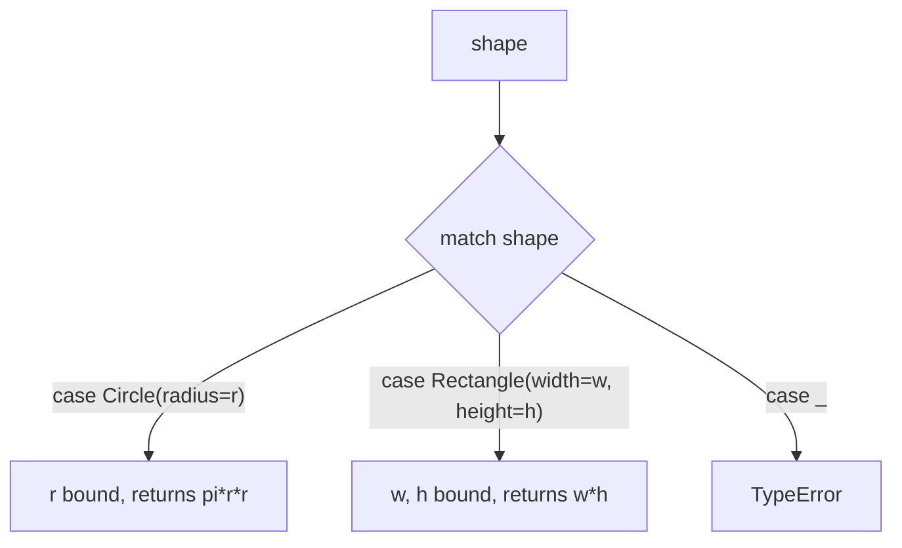

## Learning Objectives

- Use Python's `match` statement to branch on the structure of a value, not merely its type or a single scalar value.
- Bind sub-parts of a matched value to new names directly within a pattern, and explain how this differs from manual unpacking.
- Rewrite an `if/elif` chain of type checks and manual unpacking as an equivalent `match` statement, and identify what became more direct.
- Explain what an algebraic data type is (a type that is one of several distinct variants), and identify how classes plus `match` approximate this in Python.
- State honestly what Python's approximation of algebraic data types does and does not provide, compared to a language with true ADTs.

## Context & Motivation

Every conditional covered so far has branched on a single condition at a time — a boolean expression, a comparison, an `isinstance` check. Real data, though, frequently comes in **shapes**: a value that's either a two-element tuple representing a point, or a three-element tuple representing a labeled point, or an instance of one of several different classes representing different kinds of event. Handling this kind of data with ordinary `if/elif` means chaining together a type check, then manually unpacking or attribute-accessing whatever's inside, repeating that combination once per shape the data might take. Python's `match` statement, introduced in Python 3.10, exists specifically to make this common combination — check the shape, then pull out its parts — into a single, direct construct: real **structural pattern matching**, not just a dressed-up `if/elif` chain in disguise.

The "structural" part is the key distinction from a plain `switch`-style value comparison: a `match` pattern doesn't just ask "is this value equal to X?" — it can ask "does this value have the *shape* of a two-element sequence, and if so, bind its first element to `x` and its second to `y`," all in one clause. This connects to a broader idea from the ML/Haskell family of languages: an **algebraic data type** is a type explicitly defined as one of several distinct variants (a "sum type"), each variant possibly carrying its own data — a `Shape` that is either a `Circle` with a radius, a `Rectangle` with a width and height, or a `Triangle` with three side lengths, and nothing else. In those languages, defining such a type and writing a pattern match over it are two halves of one designed-together feature, and the compiler can even verify that every variant has been handled.

Python does not have true algebraic data types in that built-in, compiler-checked sense — it's honest to be upfront about this rather than overstate what `match` provides. What Python does offer is `match` plus ordinary classes (often `dataclasses`) that, used together, can *approximate* the same pattern-matching-driven style: define a handful of classes representing the distinct "shapes" data can take, then use `match` to branch on which shape a given value actually has, binding its parts along the way. It's an approximation worth taking seriously — the resulting code reads remarkably like real ADT-based code from an ML-family language — but it remains an approximation, without the compiler-enforced guarantee that every variant has been covered, which real algebraic data types provide.

## Core Theory

### Structural matching versus value matching

The simplest `match` clauses just compare against literal values, which is not meaingfully different from a chain of `==` checks:

```python
def describe_number(n):
    match n:
        case 0:
            return "zero"
        case 1:
            return "one"
        case _:
            return "some other number"
```

The genuinely new capability is matching on **structure** — the shape of a sequence, a mapping, or an object — and binding names to its parts as part of the same clause:

```python
def describe_point(point):
    match point:
        case (0, 0):
            return "the origin"
        case (x, 0):
            return f"on the x-axis at {x}"
        case (0, y):
            return f"on the y-axis at {y}"
        case (x, y):
            return f"a point at ({x}, {y})"
        case _:
            return "not a 2D point"

print(describe_point((0, 0)))    # the origin
print(describe_point((5, 0)))    # on the x-axis at 5
print(describe_point((3, 4)))    # a point at (3, 4)
```

Each `case` here checks both the *shape* (a 2-tuple) and, in the first three cases, a specific value in one position — and simultaneously binds whatever doesn't need to match a literal (`x`, `y`) to a new name, usable directly in that clause's body. `case _:` is the wildcard, matching anything not caught by an earlier clause — the structural-matching equivalent of an `else`.

### Matching on class instances, including nested structure

`match` can check whether a value is an instance of a given class *and* bind its attributes, in one clause, using `ClassName(attribute=pattern, ...)` syntax:

```python
class Circle:
    def __init__(self, radius):
        self.radius = radius

class Rectangle:
    def __init__(self, width, height):
        self.width = width
        self.height = height

def area(shape):
    match shape:
        case Circle(radius=r):
            return 3.14159 * r * r
        case Rectangle(width=w, height=h):
            return w * h
        case _:
            raise TypeError("unsupported shape")

print(area(Circle(2)))          # 12.56636
print(area(Rectangle(3, 4)))    # 12
```

`case Circle(radius=r):` does two things in one step: it confirms `shape` is an instance of `Circle`, and it binds `shape.radius` to the local name `r`, ready to use in the clause's body — no separate `isinstance` check and no separate attribute access are written out by hand.

### The equivalent `if/elif` chain, and what pattern matching removes

The same `area` function, written without `match`, needs a type check and a manual attribute access as two separate steps in every branch:

```python
def area_if_elif(shape):
    if isinstance(shape, Circle):
        r = shape.radius
        return 3.14159 * r * r
    elif isinstance(shape, Rectangle):
        w = shape.width
        h = shape.height
        return w * h
    else:
        raise TypeError("unsupported shape")
```

Both versions compute identically. The `match` version fuses "check the type" and "extract the fields I need" into one clause header, so the reader sees, at a glance, exactly which shape each branch handles and which of its parts that branch actually uses — the `if/elif` version spreads that same information across a condition line and one or more separate assignment lines beneath it.



### Algebraic data types: the idea, and Python's approximation of it

An **algebraic data type** (ADT), in the ML/Haskell sense of the term, is a type deliberately defined as one of several distinct variants — often called a **sum type** — where each variant may carry its own associated data. A `Shape` type might be defined (in an ML-family language) as exactly `Circle of float | Rectangle of float * float | Triangle of float * float * float`, and nothing else is a valid `Shape`. Pattern matching in those languages is designed hand-in-hand with this kind of type: the compiler can verify a `match` covers every variant, flagging an error if, say, `Triangle` is left unhandled.

Python has no built-in construct that plays this exact role — there is no compiler step, and nothing stops a class hierarchy from being extended with a new subclass that a given `match` statement doesn't know to handle. What Python offers instead is an **approximation**: define each variant as its own class (frequently a `@dataclass` for brevity), and use `match`'s `case ClassName(...):` pattern to branch on which variant a value actually is:

```python
from dataclasses import dataclass

@dataclass
class Circle:
    radius: float

@dataclass
class Rectangle:
    width: float
    height: float

Shape = Circle | Rectangle   # a type hint suggesting the "one of these" idea -- not enforced by Python itself

def describe_shape(shape: Shape) -> str:
    match shape:
        case Circle(radius=r):
            return f"a circle of radius {r}"
        case Rectangle(width=w, height=h):
            return f"a {w}x{h} rectangle"
```

This reads remarkably close to genuine ADT-and-pattern-match code from an ML-family language, and the `dataclass` decorator removes most of the boilerplate `__init__` would otherwise require. But it is honestly still an approximation: `Shape = Circle | Rectangle` is a type-hint annotation, not an enforced constraint — nothing in the language stops another class, `Triangle`, from being passed to `describe_shape` and silently falling through to an unhandled case (or crashing, if there's no wildcard `case _:` to catch it) — and no compiler verifies that `describe_shape`'s `match` actually covers every variant of `Shape`. Python's `match` gives real, structural pattern matching; what it does not give is the compile-time exhaustiveness guarantee that makes a true algebraic data type's pattern match provably complete.

## Worked Examples

### Example 1 — matching nested list/tuple structure with binding

**Problem:** given a list of commands, each either `("move", dx, dy)` or `("say", text)`, process each one according to its shape.

```python
def process(command):
    match command:
        case ("move", dx, dy):
            return f"moving by ({dx}, {dy})"
        case ("say", text):
            return f"saying: {text}"
        case _:
            return "unknown command"

commands = [("move", 1, 2), ("say", "hello"), ("jump",)]
for cmd in commands:
    print(process(cmd))
# moving by (1, 2)
# saying: hello
# unknown command
```

Each `case` pattern checks both the tuple's length and its first element's literal value ("move" or "say") in one step, then binds the remaining positions (`dx, dy`, or `text`) directly — a single line expresses what a manual version would need a length check, an index-0 comparison, and separate variable assignments to accomplish.

### Example 2 — the manual `if/elif` equivalent, for direct comparison

**Problem:** write `process` from Example 1 without `match`, to see exactly what pattern matching consolidated.

```python
def process_if_elif(command):
    if len(command) == 3 and command[0] == "move":
        dx, dy = command[1], command[2]
        return f"moving by ({dx}, {dy})"
    elif len(command) == 2 and command[0] == "say":
        text = command[1]
        return f"saying: {text}"
    else:
        return "unknown command"
```

Every condition `match` fused into one `case` line is spelled out here as a separate `len(...)` check, a separate index-0 comparison, and a separate manual-unpacking assignment — three ideas per branch instead of one. Both functions behave identically on every input in Example 1's `commands` list, confirming that `match` changed how directly the logic is expressed, not what it computes.

### Example 3 — an approximate ADT for a simple expression tree

**Problem:** represent a small arithmetic expression as one of three variants — a number, or an addition/multiplication of two sub-expressions — and evaluate it recursively using `match`.

```python
from dataclasses import dataclass

@dataclass
class Num:
    value: float

@dataclass
class Add:
    left: object
    right: object

@dataclass
class Mul:
    left: object
    right: object

def evaluate(expr):
    match expr:
        case Num(value=v):
            return v
        case Add(left=l, right=r):
            return evaluate(l) + evaluate(r)
        case Mul(left=l, right=r):
            return evaluate(l) * evaluate(r)

# (2 + 3) * 4
tree = Mul(Add(Num(2), Num(3)), Num(4))
print(evaluate(tree))   # 20
```

`Num`, `Add`, and `Mul` together approximate an algebraic data type for "arithmetic expression" — every valid expression is one of exactly these three variants, `Add` and `Mul` each carrying two sub-expressions of the same overall type. `evaluate` matches on which variant it has, recursing into `left`/`right` for the two compound cases — a direct, structural expression of "an expression is a number, or a combination of two smaller expressions," with no manual `isinstance` chain required. As Core Theory notes, Python cannot guarantee at compile time that `evaluate` covers every possible variant of `expr` — a fourth variant class added later, with no matching `case` added to `evaluate`, would simply fall through with no return value, silently, rather than being caught as an error the way a true ADT's exhaustiveness check would catch it.

## Common Misconceptions & Pitfalls

- **"`match` is just Python's version of a `switch` statement from other languages."** A plain `switch` compares a single value against a list of literal alternatives. `match` does that too (Core Theory's `describe_number`) but also matches structure — sequence shape, mapping keys, class instance plus attributes — binding sub-parts to names as part of the same clause, which a value-only `switch` cannot do at all.
- **"`case Circle(radius=r):` calls `Circle`'s constructor to check the match."** It does not construct anything — this pattern checks whether the matched value is already an instance of `Circle`, then reads its existing `radius` attribute into `r`. No `Circle(...)` object is created during the match itself.
- **"Since Python's classes-plus-`match` style looks just like a real algebraic data type, it provides the same guarantees."** It provides the same *pattern-matching-driven reading style*, but not the same compile-time guarantee. A true ADT's pattern match can be checked for exhaustiveness by the compiler; Python's `match` cannot be, and a `case` clause left out for some variant simply falls through silently (or hits a wildcard, if one exists) rather than being flagged as an error before the code ever runs.
- **"Writing `case _:` at the end of every `match` is unnecessary boilerplate."** Without a wildcard case, a `match` statement that fails to match any clause simply does nothing and the code continues past it (unlike an unmatched `switch` in some languages, this is not an error by default) — silently producing no result at all for an unhandled shape, which is often worse than an explicit error. Including `case _:` (raising, logging, or explicitly signaling "unhandled") is usually the safer default, precisely because Python provides no automatic exhaustiveness check to catch a genuinely missed case.

## Summary

Python's `match` statement, added in 3.10, provides real structural pattern matching: a single `case` clause can check the *shape* of a value — a tuple's length and positions, a class instance and its attributes — while simultaneously binding sub-parts to new names, collapsing what an `if/elif` chain would need a type check plus manual unpacking to express into one direct line. An algebraic data type, in the ML/Haskell sense, is a type deliberately defined as one of several distinct variants, with pattern matching designed alongside it and checked for exhaustiveness by the compiler. Python has no built-in construct playing that exact role, but classes (often `dataclasses`) representing each variant, combined with `match`'s `case ClassName(...):` pattern, approximate the same style convincingly — while remaining honestly an approximation, since nothing in Python enforces that a given `match` actually covers every variant a hinted type could take, the way a genuine ADT's compiler-checked exhaustiveness would.

## Documentation Links

- [University of Washington / Coursera — Programming Languages, Part A (Grossman)](https://www.coursera.org/learn/programming-languages) — doc
- [MIT SICP — Wikipedia (course/book overview)](https://en.wikipedia.org/wiki/Structure_and_Interpretation_of_Computer_Programs) — doc
