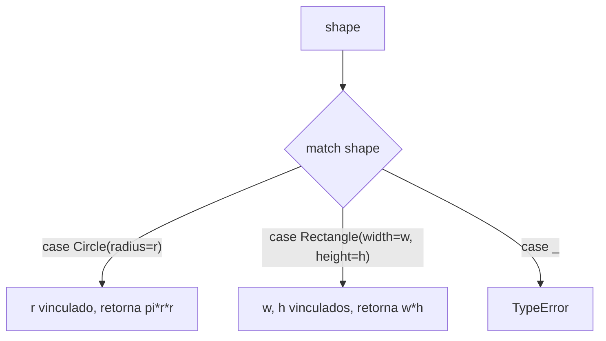

## Objetivos de Aprendizagem

- Usar a instrução `match` do Python para ramificar com base na estrutura de um valor, não meramente seu tipo ou um único valor escalar.
- Vincular subpartes de um valor casado a novos nomes diretamente dentro de um padrão, e explicar como isso difere de desempacotamento manual.
- Reescrever uma cadeia `if/elif` de checagens de tipo e desempacotamento manual como uma instrução `match` equivalente, e identificar o que se tornou mais direto.
- Explicar o que é um tipo de dado algébrico (um tipo que é uma dentre várias variantes distintas), e identificar como classes mais `match` aproximam isso em Python.
- Enunciar honestamente o que a aproximação do Python de tipos de dados algébricos fornece e não fornece, comparado a uma linguagem com ADTs verdadeiros.

## Contexto e Motivação

Todo condicional coberto até agora ramificou com base em uma única condição de cada vez, uma expressão booleana, uma comparação, uma checagem `isinstance`. Dados reais, porém, frequentemente vêm em **formas**: um valor que é ou uma tupla de dois elementos representando um ponto, ou uma tupla de três elementos representando um ponto rotulado, ou uma instância de uma dentre várias classes diferentes representando diferentes tipos de evento. Lidar com esse tipo de dado com `if/elif` comum significa encadear uma checagem de tipo, depois desempacotar manualmente ou acessar atributos do que está dentro, repetindo aquela combinação uma vez por forma que o dado pode assumir. A instrução `match` do Python, introduzida no Python 3.10, existe especificamente para transformar essa combinação comum, checar a forma, depois extrair suas partes, em uma única construção direta: pattern matching estrutural de verdade, não só uma cadeia `if/elif` disfarçada.

A parte "estrutural" é a distinção chave em relação a uma comparação de valor estilo `switch` simples: um padrão `match` não pergunta só "este valor é igual a X?", pode perguntar "este valor tem a *forma* de uma sequência de dois elementos, e se sim, vincule seu primeiro elemento a `x` e seu segundo a `y`", tudo em uma única cláusula. Isso se conecta a uma ideia mais ampla da família de linguagens ML/Haskell: um **tipo de dado algébrico** é um tipo explicitamente definido como uma dentre várias variantes distintas (um "tipo soma"), cada variante possivelmente carregando seus próprios dados, um `Shape` que é ou um `Circle` com um raio, ou um `Rectangle` com uma largura e altura, ou um `Triangle` com três comprimentos de lado, e nada mais. Nessas linguagens, definir tal tipo e escrever um pattern match sobre ele são duas metades de um recurso desenhado junto, e o compilador pode até verificar que toda variante foi tratada.

Python não tem tipos de dados algébricos verdadeiros naquele sentido embutido, verificado pelo compilador, é honesto deixar isso claro em vez de superestimar o que `match` fornece. O que Python oferece é `match` mais classes comuns (frequentemente `dataclasses`) que, usadas juntas, podem *aproximar* o mesmo estilo orientado por pattern matching: defina um punhado de classes representando as "formas" distintas que um dado pode assumir, depois use `match` para ramificar com base em qual forma um dado valor de fato tem, vinculando suas partes ao longo do caminho. É uma aproximação que vale a pena levar a sério, o código resultante se lê notavelmente como código real baseado em ADT de uma linguagem da família ML, mas continua sendo uma aproximação, sem a garantia verificada pelo compilador de que toda variante foi coberta, que tipos de dados algébricos verdadeiros fornecem.

## Teoria Central

### Casamento estrutural versus casamento de valor

As cláusulas `match` mais simples só comparam contra valores literais, o que não é significativamente diferente de uma cadeia de checagens `==`:

```python
def describe_number(n):
    match n:
        case 0:
            return "zero"
        case 1:
            return "one"
        case _:
            return "some other number"
```

A capacidade genuinamente nova é casar com base em **estrutura**, a forma de uma sequência, um mapeamento, ou um objeto, e vincular nomes a suas partes como parte da mesma cláusula:

```python
def describe_point(point):
    match point:
        case (0, 0):
            return "the origin"
        case (x, 0):
            return f"on the x-axis at {x}"
        case (0, y):
            return f"on the y-axis at {y}"
        case (x, y):
            return f"a point at ({x}, {y})"
        case _:
            return "not a 2D point"

print(describe_point((0, 0)))    # the origin
print(describe_point((5, 0)))    # on the x-axis at 5
print(describe_point((3, 4)))    # a point at (3, 4)
```

Cada `case` aqui checa tanto a *forma* (uma 2-tupla) quanto, nos três primeiros casos, um valor específico em uma posição, e simultaneamente vincula o que não precisa casar com um literal (`x`, `y`) a um nome novo, usável diretamente no corpo daquela cláusula. `case _:` é o coringa, casando com qualquer coisa não capturada por uma cláusula anterior, o equivalente em casamento estrutural de um `else`.

### Casando com instâncias de classe, incluindo estrutura aninhada

`match` pode checar se um valor é uma instância de uma dada classe *e* vincular seus atributos, em uma cláusula, usando sintaxe `NomeDaClasse(atributo=padrão, ...)`:

```python
class Circle:
    def __init__(self, radius):
        self.radius = radius

class Rectangle:
    def __init__(self, width, height):
        self.width = width
        self.height = height

def area(shape):
    match shape:
        case Circle(radius=r):
            return 3.14159 * r * r
        case Rectangle(width=w, height=h):
            return w * h
        case _:
            raise TypeError("unsupported shape")

print(area(Circle(2)))          # 12.56636
print(area(Rectangle(3, 4)))    # 12
```

`case Circle(radius=r):` faz duas coisas em um passo: confirma que `shape` é uma instância de `Circle`, e vincula `shape.radius` ao nome local `r`, pronto para uso no corpo da cláusula, nenhuma checagem `isinstance` separada e nenhum acesso a atributo separado são escritos à mão.

### A cadeia `if/elif` equivalente, e o que pattern matching remove

A mesma função `area`, escrita sem `match`, precisa de uma checagem de tipo e um acesso manual a atributo como dois passos separados em cada ramo:

```python
def area_if_elif(shape):
    if isinstance(shape, Circle):
        r = shape.radius
        return 3.14159 * r * r
    elif isinstance(shape, Rectangle):
        w = shape.width
        h = shape.height
        return w * h
    else:
        raise TypeError("unsupported shape")
```

Ambas as versões calculam identicamente. A versão `match` funde "checar o tipo" e "extrair os campos que preciso" em um único cabeçalho de cláusula, então o leitor vê, num relance, exatamente qual forma cada ramo trata e quais de suas partes aquele ramo de fato usa, a versão `if/elif` espalha essa mesma informação por uma linha de condição e uma ou mais linhas de atribuição separadas abaixo dela.



### Tipos de dados algébricos: a ideia, e a aproximação do Python

Um **tipo de dado algébrico** (ADT), no sentido ML/Haskell do termo, é um tipo deliberadamente definido como uma dentre várias variantes distintas, frequentemente chamado de **tipo soma**, onde cada variante pode carregar seus próprios dados associados. Um tipo `Shape` poderia ser definido (em uma linguagem da família ML) como exatamente `Circle of float | Rectangle of float * float | Triangle of float * float * float`, e nada mais é um `Shape` válido. Pattern matching nessas linguagens é desenhado de mãos dadas com esse tipo de tipo: o compilador consegue verificar que um `match` cobre toda variante, sinalizando um erro se, digamos, `Triangle` for deixado sem tratamento.

Python não tem nenhuma construção embutida desempenhando exatamente esse papel, não há passo de compilador, e nada impede que uma hierarquia de classes seja estendida com uma subclasse nova que uma dada instrução `match` não sabe tratar. O que Python oferece em vez disso é uma **aproximação**: defina cada variante como sua própria classe (frequentemente um `@dataclass` por brevidade), e use o padrão `case NomeDaClasse(...):` do `match` para ramificar com base em qual variante um valor de fato é:

```python
from dataclasses import dataclass

@dataclass
class Circle:
    radius: float

@dataclass
class Rectangle:
    width: float
    height: float

Shape = Circle | Rectangle   # uma dica de tipo sugerindo a ideia de "um destes" -- não imposta pelo próprio Python

def describe_shape(shape: Shape) -> str:
    match shape:
        case Circle(radius=r):
            return f"a circle of radius {r}"
        case Rectangle(width=w, height=h):
            return f"a {w}x{h} rectangle"
```

Isso se lê notavelmente próximo de código genuíno de ADT-mais-pattern-match de uma linguagem da família ML, e o decorador `dataclass` remove a maior parte do código repetitivo que um `__init__` de outra forma exigiria. Mas continua honestamente sendo uma aproximação: `Shape = Circle | Rectangle` é uma anotação de dica de tipo, não uma restrição imposta, nada na linguagem impede que outra classe, `Triangle`, seja passada para `describe_shape` e silenciosamente caia por um caso não tratado (ou quebre, se não houver um `case _:` coringa para capturá-la), e nenhum compilador verifica que o `match` de `describe_shape` de fato cobre toda variante de `Shape`. O `match` do Python fornece pattern matching estrutural de verdade; o que não fornece é a garantia de exaustividade em tempo de compilação que torna o pattern match de um tipo de dado algébrico verdadeiro comprovadamente completo.

## Exemplos Resolvidos

### Exemplo 1 — casando estrutura aninhada de lista/tupla com vinculação

**Problema:** dada uma lista de comandos, cada um ou `("move", dx, dy)` ou `("say", text)`, processe cada um de acordo com sua forma.

```python
def process(command):
    match command:
        case ("move", dx, dy):
            return f"moving by ({dx}, {dy})"
        case ("say", text):
            return f"saying: {text}"
        case _:
            return "unknown command"

commands = [("move", 1, 2), ("say", "hello"), ("jump",)]
for cmd in commands:
    print(process(cmd))
# moving by (1, 2)
# saying: hello
# unknown command
```

Cada padrão `case` checa tanto o comprimento da tupla quanto o valor literal de seu primeiro elemento ("move" ou "say") em um passo, depois vincula as posições restantes (`dx, dy`, ou `text`) diretamente, uma única linha expressa o que uma versão manual precisaria de uma checagem de comprimento, uma comparação de índice 0, e atribuições de variável separadas para realizar.

### Exemplo 2 — o equivalente manual `if/elif`, para comparação direta

**Problema:** escreva `process` do Exemplo 1 sem `match`, para ver exatamente o que pattern matching consolidou.

```python
def process_if_elif(command):
    if len(command) == 3 and command[0] == "move":
        dx, dy = command[1], command[2]
        return f"moving by ({dx}, {dy})"
    elif len(command) == 2 and command[0] == "say":
        text = command[1]
        return f"saying: {text}"
    else:
        return "unknown command"
```

Toda condição que `match` fundiu em uma linha `case` está soletrada aqui como uma checagem `len(...)` separada, uma comparação de índice 0 separada, e uma atribuição de desempacotamento manual separada, três ideias por ramo em vez de uma. Ambas as funções se comportam identicamente em toda entrada da lista `commands` do Exemplo 1, confirmando que `match` mudou quão diretamente a lógica é expressa, não o que ela calcula.

### Exemplo 3 — um ADT aproximado para uma árvore de expressão simples

**Problema:** represente uma pequena expressão aritmética como uma dentre três variantes, um número, ou uma adição/multiplicação de duas subexpressões, e avalie-a recursivamente usando `match`.

```python
from dataclasses import dataclass

@dataclass
class Num:
    value: float

@dataclass
class Add:
    left: object
    right: object

@dataclass
class Mul:
    left: object
    right: object

def evaluate(expr):
    match expr:
        case Num(value=v):
            return v
        case Add(left=l, right=r):
            return evaluate(l) + evaluate(r)
        case Mul(left=l, right=r):
            return evaluate(l) * evaluate(r)

# (2 + 3) * 4
tree = Mul(Add(Num(2), Num(3)), Num(4))
print(evaluate(tree))   # 20
```

`Num`, `Add`, e `Mul` juntas aproximam um tipo de dado algébrico para "expressão aritmética", toda expressão válida é uma dentre exatamente essas três variantes, `Add` e `Mul` cada uma carregando duas subexpressões do mesmo tipo geral. `evaluate` casa com base em qual variante tem, recursando em `left`/`right` para os dois casos compostos, uma expressão direta, estrutural de "uma expressão é um número, ou uma combinação de duas expressões menores", sem cadeia `isinstance` manual necessária. Como a Teoria Central observa, Python não consegue garantir em tempo de compilação que `evaluate` cobre toda variante possível de `expr`, uma quarta classe de variante adicionada depois, sem um `case` correspondente adicionado a `evaluate`, simplesmente cairia por um caso não tratado sem nenhum valor de retorno, silenciosamente, em vez de ser capturada como um erro da forma que a checagem de exaustividade de um ADT verdadeiro capturaria.

## Equívocos Comuns e Armadilhas

- **"`match` é só a versão do Python de uma instrução `switch` de outras linguagens."** Um `switch` simples compara um único valor contra uma lista de alternativas literais. `match` faz isso também (o `describe_number` da Teoria Central) mas também casa com estrutura, forma de sequência, chaves de mapeamento, instância de classe mais atributos, vinculando subpartes a nomes como parte da mesma cláusula, o que um `switch` só-de-valor não consegue fazer de jeito nenhum.
- **"`case Circle(radius=r):` chama o construtor de `Circle` para checar o casamento."** Não constrói nada, este padrão checa se o valor casado já é uma instância de `Circle`, depois lê seu atributo `radius` existente em `r`. Nenhum objeto `Circle(...)` é criado durante o próprio casamento.
- **"Já que o estilo classes-mais-`match` do Python parece exatamente com um tipo de dado algébrico real, ele fornece as mesmas garantias."** Ele fornece o mesmo *estilo de leitura orientado por pattern matching*, mas não a mesma garantia de tempo de compilação. O pattern match de um ADT verdadeiro pode ser checado quanto à exaustividade pelo compilador; o `match` do Python não pode, e uma cláusula `case` deixada de fora para alguma variante simplesmente cai silenciosamente (ou atinge um coringa, se um existir) em vez de ser sinalizada como um erro antes de o código sequer executar.
- **"Escrever `case _:` no final de todo `match` é código repetitivo desnecessário."** Sem um caso coringa, uma instrução `match` que falha em casar com qualquer cláusula simplesmente não faz nada e o código continua depois dela (diferente de um `switch` não casado em algumas linguagens, isso não é um erro por padrão), produzindo silenciosamente nenhum resultado para uma forma não tratada, o que é frequentemente pior que um erro explícito. Incluir `case _:` (levantando exceção, registrando, ou sinalizando explicitamente "não tratado") é geralmente o padrão mais seguro, precisamente porque Python não fornece nenhuma checagem automática de exaustividade para capturar um caso genuinamente perdido.

## Resumo

A instrução `match` do Python, adicionada na 3.10, fornece pattern matching estrutural de verdade: uma única cláusula `case` pode checar a *forma* de um valor, o comprimento e as posições de uma tupla, uma instância de classe e seus atributos, enquanto simultaneamente vincula subpartes a nomes novos, colapsando o que uma cadeia `if/elif` precisaria de uma checagem de tipo mais desempacotamento manual para expressar em uma única linha direta. Um tipo de dado algébrico, no sentido ML/Haskell, é um tipo deliberadamente definido como uma dentre várias variantes distintas, com pattern matching desenhado junto com ele e checado quanto à exaustividade pelo compilador. Python não tem nenhuma construção embutida desempenhando exatamente esse papel, mas classes (frequentemente `dataclasses`) representando cada variante, combinadas com o padrão `case NomeDaClasse(...):` do `match`, aproximam o mesmo estilo de forma convincente, permanecendo honestamente uma aproximação, já que nada em Python impõe que um dado `match` de fato cobre toda variante que um tipo sugerido poderia assumir, da forma que a exaustividade verificada pelo compilador de um ADT genuíno faria.

## Documentation Links

- [University of Washington / Coursera — Programming Languages, Part A (Grossman)](https://www.coursera.org/learn/programming-languages) — doc
- [MIT SICP — Wikipedia (course/book overview)](https://en.wikipedia.org/wiki/Structure_and_Interpretation_of_Computer_Programs) — doc
