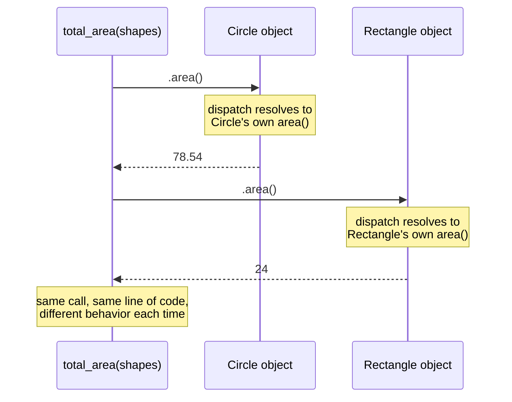

## Learning Objectives

- Define polymorphism as calling the same method name on objects of different types, each responding according to its own overridden implementation.
- Write a function that operates uniformly over a collection of objects from different subclasses of a common base class, without branching on each object's specific type.
- Explain, mechanically, why the correct overridden method runs for each object — connecting this back to the method-lookup order established in the inheritance concept.
- Contrast polymorphic dispatch with the type-checking, branch-per-case alternative it replaces, and state concretely what the polymorphic version gains.

## Context & Motivation

The previous concept ended by naming its own payoff before delivering it: inheritance lets `Circle` and `Rectangle` share a common ancestor, `Shape`, each overriding `area()` with its own correct formula — but what was that reuse actually *for*? If every piece of code that ever needed a shape's area still had to ask, explicitly, "is this a circle or a rectangle?" before calling the right formula, inheritance would have bought remarkably little: some shared code in `Shape`, yes, but every caller would still be doing the same type-by-type branching it would have needed with no inheritance at all. **Polymorphism** is the answer to why that branching is unnecessary in the first place: a single piece of calling code can invoke `.area()` on an object without knowing or caring whether that object is a `Circle`, a `Rectangle`, or any other `Shape` subclass, because each object already knows, via its own overridden method, how to answer correctly. This is the direct, concrete payoff inheritance was building toward — the reuse of shared structure turns out to matter less on its own than the uniform calling code it makes possible.

The word itself comes from Greek roots meaning "many forms" — and that is exactly the phenomenon: the same method call, `.area()`, takes on a different concrete behavior depending on which actual type of object it is called on, while looking, at the call site, completely identical every time. This is what makes object-oriented programming genuinely more than "classes are a nice way to organize data" — a function written once, against a shared base class, can correctly handle objects of subclasses that did not even exist yet when that function was written, as long as each new subclass properly overrides the methods the function relies on. That property — code that keeps working correctly as new, related types are added, with zero changes to the code itself — is precisely why polymorphism is treated as one of object-oriented programming's central pillars, alongside encapsulation and inheritance, rather than as a minor syntactic convenience.

As with the two concepts before it, this treatment stays at the comparative depth this discipline commits to throughout: the mechanical core of polymorphic dispatch, made concrete with real, runnable code building directly on the `Shape` hierarchy already established — not an exhaustive tour of every variation the idea takes across different languages (a separate, language-specific track on this platform covers that ground in full).

## Core Theory

### The core idea: same call, different behavior, decided by the object itself

Polymorphism, in the sense this concept is concerned with, means writing code that calls a method by name on some object — `shape.area()` — where the exact behavior that runs depends entirely on the actual, concrete type of the object `shape` refers to at the moment the call happens, not on anything written at the call site itself. The call site's code — `shape.area()` — is written exactly once, and it never mentions `Circle` or `Rectangle` by name at all; it is written entirely in terms of the shared base class's promised interface (every `Shape` has an `area()` method), trusting each concrete subclass to have supplied a correct implementation of its own.

### The mechanism: dispatch, resolved at the moment of the call

This works because of exactly the method-lookup order the previous concept established: when `shape.area()` runs, the search for which `area` method to actually execute begins at `shape`'s own, real, concrete class — not at whatever type the surrounding code might have been written to expect — and only moves up the inheritance chain if that concrete class itself has no override. Because a `Circle` object's own class is `Circle`, calling `.area()` on it finds `Circle`'s override immediately, without ever needing to consult `Shape`'s (unimplemented) version; the identical call on a `Rectangle` object finds `Rectangle`'s override instead. This resolution — deciding, *at the moment the call actually happens*, which specific method body to run, based on the real object rather than on any label the surrounding code happens to use for it — is called **dynamic dispatch**, and it is the precise mechanical reason polymorphism works at all: the same written line of calling code, `shape.area()`, dispatches to different actual code depending on what `shape` really is each time it runs.



### What polymorphism replaces: branching on type

The alternative to polymorphic dispatch — the thing it makes unnecessary — is a function that explicitly checks each object's type and branches accordingly: "if this is a circle, use the circle formula; if this is a rectangle, use the rectangle formula." Such a function works, but it has a specific, structural weakness: every time a new shape type is added to the program, this branching function must be found and edited to add a new case for it, and if it is missed, or if the function lives somewhere its author has forgotten about, the new shape type silently fails to work correctly wherever that branching logic was needed. A polymorphic version of the same function — one that simply calls `.area()` and trusts dynamic dispatch — needs no such edit at all: a new `Shape` subclass that correctly overrides `area()` slots in and works correctly the very first time it is used, with the calling code completely unaware anything changed.

### Polymorphism over a collection: the pattern this concept exists to enable

The single most common and useful shape this idea takes in practice is a function that iterates over a collection containing objects of several different subclasses, mixed together, calling the same method on each one in a uniform loop, with no branching at all inside the loop. This is precisely the pattern the Learning Objectives point toward, and it is the pattern the worked examples below build in full, completing the `Shape`/`Circle`/`Rectangle` hierarchy the inheritance concept established.

## Worked Examples

### Example 1 — a function that sums the area of a mixed list of shapes

**Problem:** Using the `Shape`, `Circle`, and `Rectangle` classes from the inheritance concept, write a single function that computes the total area of a list containing a mix of both shape types, with no type-checking or branching inside it.

```python
class Shape:
    def area(self):
        raise NotImplementedError("subclasses must override area()")


class Circle(Shape):
    def __init__(self, radius):
        self.radius = radius

    def area(self):
        return 3.14159 * self.radius ** 2


class Rectangle(Shape):
    def __init__(self, width, height):
        self.width = width
        self.height = height

    def area(self):
        return self.width * self.height


def total_area(shapes):
    total = 0
    for shape in shapes:
        total += shape.area()     # no "if isinstance(shape, Circle) ..." anywhere
    return total
```

**Using it.**

```python
shapes = [Circle(5), Rectangle(4, 6), Circle(2), Rectangle(3, 3)]
print(total_area(shapes))   # 78.53975 + 24 + 12.56636 + 9 = 124.10611
```

**Reasoning.** `total_area` mentions `Shape`, `Circle`, and `Rectangle` nowhere in its own body — it does not import them, check for them, or branch on them. It relies entirely on the promise every `Shape` subclass is expected to keep: "you have an `.area()` method that returns a number." Each iteration of the loop calls `shape.area()` on a different concrete object, and dynamic dispatch resolves each call correctly on its own — `Circle`'s formula runs for the `Circle` objects, `Rectangle`'s formula runs for the `Rectangle` objects — with the exact same one line of calling code responsible for both. If a new subclass, `Triangle`, were added tomorrow, correctly overriding `area()`, it could be dropped straight into the `shapes` list passed to this exact, unmodified function, and `total_area` would compute the correct grand total immediately, with zero edits.

### Example 2 — the branching alternative, and what it costs when a new shape is added

**Problem:** Write `total_area` the type-checking way instead, then add a `Triangle` subclass and observe what breaks.

```python
def total_area_branching(shapes):
    total = 0
    for shape in shapes:
        if isinstance(shape, Circle):
            total += 3.14159 * shape.radius ** 2
        elif isinstance(shape, Rectangle):
            total += shape.width * shape.height
        # no case for Triangle — nobody remembered to add one
    return total


class Triangle(Shape):
    def __init__(self, base, height):
        self.base = base
        self.height = height

    def area(self):
        return 0.5 * self.base * self.height


shapes = [Circle(5), Rectangle(4, 6), Triangle(3, 4)]
print(total_area_branching(shapes))   # 102.53975 — the triangle's area (6) is silently missing
print(total_area(shapes))             # 108.53975 — correct: Triangle.area() dispatches fine
```

**Reasoning.** `Triangle` was defined correctly, with a properly overridden `area()` method — the class itself is fine. The bug is entirely inside `total_area_branching`: it was written before `Triangle` existed, and nobody went back to add an `elif isinstance(shape, Triangle)` branch for it, so triangles silently contribute zero to the running total, with no error raised anywhere to signal the omission. `total_area` — the polymorphic version from Example 1 — required no such addition at all; it worked correctly for `Triangle` objects the moment `Triangle` was defined, purely because it never hard-coded any list of shape types to check against in the first place. This is the concrete cost polymorphism eliminates: a branching function's correctness is coupled to someone remembering to update it every time the family of types it handles grows, exactly the kind of silent, easy-to-miss coupling this discipline has been building toward naming precisely.

### Example 3 — polymorphism does not require the objects to share identical data, only the shared method

**Problem:** Confirm that `total_area` works correctly even though `Circle` objects and `Rectangle` objects store completely different attributes internally (`radius` versus `width`/`height`).

**Reasoning.** Nothing about `total_area`'s loop body, `total += shape.area()`, ever inspects `shape.radius` or `shape.width` directly — it only ever calls `shape.area()` and uses the number that comes back. This is precisely why the two classes' completely different internal data layouts cause no problem at all: `Circle.area()` knows how to turn a `radius` into an area, and `Rectangle.area()` knows how to turn a `width` and `height` into an area, but the caller never needs to know that either kind of internal detail exists. Polymorphism's uniformity operates entirely at the level of the shared method's *name and return value* — the promise "call `.area()`, get a number back" — never at the level of what data each object happens to store to make good on that promise. This is exactly the same "interface separate from implementation" idea this discipline has now built up in three connected layers: an ADT's contract independent of its data layout, a class's encapsulated data hidden behind its methods, and now, polymorphism, calling code relying on a shared method name across objects whose actual stored data can differ completely.

## Common Misconceptions & Pitfalls

- **"Polymorphism means a function can accept 'anything' and it will just work."** It works only because every object passed in is expected to support the specific method being called (`.area()`, here) — pass `total_area` a list containing something that is not a `Shape` subclass and has no `.area()` method at all, and the call fails with an error at that point. Polymorphism relies on a shared contract (every `Shape` promises `area()`), not on the complete absence of any requirement.
- **"Polymorphism is just method overriding — the two words mean the same thing."** Overriding (covered in the inheritance concept) is the mechanism that makes each subclass's version of a method available in the first place; polymorphism is the payoff of calling code that relies on dynamic dispatch to reach whichever override is correct for the actual object at hand, without knowing in advance which one that will be. Example 1's `total_area` is the polymorphism; `Circle.area()` and `Rectangle.area()` overriding `Shape.area()` is the overriding that makes it possible.
- **"Branching on type with `isinstance` checks is just as good as polymorphism, only more explicit."** Example 2 demonstrates the concrete cost directly: the branching version silently produced a wrong total the moment a new subclass was added, requiring a human to remember to update it, while the polymorphic version required no update at all and was correct immediately. "More explicit" here is not a neutral stylistic preference — it is a real, ongoing maintenance liability every time the family of types grows.
- **"Since `Circle` and `Rectangle` store totally different data, code that treats them uniformly must be doing something unsafe or hacky."** Example 3 addresses this directly: uniform calling code never touches either class's differing internal data at all — it only ever calls the shared method and uses its return value. The differing internals are exactly what each class's own method body is responsible for handling, safely, entirely out of the caller's view.

## Summary

Polymorphism is writing calling code that invokes the same method name — `.area()`, in this concept's running example — on objects of different types, trusting each object's own overridden implementation, resolved through dynamic dispatch at the moment the call actually runs, to produce the correct behavior for whatever concrete type that object really is. This is the direct payoff the inheritance concept was building toward: `total_area`, written once against the shared `Shape` interface, correctly summed the areas of a mixed list of `Circle` and `Rectangle` objects with no branching on type anywhere in its body, and continued working correctly, with zero changes, the moment a new `Triangle` subclass was added — in sharp contrast to a hand-written, `isinstance`-branching alternative, which silently produced a wrong total for the very same `Triangle` addition because nobody remembered to add a matching branch. Polymorphism's uniformity operates purely at the level of a shared method name and its promised return value, never requiring the underlying objects to share identical stored data. Together, encapsulation, inheritance, and polymorphism form object-oriented programming's three central pillars — bundling data with behavior, reusing and selectively overriding that behavior across related classes, and writing code that calls that behavior uniformly regardless of which specific related class an object actually belongs to.

## Documentation Links

- [University of Washington / Coursera — Programming Languages, Part A (Grossman)](https://www.coursera.org/learn/programming-languages) — doc
- [ACM/IEEE CS2013 — Programming Languages Knowledge Area](https://csed.acm.org/knowledge-areas-programming-languages-pl-cs2013-version/) — doc
