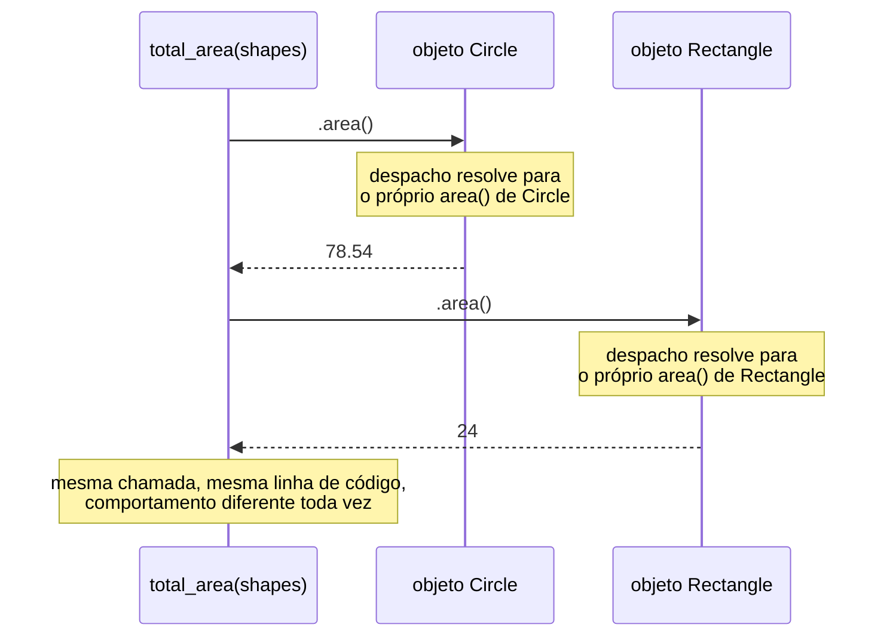

## Objetivos de Aprendizagem

- Definir polimorfismo como chamar o mesmo nome de método em objetos de tipos diferentes, cada um respondendo de acordo com sua própria implementação sobrescrita.
- Escrever uma função que opera uniformemente sobre uma coleção de objetos de subclasses diferentes de uma classe base comum, sem ramificar no tipo específico de cada objeto.
- Explicar, mecanicamente, por que o método sobrescrito correto roda para cada objeto, conectando isso de volta à ordem de busca de método estabelecida no conceito de herança.
- Contrastar despacho polimórfico com a alternativa de verificação de tipo, ramo-por-caso, que substitui, e enunciar concretamente o que a versão polimórfica ganha.

## Contexto e Motivação

O conceito anterior terminou nomeando seu próprio ganho antes de entregá-lo: herança permite que `Circle` e `Rectangle` compartilhem um ancestral comum, `Shape`, cada uma sobrescrevendo `area()` com sua própria fórmula correta, mas para que aquele reúso era de fato *para*? Se todo pedaço de código que jamais precisasse da área de uma forma ainda tivesse que perguntar, explicitamente, "isso é um círculo ou um retângulo?" antes de chamar a fórmula certa, herança teria comprado notavelmente pouco: algum código compartilhado em `Shape`, sim, mas todo chamador ainda estaria fazendo a mesma ramificação tipo-por-tipo que precisaria sem nenhuma herança afinal. **Polimorfismo** é a resposta para por que aquela ramificação é desnecessária em primeiro lugar: um único pedaço de código chamador pode invocar `.area()` em um objeto sem saber ou se importar se aquele objeto é um `Circle`, um `Rectangle`, ou qualquer outra subclasse de `Shape`, porque cada objeto já sabe, via seu próprio método sobrescrito, como responder corretamente. Esse é o ganho direto, concreto, para o qual herança estava se preparando, o reúso de estrutura compartilhada acaba importando menos por conta própria do que o código chamador uniforme que torna possível.

A própria palavra vem de raízes gregas significando "muitas formas", e esse é exatamente o fenômeno: a mesma chamada de método, `.area()`, assume um comportamento concreto diferente dependendo de em qual tipo real de objeto é chamada, enquanto parece, no local de chamada, completamente idêntica toda vez. Isso é o que torna programação orientada a objetos genuinamente mais que "classes são uma forma boa de organizar dados", uma função escrita uma vez, contra uma classe base compartilhada, pode corretamente tratar objetos de subclasses que nem sequer existiam ainda quando aquela função foi escrita, contanto que toda nova subclasse propriamente sobrescreva os métodos dos quais a função depende. Essa propriedade, código que continua funcionando corretamente conforme novos tipos relacionados são adicionados, com zero mudanças ao próprio código, é precisamente por que polimorfismo é tratado como um dos pilares centrais da programação orientada a objetos, ao lado de encapsulamento e herança, em vez de como uma conveniência sintática menor.

Como com os dois conceitos antes dele, este tratamento permanece na profundidade comparativa com a qual esta disciplina se compromete ao longo: o núcleo mecânico de despacho polimórfico, tornado concreto com código real, executável, construindo diretamente sobre a hierarquia `Shape` já estabelecida, não um tour exaustivo de toda variação que a ideia assume através de linguagens diferentes (uma trilha separada, específica de linguagem, nesta plataforma cobre esse terreno em profundidade completa).

## Teoria Central

### A ideia central: mesma chamada, comportamento diferente, decidido pelo próprio objeto

Polimorfismo, no sentido com que este conceito se preocupa, significa escrever código que chama um método pelo nome em algum objeto, `shape.area()`, onde o comportamento exato que roda depende inteiramente do tipo real, concreto, do objeto ao qual `shape` se refere no momento em que a chamada acontece, não em nada escrito no próprio local de chamada. O código do local de chamada, `shape.area()`, é escrito exatamente uma vez, e nunca menciona `Circle` ou `Rectangle` pelo nome afinal; é escrito inteiramente em termos da interface prometida pela classe base compartilhada (toda `Shape` tem um método `area()`), confiando em cada subclasse concreta ter fornecido uma implementação correta própria.

### O mecanismo: despacho, resolvido no momento da chamada

Isso funciona por causa exatamente da ordem de busca de método que o conceito anterior estabeleceu: quando `shape.area()` roda, a busca por qual método `area` de fato executar começa na própria classe real, concreta, de `shape`, não em qualquer tipo que o código ao redor possa ter sido escrito para esperar, e só se move para cima na cadeia de herança se aquela classe concreta em si não tem uma sobrescrita. Porque a própria classe de um objeto `Circle` é `Circle`, chamar `.area()` nele encontra a sobrescrita de `Circle` imediatamente, sem jamais precisar consultar a versão (não implementada) de `Shape`; a chamada idêntica em um objeto `Rectangle` encontra a sobrescrita de `Rectangle` em vez disso. Essa resolução, decidir, *no momento em que a chamada de fato acontece*, qual corpo de método específico rodar, baseado no objeto real em vez de em qualquer rótulo que o código ao redor aconteça de usar para ele, é chamada **despacho dinâmico**, e é a razão mecânica precisa pela qual polimorfismo funciona afinal: a mesma linha escrita de código chamador, `shape.area()`, despacha para código real diferente dependendo do que `shape` de fato é toda vez que roda.



### O que polimorfismo substitui: ramificação no tipo

A alternativa ao despacho polimórfico, a coisa que torna desnecessária, é uma função que explicitamente verifica o tipo de cada objeto e ramifica de acordo: "se isso é um círculo, use a fórmula do círculo; se isso é um retângulo, use a fórmula do retângulo." Tal função funciona, mas tem uma fraqueza específica, estrutural: toda vez que um novo tipo de forma é adicionado ao programa, essa função de ramificação deve ser encontrada e editada para adicionar um novo caso para ele, e se é perdida, ou se a função vive em algum lugar que seu autor esqueceu, o novo tipo de forma silenciosamente falha em funcionar corretamente onde quer que aquela lógica de ramificação fosse necessária. Uma versão polimórfica da mesma função, uma que simplesmente chama `.area()` e confia em despacho dinâmico, não precisa de nenhuma tal edição afinal: uma nova subclasse de `Shape` que corretamente sobrescreve `area()` se encaixa e funciona corretamente na primeiríssima vez que é usada, com o código chamador completamente alheio a qualquer mudança.

### Polimorfismo sobre uma coleção: o padrão que este conceito existe para habilitar

A forma única mais comum e útil que essa ideia assume na prática é uma função que itera sobre uma coleção contendo objetos de várias subclasses diferentes, misturadas juntas, chamando o mesmo método em cada uma em um laço uniforme, sem nenhuma ramificação dentro do laço. Esse é precisamente o padrão para o qual os Objetivos de Aprendizagem apontam, e é o padrão que os exemplos resolvidos abaixo constroem por completo, completando a hierarquia `Shape`/`Circle`/`Rectangle` que o conceito de herança estabeleceu.

## Exemplos Resolvidos

### Exemplo 1: uma função que soma a área de uma lista mista de formas

**Problema:** Usando as classes `Shape`, `Circle`, e `Rectangle` do conceito de herança, escreva uma única função que calcula a área total de uma lista contendo uma mistura de ambos os tipos de forma, sem nenhuma verificação de tipo ou ramificação dentro dela.

```python
class Shape:
    def area(self):
        raise NotImplementedError("subclasses must override area()")


class Circle(Shape):
    def __init__(self, radius):
        self.radius = radius

    def area(self):
        return 3.14159 * self.radius ** 2


class Rectangle(Shape):
    def __init__(self, width, height):
        self.width = width
        self.height = height

    def area(self):
        return self.width * self.height


def total_area(shapes):
    total = 0
    for shape in shapes:
        total += shape.area()     # nenhum "if isinstance(shape, Circle) ..." em lugar nenhum
    return total
```

**Usando-a.**

```python
shapes = [Circle(5), Rectangle(4, 6), Circle(2), Rectangle(3, 3)]
print(total_area(shapes))   # 78.53975 + 24 + 12.56636 + 9 = 124.10611
```

**Raciocínio.** `total_area` não menciona `Shape`, `Circle`, ou `Rectangle` em lugar nenhum de seu próprio corpo, não as importa, verifica por elas, ou ramifica nelas. Depende inteiramente da promessa que toda subclasse de `Shape` é esperada manter: "você tem um método `.area()` que retorna um número." Cada iteração do laço chama `shape.area()` em um objeto concreto diferente, e despacho dinâmico resolve cada chamada corretamente por conta própria, a fórmula de `Circle` roda para os objetos `Circle`, a fórmula de `Rectangle` roda para os objetos `Rectangle`, com exatamente a mesma única linha de código chamador responsável por ambas. Se uma nova subclasse, `Triangle`, fosse adicionada amanhã, corretamente sobrescrevendo `area()`, poderia ser jogada direto na lista `shapes` passada para essa função exata, não modificada, e `total_area` calcularia o total geral correto imediatamente, com zero edições.

### Exemplo 2: a alternativa de ramificação, e o que custa quando uma nova forma é adicionada

**Problema:** Escreva `total_area` da forma de verificação de tipo em vez disso, depois adicione uma subclasse `Triangle` e observe o que quebra.

```python
def total_area_branching(shapes):
    total = 0
    for shape in shapes:
        if isinstance(shape, Circle):
            total += 3.14159 * shape.radius ** 2
        elif isinstance(shape, Rectangle):
            total += shape.width * shape.height
        # nenhum caso para Triangle: ninguém se lembrou de adicionar um
    return total


class Triangle(Shape):
    def __init__(self, base, height):
        self.base = base
        self.height = height

    def area(self):
        return 0.5 * self.base * self.height


shapes = [Circle(5), Rectangle(4, 6), Triangle(3, 4)]
print(total_area_branching(shapes))   # 102.53975: a área do triângulo (6) está silenciosamente faltando
print(total_area(shapes))             # 108.53975: correto: Triangle.area() despacha bem
```

**Raciocínio.** `Triangle` foi definida corretamente, com um método `area()` propriamente sobrescrito, a própria classe está bem. O bug está inteiramente dentro de `total_area_branching`: foi escrita antes de `Triangle` existir, e ninguém voltou para adicionar um ramo `elif isinstance(shape, Triangle)` para ela, então triângulos silenciosamente contribuem zero ao total corrente, sem nenhum erro levantado em lugar nenhum para sinalizar a omissão. `total_area`, a versão polimórfica do Exemplo 1, não exigiu nenhuma tal adição afinal; funcionou corretamente para objetos `Triangle` no momento em que `Triangle` foi definida, puramente porque nunca codificou de forma fixa nenhuma lista de tipos de forma contra a qual verificar em primeiro lugar. Esse é o custo concreto que polimorfismo elimina: a correção de uma função de ramificação está acoplada a alguém se lembrar de atualizá-la toda vez que a família de tipos que trata cresce, exatamente o tipo de acoplamento silencioso, fácil de perder, que esta disciplina tem construído em direção a nomear precisamente.

### Exemplo 3: polimorfismo não exige que os objetos compartilhem dados idênticos, só o método compartilhado

**Problema:** Confirme que `total_area` funciona corretamente mesmo que objetos `Circle` e objetos `Rectangle` armazenem atributos completamente diferentes internamente (`radius` versus `width`/`height`).

**Raciocínio.** Nada sobre o corpo do laço de `total_area`, `total += shape.area()`, jamais inspeciona `shape.radius` ou `shape.width` diretamente, só jamais chama `shape.area()` e usa o número que volta. Isso é precisamente por que os layouts de dado internos completamente diferentes das duas classes não causam nenhum problema afinal: `Circle.area()` sabe como transformar um `radius` em uma área, e `Rectangle.area()` sabe como transformar um `width` e `height` em uma área, mas o chamador nunca precisa saber que qualquer um desses tipos de detalhe interno existe. A uniformidade do polimorfismo opera inteiramente no nível do *nome e valor de retorno* do método compartilhado, a promessa "chame `.area()`, receba um número de volta", nunca no nível de quais dados cada objeto acontece de armazenar para cumprir aquela promessa. Isso é exatamente a mesma ideia de "interface separada de implementação" que esta disciplina agora construiu em três camadas conectadas: o contrato de um TAD independente de seu layout de dado, os dados encapsulados de uma classe escondidos atrás de seus métodos, e agora, polimorfismo, código chamador dependendo de um nome de método compartilhado através de objetos cujos dados armazenados reais podem diferir completamente.

## Equívocos Comuns e Armadilhas

- **"Polimorfismo significa que uma função pode aceitar 'qualquer coisa' e simplesmente funcionará."** Só funciona porque todo objeto passado é esperado suportar o método específico sendo chamado (`.area()`, aqui), passe a `total_area` uma lista contendo algo que não é uma subclasse de `Shape` e não tem nenhum método `.area()` afinal, e a chamada falha com um erro naquele ponto. Polimorfismo depende de um contrato compartilhado (toda `Shape` promete `area()`), não da ausência completa de qualquer requisito.
- **"Polimorfismo é só sobrescrita de método, as duas palavras significam a mesma coisa."** Sobrescrita (coberta no conceito de herança) é o mecanismo que torna a versão de cada subclasse de um método disponível em primeiro lugar; polimorfismo é o ganho de código chamador que depende de despacho dinâmico para alcançar qualquer que seja a sobrescrita correta para o objeto real em mãos, sem saber antecipadamente qual será. O `total_area` do Exemplo 1 é o polimorfismo; `Circle.area()` e `Rectangle.area()` sobrescrevendo `Shape.area()` é a sobrescrita que o torna possível.
- **"Ramificar no tipo com verificações `isinstance` é tão bom quanto polimorfismo, só mais explícito."** O Exemplo 2 demonstra o custo concreto diretamente: a versão de ramificação silenciosamente produziu um total errado no momento em que uma nova subclasse foi adicionada, exigindo que um humano se lembrasse de atualizá-la, enquanto a versão polimórfica não exigiu nenhuma atualização afinal e estava correta imediatamente. "Mais explícito" aqui não é uma preferência estilística neutra, é uma responsabilidade de manutenção real, contínua, toda vez que a família de tipos cresce.
- **"Já que `Circle` e `Rectangle` armazenam dados totalmente diferentes, código que os trata uniformemente deve estar fazendo algo inseguro ou hacky."** O Exemplo 3 aborda isso diretamente: código chamador uniforme nunca toca os dados internos diferentes de nenhuma das classes afinal, só jamais chama o método compartilhado e usa seu valor de retorno. Os internos diferentes são exatamente o que o próprio corpo de método de cada classe é responsável por tratar, com segurança, inteiramente fora da vista do chamador.

## Resumo

Polimorfismo é escrever código chamador que invoca o mesmo nome de método, `.area()`, no exemplo corrente deste conceito, em objetos de tipos diferentes, confiando na própria implementação sobrescrita de cada objeto, resolvida através de despacho dinâmico no momento em que a chamada de fato roda, para produzir o comportamento correto para qualquer que seja o tipo concreto que aquele objeto realmente é. Esse é o ganho direto para o qual o conceito de herança estava se preparando: `total_area`, escrita uma vez contra a interface `Shape` compartilhada, corretamente somou as áreas de uma lista mista de objetos `Circle` e `Rectangle` sem nenhuma ramificação no tipo em lugar nenhum de seu corpo, e continuou funcionando corretamente, com zero mudanças, no momento em que uma nova subclasse `Triangle` foi adicionada, em nítido contraste com uma alternativa de ramificação `isinstance` escrita à mão, que silenciosamente produziu um total errado para a mesma adição de `Triangle` porque ninguém se lembrou de adicionar um ramo correspondente. A uniformidade do polimorfismo opera puramente no nível de um nome de método compartilhado e seu valor de retorno prometido, nunca exigindo que os objetos subjacentes compartilhem dados armazenados idênticos. Juntos, encapsulamento, herança, e polimorfismo formam os três pilares centrais da programação orientada a objetos, empacotar dados com comportamento, reutilizar e seletivamente sobrescrever aquele comportamento através de classes relacionadas, e escrever código que chama aquele comportamento uniformemente independentemente de qual classe relacionada específica um objeto de fato pertence.

## Documentation Links

- [University of Washington / Coursera: Programming Languages, Part A (Grossman)](https://www.coursera.org/learn/programming-languages): doc
- [ACM/IEEE CS2013: Programming Languages Knowledge Area](https://csed.acm.org/knowledge-areas-programming-languages-pl-cs2013-version/): doc
