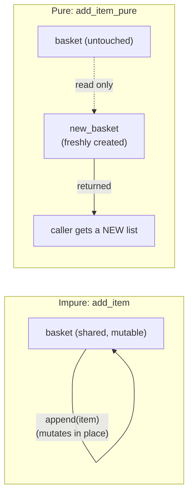

## Learning Objectives

- Define a pure function precisely: its output depends only on its inputs, and it produces no observable side effects.
- Identify, in a given function, every source of impurity — mutation of external state, I/O, reliance on non-parameter data.
- Rewrite an impure function that mutates shared or default-argument state into a pure equivalent that returns a new value instead.
- Explain why a pure function can be understood and tested in complete isolation, without tracing the rest of the program.
- Contrast the functional paradigm's stance on state with the mutable-state model imperative programming is built on.

## Context & Motivation

Every imperative program covered so far has leaned on the same basic move: a variable holds a value, and some later statement changes it. A loop counter increments. A list gets an element appended to it. An object's field gets reassigned. This works, and it's how most programs in most languages get written — but it comes with a cost that's easy to underestimate until it actually bites: to know what a piece of code does, you often have to know what *else* might be touching the same piece of state, possibly from somewhere else in the program entirely, possibly at a time you didn't expect. A function that reads a global variable, or mutates a list it was handed, can behave differently on two calls that look identical on the page, because something in between changed the state it depends on.

The functional paradigm's founding move is to reject this outright: a **pure function** is one whose entire behavior is determined by its arguments, with no side effects of any kind — it doesn't read or write anything outside itself, and calling it twice with the same inputs always produces exactly the same output. This is a real, sharp constraint, not just good style advice, and it is exactly the opposite of the mutable-state model imperative programming was built on. Where imperative code treats "changing something over time" as the basic unit of computation, functional code treats a value, once created, as fixed forever — **immutable** — and treats "computing a new value from an old one" as the basic unit instead of "changing the old one in place."

The payoff is not abstract. A pure function can be understood by reading its body alone — no need to trace every other place in a large codebase that might touch the same data, because there is no such place; the function simply doesn't reach outside itself. It can be tested by calling it with some inputs and checking the output, with no setup of global state and no teardown afterward. It can be called from multiple threads at once with no risk of one call corrupting another's view of shared data, because there is no shared, mutable data to corrupt. This material traces to the same course line already introducing the paradigm-level view of functional programming (SICP's own opening chapters build essentially their entire method around this distinction), and it is the concept everything else in the functional paradigm builds on: higher-order functions, closures, and recursion-as-looping all make far more sense once purity and immutability are the assumed default rather than the exception.

## Core Theory

### What makes a function pure

A function is **pure** if it satisfies two conditions together:

1. **Referential transparency** — given the same arguments, it always returns the same result, with no dependency on anything other than those arguments (not the time of day, not a global counter, not the contents of a file).
2. **No side effects** — calling it does not observably change anything outside its own local execution: no mutating an object or list passed in, no reassigning a variable outside its scope, no printing, no writing to a file or network, no reading external mutable state either.

Both conditions matter independently. A function could depend only on its arguments (satisfying condition 1) and still mutate something as a side effect while doing so (violating condition 2) — that function is impure even though its return value is perfectly predictable, because impurity is about the *effects*, not only the *result*.

### The classic gotcha: mutable default arguments

Python's most famous purity trap is a function that appends to a list, using a default argument as that list's initial value:

```python
def add_item(item, basket=[]):      # DANGER: default evaluated ONCE, at def time
    basket.append(item)
    return basket

add_item("apple")     # ["apple"]
add_item("banana")     # ["apple", "banana"] -- NOT ["banana"]!
```

The default value `[]` is created exactly once, when the `def` statement executes — not fresh on every call — so every call that doesn't supply its own `basket` shares the *same* list object across calls. `add_item` here is impure in exactly the sense above: calling it twice with the same visible argument (`item` alone) produces different results depending on invisible state (how many times it's been called before), and it mutates that shared state as a side effect.

The pure fix returns a brand-new list on every call instead of mutating a shared one:

```python
def add_item_pure(item, basket=None):
    new_basket = list(basket) if basket is not None else []
    new_basket.append(item)
    return new_basket

original = ["apple"]
result = add_item_pure("banana", original)
print(result)     # ["apple", "banana"] -- a new list
print(original)   # ["apple"] -- completely untouched
```

`add_item_pure` never touches `original`; it builds and returns a fresh list, leaving whatever was passed in exactly as it was. Calling it twice with the same arguments always produces an equal result, and nothing about the outside world has changed as a consequence of calling it.



### Immutability as the structural enforcement of purity

Purity is much easier to maintain when the data itself simply cannot be mutated. Python's own built-in `tuple` and `str` are immutable — there is no method on a `str` that changes it in place; every string "operation" (`.upper()`, `.replace()`, slicing) returns a brand-new string, leaving the original exactly as it was. Contrast this with `list` and `dict`, which are mutable and therefore always carry the risk the previous example showed: any function that receives one and doesn't discipline itself to avoid mutating it can silently break the caller's assumptions. Functional-style Python code adopts a convention closely mirroring what immutable data structures enforce automatically in languages like Haskell or Clojure: treat every value as if it could not be changed, and produce new values instead of changing old ones, even when the underlying data type would technically allow the mutation.

### Purity and local reasoning

The deepest practical payoff of purity is what's sometimes called **local reasoning**: understanding a pure function requires looking only at its own definition, never at the rest of the program. An impure function that reads and writes a global variable cannot be understood this way — to know what it will return, you may need to know the entire history of every other function that has touched that global before this call. A pure function has no such history to trace; its behavior is fully determined the moment its arguments are fixed. This is precisely why pure functions compose so well: calling one pure function's result into another produces a result whose correctness depends only on each piece being individually correct, with no need to worry about call order affecting some hidden, shared state.

## Worked Examples

### Example 1 — the mutable-default-argument gotcha, diagnosed and fixed

**Problem:** a logging helper is supposed to record each message into a list and return that list, but callers are seeing messages from unrelated calls mixed together.

```python
def log_message(msg, history=[]):
    history.append(msg)
    return history

log_a = log_message("starting service A")
log_b = log_message("starting service B")
print(log_a)   # ['starting service A', 'starting service B'] -- unexpected!
print(log_a is log_b)   # True -- they are literally the same list object
```

**Diagnosis.** `history=[]` is evaluated once, at `def` time, producing one list object that every call sharing the default argument mutates further. `log_a` and `log_b` are not two separate histories — they are two names pointing at the exact same object, mutated twice.

**Fix.** Make the function pure: never mutate the list it's handed (or its own default), always return a new one.

```python
def log_message_pure(msg, history=()):
    return tuple(history) + (msg,)

log_a = log_message_pure("starting service A")
log_b = log_message_pure("starting service B")
print(log_a)   # ('starting service A',)
print(log_b)   # ('starting service B',) -- independent
print(log_a is log_b)   # False
```

Using an immutable `tuple` as the default removes the possibility of accidental mutation entirely — `tuple(history) + (msg,)` always builds a new tuple, and the empty default `()` is safe to share across calls because nothing can ever mutate it.

### Example 2 — pure vs. impure "same" function, side by side

**Problem:** given a list of temperatures in Celsius, produce the same list in Fahrenheit.

Impure version — converts and mutates the list in place:

```python
def to_fahrenheit_impure(temps):
    for i in range(len(temps)):
        temps[i] = temps[i] * 9 / 5 + 32
    return temps

celsius = [0, 20, 100]
result = to_fahrenheit_impure(celsius)
print(result)    # [32.0, 68.0, 212.0]
print(celsius)   # [32.0, 68.0, 212.0] -- the ORIGINAL list is gone
```

Any other part of the program still holding a reference to `celsius` — expecting Celsius values — silently sees Fahrenheit values instead, because `to_fahrenheit_impure` mutated the very list it was handed rather than producing a separate result.

Pure version — builds and returns a new list, leaving the input untouched:

```python
def to_fahrenheit_pure(temps):
    return [t * 9 / 5 + 32 for t in temps]

celsius = [0, 20, 100]
fahrenheit = to_fahrenheit_pure(celsius)
print(fahrenheit)   # [32.0, 68.0, 212.0]
print(celsius)       # [0, 20, 100] -- completely unchanged
```

`to_fahrenheit_pure` can be called any number of times on `celsius` and always returns the same, independent result; nothing about `celsius` itself, or any other code depending on it, is ever at risk.

### Example 3 — testing a pure function requires no setup at all

**Problem:** verify that a discount calculation is correct.

```python
def apply_discount(price, percent_off):
    return price * (1 - percent_off / 100)

assert apply_discount(100, 20) == 80.0
assert apply_discount(50, 0) == 50.0
assert apply_discount(200, 50) == 100.0
```

Because `apply_discount` is pure, testing it needs nothing beyond calling it directly with sample inputs and checking the outputs — no database to seed, no global configuration to set first, no state to reset between assertions, and no risk that running the tests in a different order changes the results. Contrast this with an impure version that, say, read a "current discount season" from a global variable: testing it correctly would require carefully setting up and tearing down that global before and after every single assertion, and the tests could interfere with each other if run out of order or concurrently.

## Common Misconceptions & Pitfalls

- **"A function with no explicit `global` keyword must be pure."** Reading external mutable state (a module-level list, an object's attribute) without ever writing to it still violates referential transparency if that external state can change between calls — the function's output then depends on more than just its arguments, even though nothing was technically "written." A truly pure function depends *only* on the values passed to it as arguments.
- **"Returning a new value is enough — mutating the input a little on the way there doesn't count."** `to_fahrenheit_impure` above does eventually return the "right" list, but it still mutated the caller's original list as a side effect, which is exactly the impurity purity rules out — a pure function must leave everything it didn't create alone, full stop, not just eventually produce a defensible return value.
- **"Mutable default arguments are just an obscure trap — normal code doesn't hit this."** `def f(x, cache={})` and similar patterns appear constantly in real code, often written by someone who assumed (reasonably, but incorrectly) that `{}` or `[]` as a default gets rebuilt fresh on every call. It is created exactly once, at function-definition time, and every call omitting that argument shares the identical object.
- **"Purity is just a style preference with no real technical difference from writing careful imperative code."** The practical difference shows up under composition and concurrency: pure functions can be freely reordered, cached, or run in parallel without changing the result, because there is no shared mutable state to race over or invalidate — properties that hold automatically for pure code and require careful, manual discipline to guarantee for impure code doing the "same" job.

## Summary

A pure function's output depends only on its arguments, and calling it produces no observable side effects — no mutating anything passed in or held externally, no I/O, no dependence on anything beyond the parameters themselves. Python's mutable-default-argument trap is a real, common way purity gets accidentally broken: a default like `[]` or `{}` is built once at `def` time and silently shared and mutated across every call that relies on it, whereas the pure fix always constructs and returns a fresh value instead. Immutable data (tuples, strings) helps enforce purity structurally, since there is simply no method available to mutate them in place, unlike lists and dictionaries, which require deliberate discipline. The payoff is local reasoning: a pure function can be fully understood, tested, and trusted by reading its definition alone, with no need to trace the rest of the program for other code that might be touching the same state — the exact opposite of the mutable, shared-state model imperative programming assumes as its default.

## Documentation Links

- [MIT SICP — Wikipedia (course/book overview)](https://en.wikipedia.org/wiki/Structure_and_Interpretation_of_Computer_Programs) — doc
- [University of Washington / Coursera — Programming Languages, Part A (Grossman)](https://www.coursera.org/learn/programming-languages) — doc
