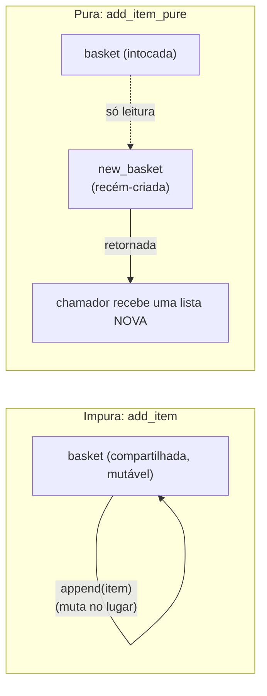

## Objetivos de Aprendizagem

- Definir uma função pura precisamente: sua saída depende só de suas entradas, e não produz efeitos colaterais observáveis.
- Identificar, em uma dada função, toda fonte de impureza, mutação de estado externo, E/S, dependência em dados que não são parâmetros.
- Reescrever uma função impura que muta estado compartilhado ou de argumento-padrão em um equivalente puro que retorna um novo valor em vez disso.
- Explicar por que uma função pura pode ser entendida e testada em isolamento completo, sem rastrear o resto do programa.
- Contrastar a postura do paradigma funcional sobre estado com o modelo de estado mutável sobre o qual programação imperativa é construída.

## Contexto e Motivação

Todo programa imperativo coberto até agora se apoiou no mesmo movimento básico: uma variável mantém um valor, e alguma declaração posterior o muda. Um contador de laço incrementa. Uma lista recebe um elemento anexado a ela. O campo de um objeto é reatribuído. Isso funciona, e é como a maioria dos programas na maioria das linguagens são escritos, mas vem com um custo fácil de subestimar até de fato morder: para saber o que um pedaço de código faz, frequentemente você tem que saber o que *mais* poderia estar tocando o mesmo pedaço de estado, possivelmente de algum outro lugar no programa inteiramente, possivelmente em um momento que você não esperava. Uma função que lê uma variável global, ou muta uma lista que recebeu, pode se comportar diferentemente em duas chamadas que parecem idênticas na página, porque algo no meio mudou o estado do qual depende.

O movimento fundador do paradigma funcional é rejeitar isso completamente: uma **função pura** é aquela cujo comportamento inteiro é determinado por seus argumentos, sem efeitos colaterais de nenhum tipo, não lê ou escreve nada fora de si mesma, e chamá-la duas vezes com as mesmas entradas sempre produz exatamente a mesma saída. Essa é uma restrição real, afiada, não só um conselho de bom estilo, e é exatamente o oposto do modelo de estado mutável sobre o qual programação imperativa foi construída. Onde código imperativo trata "mudar algo ao longo do tempo" como a unidade básica de computação, código funcional trata um valor, uma vez criado, como fixo para sempre, **imutável**, e trata "calcular um novo valor a partir de um antigo" como a unidade básica em vez de "mudar o antigo no lugar."

O ganho não é abstrato. Uma função pura pode ser entendida lendo seu corpo sozinho, nenhuma necessidade de rastrear todo outro lugar em uma base de código grande que poderia tocar os mesmos dados, porque não existe tal lugar; a função simplesmente não alcança fora de si mesma. Pode ser testada chamando-a com algumas entradas e verificando a saída, sem nenhuma configuração de estado global e nenhum desmonte depois. Pode ser chamada de múltiplas threads ao mesmo tempo sem risco de uma chamada corromper a visão de outra de dados compartilhados, porque não há dados compartilhados, mutáveis, para corromper. Este material remonta à mesma linha de curso já introduzindo a visão de nível de paradigma de programação funcional (os próprios capítulos de abertura do SICP constroem essencialmente seu método inteiro em torno dessa distinção), e é o conceito sobre o qual tudo mais no paradigma funcional se constrói: funções de ordem superior, closures, e recursão-como-laço todos fazem muito mais sentido uma vez que pureza e imutabilidade são o padrão assumido em vez da exceção.

## Teoria Central

### O que torna uma função pura

Uma função é **pura** se satisfaz duas condições juntas:

1. **Transparência referencial**, dado os mesmos argumentos, sempre retorna o mesmo resultado, sem nenhuma dependência em nada além daqueles argumentos (não a hora do dia, não um contador global, não o conteúdo de um arquivo).
2. **Nenhum efeito colateral**, chamá-la não observavelmente muda nada fora de sua própria execução local: nenhuma mutação de um objeto ou lista passado, nenhuma reatribuição de uma variável fora de seu escopo, nenhuma impressão, nenhuma escrita em um arquivo ou rede, nenhuma leitura de estado mutável externo também.

Ambas as condições importam independentemente. Uma função poderia depender só de seus argumentos (satisfazendo a condição 1) e ainda mutar algo como um efeito colateral enquanto faz isso (violando a condição 2), aquela função é impura mesmo que seu valor de retorno seja perfeitamente previsível, porque impureza é sobre os *efeitos*, não só o *resultado*.

### A cilada clássica: argumentos padrão mutáveis

A armadilha de pureza mais famosa do Python é uma função que anexa a uma lista, usando um argumento padrão como o valor inicial daquela lista:

```python
def add_item(item, basket=[]):      # PERIGO: padrão avaliado UMA VEZ, no momento de def
    basket.append(item)
    return basket

add_item("apple")     # ["apple"]
add_item("banana")     # ["apple", "banana"] -- NÃO ["banana"]!
```

O valor padrão `[]` é criado exatamente uma vez, quando a declaração `def` executa, não novo a cada chamada, então toda chamada que não fornece seu próprio `basket` compartilha o *mesmo* objeto lista através das chamadas. `add_item` aqui é impura exatamente no sentido acima: chamá-la duas vezes com o mesmo argumento visível (`item` sozinho) produz resultados diferentes dependendo de estado invisível (quantas vezes foi chamada antes), e muta aquele estado compartilhado como um efeito colateral.

O conserto puro retorna uma lista completamente nova a cada chamada em vez de mutar uma compartilhada:

```python
def add_item_pure(item, basket=None):
    new_basket = list(basket) if basket is not None else []
    new_basket.append(item)
    return new_basket

original = ["apple"]
result = add_item_pure("banana", original)
print(result)     # ["apple", "banana"] -- uma nova lista
print(original)   # ["apple"] -- completamente intocada
```

`add_item_pure` nunca toca `original`; constrói e retorna uma lista nova, deixando o que quer que foi passado exatamente como estava. Chamá-la duas vezes com os mesmos argumentos sempre produz um resultado igual, e nada sobre o mundo externo mudou como consequência de chamá-la.



### Imutabilidade como a aplicação estrutural de pureza

Pureza é muito mais fácil de manter quando os próprios dados simplesmente não podem ser mutados. As próprias `tuple` e `str` embutidas do Python são imutáveis, não há nenhum método em uma `str` que a muda no lugar; toda "operação" de string (`.upper()`, `.replace()`, fatiamento) retorna uma string completamente nova, deixando a original exatamente como estava. Contraste isso com `list` e `dict`, que são mutáveis e portanto sempre carregam o risco que o exemplo anterior mostrou: qualquer função que recebe uma e não se disciplina para evitar mutá-la pode silenciosamente quebrar as suposições do chamador. Código Python de estilo funcional adota uma convenção espelhando de perto o que estruturas de dados imutáveis aplicam automaticamente em linguagens como Haskell ou Clojure: trate todo valor como se não pudesse ser mudado, e produza novos valores em vez de mudar os antigos, mesmo quando o tipo de dado subjacente tecnicamente permitiria a mutação.

### Pureza e raciocínio local

O ganho prático mais profundo de pureza é o que às vezes é chamado **raciocínio local**: entender uma função pura exige olhar só para sua própria definição, nunca para o resto do programa. Uma função impura que lê e escreve uma variável global não pode ser entendida dessa forma, para saber o que retornará, você pode precisar saber o histórico inteiro de toda outra função que tocou aquela global antes dessa chamada. Uma função pura não tem tal histórico para rastrear; seu comportamento é completamente determinado no momento em que seus argumentos são fixados. Isso é precisamente por que funções puras se compõem tão bem: encadear o resultado de uma função pura em outra produz um resultado cuja correção depende só de cada peça estar individualmente correta, sem necessidade de se preocupar com ordem de chamada afetando algum estado compartilhado, escondido.

## Exemplos Resolvidos

### Exemplo 1 — a cilada do argumento-padrão-mutável, diagnosticada e consertada

**Problema:** um auxiliar de log é destinado a registrar cada mensagem em uma lista e retornar aquela lista, mas chamadores estão vendo mensagens de chamadas não relacionadas misturadas juntas.

```python
def log_message(msg, history=[]):
    history.append(msg)
    return history

log_a = log_message("starting service A")
log_b = log_message("starting service B")
print(log_a)   # ['starting service A', 'starting service B'] -- inesperado!
print(log_a is log_b)   # True -- são literalmente o mesmo objeto lista
```

**Diagnóstico.** `history=[]` é avaliada uma vez, no momento de `def`, produzindo um objeto lista que toda chamada compartilhando o argumento padrão muta ainda mais. `log_a` e `log_b` não são dois históricos separados, são dois nomes apontando para o exato mesmo objeto, mutado duas vezes.

**Conserto.** Torne a função pura: nunca mute a lista que recebe (ou seu próprio padrão), sempre retorne uma nova.

```python
def log_message_pure(msg, history=()):
    return tuple(history) + (msg,)

log_a = log_message_pure("starting service A")
log_b = log_message_pure("starting service B")
print(log_a)   # ('starting service A',)
print(log_b)   # ('starting service B',) -- independente
print(log_a is log_b)   # False
```

Usar uma `tuple` imutável como o padrão remove a possibilidade de mutação acidental completamente, `tuple(history) + (msg,)` sempre constrói uma nova tupla, e o padrão vazio `()` é seguro para compartilhar através de chamadas porque nada jamais pode mutá-lo.

### Exemplo 2 — função "mesma" pura vs. impura, lado a lado

**Problema:** dada uma lista de temperaturas em Celsius, produza a mesma lista em Fahrenheit.

Versão impura, converte e muta a lista no lugar:

```python
def to_fahrenheit_impure(temps):
    for i in range(len(temps)):
        temps[i] = temps[i] * 9 / 5 + 32
    return temps

celsius = [0, 20, 100]
result = to_fahrenheit_impure(celsius)
print(result)    # [32.0, 68.0, 212.0]
print(celsius)   # [32.0, 68.0, 212.0] -- a lista ORIGINAL se foi
```

Qualquer outra parte do programa ainda mantendo uma referência a `celsius`, esperando valores Celsius, silenciosamente vê valores Fahrenheit em vez disso, porque `to_fahrenheit_impure` mutou a própria lista que recebeu em vez de produzir um resultado separado.

Versão pura, constrói e retorna uma nova lista, deixando a entrada intocada:

```python
def to_fahrenheit_pure(temps):
    return [t * 9 / 5 + 32 for t in temps]

celsius = [0, 20, 100]
fahrenheit = to_fahrenheit_pure(celsius)
print(fahrenheit)   # [32.0, 68.0, 212.0]
print(celsius)       # [0, 20, 100] -- completamente inalterada
```

`to_fahrenheit_pure` pode ser chamada qualquer número de vezes em `celsius` e sempre retorna o mesmo resultado independente; nada sobre a própria `celsius`, ou qualquer outro código dependendo dela, jamais está em risco.

### Exemplo 3 — testar uma função pura não exige nenhuma configuração afinal

**Problema:** verifique que um cálculo de desconto está correto.

```python
def apply_discount(price, percent_off):
    return price * (1 - percent_off / 100)

assert apply_discount(100, 20) == 80.0
assert apply_discount(50, 0) == 50.0
assert apply_discount(200, 50) == 100.0
```

Porque `apply_discount` é pura, testá-la não precisa de nada além de chamá-la diretamente com entradas de amostra e verificar as saídas, nenhum banco de dados para semear, nenhuma configuração global para definir primeiro, nenhum estado para redefinir entre asserções, e nenhum risco de que rodar os testes em uma ordem diferente mude os resultados. Contraste isso com uma versão impura que, digamos, lesse uma "temporada de desconto atual" de uma variável global: testá-la corretamente exigiria cuidadosamente configurar e desmontar aquela global antes e depois de toda única asserção, e os testes poderiam interferir uns com os outros se rodados fora de ordem ou concorrentemente.

## Equívocos Comuns e Armadilhas

- **"Uma função sem nenhuma palavra-chave `global` explícita deve ser pura."** Ler estado mutável externo (uma lista de nível de módulo, o atributo de um objeto) sem jamais escrever nele ainda viola transparência referencial se aquele estado externo puder mudar entre chamadas, a saída da função então depende de mais do que só seus argumentos, mesmo que nada tenha sido tecnicamente "escrito." Uma função verdadeiramente pura depende *só* dos valores passados a ela como argumentos.
- **"Retornar um novo valor é suficiente, mutar a entrada um pouco no caminho até lá não conta."** `to_fahrenheit_impure` acima eventualmente retorna a lista "certa", mas ainda mutou a lista original do chamador como um efeito colateral, que é exatamente a impureza que regras de pureza eliminam, uma função pura deve deixar tudo que não criou em paz, ponto final, não só eventualmente produzir um valor de retorno defensável.
- **"Argumentos padrão mutáveis são só uma armadilha obscura, código normal não atinge isso."** `def f(x, cache={})` e padrões similares aparecem constantemente em código real, frequentemente escrito por alguém que assumiu (razoavelmente, mas incorretamente) que `{}` ou `[]` como um padrão é reconstruído novo a cada chamada. É criado exatamente uma vez, no momento de definição de função, e toda chamada omitindo aquele argumento compartilha o objeto idêntico.
- **"Pureza é só uma preferência de estilo sem nenhuma diferença técnica real de escrever código imperativo cuidadoso."** A diferença prática aparece sob composição e concorrência: funções puras podem ser livremente reordenadas, cacheadas, ou rodadas em paralelo sem mudar o resultado, porque não há estado mutável compartilhado para competir ou invalidar, propriedades que valem automaticamente para código puro e exigem disciplina cuidadosa, manual, para garantir para código impuro fazendo o "mesmo" trabalho.

## Resumo

A saída de uma função pura depende só de seus argumentos, e chamá-la não produz nenhum efeito colateral observável, nenhuma mutação de qualquer coisa passada ou mantida externamente, nenhuma E/S, nenhuma dependência em nada além dos próprios parâmetros. A armadilha do argumento-padrão-mutável do Python é uma forma real, comum, pela qual pureza é acidentalmente quebrada: um padrão como `[]` ou `{}` é construído uma vez no momento de `def` e silenciosamente compartilhado e mutado através de toda chamada que depende dele, enquanto o conserto puro sempre constrói e retorna um valor novo em vez disso. Dados imutáveis (tuplas, strings) ajudam a aplicar pureza estruturalmente, já que simplesmente não há nenhum método disponível para mutá-los no lugar, diferente de listas e dicionários, que exigem disciplina deliberada. O ganho é raciocínio local: uma função pura pode ser completamente entendida, testada, e confiada lendo sua definição sozinha, sem necessidade de rastrear o resto do programa por outro código que possa estar tocando o mesmo estado, o oposto exato do modelo de estado mutável, compartilhado que programação imperativa assume como seu padrão.

## Documentation Links

- [MIT SICP — Wikipedia (course/book overview)](https://en.wikipedia.org/wiki/Structure_and_Interpretation_of_Computer_Programs) — doc
- [University of Washington / Coursera — Programming Languages, Part A (Grossman)](https://www.coursera.org/learn/programming-languages) — doc
