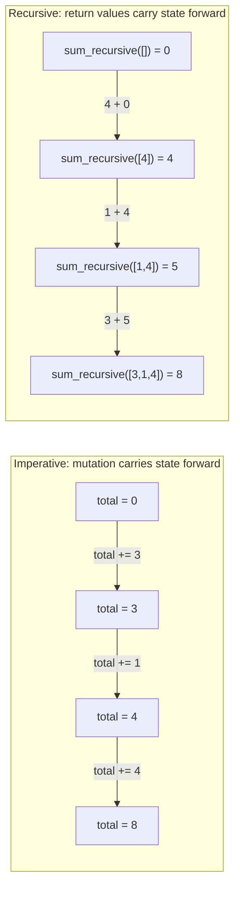

## Learning Objectives

- Explain why a mutation-free style leaves no place for a `for` loop's incrementing counter or accumulator variable to live.
- Rewrite an explicit accumulator loop (e.g., summing a list) as a purely recursive equivalent with no mutation anywhere.
- Identify the base case and recursive case in a mutation-free recursive solution, and confirm neither one mutates any variable.
- State why functional languages treat recursion as their default, primary way of repeating an action, rather than one option among several.
- Compare a mutation-free recursive solution against its imperative loop equivalent and identify exactly where each one's "state" lives.

## Context & Motivation

Recursion itself — the base case, the recursive case, the call stack that tracks pending calls and unwinds them in reverse order — has already been covered in full, and none of that mechanism is any different here. What's new is a question that only becomes pressing once mutation is off the table: if a pure function can never mutate a variable, where does a `for` loop's incrementing counter, or its accumulator that grows on every pass, actually *live*? An ordinary `for i in range(n)` loop depends on `i` changing value on every iteration, and an accumulator pattern (`total = 0; total += x`) depends on `total` being reassigned on every pass too — both are mutation, exactly the thing the pure-functions concept ruled out as the functional paradigm's founding move. Once mutation is gone, that style of loop has nowhere left to go.

Functional languages resolve this not by inventing some entirely new looping construct, but by leaning on the recursion you already understand deeply and making it the **default**, primary way of repeating an action — not one option sitting alongside loops, the way it might feel in an imperative language where `for` and `while` are what get reached for first and recursion is the occasional exception for tree-shaped problems. Every "loop" in a purely functional style is, structurally, a recursive function: what would be a loop counter becomes a parameter that shrinks with every recursive call instead of a variable that gets reassigned in place, and what would be an accumulator becomes the *value returned* by a recursive call, combined by the caller, rather than a variable mutated across iterations.

This is best seen directly on a problem simple enough that the contrast is unambiguous: summing a list of numbers. The imperative version — already covered under that paradigm — uses an explicit accumulator that gets mutated once per element. The purely recursive version replaces that mutation entirely: the base case says an empty list sums to `0`, and the recursive case says the sum of any other list is its first element plus the (recursively computed) sum of everything after it — with no variable anywhere ever reassigned. This is the direct, paradigm-level payoff of the recursion mechanics already mastered: the same tool, now doing the *primary* job a `for` loop would otherwise do.

## Core Theory

### Where a loop's mutable state has nowhere to live

A `for` loop's mechanics depend on two things being reassignable: the loop variable itself (`i`, or whatever is being iterated), and, for anything beyond the simplest "do this n times," an accumulator that carries a running result forward from one iteration to the next.

```python
def sum_imperative(numbers):
    total = 0                 # mutable accumulator
    for n in numbers:
        total += n             # reassigned on every iteration
    return total
```

`total` is reassigned `len(numbers)` times over the life of this loop. In a style with no mutation permitted at all, `total += n` simply isn't an available move — there is no variable that can be changed in place, because "changing something in place" is exactly what purity rules out.

### The purely recursive replacement: no mutation, anywhere

The recursive version replaces the accumulator with the *return value* of a smaller recursive call, and replaces "advance the loop variable" with "call yourself on a smaller version of the same input":

```python
def sum_recursive(numbers):
    if not numbers:                          # base case: empty list sums to 0
        return 0
    return numbers[0] + sum_recursive(numbers[1:])   # recursive case
```

No variable here is ever reassigned. `numbers[1:]` does not mutate `numbers` — it constructs a brand-new list, one element shorter, leaving the original untouched, matching exactly the immutability standard the pure-functions concept established. The "running total" that the imperative version kept in a mutable variable is, in this version, simply the value each recursive call *returns* — the outermost call gets the final sum entirely by adding its own first element to whatever the recursive call underneath it returns, with the accumulation happening through return values stacking up, not through any variable being changed.



Both diagrams reach the same final total, `8`, over the same three numbers — but the imperative side gets there by changing one variable's value three times in place, while the recursive side gets there by nesting three separate return values, each computed once and never altered afterward.

### Recursion as the default, not an alternative

In an imperative language, recursion is typically presented as a specialized tool: reached for when a problem's shape is naturally self-referential (trees, nested structures), while `for` and `while` remain the default choice for straightforward repetition like summing a list or processing every element of a sequence once. A purely functional language cannot make that same division, because the "default, straightforward" tool — the mutating loop — isn't available at all. Every repeated action, no matter how simple, has to be expressed the way `sum_recursive` is: a base case for the smallest input, and a recursive case that shrinks the input and combines its own contribution with whatever the smaller call returns. This is why recursion in functional languages is described as the **primary loop** rather than one option among several: it isn't chosen over a `for` loop for stylistic reasons on a case-by-case basis — it's the only mechanism left standing once mutation is removed, so it necessarily becomes the default way *every* repetition, simple or complex, gets expressed.

### What doesn't change from the recursion you already know

The base case, recursive case, leap of faith, and call-stack mechanics behind `sum_recursive` are identical in kind to `factorial` or `list_sum` from earlier recursion material — nothing about *how* recursion works is different here. What's different is only the *role* it's playing: there, recursion was introduced as a technique available alongside loops, useful for naturally self-similar problems; here, the absence of mutation forces every repeated action, however simple, through that same mechanism, because there is no mutating alternative left to reach for instead.

## Worked Examples

### Example 1 — summing a list, imperative vs. purely recursive, traced side by side

**Problem:** compute the sum of `[3, 1, 4, 1]` both ways, and confirm exactly where each version's "running total" physically lives.

Imperative — one variable, reassigned four times:

```python
def sum_imperative(numbers):
    total = 0
    for n in numbers:
        total += n
    return total

sum_imperative([3, 1, 4, 1])
# total: 0 -> 3 -> 4 -> 8 -> 9   (same variable, reassigned each pass)
```

Purely recursive — no variable reassigned even once; each partial total is a fresh return value:

```python
def sum_recursive(numbers):
    if not numbers:
        return 0
    return numbers[0] + sum_recursive(numbers[1:])

sum_recursive([3, 1, 4, 1])
# = 3 + sum_recursive([1, 4, 1])
# = 3 + (1 + sum_recursive([4, 1]))
# = 3 + (1 + (4 + sum_recursive([1])))
# = 3 + (1 + (4 + (1 + sum_recursive([]))))
# = 3 + (1 + (4 + (1 + 0)))
# = 9
```

Both reach `9`. The imperative trace shows one name (`total`) taking on five different values over time; the recursive trace shows five distinct, never-changing return values (`0`, `1`, `5`, `6`, `9`) nesting inside each other, none of them ever reassigned after being computed.

### Example 2 — counting elements satisfying a condition, without mutation

**Problem:** count how many numbers in a list are negative, using a purely recursive approach — no accumulator variable, no loop.

```python
def count_negative(numbers):
    if not numbers:                                   # base case: nothing to count
        return 0
    first_contributes = 1 if numbers[0] < 0 else 0
    return first_contributes + count_negative(numbers[1:])

count_negative([3, -2, -5, 7, -1])   # 3
```

`first_contributes` is a fresh local value computed once per call from that call's own `numbers[0]` — it is never mutated, only read once and used in the addition that produces this call's return value. The "count so far" that an imperative version would keep in a mutable variable across loop iterations is, here, simply the value each smaller recursive call returns, added into by the level above it — matching `sum_recursive`'s shape exactly, with a conditional in place of a direct addition.

### Example 3 — building a new list without mutation, in place of `append`-based accumulation

**Problem:** double every number in a list, purely recursively, with no `result = []; result.append(...)` pattern anywhere.

Imperative version, for contrast — an accumulator list, mutated via `append` on every pass:

```python
def double_all_imperative(numbers):
    result = []
    for n in numbers:
        result.append(n * 2)
    return result
```

Purely recursive version — the "growing list" becomes a freshly constructed list at every level, never mutated after being built:

```python
def double_all_recursive(numbers):
    if not numbers:
        return []
    return [numbers[0] * 2] + double_all_recursive(numbers[1:])

double_all_recursive([3, 1, 4])   # [6, 2, 8]
```

`[numbers[0] * 2] + double_all_recursive(numbers[1:])` builds a brand-new list at every recursive level by concatenation, never calling `.append` on any list that already exists — each level's result is assembled once, from smaller, already-finished pieces, and never touched again afterward. This mirrors exactly the same shift as `sum_recursive`: an operation that would mutate a shared, growing structure in the imperative version instead produces a brand-new, immutable structure at each level in the recursive one.

## Common Misconceptions & Pitfalls

- **"This is just recursion again — nothing new is being said here."** The mechanics genuinely are unchanged from what's already been covered (base case, recursive case, call stack). What's new is the *reason* recursion is being used: not because the problem is naturally tree-shaped, but because a mutation-free style has no mutating loop available at all, which makes recursion the default way to express *any* repetition, not a specialized alternative reached for occasionally.
- **"A recursive version without mutation must be doing something fundamentally different from a loop with an accumulator."** Both compute identically and do comparable work; the difference is only in *where the running state lives* — a single reassigned variable in the loop version, versus a chain of freshly computed, never-changed return values in the recursive version. Neither is mutating any state that the other doesn't also, in some sense, "accumulate" — they simply carry that accumulation through different mechanisms.
- **"Since there's no mutation, this recursive style must be free of the usual recursion costs (stack depth, etc.)."** Removing mutation changes nothing about the call-stack mechanics already covered — `sum_recursive` on a very long list still pushes one stack frame per element, exactly like any other recursive function, and can still hit `RecursionError` on a long enough input, precisely because avoiding mutation and avoiding stack usage are two separate concerns; purely functional languages that lean on recursion this heavily typically rely on a compiler optimization (tail-call optimization) that Python's own implementation does not provide, which is a real, separate limitation worth being aware of.
- **"Building a new list via `[x] + recursive_call(...)` at every level is just as efficient as `append`-based mutation."** `+` on lists constructs an entirely new list each time, copying every existing element into it — repeating this at every one of `n` recursive levels costs meaningfully more work than a single mutated list growing via `append`. The point of Example 3 is to demonstrate the *mutation-free shape* clearly, not to claim there is no performance difference from the imperative accumulator version.

## Summary

Recursion's own mechanics — base case, recursive case, the call stack — are exactly what was already covered elsewhere and are not being re-derived here. What's new is the paradigm-level reason recursion becomes *the* default way to repeat an action once mutation is disallowed: a `for` loop's incrementing counter and an accumulator's repeated reassignment both depend on mutation, which a purely functional style rules out entirely, leaving nowhere for that mutable state to live. The fix is not a new construct but a shift in where the running result is carried: instead of one variable reassigned across iterations, each recursive call returns its own contribution, and the level above combines it with the recursive call's result — exactly as `sum_recursive` (base case: empty list sums to `0`; recursive case: first element plus the recursive sum of the rest) demonstrates against its mutating, imperative twin. This is why functional languages treat recursion not as one looping option among several, but as the primary, default mechanism for repetition of any kind.

## Documentation Links

- [MIT SICP — Wikipedia (course/book overview)](https://en.wikipedia.org/wiki/Structure_and_Interpretation_of_Computer_Programs) — doc
- [University of Washington / Coursera — Programming Languages, Part A (Grossman)](https://www.coursera.org/learn/programming-languages) — doc
