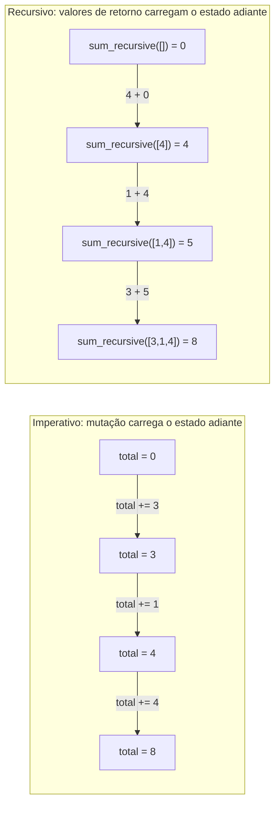

## Objetivos de Aprendizagem

- Explicar por que um estilo livre de mutação não deixa lugar para a variável contadora incremental ou acumuladora de um laço `for` viver.
- Reescrever um laço acumulador explícito (ex: somando uma lista) como um equivalente puramente recursivo sem nenhuma mutação em lugar nenhum.
- Identificar o caso base e o caso recursivo em uma solução recursiva livre de mutação, e confirmar que nenhum dos dois muta qualquer variável.
- Enunciar por que linguagens funcionais tratam recursão como sua forma padrão, primária, de repetir uma ação, em vez de uma opção entre várias.
- Comparar uma solução recursiva livre de mutação contra seu equivalente em laço imperativo e identificar exatamente onde o "estado" de cada uma vive.

## Contexto e Motivação

A própria recursão, o caso base, o caso recursivo, a pilha de chamadas que rastreia chamadas pendentes e as desenrola em ordem reversa, já foi coberta por completo, e nenhum daquele mecanismo é diferente aqui. O que é novo é uma pergunta que só se torna urgente uma vez que mutação está fora de cogitação: se uma função pura nunca pode mutar uma variável, onde de fato *vive* o contador incremental de um laço `for`, ou seu acumulador que cresce a cada passagem? Um laço `for i in range(n)` comum depende de `i` mudar de valor a cada iteração, e um padrão acumulador (`total = 0; total += x`) depende de `total` ser reatribuído a cada passagem também, ambos são mutação, exatamente a coisa que o conceito de funções puras descartou como o movimento fundador do paradigma funcional. Uma vez que a mutação desaparece, aquele estilo de laço não tem mais para onde ir.

Linguagens funcionais resolvem isso não inventando alguma construção de laço inteiramente nova, mas se apoiando na recursão que você já entende profundamente e tornando-a o **padrão**, a forma primária de repetir uma ação, não uma opção sentada ao lado de laços, da forma que poderia parecer em uma linguagem imperativa onde `for` e `while` são o que se busca primeiro e recursão é a exceção ocasional para problemas em forma de árvore. Todo "laço" em um estilo puramente funcional é, estruturalmente, uma função recursiva: o que seria um contador de laço se torna um parâmetro que encolhe a cada chamada recursiva em vez de uma variável reatribuída no lugar, e o que seria um acumulador se torna o *valor retornado* por uma chamada recursiva, combinado pelo chamador, em vez de uma variável mutada ao longo das iterações.

Isso é melhor visto diretamente em um problema simples o bastante para que o contraste seja inequívoco: somar uma lista de números. A versão imperativa, já coberta sob aquele paradigma, usa um acumulador explícito que é mutado uma vez por elemento. A versão puramente recursiva substitui aquela mutação por completo: o caso base diz que uma lista vazia soma `0`, e o caso recursivo diz que a soma de qualquer outra lista é seu primeiro elemento mais a soma (calculada recursivamente) de tudo depois dele, sem nenhuma variável em lugar nenhum jamais reatribuída. Este é o retorno direto, em nível de paradigma, da mecânica de recursão já dominada: a mesma ferramenta, agora fazendo o trabalho *primário* que um laço `for` de outra forma faria.

## Teoria Central

### Onde o estado mutável de um laço não tem onde viver

A mecânica de um laço `for` depende de duas coisas serem reatribuíveis: a própria variável de laço (`i`, ou o que estiver sendo iterado), e, para qualquer coisa além do mais simples "faça isso n vezes," um acumulador que carrega um resultado corrente adiante de uma iteração para a próxima.

```python
def sum_imperative(numbers):
    total = 0                 # acumulador mutável
    for n in numbers:
        total += n             # reatribuído a cada iteração
    return total
```

`total` é reatribuído `len(numbers)` vezes ao longo da vida deste laço. Em um estilo sem nenhuma mutação permitida, `total += n` simplesmente não é um movimento disponível, não há variável que possa ser mudada no lugar, porque "mudar algo no lugar" é exatamente o que pureza descarta.

### A substituição puramente recursiva: nenhuma mutação, em lugar nenhum

A versão recursiva substitui o acumulador pelo *valor de retorno* de uma chamada recursiva menor, e substitui "avance a variável de laço" por "chame a si mesma em uma versão menor da mesma entrada":

```python
def sum_recursive(numbers):
    if not numbers:                          # caso base: lista vazia soma 0
        return 0
    return numbers[0] + sum_recursive(numbers[1:])   # caso recursivo
```

Nenhuma variável aqui é jamais reatribuída. `numbers[1:]` não muta `numbers`, constrói uma lista inteiramente nova, um elemento mais curta, deixando a original intocada, combinando exatamente com o padrão de imutabilidade que o conceito de funções puras estabeleceu. O "total corrente" que a versão imperativa mantinha em uma variável mutável é, nesta versão, simplesmente o valor que cada chamada recursiva *retorna*, a chamada mais externa obtém a soma final inteiramente somando seu próprio primeiro elemento ao que a chamada recursiva abaixo dela retorna, com a acumulação acontecendo através de valores de retorno se empilhando, não através de qualquer variável sendo mudada.



Ambos os diagramas chegam ao mesmo total final, `8`, sobre os mesmos três números, mas o lado imperativo chega lá mudando o valor de uma variável três vezes no lugar, enquanto o lado recursivo chega lá aninhando três valores de retorno separados, cada um calculado uma vez e nunca alterado depois.

### Recursão como o padrão, não uma alternativa

Em uma linguagem imperativa, recursão é tipicamente apresentada como uma ferramenta especializada: buscada quando a forma de um problema é naturalmente autorreferencial (árvores, estruturas aninhadas), enquanto `for` e `while` permanecem a escolha padrão para repetição direta como somar uma lista ou processar cada elemento de uma sequência uma vez. Uma linguagem puramente funcional não pode fazer essa mesma divisão, porque a ferramenta "padrão, direta", o laço mutante, simplesmente não está disponível. Toda ação repetida, não importa quão simples, tem que ser expressa da forma que `sum_recursive` é: um caso base para a menor entrada, e um caso recursivo que encolhe a entrada e combina sua própria contribuição com o que a chamada menor retorna. É por isso que recursão em linguagens funcionais é descrita como o **laço primário** em vez de uma opção entre várias: não é escolhida em vez de um laço `for` por razões estilísticas caso a caso, é o único mecanismo restante uma vez que mutação é removida, então necessariamente se torna a forma padrão pela qual *toda* repetição, simples ou complexa, é expressa.

### O que não muda em relação à recursão que você já conhece

O caso base, o caso recursivo, o salto de fé, e a mecânica de pilha de chamadas por trás de `sum_recursive` são idênticos em tipo a `factorial` ou `list_sum` do material anterior de recursão, nada sobre *como* recursão funciona é diferente aqui. O que é diferente é só o *papel* que ela está desempenhando: ali, recursão foi introduzida como uma técnica disponível ao lado de laços, útil para problemas naturalmente autossimilares; aqui, a ausência de mutação força toda ação repetida, por mais simples que seja, através daquele mesmo mecanismo, porque não há alternativa mutante restante para se buscar em vez disso.

## Exemplos Resolvidos

### Exemplo 1 — somando uma lista, imperativo vs. puramente recursivo, rastreados lado a lado

**Problema:** calcule a soma de `[3, 1, 4, 1]` das duas formas, e confirme exatamente onde o "total corrente" de cada versão fisicamente vive.

Imperativo, uma variável, reatribuída quatro vezes:

```python
def sum_imperative(numbers):
    total = 0
    for n in numbers:
        total += n
    return total

sum_imperative([3, 1, 4, 1])
# total: 0 -> 3 -> 4 -> 8 -> 9   (mesma variável, reatribuída a cada passagem)
```

Puramente recursivo, nenhuma variável reatribuída sequer uma vez; cada total parcial é um valor de retorno novo:

```python
def sum_recursive(numbers):
    if not numbers:
        return 0
    return numbers[0] + sum_recursive(numbers[1:])

sum_recursive([3, 1, 4, 1])
# = 3 + sum_recursive([1, 4, 1])
# = 3 + (1 + sum_recursive([4, 1]))
# = 3 + (1 + (4 + sum_recursive([1])))
# = 3 + (1 + (4 + (1 + sum_recursive([]))))
# = 3 + (1 + (4 + (1 + 0)))
# = 9
```

Ambos chegam a `9`. O rastro imperativo mostra um nome (`total`) assumindo cinco valores diferentes ao longo do tempo; o rastro recursivo mostra cinco valores de retorno distintos, nunca mudando (`0`, `1`, `5`, `6`, `9`) aninhados uns dentro dos outros, nenhum deles jamais reatribuído depois de ser calculado.

### Exemplo 2 — contando elementos que satisfazem uma condição, sem mutação

**Problema:** conte quantos números em uma lista são negativos, usando uma abordagem puramente recursiva, sem variável acumuladora, sem laço.

```python
def count_negative(numbers):
    if not numbers:                                   # caso base: nada para contar
        return 0
    first_contributes = 1 if numbers[0] < 0 else 0
    return first_contributes + count_negative(numbers[1:])

count_negative([3, -2, -5, 7, -1])   # 3
```

`first_contributes` é um valor local novo calculado uma vez por chamada a partir do próprio `numbers[0]` daquela chamada, nunca é mutado, só lido uma vez e usado na soma que produz o valor de retorno desta chamada. A "contagem até agora" que uma versão imperativa manteria em uma variável mutável através das iterações do laço é, aqui, simplesmente o valor que cada chamada recursiva menor retorna, somado pelo nível acima dela, combinando exatamente com a forma de `sum_recursive`, com um condicional no lugar de uma soma direta.

### Exemplo 3 — construindo uma lista nova sem mutação, no lugar de acumulação baseada em `append`

**Problema:** dobre todo número em uma lista, puramente recursivamente, sem nenhum padrão `result = []; result.append(...)` em lugar nenhum.

Versão imperativa, para contraste, uma lista acumuladora, mutada via `append` a cada passagem:

```python
def double_all_imperative(numbers):
    result = []
    for n in numbers:
        result.append(n * 2)
    return result
```

Versão puramente recursiva, a "lista crescente" se torna uma lista recém-construída em cada nível, nunca mutada depois de ser construída:

```python
def double_all_recursive(numbers):
    if not numbers:
        return []
    return [numbers[0] * 2] + double_all_recursive(numbers[1:])

double_all_recursive([3, 1, 4])   # [6, 2, 8]
```

`[numbers[0] * 2] + double_all_recursive(numbers[1:])` constrói uma lista inteiramente nova em cada nível recursivo por concatenação, nunca chamando `.append` em nenhuma lista que já existe, o resultado de cada nível é montado uma vez, a partir de peças menores, já finalizadas, e nunca tocado de novo depois. Isso espelha exatamente a mesma mudança de `sum_recursive`: uma operação que mutaria uma estrutura compartilhada, crescente, na versão imperativa em vez disso produz uma estrutura inteiramente nova, imutável, em cada nível na versão recursiva.

## Equívocos Comuns e Armadilhas

- **"Isso é só recursão de novo, nada novo está sendo dito aqui."** A mecânica genuinamente não mudou em relação ao que já foi coberto (caso base, caso recursivo, pilha de chamadas). O que é novo é a *razão* pela qual recursão está sendo usada: não porque o problema é naturalmente em forma de árvore, mas porque um estilo livre de mutação não tem nenhum laço mutante disponível, o que torna recursão a forma padrão de expressar *qualquer* repetição, não uma alternativa especializada buscada ocasionalmente.
- **"Uma versão recursiva sem mutação deve estar fazendo algo fundamentalmente diferente de um laço com um acumulador."** Ambas calculam identicamente e fazem trabalho comparável; a diferença é só em *onde o estado corrente vive*, uma única variável reatribuída na versão do laço, versus uma cadeia de valores de retorno recém-calculados, nunca mudados, na versão recursiva. Nenhuma das duas está mutando algum estado que a outra também não, em algum sentido, "acumula", elas simplesmente carregam aquela acumulação através de mecanismos diferentes.
- **"Já que não há mutação, este estilo recursivo deve estar livre dos custos usuais de recursão (profundidade de pilha, etc.)."** Remover mutação não muda nada sobre a mecânica de pilha de chamadas já coberta, `sum_recursive` em uma lista muito longa ainda empilha um quadro de pilha por elemento, exatamente como qualquer outra função recursiva, e ainda pode atingir `RecursionError` em uma entrada longa o bastante, precisamente porque evitar mutação e evitar uso de pilha são duas preocupações separadas; linguagens puramente funcionais que se apoiam nessa recursão tão pesadamente tipicamente dependem de uma otimização de compilador (otimização de chamada de cauda) que a própria implementação do Python não fornece, o que é uma limitação real, separada, que vale a pena conhecer.
- **"Construir uma lista nova via `[x] + recursive_call(...)` em cada nível é tão eficiente quanto mutação baseada em `append`."** `+` em listas constrói uma lista inteiramente nova a cada vez, copiando todo elemento existente para dentro dela, repetir isso em cada um dos `n` níveis recursivos custa significativamente mais trabalho que uma única lista mutada crescendo via `append`. O ponto do Exemplo 3 é demonstrar a *forma livre de mutação* claramente, não afirmar que não há diferença de desempenho em relação à versão do acumulador imperativo.

## Resumo

A própria mecânica da recursão, caso base, caso recursivo, a pilha de chamadas, é exatamente o que já foi coberto em outro lugar e não está sendo rederivada aqui. O que é novo é a razão em nível de paradigma pela qual recursão se torna *o* modo padrão de repetir uma ação uma vez que mutação é proibida: o contador incremental de um laço `for` e a reatribuição repetida de um acumulador ambos dependem de mutação, que um estilo puramente funcional descarta por completo, deixando nenhum lugar para aquele estado mutável viver. A correção não é uma construção nova mas uma mudança em onde o resultado corrente é carregado: em vez de uma variável reatribuída ao longo das iterações, cada chamada recursiva retorna sua própria contribuição, e o nível acima a combina com o resultado da chamada recursiva, exatamente como `sum_recursive` (caso base: lista vazia soma `0`; caso recursivo: primeiro elemento mais a soma recursiva do resto) demonstra contra seu gêmeo mutante, imperativo. É por isso que linguagens funcionais tratam recursão não como uma opção de laço entre várias, mas como o mecanismo primário, padrão, para repetição de qualquer tipo.

## Documentation Links

- [MIT SICP — Wikipedia (course/book overview)](https://en.wikipedia.org/wiki/Structure_and_Interpretation_of_Computer_Programs) — doc
- [University of Washington / Coursera — Programming Languages, Part A (Grossman)](https://www.coursera.org/learn/programming-languages) — doc
