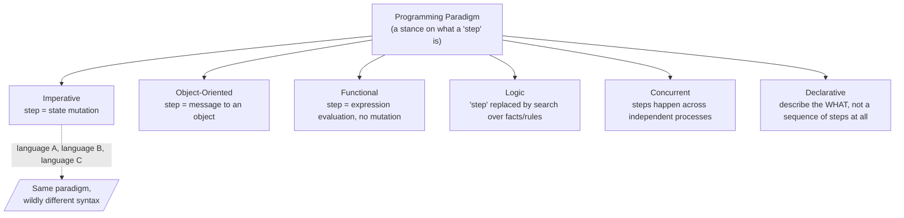

## Learning Objectives

- Define a programming paradigm as a way of thinking about what a program IS, not merely a set of syntax rules.
- Distinguish "paradigm" from "language" — explain why a single language can support more than one paradigm, and why two languages can share a paradigm despite looking nothing alike.
- Name the major paradigm families this discipline will cover (imperative, object-oriented, functional, logic, concurrent, declarative) and state, in one sentence each, the core conceptual move that defines each family.
- Explain why comparing paradigms on the SAME small problem, solved multiple genuinely different ways, is a more reliable way to see the differences than comparing their syntax alone.

## Context & Motivation

Every programmer who has written more than a handful of programs has, without necessarily noticing it, already absorbed a way of thinking about what a program fundamentally is. If your instinct when asked "how do I compute the sum of a list of numbers" is to reach for a variable, initialize it to zero, and loop, updating it one step at a time, you have absorbed one particular answer to the question "what is a program?" — a program is a sequence of instructions that changes the state of the machine, one step after another, until the answer falls out. That answer feels so natural that it rarely gets named. It is not, however, the only answer, and it is not even the historically first one. A programming paradigm is precisely this: a fundamental stance on what counts as a computational "step," what a program is conceived of as being (a sequence of state changes? a mathematical function being evaluated? a set of logical facts being queried? a network of independent processes exchanging messages?), and, downstream of that stance, what kinds of things are easy to say and what kinds of things are awkward to say in that style.

This distinction — paradigm versus language versus syntax — matters because it is easy to conflate them, and the conflation hides something important. Two languages that look completely different on the page (say, a curly-brace, semicolon-terminated language and a whitespace-sensitive one) can be doing the exact same conceptual thing: both mutating variables in a loop, both treating "the current state of memory" as the thing the program pushes forward one instruction at a time. Meanwhile, a single modern language often supports several paradigms at once, letting the same programmer write an explicit `for` loop with a mutable accumulator in one function and a chain of side-effect-free transformations in the next, within the same file. If "paradigm" were just "which language," none of this would make sense. What actually varies across paradigms is something deeper than syntax: the paradigm determines what a "step" of computation even means, and that, in turn, shapes which problems feel natural to express and which feel like fighting the language.

The ACM/IEEE CS2013 curriculum guidelines treat "Programming Languages" as a knowledge area precisely because employers and researchers alike have found that a computer scientist who has only ever programmed in one paradigm tends to reach for the same hammer regardless of the shape of the problem in front of them — writing awkward, imperative-style loops to solve a problem that is naturally a set of independent, parallel transformations, for instance, simply because that is the only mental model available. Learning to recognize a paradigm as a deliberate, nameable choice — rather than as "the normal way to write code" — is the first step toward being able to choose deliberately rather than by habit. This discipline is built around exactly that goal: rather than describing paradigms in the abstract and leaving the differences vague, it will return, again and again, to variations on the same small handful of problems (summing a list is one you will see almost immediately), solved in genuinely different paradigm styles, so that the differences show up concretely, in actual code that behaves differently, rather than only as adjectives in a lecture.

It is worth being honest, up front, about scope: "paradigm" is a big word, and full academic treatments (Grossman's UW course, referenced throughout this discipline, is one of the more rigorous ones) spend an entire semester on it. This discipline's ambition is narrower and more practical — enough real understanding of each major paradigm family to recognize it in the wild, to write a small working program in each style, and to reason about which style fits a given problem best, rather than an exhaustive theoretical treatment of programming language semantics.

## Core Theory

### What varies across paradigms: the notion of a "step"

At the center of every paradigm is an answer to a single question: what does it mean to make progress in a computation? In the imperative paradigm (covered in the next concept), a "step" is an instruction that changes some piece of stored state — an assignment, a mutation, a jump to a different instruction. In the object-oriented paradigm, a "step" is often understood as a message sent to an object, requesting that it act (and possibly mutate its own internal state) according to its own logic. In the functional paradigm, a "step" is the evaluation of an expression into a value, with no notion of "changing" anything — a function is applied to inputs and produces an output, full stop, and doing it again with the same inputs always produces the same output. In the logic paradigm, there is no "step" toward an answer at all in the imperative sense; instead, a program is a set of facts and rules, and "running" the program means searching for values that make some query true. In paradigms built around concurrency, a step is something that happens in one of possibly many simultaneously-running processes, and part of what the paradigm has to define is how (or whether) those processes see each other's steps at all.

None of these are merely stylistic quirks — each stance has real, follow-on consequences for how a program in that paradigm is written, read, debugged, and reasoned about. If "step" means "mutate shared state," you must reason carefully about ordering: which mutation happened before which. If "step" means "evaluate an expression to a value with no side effects," you can substitute equal expressions for each other freely (this property has a name, referential transparency, that a later concept in this discipline develops in full) and reorder independent computations without changing the result — an entire category of bugs (a variable having an unexpected value because some other, seemingly unrelated code changed it first) becomes structurally impossible.

### Paradigm as a lens, not a language

A useful mental model: a paradigm is a lens you look at a problem through, and a language is a tool that supports looking through zero, one, or several such lenses. Multi-paradigm languages are the norm today, not the exception — a language might make it comfortable to write imperative loops, define classes with methods, and pass functions as values, all without switching languages. This means that recognizing "I am currently writing imperative-style code" or "this function is written in a functional style" is a skill applied to a piece of code, independent of which language that code happens to be written in. Two different languages, both used in a strictly imperative style, are more alike, at the paradigm level, than two pieces of code in the same language written in different paradigm styles.



### The paradigm families this discipline covers

This discipline works through six broad families, each introduced by naming precisely the conceptual move that defines it, in this order: imperative programming (state that changes over explicit sequences of instructions — the very next concept); object-oriented programming (bundling data and the operations on it into objects, with encapsulation, inheritance, and polymorphism as its central mechanisms); functional programming (pure functions, immutability, and higher-order functions in place of mutation and explicit loops); logic programming (facts, rules, and queries resolved by unification, rather than instructions executed in order); and, closing the sequence, concurrent programming and declarative programming, which cut across the earlier categories by asking different questions entirely — "what runs at the same time as what, and how do those things communicate?" and "can I describe only the result I want, leaving the how to the system?" A closing capstone concept revisits all of them side by side, organized by the shape of problem each fits most naturally.

### Why "the same problem, many ways" is the right teaching tool

Comparing paradigms in the abstract risks producing a list of adjectives (imperative is "step-by-step," functional is "declarative and side-effect-free," and so on) that sound reasonable but do not stick, because they were never tied to anything concrete. The far more durable approach — and the one this discipline commits to — is to fix a genuinely simple problem (summing a list of numbers is the running example that appears almost immediately, in the very next concept) and solve it in each paradigm's native style, so the contrast is visible in actual, comparable code: an explicit loop with a mutable accumulator versus a call to a reduction function with no mutable variable in sight versus, later, a recursive definition with no loop construct at all. Seeing the same output produced by structurally different processes is what makes "a paradigm changes what a program IS" concrete rather than rhetorical.

## Worked Examples

### Example 1 — recognizing paradigm versus syntax

**Problem:** Two snippets below both print the numbers 1 through 5. Are they written in the same paradigm?

```python
# Snippet A
i = 1
while i <= 5:
    print(i)
    i = i + 1
```

```python
# Snippet B
for i in range(1, 6):
    print(i)
```

**Reasoning.** Both snippets are Python — same language — and both produce identical output. But at the paradigm level, both are also, in fact, imperative: both describe a sequence of instructions to be carried out in order, and Snippet A additionally makes the state mutation completely explicit (`i = i + 1` visibly changes a stored variable's value between iterations), while Snippet B hides the equivalent mutation inside the `range`/`for` machinery. Recognizing "same paradigm, different surface syntax" here is the easy direction. The harder, more useful skill — introduced properly in the next concept and developed throughout this discipline — is recognizing when two snippets that also look superficially similar (both use a Python `def`, both return a value) are actually written in different paradigms, because one relies on mutating a variable captured from an outer scope and the other computes its result purely from its arguments.

### Example 2 — same problem, sketched in two different paradigm styles

**Problem:** Sum the numbers in the list `[3, 7, 2, 9]`. Sketch the shape of a solution in an imperative style and in a functional style, without yet worrying about exact syntax (both are developed fully in later concepts).

**Imperative sketch.** Start a variable (an accumulator) at 0. Walk through the list one element at a time, in order, and at each step, mutate the accumulator by adding the current element to it. When the walk finishes, the accumulator's current value — the result of a sequence of state changes — is the answer. Note the vocabulary: "start," "walk," "at each step," "mutate," "when it finishes" — every phrase describes a sequence of events happening in time, transforming stored state.

**Functional sketch.** Apply a reduction operation to the list, using addition as the combining operation and 0 as the starting value; the reduction itself, as a single expression, evaluates to the answer directly, with no variable ever assigned to twice and no explicit walk described by the programmer. Note the different vocabulary: no "steps," no "mutation," no "then" — it reads as a single expression being evaluated to a value, not a recipe being followed over time.

**Reasoning.** Both sketches compute 21. Neither is "more correct" — the point of laying them side by side, at the level of sketches rather than working code, is to notice that the very words needed to describe each approach are different in kind: one is inescapably about sequence and change over time, the other is about a single value being derived from another. That difference in vocabulary is not a stylistic accident; it is the paradigm showing through. The next concept in this discipline develops the imperative version into full working code and names its defining trait explicitly; a later concept in the Functional Programming topic does the same for the functional version.

### Example 3 — one language, two paradigms, same file

**Problem:** Is it possible for a single small program to contain code written in two different paradigms? Sketch why this is unremarkable in modern languages.

**Reasoning.** Consider a program that reads a list of scores, computes the maximum score using an explicit loop with a mutable "best so far" variable (imperative), and then, in the very next function, filters that same list down to only the passing scores using a single call to a filtering operation with no loop or mutable variable at all (functional in style). Nothing prevents this — most general-purpose languages in production use today support writing both styles, often in the same file, sometimes in the same function. This is exactly why "paradigm" cannot be a property of the language alone: it is a property of the *stance the code takes* toward computation, chosen independently at each point in the program, and a working programmer routinely moves between stances within a single project, choosing whichever one best fits the piece of the problem at hand — which is precisely the judgment this discipline's closing concept asks you to practice explicitly.

## Common Misconceptions & Pitfalls

- **"Paradigm just means which language you're using."** As Example 3 shows, a single language, and even a single file, commonly mixes imperative, object-oriented, and functional code side by side. Paradigm is a property of the approach taken in a given piece of code, not an attribute fixed by the language's name.
- **"The imperative style is 'the normal way to program' and the others are exotic alternatives."** This is exactly the habit this discipline exists to break. Imperative programming is one paradigm among several, historically prominent because it maps closely onto how physical computer hardware actually works (an instruction pointer moving through memory, registers being overwritten) — not because it is a more fundamental or more "natural" way to think about computation than the alternatives.
- **"Paradigms are just different syntaxes for writing the same underlying logic."** Example 2's two sketches for summing a list are not simply two spellings of one idea — one describes a sequence of mutations over time, the other a single value derived from an expression, with no notion of "steps" at all. The difference is conceptual, not cosmetic, and it has real consequences (reorderability, ease of parallelizing, ease of testing) developed across the rest of this discipline.
- **"Comparing paradigms is really only useful in the abstract, as a piece of computer science trivia."** The opposite is closer to the truth: the concrete payoff — writing a summing loop in one style now, and later writing the identical computation with no loop at all — is what turns "paradigms differ" from a vague claim into something you have directly observed happen to a real, working program.

## Summary

A programming paradigm is a fundamental stance on what a computational "step" is and what a program fundamentally IS — a sequence of state changes, an evaluation of an expression, a search over facts and rules, a set of independently-running processes — not merely a surface-level syntax choice, and not a property fixed by which language you happen to be using. A single language typically supports several paradigms at once, and recognizing which paradigm a given piece of code is written in is a skill applied to the code itself, not to the language's name. This discipline covers six major families — imperative, object-oriented, functional, logic, concurrent, and declarative — and will make each one concrete not through adjectives alone but by returning repeatedly to the same small problems, solved in genuinely different, working styles, so the differences are visible in real behavior rather than only described in the abstract. The very next concept picks up the paradigm you have almost certainly already been writing without naming it: imperative programming.

## Documentation Links

- [MIT SICP — Wikipedia (course/book overview)](https://en.wikipedia.org/wiki/Structure_and_Interpretation_of_Computer_Programs) — doc
- [ACM/IEEE CS2013 — Programming Languages Knowledge Area](https://csed.acm.org/knowledge-areas-programming-languages-pl-cs2013-version/) — doc
