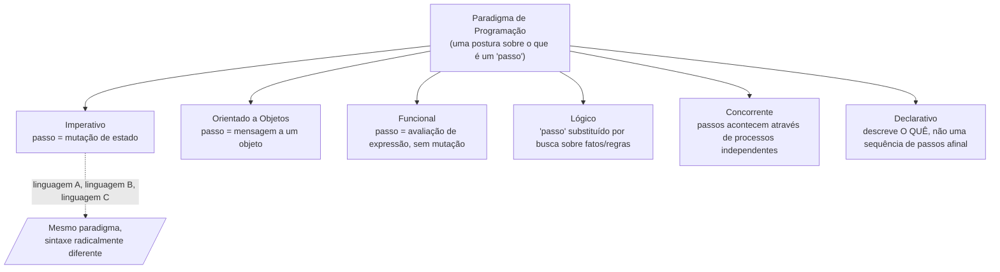

## Objetivos de Aprendizagem

- Definir um paradigma de programação como uma forma de pensar sobre o que um programa É, não meramente um conjunto de regras de sintaxe.
- Distinguir "paradigma" de "linguagem", explicar por que uma única linguagem pode suportar mais de um paradigma, e por que duas linguagens podem compartilhar um paradigma apesar de parecerem completamente diferentes.
- Nomear as famílias de paradigma principais que esta disciplina cobrirá (imperativo, orientado a objetos, funcional, lógico, concorrente, declarativo) e enunciar, em uma frase cada, o movimento conceitual central que define cada família.
- Explicar por que comparar paradigmas no MESMO pequeno problema, resolvido de múltiplas formas genuinamente diferentes, é uma forma mais confiável de ver as diferenças do que comparar só sua sintaxe.

## Contexto e Motivação

Todo programador que escreveu mais que um punhado de programas já absorveu, sem necessariamente notar, uma forma de pensar sobre o que um programa fundamentalmente é. Se seu instinto quando perguntado "como calculo a soma de uma lista de números" é recorrer a uma variável, inicializá-la em zero, e fazer um laço, atualizando-a um passo de cada vez, você absorveu uma resposta particular para a pergunta "o que é um programa?", um programa é uma sequência de instruções que muda o estado da máquina, um passo depois do outro, até que a resposta caia. Essa resposta parece tão natural que raramente é nomeada. Não é, no entanto, a única resposta, e nem sequer é a historicamente primeira. Um paradigma de programação é precisamente isso: uma postura fundamental sobre o que conta como um "passo" computacional, o que um programa é concebido como sendo (uma sequência de mudanças de estado? uma função matemática sendo avaliada? um conjunto de fatos lógicos sendo consultado? uma rede de processos independentes trocando mensagens?), e, a jusante dessa postura, que tipos de coisas são fáceis de dizer e que tipos de coisas são estranhas de dizer naquele estilo.

Essa distinção, paradigma versus linguagem versus sintaxe, importa porque é fácil confundi-los, e a confusão esconde algo importante. Duas linguagens que parecem completamente diferentes na página (digamos, uma linguagem de chaves, terminada em ponto e vírgula, e uma sensível a espaço em branco) podem estar fazendo exatamente a mesma coisa conceitual: ambas mutando variáveis em um laço, ambas tratando "o estado atual da memória" como a coisa que o programa empurra para frente uma instrução de cada vez. Enquanto isso, uma única linguagem moderna frequentemente suporta vários paradigmas de uma vez, permitindo que o mesmo programador escreva um laço `for` explícito com um acumulador mutável em uma função e uma cadeia de transformações sem efeito colateral na próxima, dentro do mesmo arquivo. Se "paradigma" fosse só "qual linguagem," nada disso faria sentido. O que de fato varia através de paradigmas é algo mais profundo que sintaxe: o paradigma determina o que um "passo" de computação sequer significa, e isso, por sua vez, molda quais problemas parecem naturais de expressar e quais parecem uma luta contra a linguagem.

As diretrizes curriculares do ACM/IEEE CS2013 tratam "Linguagens de Programação" como uma área de conhecimento precisamente porque tanto empregadores quanto pesquisadores descobriram que um cientista da computação que só jamais programou em um paradigma tende a recorrer ao mesmo martelo independentemente da forma do problema à sua frente, escrevendo laços estilo imperativo desajeitados para resolver um problema que é naturalmente um conjunto de transformações independentes, paralelas, por exemplo, simplesmente porque esse é o único modelo mental disponível. Aprender a reconhecer um paradigma como uma escolha deliberada, nomeável, em vez de "a forma normal de escrever código," é o primeiro passo em direção a ser capaz de escolher deliberadamente em vez de por hábito. Esta disciplina é construída em torno exatamente desse objetivo: em vez de descrever paradigmas no abstrato e deixar as diferenças vagas, retornará, de novo e de novo, a variações do mesmo pequeno punhado de problemas (somar uma lista é um que você verá quase imediatamente), resolvidos em estilos de paradigma genuinamente diferentes, para que as diferenças apareçam concretamente, em código real que se comporta diferentemente, em vez de só como adjetivos em uma aula.

Vale a pena ser honesto, antecipadamente, sobre escopo: "paradigma" é uma palavra grande, e tratamentos acadêmicos completos (o curso de Grossman da UW, referenciado através desta disciplina, é um dos mais rigorosos) gastam um semestre inteiro nisso. A ambição desta disciplina é mais estreita e mais prática: entendimento real suficiente de cada família de paradigma principal para reconhecê-la em estado selvagem, escrever um pequeno programa funcionando em cada estilo, e raciocinar sobre qual estilo combina melhor com um dado problema, em vez de um tratamento teórico exaustivo de semântica de linguagem de programação.

## Teoria Central

### O que varia através de paradigmas: a noção de um "passo"

No centro de todo paradigma está uma resposta a uma única pergunta: o que significa fazer progresso em uma computação? No paradigma imperativo (coberto no próximo conceito), um "passo" é uma instrução que muda algum pedaço de estado armazenado, uma atribuição, uma mutação, um salto para uma instrução diferente. No paradigma orientado a objetos, um "passo" é frequentemente entendido como uma mensagem enviada a um objeto, pedindo que aja (e possivelmente mute seu próprio estado interno) de acordo com sua própria lógica. No paradigma funcional, um "passo" é a avaliação de uma expressão em um valor, sem nenhuma noção de "mudar" qualquer coisa, uma função é aplicada a entradas e produz uma saída, ponto final, e fazer isso de novo com as mesmas entradas sempre produz a mesma saída. No paradigma lógico, não há nenhum "passo" em direção a uma resposta de forma alguma no sentido imperativo; em vez disso, um programa é um conjunto de fatos e regras, e "rodar" o programa significa buscar valores que tornem alguma consulta verdadeira. Em paradigmas construídos em torno de concorrência, um passo é algo que acontece em um de possivelmente muitos processos rodando simultaneamente, e parte do que o paradigma tem que definir é como (ou se) esses processos veem os passos um do outro afinal.

Nenhuma dessas é meramente uma peculiaridade estilística, cada postura tem consequências reais, subsequentes, para como um programa naquele paradigma é escrito, lido, depurado, e raciocinado sobre. Se "passo" significa "mutar estado compartilhado," você deve raciocinar cuidadosamente sobre ordenação: qual mutação aconteceu antes de qual. Se "passo" significa "avaliar uma expressão para um valor sem efeitos colaterais," você pode substituir expressões iguais uma pela outra livremente (essa propriedade tem um nome, transparência referencial, que um conceito posterior nesta disciplina desenvolve por completo) e reordenar computações independentes sem mudar o resultado, uma categoria inteira de bugs (uma variável tendo um valor inesperado porque algum outro código, aparentemente não relacionado, a mudou primeiro) se torna estruturalmente impossível.

### Paradigma como uma lente, não uma linguagem

Um modelo mental útil: um paradigma é uma lente através da qual você olha um problema, e uma linguagem é uma ferramenta que suporta olhar através de zero, uma, ou várias dessas lentes. Linguagens multi-paradigma são a norma hoje, não a exceção, uma linguagem pode tornar confortável escrever laços imperativos, definir classes com métodos, e passar funções como valores, tudo sem trocar de linguagem. Isso significa que reconhecer "estou atualmente escrevendo código de estilo imperativo" ou "essa função é escrita em um estilo funcional" é uma habilidade aplicada a um pedaço de código, independente de qual linguagem aquele código acontece de ser escrito. Duas linguagens diferentes, ambas usadas em um estilo estritamente imperativo, são mais parecidas, no nível de paradigma, do que dois pedaços de código na mesma linguagem escritos em estilos de paradigma diferentes.



### As famílias de paradigma que esta disciplina cobre

Esta disciplina trabalha através de seis famílias amplas, cada uma introduzida nomeando precisamente o movimento conceitual que a define, nesta ordem: programação imperativa (estado que muda através de sequências explícitas de instruções, o próprio próximo conceito); programação orientada a objetos (empacotar dados e as operações sobre eles em objetos, com encapsulamento, herança, e polimorfismo como seus mecanismos centrais); programação funcional (funções puras, imutabilidade, e funções de ordem superior no lugar de mutação e laços explícitos); programação lógica (fatos, regras, e consultas resolvidas por unificação, em vez de instruções executadas em ordem); e, encerrando a sequência, programação concorrente e programação declarativa, que cortam através das categorias anteriores fazendo perguntas inteiramente diferentes, "o que roda ao mesmo tempo que o quê, e como essas coisas se comunicam?" e "posso descrever só o resultado que quero, deixando o como para o sistema?" Um conceito de ápice de encerramento revisita todos eles lado a lado, organizados pela forma de problema que cada um combina mais naturalmente.

### Por que "o mesmo problema, muitas formas" é a ferramenta de ensino certa

Comparar paradigmas no abstrato arrisca produzir uma lista de adjetivos (imperativo é "passo-a-passo," funcional é "declarativo e sem efeito colateral," e assim por diante) que soam razoáveis mas não grudam, porque nunca foram amarrados a nada concreto. A abordagem muito mais durável, e à qual esta disciplina se compromete, é fixar um problema genuinamente simples (somar uma lista de números é o exemplo corrente que aparece quase imediatamente, no próprio próximo conceito) e resolvê-lo no estilo nativo de cada paradigma, para que o contraste seja visível em código real, comparável: um laço explícito com um acumulador mutável versus uma chamada a uma função de redução sem nenhuma variável mutável à vista versus, depois, uma definição recursiva sem nenhuma construção de laço afinal. Ver a mesma saída produzida por processos estruturalmente diferentes é o que torna "um paradigma muda o que um programa É" concreto em vez de retórico.

## Exemplos Resolvidos

### Exemplo 1 — reconhecendo paradigma versus sintaxe

**Problema:** Os dois trechos abaixo ambos imprimem os números de 1 a 5. Estão escritos no mesmo paradigma?

```python
# Trecho A
i = 1
while i <= 5:
    print(i)
    i = i + 1
```

```python
# Trecho B
for i in range(1, 6):
    print(i)
```

**Raciocínio.** Ambos os trechos são Python, mesma linguagem, e ambos produzem saída idêntica. Mas no nível de paradigma, ambos também são, de fato, imperativos: ambos descrevem uma sequência de instruções para ser realizada em ordem, e o Trecho A adicionalmente torna a mutação de estado completamente explícita (`i = i + 1` visivelmente muda o valor de uma variável armazenada entre iterações), enquanto o Trecho B esconde a mutação equivalente dentro da maquinaria `range`/`for`. Reconhecer "mesmo paradigma, sintaxe de superfície diferente" aqui é a direção fácil. A habilidade mais difícil, mais útil, introduzida propriamente no próximo conceito e desenvolvida através desta disciplina, é reconhecer quando dois trechos que também parecem superficialmente similares (ambos usam um `def` Python, ambos retornam um valor) na verdade estão escritos em paradigmas diferentes, porque um depende de mutar uma variável capturada de um escopo externo e o outro calcula seu resultado puramente a partir de seus argumentos.

### Exemplo 2 — mesmo problema, esboçado em dois estilos de paradigma diferentes

**Problema:** Some os números na lista `[3, 7, 2, 9]`. Esboce a forma de uma solução em um estilo imperativo e em um estilo funcional, sem ainda se preocupar com sintaxe exata (ambos são desenvolvidos completamente em conceitos posteriores).

**Esboço imperativo.** Comece uma variável (um acumulador) em 0. Percorra a lista um elemento de cada vez, em ordem, e a cada passo, mute o acumulador adicionando o elemento atual a ele. Quando o percurso terminar, o valor atual do acumulador, o resultado de uma sequência de mudanças de estado, é a resposta. Note o vocabulário: "comece," "percorra," "a cada passo," "mute," "quando terminar", toda frase descreve uma sequência de eventos acontecendo no tempo, transformando estado armazenado.

**Esboço funcional.** Aplique uma operação de redução à lista, usando adição como a operação combinadora e 0 como o valor inicial; a própria redução, como uma única expressão, avalia para a resposta diretamente, sem nenhuma variável jamais atribuída duas vezes e nenhum percurso explícito descrito pelo programador. Note o vocabulário diferente: nenhum "passo," nenhuma "mutação," nenhum "depois," se lê como uma única expressão sendo avaliada para um valor, não uma receita sendo seguida ao longo do tempo.

**Raciocínio.** Ambos os esboços calculam 21. Nenhum é "mais correto," o ponto de colocá-los lado a lado, no nível de esboços em vez de código funcionando, é notar que as próprias palavras necessárias para descrever cada abordagem são diferentes em tipo: uma é inescapavelmente sobre sequência e mudança ao longo do tempo, a outra é sobre um único valor sendo derivado de outro. Essa diferença de vocabulário não é um acidente estilístico; é o paradigma transparecendo. O próximo conceito nesta disciplina desenvolve a versão imperativa em código funcionando completo e nomeia seu traço definidor explicitamente; um conceito posterior no tópico de Programação Funcional faz o mesmo para a versão funcional.

### Exemplo 3 — uma linguagem, dois paradigmas, o mesmo arquivo

**Problema:** É possível que um único programa pequeno contenha código escrito em dois paradigmas diferentes? Esboce por que isso é corriqueiro em linguagens modernas.

**Raciocínio.** Considere um programa que lê uma lista de notas, calcula a nota máxima usando um laço explícito com uma variável mutável de "melhor até agora" (imperativo), e depois, na próxima função, filtra essa mesma lista só para as notas de aprovação usando uma única chamada a uma operação de filtragem sem nenhum laço ou variável mutável afinal (estilo funcional). Nada previne isso; a maioria das linguagens de propósito geral em uso de produção hoje suportam escrever ambos os estilos, frequentemente no mesmo arquivo, às vezes na mesma função. Isso é exatamente por que "paradigma" não pode ser uma propriedade só da linguagem: é uma propriedade da *postura que o código toma* em relação à computação, escolhida independentemente em cada ponto do programa, e um programador em atuação rotineiramente se move entre posturas dentro de um único projeto, escolhendo qualquer uma que melhor combine com o pedaço do problema em mãos, que é precisamente o julgamento que o conceito de encerramento desta disciplina pede que você pratique explicitamente.

## Equívocos Comuns e Armadilhas

- **"Paradigma só significa qual linguagem você está usando."** Como o Exemplo 3 mostra, uma única linguagem, e até um único arquivo, comumente mistura código imperativo, orientado a objetos, e funcional lado a lado. Paradigma é uma propriedade da abordagem tomada em um dado pedaço de código, não um atributo fixado pelo nome da linguagem.
- **"O estilo imperativo é 'a forma normal de programar' e os outros são alternativas exóticas."** Esse é exatamente o hábito que esta disciplina existe para quebrar. Programação imperativa é um paradigma entre vários, historicamente proeminente porque mapeia de perto sobre como o hardware de computador físico de fato funciona (um ponteiro de instrução se movendo através da memória, registradores sendo sobrescritos), não porque é uma forma mais fundamental ou mais "natural" de pensar sobre computação do que as alternativas.
- **"Paradigmas são só sintaxes diferentes para escrever a mesma lógica subjacente."** Os dois esboços do Exemplo 2 para somar uma lista não são simplesmente duas grafias de uma ideia, um descreve uma sequência de mutações ao longo do tempo, o outro um único valor derivado de uma expressão, sem nenhuma noção de "passos" afinal. A diferença é conceitual, não cosmética, e tem consequências reais (reordenabilidade, facilidade de paralelizar, facilidade de testar) desenvolvidas através do resto desta disciplina.
- **"Comparar paradigmas é realmente só útil no abstrato, como uma curiosidade de ciência da computação."** O oposto está mais próximo da verdade: o ganho concreto, escrever um laço de soma em um estilo agora, e depois escrever a computação idêntica sem nenhum laço afinal, é o que transforma "paradigmas diferem" de uma afirmação vaga em algo que você observou diretamente acontecer a um programa real, funcionando.

## Resumo

Um paradigma de programação é uma postura fundamental sobre o que um "passo" computacional é e o que um programa fundamentalmente É, uma sequência de mudanças de estado, uma avaliação de uma expressão, uma busca sobre fatos e regras, um conjunto de processos rodando independentemente, não meramente uma escolha de sintaxe de superfície, e não uma propriedade fixada por qual linguagem você acontece de estar usando. Uma única linguagem tipicamente suporta vários paradigmas de uma vez, e reconhecer em qual paradigma um dado pedaço de código está escrito é uma habilidade aplicada ao próprio código, não ao nome da linguagem. Esta disciplina cobre seis famílias principais, imperativa, orientada a objetos, funcional, lógica, concorrente, e declarativa, e tornará cada uma concreta não só através de adjetivos mas retornando repetidamente aos mesmos pequenos problemas, resolvidos em estilos genuinamente diferentes, funcionando, para que as diferenças sejam visíveis em comportamento real em vez de só descritas no abstrato. O próprio próximo conceito retoma o paradigma que você quase certamente já tem escrito sem nomeá-lo: programação imperativa.

## Documentation Links

- [MIT SICP — Wikipedia (course/book overview)](https://en.wikipedia.org/wiki/Structure_and_Interpretation_of_Computer_Programs) — doc
- [ACM/IEEE CS2013 — Programming Languages Knowledge Area](https://csed.acm.org/knowledge-areas-programming-languages-pl-cs2013-version/) — doc
