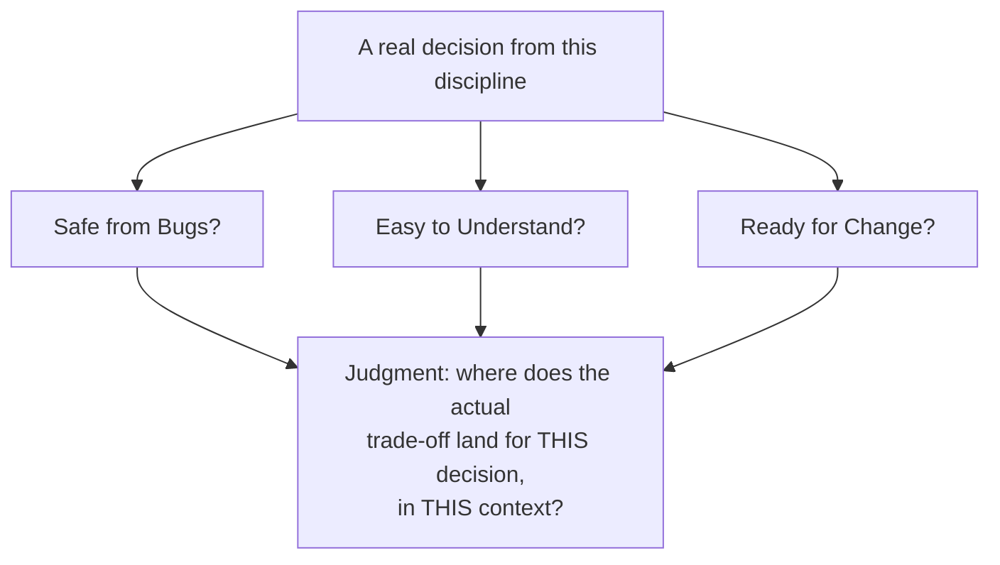

## Learning Objectives

- Restate the three organizing goals this discipline opened with — Safe from Bugs, Easy to Understand, Ready for Change — precisely enough to apply them, not just name them.
- Apply all three lenses simultaneously to a real process or design decision drawn from this discipline, rather than evaluating it against only one.
- Work through a decision where all three goals genuinely align, and articulate concretely why each one applies.
- Work through a genuinely contested decision where the three goals pull in different directions, without flattening the tension into a false consensus.
- Synthesize practices from across this entire discipline — testing, version control discipline, review, refactoring, reuse, team process — as instances of the same three-lens evaluation, rather than as an unrelated checklist.

## Context & Motivation

This discipline opened with a specific, named claim: that "good code" is not one vague quality but three distinct, sometimes-competing axes — **Safe from Bugs** (the code behaves correctly, and keeps behaving correctly as it's used and extended), **Easy to Understand** (a reader, including the original author much later, can grasp what it does and why without running it or asking anyone), and **Ready for Change** (a reasonable future modification touches a small, well-localized part of the system rather than rippling outward). Every concept since then — specifications, coupling and cohesion, testing strategy, version control discipline, code review, refactoring, reuse, team process — has been, whether stated explicitly at the time or not, a specific answer to the question these three goals pose: does this practice make code safer, easier to understand, more ready for change, or some honest mixture of trade-offs among the three?

This concept closes the discipline by making that connection explicit and doing the actual work: taking real decisions this discipline has raised — should a team adopt a testing discipline as rigorous as test-driven development, should isolated feature-branch review be worth the overhead, should a system be built with more flexibility than its current requirements strictly demand — and running each one through all three lenses deliberately, the way the opening concept insisted was the whole point of naming them in the first place. This is not a repeat of that opening concept's content; it is the payoff the opening concept was setting up, using the vocabulary this discipline has built in the meantime — a test suite that makes refactoring safe, a reviewer who catches what an author's cognitive distance hides, a dependency whose costs are real, a team's coordination cost that individual practice never has to pay — as the actual substance being evaluated, rather than the toy `average()` function the opening concept used before any of that vocabulary existed yet.

The honest half of this closing exercise, carried over directly from the opening concept's own honesty about trade-offs, is that not every decision resolves the way the first worked example below does, with all three goals pointing the same direction. Some decisions this discipline has raised are genuinely contested — a design choice that clearly helps one goal while genuinely costing another, with no clean resolution that makes the tension disappear. Presenting only decisions where the three lenses agree would misrepresent what this framework is actually for; its real value shows up precisely in the decisions where it doesn't hand you an easy answer, and it forces the trade-off to be made on purpose instead of by accident.

## Core Theory

### The three goals, restated for application rather than definition

**Safe from Bugs (SFB):** the code computes the right answer for every input it claims to handle, and stays correct as it's extended — built from precise contracts, checks that fail loudly rather than corrupting state silently, and a test suite that actually exercises the edges where bugs hide. **Easy to Understand (ETU):** a reader with no other context — including the original author, much later — can reconstruct what the code does and why without running it, tracing history, or asking anyone. **Ready for Change (RFC):** a reasonable, foreseeable future modification stays small and localized rather than rippling through the whole system, achieved through good decomposition, hidden implementation details behind stable contracts, and avoided duplication — but explicitly *not* through engineering for every conceivable hypothetical, which is its own failure mode (speculative generality), addressed directly in Worked Example 2 below.

### Using the framework as an actual decision procedure

Applying these three lenses to a real decision means asking, deliberately and separately, three questions rather than one blended judgment: does this choice make the resulting system more likely to behave correctly over time (SFB)? Does it make the system easier for a future reader — teammate or the same person later — to understand without extra help (ETU)? Does it make a reasonable future change to the system cheaper and more contained (RFC)? A decision that scores well on all three is an easy call. A decision that scores well on one or two while costing the third is where the actual judgment this framework demands has to happen — not by mechanically averaging the three, but by reasoning explicitly about which goal matters most given the actual context the decision is being made in, exactly as the opening concept insisted from the start.

### Not every decision produces a tension — but the framework has to be honest when one exists

It would be a misuse of this framework to force every decision into a contrived three-way conflict just to look rigorous, and it would be an equally serious misuse to claim every decision this discipline has raised resolves cleanly with all three goals in agreement. The worked examples below deliberately include one of each kind, for exactly this reason.

## Worked Examples

### Example 1 — a decision where all three goals genuinely align: adopting test-driven development

**Decision:** should a team writing a moderately complex billing module adopt test-driven development — writing a failing test before the code that makes it pass — rather than writing the implementation first and testing afterward, if at all?

- **Safe from Bugs?** Yes, directly. A failing test written before any implementation exists forces an explicit, checkable claim about correct behavior — including boundary conditions — before a single line of the implementation can be trusted; by the time the implementation is complete, it has already been checked against every case anyone thought to specify in advance, rather than tested only against whatever happened to occur to someone after the fact.
- **Easy to Understand?** Yes, and for a reason easy to overlook: a thorough test suite written this way doubles as executable documentation. A future reader wondering what `calculate_late_fee()` is actually supposed to do for an account with a zero balance, or a payment made exactly on the due date, can read the tests written for those cases and see the expected behavior stated precisely, without having to reverse-engineer intent from the implementation alone.
- **Ready for Change?** Yes, tying directly back to the refactoring concept earlier in this discipline: a comprehensive test suite is exactly what makes refactoring the billing module's internal structure later — say, extracting duplicated fee logic into one shared implementation — something that can be done with real confidence rather than hope, because the tests already prove the external behavior before the change, and can prove it again unmodified afterward.

**Conclusion:** this decision is a case where the three lenses converge rather than conflict — a genuinely strong case for adopting TDD here, made explicit rather than left as a vague intuition that "testing is good practice."

### Example 2 — a genuinely contested decision: building an extensive plugin system "just in case"

**Decision:** a small internal reporting tool currently generates one fixed report format. A developer proposes building a general plugin architecture now — an interface, a plugin discovery mechanism, a registration system — so that new report formats can be added later without touching the core tool, even though no second format has actually been requested yet.

- **Ready for Change?** Genuinely, yes, if that anticipated need materializes: a well-designed plugin interface would make adding a second, third, or tenth report format a matter of writing a new plugin against a stable contract, rather than modifying the core tool's logic each time — exactly the kind of localized, contained future change this goal is meant to describe.
- **Easy to Understand?** Genuinely, no — and this is not a minor cost to wave away. A reader trying to understand how the *one* report format that currently exists actually gets generated now has to trace through an interface, a discovery mechanism, and a concrete plugin implementation to find the handful of lines that do the real work — complexity paid for entirely in service of formats that don't exist yet and may never be requested. This is exactly the speculative-generality failure the opening concept warned against: RFC spent on a hypothetical, at real, immediate cost to ETU.
- **Safe from Bugs?** Modestly worse, not better: the plugin discovery and registration mechanism is itself new code that has to be correct, and it introduces new failure modes (a malformed or missing plugin, a registration conflict) that simply did not exist in a tool that only ever did one thing directly.

**Conclusion — and this is the honest part:** this is a real tension, not a false one manufactured for the exercise. RFC points toward building the plugin system; ETU points firmly away from it, right now, for a need that is currently hypothetical; SFB offers no real benefit and a small real cost either way. The reasoned answer this framework favors is not "never build flexibility" — it's that RFC should be spent on known or strongly anticipated change, not on every conceivable one, exactly as the opening concept's own tax-calculation example demonstrated. Until a second report format is an actual, concrete requirement, the single-format tool remains the better decision: simpler to understand today, with the refactor toward a plugin architecture deferred until real requirements exist to shape it correctly — at which point it can be built in response to an actual need rather than a guess about one.

### Example 3 — a process decision run through the same three lenses: feature branches plus mandatory code review

**Decision:** should a growing team move from committing directly to a shared branch to requiring every change go through a feature branch and a code review before merging?

- **Safe from Bugs?** Yes — code review catches bugs an author's own cognitive distance from their code hides, and a shared main branch that only receives reviewed, complete work stays a reliable, working foundation rather than one that can be broken by anyone's unfinished change landing on it directly.
- **Easy to Understand?** Yes, indirectly but genuinely — a change that has to survive review tends to arrive with a clearer commit message and a more defensible design than one nobody but its author will ever read closely, because the author knows a second person is about to look at it.
- **Ready for Change?** Yes — isolating each unit of work on its own branch until it's genuinely complete, rather than letting half-finished work sit on the shared line, keeps main in the always-working state that lets any future change be built on a trustworthy foundation, rather than one that might already be silently broken by someone else's in-progress work.

**Conclusion:** like Example 1, this is a case where the three lenses converge — the real cost here isn't to any of the three design goals, but to short-term process overhead (review takes time; branches require discipline), which is a genuine cost worth acknowledging honestly, just not one this framework's three lenses are built to measure directly.

## Common Misconceptions & Pitfalls

- **"The framework always produces a clean, single answer."** Example 2 is included specifically to demonstrate this is false — RFC and ETU genuinely pull in opposite directions there, and the framework's value is in making that tension visible and reasoned about explicitly, not in pretending it resolves cleanly when it doesn't.
- **"If a decision helps two of the three goals, the third one doesn't matter."** Example 2's plugin system helps RFC alone while costing ETU and offering nothing to SFB — two goals against it and one for it is not a tie to be broken arbitrarily; the framework asks for an explicit judgment about which goal actually matters most in this specific context (a currently hypothetical need), not a vote count.
- **"This framework only applies to small code-level decisions, like the opening concept's `average()` example."** Example 3 applies the identical three-question process to a team process decision — adopting feature branches and review — showing the framework scales to process and tooling choices across this entire discipline, not just to how one function is written.
- **"Ready for Change always means 'build in more flexibility.'"** Example 2 is the direct counterexample: RFC, applied honestly, argues *against* building the plugin system now, because the anticipated change is hypothetical rather than known — RFC is a goal to be spent on real, foreseeable change, not maximized indiscriminately at every opportunity.
- **"Since some decisions resolve with all three goals agreeing, the framework is basically just a formality for decisions that are obviously good ideas anyway."** Examples 1 and 3 resolve cleanly, but stating explicitly *why* each of the three goals is served — rather than leaning on a vague sense that "testing is good" or "review is good practice" — is exactly what turns an intuition into an articulable, defensible engineering argument, which is the actual habit this whole discipline has been trying to install from its first concept onward.

## Summary

This discipline opened by naming three distinct lenses for evaluating any piece of code or design decision — Safe from Bugs, Easy to Understand, Ready for Change — and insisting that treating "good code" as one fuzzy quality obscures exactly the trade-offs worth making deliberately. Applied now to real decisions this discipline has actually raised, the same three questions produce genuinely different verdicts depending on the decision: adopting test-driven development and moving to feature branches with mandatory review both resolve with all three goals in clean agreement, each for concrete, specific reasons tied directly to earlier concepts (a test suite doubling as documentation and as a refactoring safety net; review catching what cognitive distance hides). Building unrequested flexibility "just in case," by contrast, resolves as a genuine, unresolved tension — a real Ready-for-Change benefit bought at a real, immediate Easy-to-Understand cost, for a need that is still only hypothetical — and the framework's honest answer is not to erase that tension but to make it visible enough to decide on purpose. That is the whole discipline's closing lesson: safe, easy, and ready are not a checklist to satisfy uniformly, but three lenses to hold up, deliberately and simultaneously, against every practice this course has covered — testing, version control, review, refactoring, reuse, and team process alike.

## Documentation Links

- [MIT 6.031 — General Info & FAQ (SFB/ETU/RFC objective)](https://web.mit.edu/6.031/www/sp17/general/) — doc
- [ACM/IEEE CS2013 — Software Engineering Knowledge Area](https://csed.acm.org/knowledge-areas-software-engineering-se-cs2013-version/) — doc
