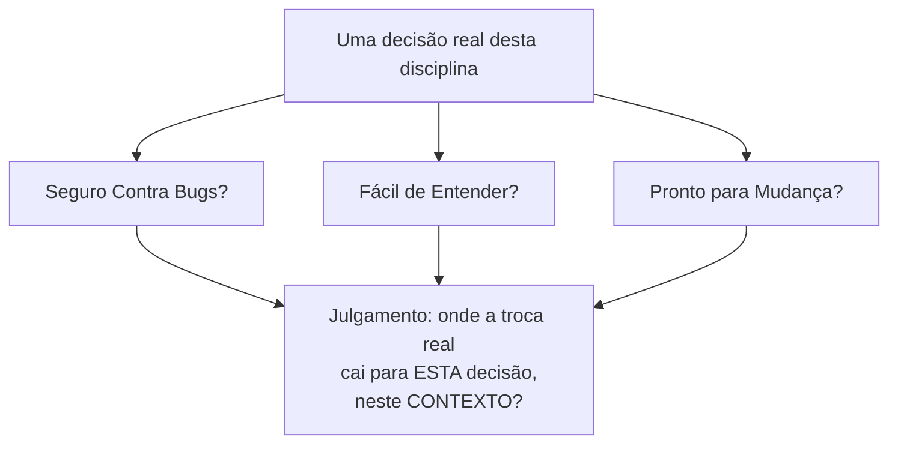

## Objetivos de Aprendizagem

- Reenunciar os três objetivos organizadores com os quais esta disciplina abriu, Seguro Contra Bugs, Fácil de Entender, Pronto para Mudança, precisamente o suficiente para aplicá-los, não só nomeá-los.
- Aplicar as três lentes simultaneamente a uma decisão real de processo ou design tirada desta disciplina, em vez de avaliá-la contra só uma.
- Trabalhar através de uma decisão onde os três objetivos genuinamente se alinham, e articular concretamente por que cada um se aplica.
- Trabalhar através de uma decisão genuinamente contestada onde os três objetivos puxam em direções diferentes, sem achatar a tensão em um falso consenso.
- Sintetizar práticas através desta disciplina inteira, testes, disciplina de controle de versão, revisão, refatoração, reutilização, processo de equipe, como instâncias da mesma avaliação de três lentes, em vez de como uma lista de verificação não relacionada.

## Contexto e Motivação

Esta disciplina abriu com uma afirmação específica, nomeada: que "código bom" não é uma qualidade vaga única mas três eixos distintos, às vezes competindo, **Seguro Contra Bugs** (o código se comporta corretamente, e continua se comportando corretamente conforme é usado e estendido), **Fácil de Entender** (um leitor, incluindo o autor original muito depois, pode entender o que faz e por quê sem rodá-lo ou perguntar a ninguém), e **Pronto para Mudança** (uma modificação futura razoável toca uma parte pequena, bem localizada do sistema em vez de se propagar para fora). Todo conceito desde então, especificações, acoplamento e coesão, estratégia de teste, disciplina de controle de versão, revisão de código, refatoração, reutilização, processo de equipe, foi, enunciado explicitamente no momento ou não, uma resposta específica à pergunta que esses três objetivos colocam: essa prática torna código mais seguro, mais fácil de entender, mais pronto para mudança, ou alguma mistura honesta de trocas entre os três?

Este conceito encerra a disciplina tornando essa conexão explícita e fazendo o trabalho real: tomando decisões reais que esta disciplina levantou, uma equipe deveria adotar uma disciplina de teste tão rigorosa quanto desenvolvimento guiado por testes, revisão de feature branch isolada deveria valer a sobrecarga, um sistema deveria ser construído com mais flexibilidade do que seus requisitos atuais estritamente exigem, e passando cada uma através das três lentes deliberadamente, da forma que o conceito de abertura insistiu ser o ponto inteiro de nomeá-las em primeiro lugar. Isso não é uma repetição do conteúdo daquele conceito de abertura; é o ganho para o qual o conceito de abertura estava se preparando, usando o vocabulário que esta disciplina construiu nesse meio tempo, uma suíte de teste que torna refatoração segura, um revisor que captura o que a distância cognitiva de um autor esconde, uma dependência cujos custos são reais, o custo de coordenação de uma equipe que prática individual nunca tem que pagar, como a substância real sendo avaliada, em vez da função `average()` de brinquedo que o conceito de abertura usou antes de qualquer daquele vocabulário existir ainda.

A metade honesta deste exercício de encerramento, carregada diretamente da própria honestidade do conceito de abertura sobre trocas, é que nem toda decisão se resolve da forma que o primeiro exemplo resolvido abaixo faz, com os três objetivos apontando na mesma direção. Algumas decisões que esta disciplina levantou são genuinamente contestadas, uma escolha de design que claramente ajuda um objetivo enquanto genuinamente custa outro, sem nenhuma resolução limpa que faça a tensão desaparecer. Apresentar só decisões onde as três lentes concordam representaria mal para o que este modelo de fato serve; seu valor real aparece precisamente nas decisões onde não entrega uma resposta fácil, e força a troca a ser feita de propósito em vez de por acidente.

## Teoria Central

### Os três objetivos, reenunciados para aplicação em vez de definição

**Seguro Contra Bugs (SFB):** o código calcula a resposta certa para toda entrada que afirma tratar, e permanece correto conforme é estendido, construído a partir de contratos precisos, verificações que falham alto em vez de corromper estado silenciosamente, e uma suíte de teste que de fato exercita as fronteiras onde bugs se escondem. **Fácil de Entender (ETU):** um leitor sem nenhum outro contexto, incluindo o autor original, muito depois, pode reconstruir o que o código faz e por quê sem rodá-lo, rastrear histórico, ou perguntar a ninguém. **Pronto para Mudança (RFC):** uma modificação futura razoável, previsível, permanece pequena e localizada em vez de se propagar através do sistema inteiro, alcançada através de boa decomposição, detalhes de implementação escondidos atrás de contratos estáveis, e duplicação evitada, mas explicitamente *não* através de engenharia para toda hipótese concebível, que é seu próprio modo de falha (generalidade especulativa), abordado diretamente no Exemplo Resolvido 2 abaixo.

### Usando o modelo como um procedimento de decisão real

Aplicar essas três lentes a uma decisão real significa perguntar, deliberada e separadamente, três perguntas em vez de um julgamento misturado: essa escolha torna o sistema resultante mais provável de se comportar corretamente ao longo do tempo (SFB)? Torna o sistema mais fácil para um leitor futuro, colega de equipe ou a mesma pessoa depois, entender sem ajuda extra (ETU)? Torna uma mudança futura razoável ao sistema mais barata e mais contida (RFC)? Uma decisão que pontua bem nos três é uma escolha fácil. Uma decisão que pontua bem em um ou dois enquanto custa o terceiro é onde o julgamento real que este modelo exige tem que acontecer, não mecanicamente calculando a média dos três, mas raciocinando explicitamente sobre qual objetivo mais importa dado o contexto real em que a decisão está sendo tomada, exatamente como o conceito de abertura insistiu desde o início.

### Nem toda decisão produz uma tensão — mas o modelo tem que ser honesto quando uma existe

Seria um mau uso deste modelo forçar toda decisão em um conflito de três vias artificial só para parecer rigoroso, e seria um mau uso igualmente sério afirmar que toda decisão que esta disciplina levantou se resolve limpamente com os três objetivos em acordo. Os exemplos resolvidos abaixo deliberadamente incluem um de cada tipo, por exatamente essa razão.

## Exemplos Resolvidos

### Exemplo 1 — uma decisão onde os três objetivos genuinamente se alinham: adotando desenvolvimento guiado por testes

**Decisão:** uma equipe escrevendo um módulo de faturamento moderadamente complexo deveria adotar desenvolvimento guiado por testes, escrever um teste falhando antes do código que o faz passar, em vez de escrever a implementação primeiro e testar depois, se é que testa?

- **Seguro Contra Bugs?** Sim, diretamente. Um teste falhando escrito antes de qualquer implementação existir força uma afirmação explícita, verificável, sobre comportamento correto, incluindo condições de fronteira, antes que uma única linha da implementação possa ser confiada; no momento em que a implementação está completa, já foi verificada contra todo caso que alguém pensou em especificar antecipadamente, em vez de testada só contra o que quer que acontecesse de ocorrer a alguém depois do fato.
- **Fácil de Entender?** Sim, e por uma razão fácil de negligenciar: uma suíte de teste completa escrita dessa forma dobra como documentação executável. Um leitor futuro se perguntando o que `calculate_late_fee()` de fato deveria fazer para uma conta com saldo zero, ou um pagamento feito exatamente na data de vencimento, pode ler os testes escritos para esses casos e ver o comportamento esperado enunciado precisamente, sem ter que fazer engenharia reversa de intenção só da implementação.
- **Pronto para Mudança?** Sim, amarrando diretamente de volta ao conceito de refatoração anteriormente nesta disciplina: uma suíte de teste completa é exatamente o que torna refatorar a estrutura interna do módulo de faturamento depois, digamos, extraindo lógica de taxa duplicada em uma implementação compartilhada, algo que pode ser feito com confiança real em vez de esperança, porque os testes já provam o comportamento externo antes da mudança, e podem prová-lo de novo sem modificação depois.

**Conclusão:** essa decisão é um caso onde as três lentes convergem em vez de conflitar, um argumento genuinamente forte para adotar TDD aqui, tornado explícito em vez de deixado como uma intuição vaga de que "testar é boa prática."

### Exemplo 2 — uma decisão genuinamente contestada: construindo um sistema de plugin extensivo "por precaução"

**Decisão:** uma pequena ferramenta interna de relatório atualmente gera um formato de relatório fixo. Um desenvolvedor propõe construir uma arquitetura de plugin geral agora, uma interface, um mecanismo de descoberta de plugin, um sistema de registro, para que novos formatos de relatório possam ser adicionados depois sem tocar a ferramenta central, mesmo que nenhum segundo formato tenha de fato sido pedido ainda.

- **Pronto para Mudança?** Genuinamente, sim, se aquela necessidade antecipada se materializar: uma interface de plugin bem projetada tornaria adicionar um segundo, terceiro, ou décimo formato de relatório uma questão de escrever um novo plugin contra um contrato estável, em vez de modificar a lógica da ferramenta central toda vez, exatamente o tipo de mudança futura localizada, contida que esse objetivo é destinado a descrever.
- **Fácil de Entender?** Genuinamente, não, e esse não é um custo menor para dispensar. Um leitor tentando entender como o *único* formato de relatório que atualmente existe de fato é gerado agora tem que rastrear através de uma interface, um mecanismo de descoberta, e uma implementação de plugin concreta para encontrar o punhado de linhas que faz o trabalho real, complexidade paga inteiramente a serviço de formatos que ainda não existem e podem nunca ser pedidos. Essa é exatamente a falha de generalidade especulativa contra a qual o conceito de abertura alertou: RFC gasto em uma hipótese, a um custo real, imediato, para ETU.
- **Seguro Contra Bugs?** Modestamente pior, não melhor: o próprio mecanismo de descoberta e registro de plugin é código novo que tem que estar correto, e introduz novos modos de falha (um plugin malformado ou faltando, um conflito de registro) que simplesmente não existiam em uma ferramenta que só jamais fazia uma coisa diretamente.

**Conclusão, e essa é a parte honesta:** essa é uma tensão real, não uma fabricada para o exercício. RFC aponta em direção a construir o sistema de plugin; ETU aponta firmemente contra isso, agora mesmo, para uma necessidade que atualmente é hipotética; SFB não oferece benefício real e um pequeno custo real de qualquer forma. A resposta raciocinada que este modelo favorece não é "nunca construa flexibilidade", é que RFC deveria ser gasto em mudança conhecida ou fortemente antecipada, não em toda hipótese concebível, exatamente como o próprio exemplo de cálculo de imposto do conceito de abertura demonstrou. Até que um segundo formato de relatório seja um requisito real, concreto, a ferramenta de formato único permanece a decisão melhor: mais simples de entender hoje, com a refatoração em direção a uma arquitetura de plugin adiada até que requisitos reais existam para moldá-la corretamente, ponto no qual pode ser construída em resposta a uma necessidade real em vez de um palpite sobre uma.

### Exemplo 3 — uma decisão de processo passada através das mesmas três lentes: feature branches mais revisão de código obrigatória

**Decisão:** uma equipe crescendo deveria se mover de fazer commit diretamente em um branch compartilhado para exigir que toda mudança passe por um feature branch e uma revisão de código antes de mesclar?

- **Seguro Contra Bugs?** Sim, revisão de código captura bugs que a própria distância cognitiva de um autor de seu código esconde, e um branch main compartilhado que só recebe trabalho revisado, completo, permanece uma fundação confiável, funcional, em vez de uma que pode ser quebrada pela mudança não terminada de qualquer um pousando diretamente nela.
- **Fácil de Entender?** Sim, indiretamente mas genuinamente, uma mudança que tem que sobreviver a revisão tende a chegar com uma mensagem de commit mais clara e um design mais defensável do que uma que ninguém além de seu autor jamais vai ler de perto, porque o autor sabe que uma segunda pessoa está prestes a olhar para ela.
- **Pronto para Mudança?** Sim, isolar cada unidade de trabalho em seu próprio branch até estar genuinamente completa, em vez de deixar trabalho meio-terminado sentar na linha compartilhada, mantém main no estado sempre-funcional que permite que qualquer mudança futura seja construída em uma fundação confiável, em vez de uma que já poderia estar silenciosamente quebrada pelo trabalho em progresso de outra pessoa.

**Conclusão:** como o Exemplo 1, esse é um caso onde as três lentes convergem, o custo real aqui não é para nenhum dos três objetivos de design, mas para sobrecarga de processo de curto prazo (revisão toma tempo; branches exigem disciplina), que é um custo genuíno que vale a pena reconhecer honestamente, só não um que as três lentes deste modelo são construídas para medir diretamente.

## Equívocos Comuns e Armadilhas

- **"O modelo sempre produz uma resposta limpa, única."** O Exemplo 2 é incluído especificamente para demonstrar que isso é falso, RFC e ETU genuinamente puxam em direções opostas ali, e o valor do modelo está em tornar aquela tensão visível e raciocinada sobre explicitamente, não em fingir que se resolve limpamente quando não se resolve.
- **"Se uma decisão ajuda dois dos três objetivos, o terceiro não importa."** O sistema de plugin do Exemplo 2 ajuda só RFC enquanto custa ETU e não oferece nada a SFB, dois objetivos contra e um a favor não é um empate para ser desfeito arbitrariamente; o modelo pede um julgamento explícito sobre qual objetivo de fato importa mais neste contexto específico (uma necessidade atualmente hipotética), não uma contagem de votos.
- **"Este modelo só se aplica a pequenas decisões no nível de código, como o exemplo `average()` do conceito de abertura."** O Exemplo 3 aplica o processo idêntico de três perguntas a uma decisão de processo de equipe, adotar feature branches e revisão, mostrando que o modelo escala para escolhas de processo e ferramenta através desta disciplina inteira, não só para como uma função é escrita.
- **"Pronto para Mudança sempre significa 'construa mais flexibilidade.'"** O Exemplo 2 é o contraexemplo direto: RFC, aplicado honestamente, argumenta *contra* construir o sistema de plugin agora, porque a mudança antecipada é hipotética em vez de conhecida, RFC é um objetivo para ser gasto em mudança real, previsível, não maximizado indiscriminadamente em toda oportunidade.
- **"Já que algumas decisões se resolvem com os três objetivos concordando, o modelo é basicamente só uma formalidade para decisões que são obviamente boas ideias de qualquer forma."** Os Exemplos 1 e 3 se resolvem limpamente, mas enunciar explicitamente *por que* cada um dos três objetivos é servido, em vez de se apoiar em um senso vago de que "testar é bom" ou "revisão é boa prática", é exatamente o que transforma uma intuição em um argumento de engenharia articulável, defensável, que é o hábito real que a disciplina inteira tem tentado instalar desde seu primeiro conceito em diante.

## Resumo

Esta disciplina abriu nomeando três lentes distintas para avaliar qualquer pedaço de código ou decisão de design, Seguro Contra Bugs, Fácil de Entender, Pronto para Mudança, e insistindo que tratar "código bom" como uma qualidade turva única obscurece exatamente as trocas que valem a pena fazer deliberadamente. Aplicadas agora a decisões reais que esta disciplina de fato levantou, as mesmas três perguntas produzem veredictos genuinamente diferentes dependendo da decisão: adotar desenvolvimento guiado por testes e migrar para feature branches com revisão obrigatória ambas se resolvem com os três objetivos em acordo limpo, cada uma por razões concretas, específicas, amarradas diretamente a conceitos anteriores (uma suíte de teste dobrando como documentação e como uma rede de segurança de refatoração; revisão capturando o que distância cognitiva esconde). Construir flexibilidade não solicitada "por precaução," em contraste, se resolve como uma tensão real, não resolvida, um benefício real de Pronto-para-Mudança comprado a um custo real, imediato, de Fácil-de-Entender, para uma necessidade que ainda é só hipotética, e a resposta honesta do modelo não é apagar aquela tensão mas torná-la visível o suficiente para decidir de propósito. Essa é a lição de encerramento da disciplina inteira: seguro, fácil, e pronto não são uma lista de verificação para satisfazer uniformemente, mas três lentes para segurar, deliberada e simultaneamente, contra toda prática que este curso cobriu, testes, controle de versão, revisão, refatoração, reutilização, e processo de equipe igualmente.

## Documentation Links

- [MIT 6.031 — General Info & FAQ (SFB/ETU/RFC objective)](https://web.mit.edu/6.031/www/sp17/general/) — doc
- [ACM/IEEE CS2013 — Software Engineering Knowledge Area](https://csed.acm.org/knowledge-areas-software-engineering-se-cs2013-version/) — doc
