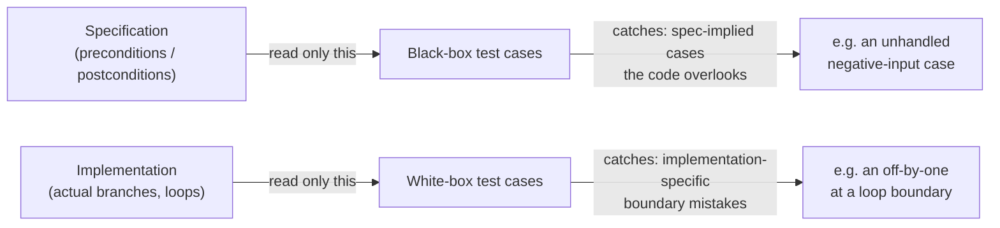

## Learning Objectives

- Define black-box and white-box testing precisely, in terms of what information each does and does not use to design test cases.
- Derive a set of black-box test cases from a specification alone, without reading the implementation.
- Derive a set of white-box test cases by reading an implementation's actual branches and loop structure.
- Construct a concrete example of a bug that black-box testing plausibly misses but white-box testing catches directly.
- Explain why the two approaches are complementary sources of test cases rather than competitors, and combine them for one function.

## Context & Motivation

Once unit, integration, and system testing are in hand as the three *levels* at which testing happens, a separate question remains open at any one of those levels: given that a specific unit is being tested, where do the actual test cases come from? Two genuinely different answers exist, and both are legitimate, because they draw on different sources of information about the same function.

**Black-box testing** designs test cases purely from the function's specification — what inputs it accepts, what output or behavior it promises for each — without ever looking at the code that implements it. The tester behaves as though the function really were an opaque box: only its documented contract is visible, never its internals. **White-box testing** does the opposite: it designs test cases by reading the actual source code, specifically to make sure every meaningful path through that code — every branch of every `if`/`else`, every loop's boundary — gets exercised by at least one test.

The reason a testing-strategy unit teaches both, rather than picking one, is that they are good at catching different things for a structural reason, not an accidental one. Black-box testing is anchored to the specification, so it is well-positioned to catch a case the spec clearly implies should be handled but that the implementation happens to overlook — because the tester never saw the implementation, they cannot be unconsciously biased by it, and will test cases the spec promises regardless of whether the code "looks like" it handles them. White-box testing is anchored to the code, so it is well-positioned to catch a mistake specific to *how* the function happens to be written — an off-by-one at a loop boundary, a branch that is simply never reached by any input a black-box tester, reading only the spec, would have thought to try. Neither source of test cases is redundant with the other; a specification rarely spells out every implementation detail precisely enough to derive white-box-style boundary cases from it, and code, read on its own, does not reveal whether it is actually doing what was *promised*, only what it actually does.

## Core Theory

### Black-box testing: test cases from the specification alone

A black-box test case is derived entirely from what a function is documented (or specified) to do — its precondition (what must be true of the input) and postcondition (what must be true of the output) — without consulting the implementation at all. The discipline here is the same "boundary conditions" thinking already familiar from single-function testing: smallest legal input, largest, an input right at a documented threshold, an input the specification treats as a distinct case (e.g., "returns an empty list if there are no matches"). What makes it *black-box* specifically is the discipline of deriving those cases from the specification's text, not from glancing at the code to see what it happens to check.

The strength of this approach is that it is completely insulated from the implementation's own blind spots: if the specification promises behavior for negative numbers, a black-box tester will test negative numbers, even if the implementation's author forgot that case entirely and the code silently mishandles it. The weakness is the mirror image of that strength: a black-box tester has no way to know that a particular loop happens to be implemented with an off-by-one error at a boundary the specification never called out explicitly, because nothing in the spec pointed there.

### White-box testing: test cases from the code's actual structure

A white-box test case is derived by reading the implementation directly, with the specific goal of exercising paths through the code that a black-box approach might never think to try. The most basic version of this goal is **branch coverage**: every `if` and every `else` (and every case of a longer conditional chain) should be taken by at least one test case, in both directions. A related and often more revealing goal is deliberately targeting **loop boundaries** — the first iteration, the last iteration, one-past-the-last, zero iterations — since off-by-one mistakes concentrate almost exclusively at exactly these points.

The strength of this approach is precision about the *actual* code: it can target a specific, dangerous-looking branch or boundary that the specification never called attention to, because the specification is a description of intended behavior, not of implementation structure, and dangerous-looking structure is only visible in the implementation. The weakness is the mirror image, again: a white-box tester, reading only the code, has no independent check on whether the code's *intended* behavior (as opposed to its actual behavior) is even correct — a function that consistently, faithfully implements the wrong specification will pass every white-box test derived from its own structure, because those tests were never checking it against anything external.

### Why the two are complementary, not redundant



Black-box testing's source of test cases (the specification) and white-box testing's source (the code) are simply different documents, and each is blind to defects that live only in the other one. A specification can imply a case the code forgot; code can contain a mechanical mistake the specification never had occasion to mention. A thorough test suite for one function typically draws on both: the spec-driven boundary cases (smallest, largest, documented special cases) *and* a pass over the actual code checking that every branch and every loop boundary specifically got exercised.

### A concrete case where black-box testing misses a bug white-box testing catches

Consider a function specified as: "`sum_first_n(numbers, n)` returns the sum of the first `n` elements of `numbers`." A black-box tester, reading only this specification, reasonably tries: a typical case (`n` somewhere in the middle of the list), `n = 0` (documented implicitly by "first n" making sense down to zero), and perhaps `n` equal to the full length of the list. None of these, chosen from the spec's plain language alone, obviously demands trying `n` equal to the length of the list *plus one* — the spec doesn't dwell on what happens if `n` exceeds the list's length, so a black-box tester focused on "typical and clearly-implied" cases can very plausibly never try it.

```python
def sum_first_n(numbers, n):
    total = 0
    for i in range(n - 1):     # bug: should be range(n)
        total += numbers[i]
    return total
```

Black-box cases like `sum_first_n([2, 4, 6], 2)` expect `6` (2 + 4) but this buggy implementation, with `range(n - 1)`, only sums the first `n - 1` elements — it returns `2`, which is wrong, but a careless black-box tester might not notice the off-by-one if their chosen expected value was computed carelessly too, or might simply never think to try `n = 0` (where the bug is invisible, since `range(-1)` and `range(0)` both produce nothing) versus `n = 1` (where the bug is immediately visible: `sum_first_n([5], 1)` returns `0` instead of `5`). A white-box tester, by contrast, reads the loop directly, sees `range(n - 1)` where the specification's "first n elements" plainly implies `n` iterations, and — following the standard white-box discipline of targeting loop boundaries specifically — tries `n = 1` deliberately, as the smallest boundary that would distinguish "loop runs n times" from "loop runs n − 1 times." That single, code-informed test case (`sum_first_n([5], 1)` should be `5`, but returns `0`) catches the bug directly, precisely because it was chosen by looking at the loop's actual bound, not by reasoning from the spec's prose alone.

## Worked Examples

### Example 1 — pure black-box test design from a specification

**Specification:** `classify_triangle(a, b, c)` takes three positive side lengths and returns `"equilateral"` if all three sides are equal, `"isosceles"` if exactly two are equal, and `"scalene"` if all three differ. (Assume the caller guarantees the three lengths form a valid triangle.)

**Black-box test cases**, derived only from this text, without looking at any implementation:

```python
assert classify_triangle(5, 5, 5) == "equilateral"
assert classify_triangle(5, 5, 8) == "isosceles"
assert classify_triangle(3, 4, 5) == "scalene"
assert classify_triangle(8, 5, 5) == "isosceles"   # equal pair in a different position
assert classify_triangle(5, 8, 5) == "isosceles"   # equal pair in yet another position
```

The last two cases are chosen specifically because the specification's *category* ("exactly two are equal") doesn't specify which two positions — a careful black-box tester notices this ambiguity and tests all the positions the spec's wording leaves open, entirely without reading any code.

### Example 2 — white-box test design that finds a hidden branch bug

**Implementation** (not yet seen by whoever wrote Example 1's tests):

```python
def classify_triangle(a, b, c):
    if a == b and b == c:
        return "equilateral"
    if a == b or b == c:
        return "isosceles"
    return "scalene"
```

Reading this code directly (white-box), the second branch `a == b or b == c` should be checked for whether it actually covers every "exactly two equal" case — note that it never checks `a == c` directly. Tracing it: if `a == c` but `a != b`, then `a == b` is `False` and `b == c` is also `False` (since `a == c` and `a != b` implies `b != c`), so this implementation falls through to `"scalene"` — a genuine bug for the case where the *first and third* sides match. A black-box tester working only from the specification's prose, as in Example 1, is testing "exactly two are equal" as a single category and may well settle for one or two representative orderings without realizing there are three structurally distinct positions to check — because nothing in the spec's wording flags the *implementation* as treating them differently. A white-box tester, reading the actual `if a == b or b == c` condition, immediately notices it never mentions `a == c`, and writes the targeted case:

```python
assert classify_triangle(5, 8, 5) == "isosceles"   # a == c, b different — targets the missing branch
```

Running it: `classify_triangle(5, 8, 5)` returns `"scalene"` — wrong. This is exactly a defect that reading the code's actual branch structure surfaces directly, by asking "does every way the specification's category could be true correspond to a path this code actually takes" — a question black-box testing, working from the specification's prose alone, is far less likely to think to ask in this precise form.

### Example 3 — combining both for one function

**Specification:** `is_valid_password(pw)` returns `True` if `pw` is at least 8 characters long, else `False`.

**Black-box cases** (from the spec: boundary around the length-8 threshold):

```python
assert is_valid_password("short") == False       # well under 8
assert is_valid_password("exactly8") == True      # exactly 8 (boundary implied by "at least 8")
assert is_valid_password("waylongerthaneight") == True
```

**Implementation:**

```python
def is_valid_password(pw):
    return len(pw) > 8
```

The black-box cases above already catch the bug: `"exactly8"` has length 8, the spec says "at least 8" means this should be `True`, but `len(pw) > 8` requires *strictly more than* 8, so it returns `False` — the boundary case, chosen from the spec's own wording, exposes the off-by-one directly. A white-box pass over the code would reach the identical conclusion by a different route: reading `len(pw) > 8` and noting that the boundary condition of a `>` versus `>=` comparison is exactly where an off-by-one lives, and testing `len(pw) == 8` specifically for that reason. Both approaches converge on the same test case here — which is itself a useful confirmation that a boundary is well covered, but it is not guaranteed in general (Example 2 shows a case where they diverge, and only the white-box case actually caught the bug).

## Common Misconceptions & Pitfalls

- **"White-box testing is just testing with more test cases."** The defining feature is not quantity but *source*: a white-box test case is chosen by looking at the code's actual branches and loop bounds, specifically to hit paths a black-box approach — working from the spec alone — might never think to try, as in the missing `a == c` branch of Example 2.
- **"Black-box testing is inferior because it can't see the code."** Not seeing the code is precisely black-box testing's strength for a specific class of bug: it cannot be led astray by an implementation's own blind spots, and will faithfully test whatever the specification promises, even a case the code's author entirely forgot to handle.
- **"100% branch coverage from white-box testing means the function is fully tested."** Exercising every branch at least once (Core Theory's white-box goal) says nothing about whether the *expected value* asserted at each branch was actually chosen correctly — a white-box test suite with weak or missing assertions can walk every code path and still miss that the code path itself computes the wrong thing, an issue examined further under test coverage.
- **"If black-box and white-box tests both pass, the two approaches are redundant."** Example 3 shows a case where both approaches converge on the same catch, but Example 2 shows the more common and more important case: a bug (the missing `a == c` case) that a reasonable black-box test suite plausibly never tries, and that only surfaces once someone reads the actual conditional logic.
- **"Testing a loop's typical middle case is enough."** Off-by-one mistakes concentrate at loop *boundaries* — zero iterations, one iteration, the last iteration — almost never in the comfortable middle; the `sum_first_n` example's bug is invisible for a "normal-looking" middle value of `n` and only shows up exactly at the boundary a white-box tester was specifically looking to target.

## Summary

Black-box testing designs test cases from a function's specification alone — its documented inputs, outputs, and boundary conditions — without ever consulting the implementation, which makes it well-suited to catching cases the spec implies but the code overlooks. White-box testing designs test cases by reading the actual implementation, specifically targeting every branch and every loop's boundary conditions, which makes it well-suited to catching implementation-specific mistakes (like an off-by-one) that a specification's prose would rarely hint at directly. The two draw on genuinely different source documents — the spec versus the code — so each is structurally blind to what only the other can see; a thorough test suite for one function typically combines spec-derived boundary cases with a deliberate pass over the code's actual branches and loop bounds, as the triangle-classification and password-length examples both show concretely.

## Documentation Links

- [ACM/IEEE CS2013 — Software Engineering Knowledge Area](https://csed.acm.org/knowledge-areas-software-engineering-se-cs2013-version/) — doc
- [MIT 6.031 Spring 2017 — Course Site (lecture list)](http://web.mit.edu/6.031/www/sp17/) — doc
