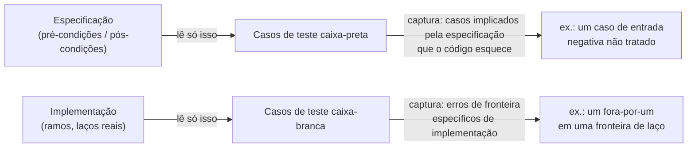

## Objetivos de Aprendizagem

- Definir teste caixa-preta e caixa-branca precisamente, em termos de qual informação cada um usa e não usa para projetar casos de teste.
- Derivar um conjunto de casos de teste caixa-preta a partir de uma especificação sozinha, sem ler a implementação.
- Derivar um conjunto de casos de teste caixa-branca lendo os ramos e estrutura de laço reais de uma implementação.
- Construir um exemplo concreto de um bug que teste caixa-preta plausivelmente perde mas teste caixa-branca captura diretamente.
- Explicar por que as duas abordagens são fontes complementares de teste em vez de competidoras, e combiná-las para uma função.

## Contexto e Motivação

Uma vez que teste de unidade, integração, e sistema estão à mão como os três *níveis* em que teste acontece, uma pergunta separada permanece em aberto em qualquer um desses níveis: dado que uma unidade específica está sendo testada, de onde vêm os casos de teste reais? Duas respostas genuinamente diferentes existem, e ambas são legítimas, porque se baseiam em fontes diferentes de informação sobre a mesma função.

**Teste caixa-preta** projeta casos de teste puramente a partir da especificação da função, quais entradas aceita, qual saída ou comportamento promete para cada uma, sem jamais olhar para o código que a implementa. O testador se comporta como se a função realmente fosse uma caixa opaca: só seu contrato documentado é visível, nunca seus internos. **Teste caixa-branca** faz o oposto: projeta casos de teste lendo o código-fonte real, especificamente para garantir que todo caminho significativo através daquele código, todo ramo de todo `if`/`else`, toda fronteira de laço, seja exercitado por pelo menos um teste.

A razão pela qual uma unidade de estratégia de teste ensina ambos, em vez de escolher um, é que são bons em capturar coisas diferentes por uma razão estrutural, não acidental. Teste caixa-preta é ancorado na especificação, então está bem posicionado para capturar um caso que a especificação claramente implica que deveria ser tratado mas que a implementação acontece de esquecer, porque o testador nunca viu a implementação, não pode ser inconscientemente enviesado por ela, e testará casos que a especificação promete independentemente de o código "parecer" tratá-los. Teste caixa-branca é ancorado no código, então está bem posicionado para capturar um erro específico de *como* a função acontece de ser escrita, um erro fora-por-um em uma fronteira de laço, um ramo que simplesmente nunca é alcançado por nenhuma entrada que um testador caixa-preta, lendo só a especificação, teria pensado em tentar. Nenhuma fonte de caso de teste é redundante com a outra; uma especificação raramente detalha todo detalhe de implementação precisamente o suficiente para derivar casos de fronteira estilo caixa-branca dela, e código, lido por si só, não revela se de fato está fazendo o que foi *prometido*, só o que de fato faz.

## Teoria Central

### Teste caixa-preta: casos de teste só da especificação

Um caso de teste caixa-preta é derivado inteiramente do que uma função é documentada (ou especificada) a fazer, sua pré-condição (o que deve ser verdadeiro sobre a entrada) e pós-condição (o que deve ser verdadeiro sobre a saída), sem consultar a implementação de forma alguma. A disciplina aqui é o mesmo pensamento de "condições de fronteira" já familiar de teste de função única: menor entrada legal, maior, uma entrada exatamente em um limiar documentado, uma entrada que a especificação trata como um caso distinto (por exemplo, "retorna uma lista vazia se não há correspondências"). O que o torna *caixa-preta* especificamente é a disciplina de derivar esses casos do texto da especificação, não de dar uma olhada no código para ver o que ele acontece de verificar.

A força dessa abordagem é que está completamente isolada dos próprios pontos cegos da implementação: se a especificação promete comportamento para números negativos, um testador caixa-preta testará números negativos, mesmo que o autor da implementação tenha esquecido completamente aquele caso e o código silenciosamente o trate mal. A fraqueza é a imagem espelhada dessa força: um testador caixa-preta não tem como saber que um laço particular acontece de ser implementado com um erro fora-por-um em uma fronteira que a especificação nunca chamou explicitamente, porque nada na especificação apontou para lá.

### Teste caixa-branca: casos de teste da estrutura real do código

Um caso de teste caixa-branca é derivado lendo a implementação diretamente, com o objetivo específico de exercitar caminhos através do código que uma abordagem caixa-preta poderia nunca pensar em tentar. A versão mais básica desse objetivo é **cobertura de ramo**: todo `if` e todo `else` (e todo caso de uma cadeia condicional mais longa) deveria ser tomado por pelo menos um caso de teste, em ambas as direções. Um objetivo relacionado e frequentemente mais revelador é mirar deliberadamente **fronteiras de laço**, a primeira iteração, a última iteração, uma-além-da-última, zero iterações, já que erros fora-por-um se concentram quase exclusivamente exatamente nesses pontos.

A força dessa abordagem é precisão sobre o código *real*: pode mirar um ramo ou fronteira específico, de aparência perigosa, que a especificação nunca chamou atenção, porque a especificação é uma descrição de comportamento pretendido, não de estrutura de implementação, e estrutura de aparência perigosa só é visível na implementação. A fraqueza é a imagem espelhada, de novo: um testador caixa-branca, lendo só o código, não tem verificação independente sobre se o comportamento *pretendido* do código (em oposição ao seu comportamento real) sequer é correto, uma função que consistente, fielmente implementa a especificação errada passará em todo teste caixa-branca derivado de sua própria estrutura, porque esses testes nunca a verificaram contra nada externo.

### Por que os dois são complementares, não redundantes



A fonte de caso de teste de teste caixa-preta (a especificação) e a fonte de teste caixa-branca (o código) são simplesmente documentos diferentes, e cada um é cego para defeitos que vivem só no outro. Uma especificação pode implicar um caso que o código esqueceu; código pode conter um erro mecânico que a especificação nunca teve ocasião de mencionar. Uma suíte de testes completa para uma função tipicamente se baseia em ambos: os casos de fronteira guiados pela especificação (menor, maior, casos especiais documentados) *e* uma passagem sobre o código real verificando que todo ramo e toda fronteira de laço especificamente foram exercitados.

### Um caso concreto onde teste caixa-preta perde um bug que teste caixa-branca captura

Considere uma função especificada como: "`sum_first_n(numbers, n)` retorna a soma dos primeiros `n` elementos de `numbers`." Um testador caixa-preta, lendo só essa especificação, razoavelmente tenta: um caso típico (`n` em algum lugar no meio da lista), `n = 0` (documentado implicitamente por "primeiros n" fazer sentido até zero), e talvez `n` igual ao comprimento completo da lista. Nenhum desses, escolhido só a partir da linguagem simples da especificação, obviamente exige tentar `n` igual ao comprimento da lista *mais um*, a especificação não se detém no que acontece se `n` excede o comprimento da lista, então um testador caixa-preta focado em casos "típicos e claramente implicados" pode muito plausivelmente nunca tentá-lo.

```python
def sum_first_n(numbers, n):
    total = 0
    for i in range(n - 1):     # bug: deveria ser range(n)
        total += numbers[i]
    return total
```

Casos caixa-preta como `sum_first_n([2, 4, 6], 2)` esperam `6` (2 + 4) mas essa implementação com bug, com `range(n - 1)`, só soma os primeiros `n - 1` elementos, retorna `2`, que está errado, mas um testador caixa-preta descuidado poderia não notar o erro fora-por-um se seu valor esperado escolhido também foi calculado descuidadamente, ou poderia simplesmente nunca pensar em tentar `n = 0` (onde o bug é invisível, já que `range(-1)` e `range(0)` ambos não produzem nada) versus `n = 1` (onde o bug é imediatamente visível: `sum_first_n([5], 1)` retorna `0` em vez de `5`). Um testador caixa-branca, em contraste, lê o laço diretamente, vê `range(n - 1)` onde o "primeiros n elementos" da especificação claramente implica `n` iterações, e, seguindo a disciplina caixa-branca padrão de mirar fronteiras de laço especificamente, tenta `n = 1` deliberadamente, como a menor fronteira que distinguiria "laço roda n vezes" de "laço roda n − 1 vezes." Esse único caso de teste, informado pelo código (`sum_first_n([5], 1)` deveria ser `5`, mas retorna `0`) captura o bug diretamente, precisamente porque foi escolhido olhando para o limite real do laço, não raciocinando só a partir da prosa da especificação.

## Exemplos Resolvidos

### Exemplo 1 — design de teste caixa-preta puro a partir de uma especificação

**Especificação:** `classify_triangle(a, b, c)` recebe três comprimentos de lado positivos e retorna `"equilateral"` se todos os três lados são iguais, `"isosceles"` se exatamente dois são iguais, e `"scalene"` se todos os três diferem. (Assuma que o chamador garante que os três comprimentos formam um triângulo válido.)

**Casos de teste caixa-preta**, derivados só desse texto, sem olhar nenhuma implementação:

```python
assert classify_triangle(5, 5, 5) == "equilateral"
assert classify_triangle(5, 5, 8) == "isosceles"
assert classify_triangle(3, 4, 5) == "scalene"
assert classify_triangle(8, 5, 5) == "isosceles"   # par igual em uma posição diferente
assert classify_triangle(5, 8, 5) == "isosceles"   # par igual em ainda outra posição
```

Os dois últimos casos são escolhidos especificamente porque a *categoria* da especificação ("exatamente dois são iguais") não especifica quais duas posições, um testador caixa-preta cuidadoso nota essa ambiguidade e testa todas as posições que a redação da especificação deixa em aberto, inteiramente sem ler nenhum código.

### Exemplo 2 — design de teste caixa-branca que encontra um bug de ramo escondido

**Implementação** (ainda não vista por quem escreveu os testes do Exemplo 1):

```python
def classify_triangle(a, b, c):
    if a == b and b == c:
        return "equilateral"
    if a == b or b == c:
        return "isosceles"
    return "scalene"
```

Lendo esse código diretamente (caixa-branca), o segundo ramo `a == b or b == c` deveria ser verificado se de fato cobre todo caso de "exatamente dois iguais", note que nunca verifica `a == c` diretamente. Rastreando: se `a == c` mas `a != b`, então `a == b` é `False` e `b == c` também é `False` (já que `a == c` e `a != b` implica `b != c`), então essa implementação cai para `"scalene"`, um bug genuíno para o caso onde o *primeiro e o terceiro* lados combinam. Um testador caixa-preta trabalhando só a partir da prosa da especificação, como no Exemplo 1, está testando "exatamente dois são iguais" como uma única categoria e pode muito bem se contentar com uma ou duas ordens representativas sem perceber que há três posições estruturalmente distintas para verificar, porque nada na redação da especificação sinaliza que a *implementação* as trata diferentemente. Um testador caixa-branca, lendo a condição real `if a == b or b == c`, imediatamente nota que nunca menciona `a == c`, e escreve o caso mirado:

```python
assert classify_triangle(5, 8, 5) == "isosceles"   # a == c, b diferente — mira o ramo faltando
```

Rodando: `classify_triangle(5, 8, 5)` retorna `"scalene"`, errado. Esse é exatamente um defeito que ler a estrutura de ramo real do código expõe diretamente, perguntando "toda forma pela qual a categoria da especificação poderia ser verdadeira corresponde a um caminho que este código de fato toma" uma pergunta que teste caixa-preta, trabalhando só a partir da prosa da especificação, é muito menos provável de pensar em fazer nessa forma precisa.

### Exemplo 3 — combinando ambos para uma função

**Especificação:** `is_valid_password(pw)` retorna `True` se `pw` tem pelo menos 8 caracteres de comprimento, senão `False`.

**Casos caixa-preta** (da especificação: fronteira em torno do limiar de comprimento 8):

```python
assert is_valid_password("short") == False       # bem abaixo de 8
assert is_valid_password("exactly8") == True      # exatamente 8 (fronteira implicada por "pelo menos 8")
assert is_valid_password("waylongerthaneight") == True
```

**Implementação:**

```python
def is_valid_password(pw):
    return len(pw) > 8
```

Os casos caixa-preta acima já capturam o bug: `"exactly8"` tem comprimento 8, a especificação diz que "pelo menos 8" significa que isso deveria ser `True`, mas `len(pw) > 8` exige *estritamente mais que* 8, então retorna `False`, o caso de fronteira, escolhido a partir da própria redação da especificação, expõe o erro fora-por-um diretamente. Uma passagem caixa-branca sobre o código chegaria à conclusão idêntica por uma rota diferente: lendo `len(pw) > 8` e notando que a condição de fronteira de uma comparação `>` versus `>=` é exatamente onde um erro fora-por-um vive, e testando `len(pw) == 8` especificamente por essa razão. Ambas as abordagens convergem no mesmo caso de teste aqui, o que é em si uma confirmação útil de que uma fronteira está bem coberta, mas não é garantido em geral (o Exemplo 2 mostra um caso onde divergem, e só o caso caixa-branca de fato capturou o bug).

## Equívocos Comuns e Armadilhas

- **"Teste caixa-branca é só teste com mais casos de teste."** A característica definidora não é quantidade mas *fonte*: um caso de teste caixa-branca é escolhido olhando para os ramos e limites de laço reais do código, especificamente para atingir caminhos que uma abordagem caixa-preta, trabalhando só a partir da especificação, poderia nunca pensar em tentar, como no ramo `a == c` faltando do Exemplo 2.
- **"Teste caixa-preta é inferior porque não pode ver o código."** Não ver o código é precisamente a força do teste caixa-preta para uma classe específica de bug: não pode ser desviado pelos próprios pontos cegos de uma implementação, e testará fielmente o que quer que a especificação prometa, mesmo um caso que o autor do código completamente esqueceu de tratar.
- **"100% de cobertura de ramo de teste caixa-branca significa que a função está completamente testada."** Exercitar todo ramo pelo menos uma vez (o objetivo caixa-branca da Teoria Central) não diz nada sobre se o *valor esperado* afirmado em cada ramo foi de fato escolhido corretamente, uma suíte de teste caixa-branca com asserções fracas ou faltando pode percorrer todo caminho de código e ainda perder que o próprio caminho de código calcula a coisa errada, uma questão examinada mais adiante sob cobertura de teste.
- **"Se os testes caixa-preta e caixa-branca ambos passam, as duas abordagens são redundantes."** O Exemplo 3 mostra um caso onde ambas as abordagens convergem na mesma captura, mas o Exemplo 2 mostra o caso mais comum e mais importante: um bug (o caso `a == c` faltando) que uma suíte de teste caixa-preta razoável plausivelmente nunca tenta, e que só aparece uma vez que alguém lê a lógica condicional real.
- **"Testar o caso típico do meio de um laço é suficiente."** Erros fora-por-um se concentram nas *fronteiras* de laço, zero iterações, uma iteração, a última iteração, quase nunca no meio confortável; o bug do exemplo `sum_first_n` é invisível para um valor "de aparência normal" no meio de `n` e só aparece exatamente na fronteira que um testador caixa-branca estava especificamente procurando mirar.

## Resumo

Teste caixa-preta projeta casos de teste só a partir da especificação de uma função, suas entradas documentadas, saídas, e condições de fronteira, sem jamais consultar a implementação, o que o torna bem adequado para capturar casos que a especificação implica mas o código esquece. Teste caixa-branca projeta casos de teste lendo a implementação real, especificamente mirando todo ramo e toda condição de fronteira de laço, o que o torna bem adequado para capturar erros específicos de implementação (como um fora-por-um) que a prosa de uma especificação raramente sugeriria diretamente. Os dois se baseiam em documentos-fonte genuinamente diferentes, a especificação versus o código, então cada um é estruturalmente cego para o que só o outro pode ver; uma suíte de teste completa para uma função tipicamente combina casos de fronteira derivados da especificação com uma passagem deliberada sobre os ramos e limites de laço reais do código, como tanto o exemplo de classificação de triângulo quanto o de comprimento de senha mostram concretamente.

## Documentation Links

- [ACM/IEEE CS2013 — Software Engineering Knowledge Area](https://csed.acm.org/knowledge-areas-software-engineering-se-cs2013-version/) — doc
- [MIT 6.031 Spring 2017 — Course Site (lecture list)](http://web.mit.edu/6.031/www/sp17/) — doc
