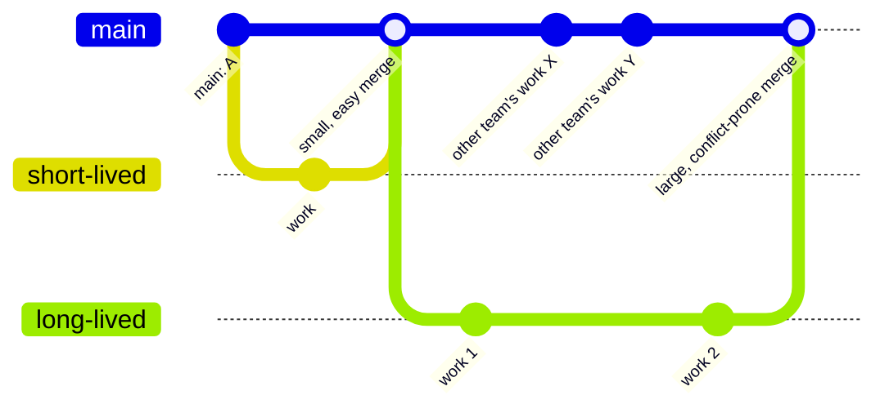

## Learning Objectives

- Explain the feature-branch convention: isolating each unit of work on its own branch and merging only once it is ready.
- Explain why keeping a shared main/trunk branch always in a working state is treated as a hard team-level rule, not a suggestion.
- Contrast a team committing directly to a shared branch against one using isolated feature branches, and predict the failure modes of each.
- Evaluate the trade-off between short-lived and long-lived branches in terms of merge difficulty.
- Recognize branching strategy as a team-process decision layered on top of git's mechanics, not a property git enforces on its own.

## Context & Motivation

Version control's basic mechanics — commit, branch, merge — say nothing about *when* to branch, *how long* to keep a branch alive before merging it, or *what state* the shared main line should be in at any given moment. Those are process questions, and different teams answer them differently; git's data model is equally happy with any answer. But not every answer works equally well in practice, and this is exactly the gap Missing Semester and MIT's own software-construction materials point to when they move from "here is what git does" to "here is how professional teams actually use it": the mechanics of branching and merging are necessary but not sufficient — a team also needs shared conventions about how those mechanics get used, or the tool's flexibility becomes a source of chaos rather than safety.

The single most consequential convention is the feature branch: rather than working directly on the branch everyone else builds on top of, a unit of work — a bug fix, a new feature, an experiment — gets its own branch, isolated from everyone else's in-progress work, and is only merged into the shared line once it is actually finished and known to work. The reason this matters is not stylistic; it's structural. A shared main branch that anyone can commit half-finished, broken work to directly becomes, in effect, unreliable for everyone else who depends on it — every person who pulls the latest code is now pulling someone else's incomplete change along with it, whether they want to or not. Isolating that same work on its own branch until it's ready means nobody else is ever exposed to it before it's deliberately merged in.

The companion convention — keeping the shared main line always in a working state — is what makes the feature-branch convention actually pay off. If main is expected to always build, always pass its test suite, and always be safe to build on top of, then every developer can pull the latest main at any moment with confidence, and any regression that does slip through is immediately visible as a break in a branch that's supposed to never break, rather than being buried among a dozen other unfinished, uncommunicated changes. Together, these two conventions are what let a team of any real size work on the same codebase simultaneously without constantly stepping on each other.

## Core Theory

### Feature branches: isolating a unit of work

A feature branch is created off the current tip of main specifically to hold the commits for one coherent unit of work — a single feature, a single bug fix, a single refactor — and nothing else. Its defining property is scope: while it's alive, it exists specifically so that in-progress, possibly broken, possibly half-finished work never touches the branch everyone else is relying on. It is merged back into main exactly once, at the point that unit of work is judged complete (often after code review, covered in a later concept in this same discipline), and is typically deleted immediately afterward — its job was to exist just long enough to isolate that one piece of work, not to persist as a permanent parallel line of history.

### Keeping main always in a working state

This convention is a team-level promise, not something git enforces by itself: at any point someone checks out main, it should build, its existing tests should pass, and it should be safe to build new work on top of. The practical consequence is that main only ever receives *completed, verified* work — which in turn is exactly why feature branches exist: they give incomplete work somewhere else to live until it clears that bar. A team that violates this promise — merging into main whatever happens to exist at the end of the day, working or not — loses the property that makes main useful as a shared foundation: nobody can trust that pulling the latest main gives them a working starting point.

### Branch lifetime: short-lived versus long-lived

The longer a feature branch stays alive without merging back into main, the more main is likely to move independently in the meantime — other feature branches merging their own completed work — and the more the feature branch's own starting point diverges from main's current tip. Since a merge has to reconcile everything that changed on *both* sides since their common ancestor, a longer-lived branch typically means a larger, harder-to-resolve merge when it finally does come back, with a higher chance of conflicts touching files that have changed on both sides for unrelated reasons. This is the practical argument for keeping feature branches short-lived: merge early and often, in small increments, rather than letting a branch drift for weeks accumulating both its own changes and a growing gap from main.



### Trunk-based development as the convention taken to its logical end

Some teams push this idea further, keeping feature branches alive for at most a day or two (or working directly against small, hidden increments on main behind feature flags) — a style usually called trunk-based development. The underlying reasoning is the same one driving the short-lived-branch argument: the smaller the gap between a branch's starting point and main's current state, the smaller and safer the eventual merge. This concept does not require adopting that specific style, only recognizing it as the same feature-branch-and-always-working-main logic pushed toward its most aggressive, lowest-conflict form.

## Worked Examples

### Example 1 — a team committing directly to main

**Scenario:** A three-person team pushes commits straight to `main` as soon as each person finishes any piece of work, with no branches at all.

Developer A is halfway through a database-schema change — the code compiles, but two functions are temporarily broken while the change is in progress — and commits this intermediate state directly to `main` at the end of the day, intending to finish tomorrow. Overnight, Developer B pulls `main` to start a new feature and now inherits A's broken intermediate state without knowing it; B's own new code, built on top of the broken functions, doesn't work either, and B has no way to tell whether the failure is in their own new code or in something they inherited. Developer C, meanwhile, wanted to quickly test a hotfix against a known-working `main` and cannot, because there is no such state available anymore — the most recent commit on `main` is A's unfinished work.

**What went wrong, structurally:** `main` stopped being a reliable shared foundation the moment an incomplete change was committed directly to it. Every subsequent person who touched `main` inherited that incompleteness, with no way to opt out of it, and no branch existed anywhere holding a stable point to fall back to.

### Example 2 — the same team using feature branches

**Scenario:** The same three-person team, same schema change, but each person works on their own feature branch.

```bash
git checkout -b schema-migration     # Developer A's isolated branch
# ... A works across the day, commits intermediate, possibly broken states ...
# main is completely untouched by any of this
```

Developer B, needing to start a new feature overnight, pulls `main` — which still reflects only completed, working history, since A's in-progress schema work lives entirely on `schema-migration` and has not touched `main` at all. B's new work builds cleanly on a known-good foundation. Developer C, wanting a stable point for a quick hotfix test, checks out `main` directly and gets exactly that — nothing unfinished is hiding there.

The next day, A finishes the schema migration, confirms the test suite passes on the branch, and merges:

```bash
git checkout main
git merge schema-migration
git branch -d schema-migration        # branch deleted once merged; its job is done
```

Only now, once the work is genuinely complete, does it become part of the shared history everyone else builds on. B and C were never exposed to the in-progress version at all — the isolation is the entire point.

## Common Misconceptions & Pitfalls

- **"More branches automatically means a more organized project."** A branch that lives for weeks without merging accumulates its own drift from main and typically produces a larger, more conflict-prone merge than several small, short-lived branches would have. The organizing value comes from disciplined, *short* isolation, not from the mere existence of branches.
- **"Trunk-based development means never branching at all."** It means keeping branches (or equivalent small increments) alive for a very short time before merging back, not eliminating the branch-and-merge structure entirely — the underlying feature-isolation idea is the same, just compressed to a much smaller time window.
- **"If the code compiles, it's fine to commit directly to main."** Compiling is a much lower bar than "safe for everyone else to build on top of" — a schema migration that compiles but leaves two functions temporarily broken, as in Example 1, is exactly the failure mode the always-working-main convention exists to prevent.
- **"A feature branch should stay open until the feature is perfect."** Waiting for perfection before merging tends to produce exactly the long-lived-branch problem described in Core Theory — a large gap between the branch and a moving main, and a larger merge to resolve later. The convention favors "verified complete and working," merged promptly, over "polished to an arbitrary standard," merged whenever that standard is finally met.
- **"Merge conflicts are a sign the branching strategy failed."** Some conflicts are simply the unavoidable consequence of two people changing related code at genuinely the same time — the strategy's goal is to reduce their *frequency and size* by keeping branches short-lived and main always working, not to eliminate the possibility of a conflict outright.

## Summary

Git's mechanics say nothing about when to branch or how long to wait before merging — that's a team-process decision layered on top, and the two conventions that answer it well are feature branches (isolating each unit of work until it's genuinely complete) and an always-working main (so that everyone can trust it as a shared, reliable foundation at any moment). A team that skips both, committing directly and continuously to a shared branch, exposes everyone to everyone else's incomplete work, as seen directly in the contrast between a team working straight on main and the same team using isolated branches. Branch lifetime matters too: the longer a branch goes before merging, the more it and main have likely diverged independently, producing a larger and more conflict-prone eventual merge — which is the practical argument for short-lived branches, merged early and often, whether or not a team goes as far as full trunk-based development.

## Documentation Links

- [The Missing Semester of Your CS Education (MIT)](https://missing.csail.mit.edu/) — doc
- [MIT 6.031/6.005 — Course Home (OCW)](https://ocw.mit.edu/courses/6-005-software-construction-spring-2016/) — doc
