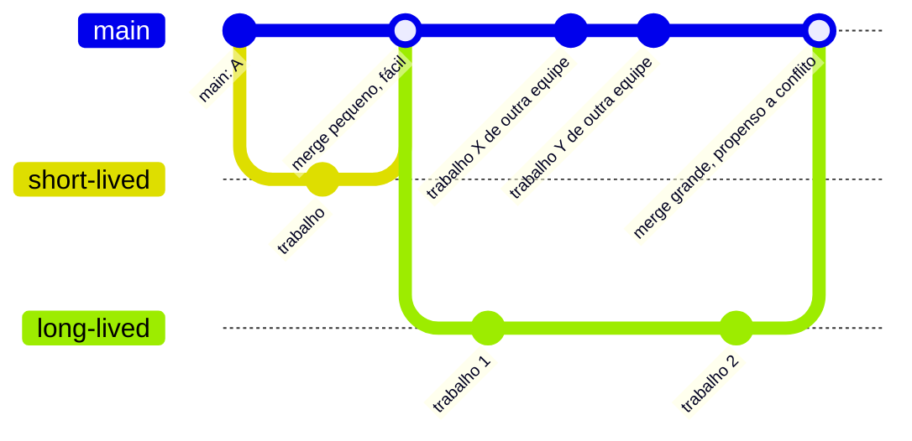

## Objetivos de Aprendizagem

- Explicar a convenção de feature branch: isolar cada unidade de trabalho em seu próprio branch e mesclar só quando estiver pronta.
- Explicar por que manter um branch main/trunk compartilhado sempre em um estado funcional é tratado como uma regra rígida no nível de equipe, não uma sugestão.
- Contrastar uma equipe fazendo commit diretamente em um branch compartilhado contra uma usando feature branches isolados, e prever os modos de falha de cada uma.
- Avaliar a troca entre branches de vida curta e de vida longa em termos de dificuldade de merge.
- Reconhecer estratégia de branching como uma decisão de processo de equipe sobreposta à mecânica do git, não uma propriedade que o git impõe por conta própria.

## Contexto e Motivação

A mecânica básica de controle de versão, commit, branch, merge, não diz nada sobre *quando* fazer branch, *quanto tempo* manter um branch vivo antes de mesclá-lo, ou *em que estado* a linha principal compartilhada deveria estar em qualquer momento dado. Essas são perguntas de processo, e equipes diferentes as respondem diferentemente; o modelo de dados do git está igualmente satisfeito com qualquer resposta. Mas nem toda resposta funciona igualmente bem na prática, e essa é exatamente a lacuna para a qual Missing Semester e os próprios materiais de construção de software do MIT apontam quando se movem de "aqui está o que git faz" para "aqui está como equipes profissionais de fato o usam": a mecânica de branching e merge é necessária mas não suficiente, uma equipe também precisa de convenções compartilhadas sobre como aquela mecânica é usada, ou a flexibilidade da ferramenta se torna uma fonte de caos em vez de segurança.

A convenção única mais consequente é o feature branch: em vez de trabalhar diretamente no branch sobre o qual todo mundo mais constrói, uma unidade de trabalho, uma correção de bug, uma nova funcionalidade, um experimento, ganha seu próprio branch, isolado do trabalho em progresso de todo mundo mais, e só é mesclada na linha compartilhada uma vez que de fato está terminada e sabida funcionar. A razão pela qual isso importa não é estilística; é estrutural. Um branch main compartilhado ao qual qualquer um pode fazer commit de trabalho meio-terminado, quebrado, diretamente se torna, em efeito, não confiável para todo mundo mais que depende dele, toda pessoa que puxa o código mais recente agora está puxando a mudança incompleta de outra pessoa junto, quer queira ou não. Isolar esse mesmo trabalho em seu próprio branch até estar pronto significa que ninguém mais é jamais exposto a ele antes de ser deliberadamente mesclado.

A convenção companheira, manter a linha main compartilhada sempre em um estado funcional, é o que faz a convenção de feature branch de fato compensar. Se main é esperado sempre buildar, sempre passar sua suíte de teste, e sempre ser seguro para construir em cima, então todo desenvolvedor pode puxar o main mais recente em qualquer momento com confiança, e qualquer regressão que de fato escape se torna imediatamente visível como uma quebra em um branch que é pra nunca quebrar, em vez de ser enterrada entre uma dúzia de outras mudanças não terminadas, não comunicadas. Juntas, essas duas convenções são o que permite que uma equipe de qualquer tamanho real trabalhe na mesma base de código simultaneamente sem constantemente pisar um no outro.

## Teoria Central

### Feature branches: isolando uma unidade de trabalho

Um feature branch é criado a partir da ponta atual de main especificamente para conter os commits de uma unidade coerente de trabalho, uma única funcionalidade, uma única correção de bug, uma única refatoração, e nada mais. Sua propriedade definidora é escopo: enquanto está vivo, existe especificamente para que trabalho em progresso, possivelmente quebrado, possivelmente meio-terminado, nunca toque o branch do qual todo mundo mais depende. É mesclado de volta em main exatamente uma vez, no ponto em que aquela unidade de trabalho é julgada completa (frequentemente depois de revisão de código, coberta em um conceito posterior nesta mesma disciplina), e é tipicamente deletado imediatamente depois, seu trabalho era existir só o suficiente para isolar aquele único pedaço de trabalho, não persistir como uma linha paralela permanente de histórico.

### Mantendo main sempre em um estado funcional

Essa convenção é uma promessa no nível de equipe, não algo que git aplica por si só: em qualquer ponto que alguém faz checkout de main, deveria buildar, seus testes existentes deveriam passar, e deveria ser seguro construir novo trabalho em cima. A consequência prática é que main só jamais recebe trabalho *completo, verificado*, que por sua vez é exatamente por que feature branches existem: dão a trabalho incompleto algum outro lugar para viver até que passe naquela barra. Uma equipe que viola essa promessa, mesclando em main o que quer que aconteça de existir no fim do dia, funcionando ou não, perde a propriedade que torna main útil como uma fundação compartilhada: ninguém pode confiar que puxar o main mais recente dá a eles um ponto de partida funcional.

### Vida de branch: curta versus longa

Quanto mais tempo um feature branch permanece vivo sem mesclar de volta em main, mais provável main se move independentemente nesse meio tempo, outros feature branches mesclando seu próprio trabalho completo, e mais o próprio ponto de partida do feature branch diverge da ponta atual de main. Já que um merge tem que reconciliar tudo que mudou em *ambos* os lados desde seu ancestral comum, um branch de vida mais longa tipicamente significa um merge maior, mais difícil de resolver quando finalmente volta, com uma chance mais alta de conflitos tocando arquivos que mudaram em ambos os lados por razões não relacionadas. Esse é o argumento prático para manter feature branches de vida curta: mescle cedo e frequentemente, em pequenos incrementos, em vez de deixar um branch derivar por semanas acumulando tanto suas próprias mudanças quanto uma lacuna crescente de main.



### Desenvolvimento baseado em tronco como a convenção levada ao seu fim lógico

Algumas equipes empurram essa ideia mais longe, mantendo feature branches vivos por no máximo um ou dois dias (ou trabalhando diretamente contra pequenos incrementos escondidos em main atrás de feature flags), um estilo geralmente chamado desenvolvimento baseado em tronco (trunk-based development). O raciocínio subjacente é o mesmo que guia o argumento de branch-de-vida-curta: quanto menor a lacuna entre o ponto de partida de um branch e o estado atual de main, menor e mais seguro o merge eventual. Este conceito não exige adotar aquele estilo específico, só reconhecê-lo como a mesma lógica de feature-branch-e-main-sempre-funcional empurrada em direção à sua forma mais agressiva, de menor conflito.

## Exemplos Resolvidos

### Exemplo 1 — uma equipe fazendo commit diretamente em main

**Cenário:** Uma equipe de três pessoas empurra commits diretamente para `main` assim que cada pessoa termina qualquer pedaço de trabalho, sem nenhum branch de forma alguma.

O Desenvolvedor A está na metade de uma mudança de esquema de banco de dados, o código compila, mas duas funções estão temporariamente quebradas enquanto a mudança está em progresso, e faz commit desse estado intermediário diretamente em `main` no fim do dia, pretendendo terminar amanhã. Durante a noite, o Desenvolvedor B puxa `main` para começar uma nova funcionalidade e agora herda o estado intermediário quebrado de A sem saber; o próprio novo código de B, construído em cima das funções quebradas, também não funciona, e B não tem como dizer se a falha está em seu próprio código novo ou em algo que herdou. O Desenvolvedor C, nesse meio tempo, queria rapidamente testar uma correção urgente contra um `main` sabidamente funcional e não pode, porque tal estado não está mais disponível em lugar nenhum, o commit mais recente em `main` é o trabalho não terminado de A.

**O que deu errado, estruturalmente:** `main` parou de ser uma fundação compartilhada confiável no momento em que uma mudança incompleta foi commitada diretamente nela. Toda pessoa subsequente que tocou `main` herdou aquela incompletude, sem forma de optar por não fazê-lo, e nenhum branch existia em lugar nenhum contendo um ponto estável para o qual recuar.

### Exemplo 2 — a mesma equipe usando feature branches

**Cenário:** A mesma equipe de três pessoas, a mesma mudança de esquema, mas cada pessoa trabalha em seu próprio feature branch.

```bash
git checkout -b schema-migration     # branch isolado do Desenvolvedor A
# ... A trabalha ao longo do dia, faz commit de estados intermediários, possivelmente quebrados ...
# main está completamente intocado por qualquer coisa disso
```

O Desenvolvedor B, precisando começar uma nova funcionalidade durante a noite, puxa `main`, que ainda reflete só histórico completo, funcional, já que o trabalho de esquema em progresso de A vive inteiramente em `schema-migration` e não tocou `main` de forma alguma. O novo trabalho de B constrói limpamente sobre uma fundação sabidamente boa. O Desenvolvedor C, querendo um ponto estável para um teste de correção urgente rápido, faz checkout de `main` diretamente e obtém exatamente isso, nada não terminado está se escondendo ali.

No dia seguinte, A termina a migração de esquema, confirma que a suíte de teste passa no branch, e mescla:

```bash
git checkout main
git merge schema-migration
git branch -d schema-migration        # branch deletado uma vez mesclado; seu trabalho está feito
```

Só agora, uma vez que o trabalho está genuinamente completo, se torna parte do histórico compartilhado sobre o qual todo mundo mais constrói. B e C nunca foram expostos à versão em progresso de forma alguma, o isolamento é o ponto inteiro.

## Equívocos Comuns e Armadilhas

- **"Mais branches automaticamente significa um projeto mais organizado."** Um branch que vive por semanas sem mesclar acumula sua própria deriva de main e tipicamente produz um merge maior, mais propenso a conflito, do que vários branches pequenos, de vida curta, teriam produzido. O valor organizador vem de isolamento disciplinado, *curto*, não da mera existência de branches.
- **"Desenvolvimento baseado em tronco significa nunca fazer branch de forma alguma."** Significa manter branches (ou incrementos pequenos equivalentes) vivos por um tempo muito curto antes de mesclar de volta, não eliminar a estrutura de branch-e-merge inteiramente, a ideia subjacente de isolamento de funcionalidade é a mesma, só comprimida para uma janela de tempo muito menor.
- **"Se o código compila, está tudo bem fazer commit diretamente em main."** Compilar é uma barra muito mais baixa que "seguro para todo mundo mais construir em cima," uma migração de esquema que compila mas deixa duas funções temporariamente quebradas, como no Exemplo 1, é exatamente o modo de falha que a convenção de main-sempre-funcional existe para prevenir.
- **"Um feature branch deveria permanecer aberto até a funcionalidade estar perfeita."** Esperar por perfeição antes de mesclar tende a produzir exatamente o problema de branch-de-vida-longa descrito na Teoria Central, uma lacuna grande entre o branch e um main em movimento, e um merge maior para resolver depois. A convenção favorece "verificado completo e funcional," mesclado prontamente, sobre "polido a um padrão arbitrário," mesclado sempre que aquele padrão finalmente é atingido.
- **"Conflitos de merge são um sinal de que a estratégia de branching falhou."** Alguns conflitos são simplesmente a consequência inevitável de duas pessoas mudando código relacionado genuinamente ao mesmo tempo, o objetivo da estratégia é reduzir sua *frequência e tamanho* mantendo branches de vida curta e main sempre funcional, não eliminar a possibilidade de um conflito completamente.

## Resumo

A mecânica do git não diz nada sobre quando fazer branch ou quanto tempo esperar antes de mesclar, essa é uma decisão de processo de equipe sobreposta, e as duas convenções que a respondem bem são feature branches (isolando cada unidade de trabalho até estar genuinamente completa) e um main sempre funcional (para que todo mundo possa confiar nele como uma fundação compartilhada, confiável, em qualquer momento). Uma equipe que pula ambas, fazendo commit direto e continuamente em um branch compartilhado, expõe todo mundo ao trabalho incompleto de todo mundo mais, como visto diretamente no contraste entre uma equipe trabalhando direto em main e a mesma equipe usando branches isolados. Vida de branch também importa: quanto mais tempo um branch demora antes de mesclar, mais ele e main provavelmente divergiram independentemente, produzindo um merge eventual maior e mais propenso a conflito, que é o argumento prático para branches de vida curta, mesclados cedo e frequentemente, quer uma equipe vá tão longe quanto desenvolvimento baseado em tronco completo ou não.

## Documentation Links

- [The Missing Semester of Your CS Education (MIT)](https://missing.csail.mit.edu/) — doc
- [MIT 6.031/6.005 — Course Home (OCW)](https://ocw.mit.edu/courses/6-005-software-construction-spring-2016/) — doc
