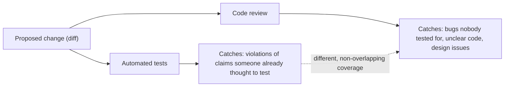

## Learning Objectives

- Explain code review's core mechanism: a second person reading a proposed change before it merges, and why that changes what gets caught.
- Describe the cognitive-distance phenomenon that makes an author less able to spot certain problems in their own code, and why a fresh reader isn't subject to it.
- Distinguish the categories of problem code review catches — bugs, unclear code, design issues — from what automated tests already cover.
- Give a concrete example of a review comment catching something a passing test suite did not.
- Evaluate whether a piece of code is clear to someone who didn't write it, as distinct from whether it merely works.

## Context & Motivation

By the time a change reaches the point of being merged, it typically already has two things going for it: the author believes it's correct, and — ideally, following the commit-hygiene practices from the previous concept — its history is atomic and its intent is documented. Neither of those is the same as a second, independent person having actually looked at it. Code review is exactly that: before a change merges into the shared history, someone other than its author reads it — the actual diff, not just a description of it — and either approves it or raises concerns.

The reason this step catches things a careful author working alone genuinely cannot catch themselves is a well-documented, real phenomenon, not a folk belief: an author who has spent an hour, or a day, deep inside one specific piece of logic loses a kind of distance from it that a fresh reader still has. Having built the mental model of what the code is *supposed* to do while writing it, the author tends to read what they intended rather than what the text on the page actually says — the same reason proofreading one's own writing is notoriously worse at catching mistakes than having someone else read it. A reviewer who opens the diff for the first time has no such investment; they see only what the code literally does, unclouded by the intention that produced it, which is precisely the vantage point from which a mismatch between intention and implementation becomes visible.

MIT's 6.031 materials and ACM/IEEE's CS2013 software-engineering guidelines both treat review this way: not a bureaucratic gate before merging, but a genuinely different source of information about a change than either the author's own confidence or an automated test suite can provide. A test suite only checks what someone thought, in advance, to write a test for; an author's confidence only reflects what they've already considered. A reviewer brings a third, independent perspective — someone who might think of the one edge case the author never considered, or notice that a piece of code, while entirely correct, is going to be genuinely confusing to the next person who reads it, neither of which a green test suite says anything about at all.

## Core Theory

### The cognitive-distance phenomenon

Writing a piece of code involves building, in the author's head, a specific mental model of what it's meant to do — the intended behavior — alongside the actual text being typed. Once that mental model is formed, it becomes very difficult for the same person to read their own code and notice a place where the text diverges from the intention, because their eyes tend to confirm what they already believe is there rather than what is literally written. This is not a matter of carelessness or lack of skill; it is a structural limitation of being the same person who both wrote the intention and is now checking it against the result. A reviewer, having never held that specific intention in their head to begin with, reads only the text as it actually is — which is exactly the perspective from which a mismatch becomes visible, because there's no prior mental model quietly filling in the gap.

### What review catches that automated tests don't

A test suite verifies a specific, finite set of input-output claims that someone thought, in advance, to write down. It says nothing about a case nobody thought of, and nothing at all about whether the code's structure is clear to someone reading it for the first time. Code review covers a genuinely different territory:

- **Bugs the author didn't think to test for.** A reviewer, coming to the code fresh, may notice an edge case — an empty input, a boundary value, an assumption about ordering — that never occurred to the author while writing the corresponding tests, precisely because the author's own blind spots and the test suite's blind spots tend to be the same blind spots.
- **Correct-but-confusing code.** Code can pass every test and still be a genuine liability if the next person to touch it cannot understand why it works, or has to reverse-engineer its logic before trusting it enough to change it safely. No automated test checks for this at all — it requires a human reader judging comprehensibility, which is exactly what a fresh set of eyes is positioned to do.
- **Design problems.** A change might work correctly in isolation while still being the wrong shape for the codebase it's joining — duplicating logic that already exists elsewhere, coupling two modules that shouldn't know about each other, or solving a narrower problem than the one that will actually recur. These are judgments about the system as a whole, which a test targeted at one function has no way to express.



### The mechanics of review, briefly

In practice, review happens on the proposed diff itself — most commonly as a pull or merge request — where a reviewer reads the actual changed lines in context, leaves comments on specific lines or on the change as a whole, and the author responds, either by making changes or by explaining a reasoning the reviewer hadn't considered. The exchange is not adversarial by design: its function is to surface a second, independent perspective before the change becomes part of the shared history everyone else builds on, at the point where raising a concern is cheapest — before merging, not after.

## Worked Examples

### Example 1 — a review comment catching an edge case the tests missed

**Scenario:** a function computes a user's average order value over their most recent orders.

```python
def average_order_value(orders):
    total = sum(order.amount for order in orders)
    return total / len(orders)
```

**Tests, written by the author, all passing:**
```python
assert average_order_value([Order(50), Order(70)]) == 60
assert average_order_value([Order(100)]) == 100
```

Both tests pass. The author, having only ever called this function with real customers who have placed at least one order, never thought to test the case of a brand-new customer with zero orders — and so never noticed the function assumes `orders` is non-empty.

**Review comment:**
> What happens here for a customer with no order history yet — say, right after signup? `len(orders)` would be `0` and this raises `ZeroDivisionError`. Is that intentional, or should this return `0`, `None`, or handle it explicitly before the caller ever sees a crash?

The tests never caught this because no test exercised an empty order list — the gap wasn't a bug in the tests that were written, it was an input nobody had thought to write a test for in the first place. The reviewer, reading the function fresh rather than from inside the author's own mental model of "a customer with order history," is the one who thought to ask about the case the author's own experience with the function had never surfaced.

### Example 2 — correct-but-confusing code caught by a reviewer

**Scenario:** a function checks whether a discount code is still valid.

```python
def is_valid(code, now):
    return not (code.expires_at < now or code.uses_remaining < 1 or not code.active)
```

This function is entirely correct — every test the author wrote for it passes, and a careful trace confirms the logic holds for every case. But it is also difficult to read at a glance: the reviewer has to mentally negate a compound condition full of double negatives (`not (... or ... or not ...)`) to figure out what "valid" actually means.

**Review comment:**
> This is correct, but it took me a minute of tracing through the negation to convince myself of that. Would inverting the logic to state the *positive* condition directly make this easier for the next person to verify at a glance?

**Revised, after the author takes the suggestion:**
```python
def is_valid(code, now):
    not_expired = code.expires_at >= now
    has_uses_left = code.uses_remaining >= 1
    return code.active and not_expired and has_uses_left
```

Nothing about the function's actual behavior changed — every test still passes exactly as before. What changed is that a future reader can now confirm correctness by reading the three named conditions directly, rather than mentally un-negating a compound boolean expression first. No automated test would ever have flagged the original version, because it wasn't wrong — it was merely harder than necessary to trust at a glance, which is a category of problem only a human reader evaluating clarity can catch.

## Common Misconceptions & Pitfalls

- **"If the tests pass, review is just a formality."** Examples 1 and 2 both pass every existing test — the missing edge case and the hard-to-verify boolean logic are precisely the categories of problem a test suite, by construction, cannot detect: one is an input nobody wrote a test for, the other is a clarity issue with no behavioral difference to test at all.
- **"Code review is mainly about nitpicking style."** Style comments do happen, but the substantive value of review is catching bugs the author's own blind spots hid from their own tests, and design or clarity issues that have nothing to do with formatting — reducing review to style feedback misses most of what it's actually for.
- **"A thorough author doesn't need review — they'll catch their own mistakes."** The cognitive-distance phenomenon is not about diligence; it applies precisely *because* the author has spent time deep inside their own intended behavior, which is exactly what makes catching a divergence between intention and implementation structurally harder for them than for a reader encountering the code for the first time.
- **"Review should only comment on things that are objectively wrong."** Example 2's comment doesn't claim the original code is incorrect — it flags that it's harder to verify than it needs to be, which is a legitimate and valuable category of feedback distinct from "this is a bug."
- **"A review comment that isn't acted on means the review failed."** Sometimes a reviewer raises a concern the author addresses by explaining context the reviewer didn't have — the exchange itself, surfacing a second perspective before the change merges, is the point, not a requirement that every comment result in a code change.

## Summary

Code review's core mechanism is simple — a second person reads a proposed change before it merges — but its value comes from a specific, real phenomenon: an author who built the mental model behind their own code loses the distance needed to notice where the implementation diverges from the intention, while a fresh reader, never having held that intention, sees only what the code actually says. This lets review catch categories of problem an automated test suite structurally cannot: an edge case nobody thought to test for (Example 1), and code that is entirely correct yet needlessly hard for the next reader to verify at a glance (Example 2). Neither a passing test suite nor an author's own confidence substitutes for this second, independent perspective — which is exactly why review sits, deliberately, at the point right before a change joins the shared history everyone else will build on.

## Documentation Links

- [MIT 6.031 Spring 2017 — Course Site (lecture list)](http://web.mit.edu/6.031/www/sp17/) — doc
- [ACM/IEEE CS2013 — Software Engineering Knowledge Area](https://csed.acm.org/knowledge-areas-software-engineering-se-cs2013-version/) — doc
