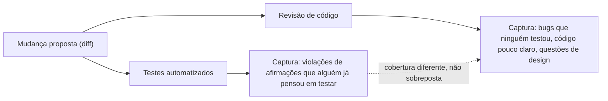

## Objetivos de Aprendizagem

- Explicar o mecanismo central da revisão de código: uma segunda pessoa lendo uma mudança proposta antes de mesclar, e por que isso muda o que é capturado.
- Descrever o fenômeno de distância cognitiva que torna um autor menos capaz de identificar certos problemas em seu próprio código, e por que um leitor novo não está sujeito a ele.
- Distinguir as categorias de problema que revisão de código captura, bugs, código pouco claro, questões de design, do que testes automatizados já cobrem.
- Dar um exemplo concreto de um comentário de revisão capturando algo que uma suíte de teste passando não capturou.
- Avaliar se um pedaço de código está claro para alguém que não o escreveu, como distinto de se meramente funciona.

## Contexto e Motivação

No momento em que uma mudança alcança o ponto de ser mesclada, tipicamente já tem duas coisas a seu favor: o autor acredita que está correta, e, idealmente, seguindo as práticas de higiene de commit do conceito anterior, seu histórico é atômico e sua intenção está documentada. Nenhuma dessas é o mesmo que uma segunda pessoa, independente, de fato ter olhado para ela. Revisão de código é exatamente isso: antes que uma mudança se mescle no histórico compartilhado, alguém além de seu autor a lê, o diff real, não só uma descrição dele, e ou a aprova ou levanta preocupações.

A razão pela qual esse passo captura coisas que um autor cuidadoso trabalhando sozinho genuinamente não consegue capturar por conta própria é um fenômeno real, bem documentado, não uma crença popular: um autor que passou uma hora, ou um dia, profundamente dentro de um pedaço específico de lógica perde um tipo de distância dele que um leitor novo ainda tem. Tendo construído o modelo mental do que o código *deveria* fazer enquanto o escrevia, o autor tende a ler o que pretendia em vez do que o texto na página de fato diz, a mesma razão pela qual revisar o próprio texto é notoriamente pior em capturar erros do que ter outra pessoa o lendo. Um revisor que abre o diff pela primeira vez não tem tal investimento; vê só o que o código literalmente faz, não obscurecido pela intenção que o produziu, que é precisamente o ponto de vista a partir do qual um descompasso entre intenção e implementação se torna visível.

Os materiais 6.031 do MIT e as diretrizes de engenharia de software do CS2013 do ACM/IEEE ambos tratam revisão dessa forma: não um portão burocrático antes de mesclar, mas uma fonte genuinamente diferente de informação sobre uma mudança do que ou a própria confiança do autor ou uma suíte de teste automatizada pode fornecer. Uma suíte de teste só verifica o que alguém pensou, antecipadamente, em escrever um teste para; a confiança de um autor só reflete o que já considerou. Um revisor traz uma terceira perspectiva, independente, alguém que pode pensar no único caso de borda que o autor nunca considerou, ou notar que um pedaço de código, embora inteiramente correto, vai ser genuinamente confuso para a próxima pessoa que o ler, nenhum dos quais uma suíte de teste verde diz nada sobre de forma alguma.

## Teoria Central

### O fenômeno de distância cognitiva

Escrever um pedaço de código envolve construir, na cabeça do autor, um modelo mental específico do que é destinado a fazer, o comportamento pretendido, ao lado do texto real sendo digitado. Uma vez que esse modelo mental é formado, se torna muito difícil para a mesma pessoa ler seu próprio código e notar um lugar onde o texto diverge da intenção, porque seus olhos tendem a confirmar o que já acreditam estar ali em vez do que está literalmente escrito. Isso não é uma questão de descuido ou falta de habilidade; é uma limitação estrutural de ser a mesma pessoa que ambos escreveu a intenção e agora a verifica contra o resultado. Um revisor, nunca tendo mantido aquela intenção específica na cabeça para começar, lê só o texto como de fato é, que é exatamente a perspectiva a partir da qual um descompasso se torna visível, porque não há nenhum modelo mental anterior silenciosamente preenchendo a lacuna.

### O que revisão captura que testes automatizados não capturam

Uma suíte de teste verifica um conjunto específico, finito, de afirmações de entrada-saída que alguém pensou, antecipadamente, em escrever. Não diz nada sobre um caso que ninguém pensou, e nada de forma alguma sobre se a estrutura do código está clara para alguém a lendo pela primeira vez. Revisão de código cobre um território genuinamente diferente:

- **Bugs que o autor não pensou em testar.** Um revisor, chegando ao código novo, pode notar um caso de borda, uma entrada vazia, um valor de fronteira, uma suposição sobre ordenação, que nunca ocorreu ao autor enquanto escrevia os testes correspondentes, precisamente porque os próprios pontos cegos do autor e os pontos cegos da suíte de teste tendem a ser os mesmos pontos cegos.
- **Código correto mas confuso.** Código pode passar em todo teste e ainda ser uma responsabilidade genuína se a próxima pessoa a tocá-lo não consegue entender por que funciona, ou tem que fazer engenharia reversa de sua lógica antes de confiar o suficiente para mudá-lo com segurança. Nenhum teste automatizado verifica isso de forma alguma, exige um leitor humano julgando compreensibilidade, que é exatamente o que um novo par de olhos está posicionado para fazer.
- **Problemas de design.** Uma mudança pode funcionar corretamente isoladamente enquanto ainda é o formato errado para a base de código que está entrando, duplicando lógica que já existe em outro lugar, acoplando dois módulos que não deveriam saber um sobre o outro, ou resolvendo um problema mais estreito do que aquele que de fato vai recorrer. Esses são julgamentos sobre o sistema como um todo, que um teste mirado em uma função não tem como expressar.



### A mecânica da revisão, brevemente

Na prática, revisão acontece no próprio diff proposto, mais comumente como um pull ou merge request, onde um revisor lê as próprias linhas mudadas em contexto, deixa comentários em linhas específicas ou na mudança como um todo, e o autor responde, ou fazendo mudanças ou explicando um raciocínio que o revisor não tinha considerado. A troca não é adversarial por design: sua função é trazer à tona uma segunda perspectiva, independente, antes que a mudança se torne parte do histórico compartilhado sobre o qual todo mundo mais constrói, no ponto onde levantar uma preocupação é mais barato, antes de mesclar, não depois.

## Exemplos Resolvidos

### Exemplo 1 — um comentário de revisão capturando um caso de borda que os testes perderam

**Cenário:** uma função calcula o valor médio de pedido de um usuário sobre seus pedidos mais recentes.

```python
def average_order_value(orders):
    total = sum(order.amount for order in orders)
    return total / len(orders)
```

**Testes, escritos pelo autor, todos passando:**
```python
assert average_order_value([Order(50), Order(70)]) == 60
assert average_order_value([Order(100)]) == 100
```

Ambos os testes passam. O autor, tendo só jamais chamado essa função com clientes reais que fizeram pelo menos um pedido, nunca pensou em testar o caso de um cliente novo com zero pedidos, e assim nunca notou que a função assume que `orders` não é vazio.

**Comentário de revisão:**
> O que acontece aqui para um cliente sem histórico de pedido ainda, digamos, logo depois do cadastro? `len(orders)` seria `0` e isso levanta `ZeroDivisionError`. Isso é intencional, ou deveria retornar `0`, `None`, ou tratar isso explicitamente antes que o chamador jamais veja um travamento?

Os testes nunca capturaram isso porque nenhum teste exercitou uma lista de pedido vazia, a lacuna não era um bug nos testes que foram escritos, era uma entrada que ninguém tinha pensado em escrever um teste para em primeiro lugar. O revisor, lendo a função de forma nova em vez de de dentro do próprio modelo mental do autor de "um cliente com histórico de pedido", é quem pensou em perguntar sobre o caso que a própria experiência do autor com a função nunca trouxe à tona.

### Exemplo 2 — código correto mas confuso capturado por um revisor

**Cenário:** uma função verifica se um código de desconto ainda é válido.

```python
def is_valid(code, now):
    return not (code.expires_at < now or code.uses_remaining < 1 or not code.active)
```

Essa função é inteiramente correta, todo teste que o autor escreveu para ela passa, e um rastreamento cuidadoso confirma que a lógica vale para todo caso. Mas também é difícil de ler de relance: o revisor tem que mentalmente negar uma condição composta cheia de duplas negativas (`not (... or ... or not ...)`) para descobrir o que "válido" de fato significa.

**Comentário de revisão:**
> Isso está correto, mas me levou um minuto rastreando a negação para me convencer disso. Inverter a lógica para enunciar a condição *positiva* diretamente tornaria isso mais fácil para a próxima pessoa verificar de relance?

**Revisado, depois que o autor aceita a sugestão:**
```python
def is_valid(code, now):
    not_expired = code.expires_at >= now
    has_uses_left = code.uses_remaining >= 1
    return code.active and not_expired and has_uses_left
```

Nada sobre o comportamento real da função mudou, todo teste ainda passa exatamente como antes. O que mudou é que um leitor futuro agora pode confirmar correção lendo as três condições nomeadas diretamente, em vez de mentalmente desnegar uma expressão booleana composta primeiro. Nenhum teste automatizado jamais teria sinalizado a versão original, porque não estava errada, era meramente mais difícil que o necessário de confiar de relance, que é uma categoria de problema que só um leitor humano avaliando clareza pode capturar.

## Equívocos Comuns e Armadilhas

- **"Se os testes passam, revisão é só uma formalidade."** Os Exemplos 1 e 2 ambos passam em todo teste existente, o caso de borda faltando e a lógica booleana difícil de verificar são precisamente as categorias de problema que uma suíte de teste, por construção, não pode detectar: um é uma entrada que ninguém escreveu um teste para, o outro é uma questão de clareza sem nenhuma diferença comportamental para testar de forma alguma.
- **"Revisão de código é principalmente sobre criticar detalhes de estilo."** Comentários de estilo de fato acontecem, mas o valor substantivo de revisão é capturar bugs que os próprios pontos cegos do autor esconderam de seus próprios testes, e questões de design ou clareza que não têm nada a ver com formatação, reduzir revisão a feedback de estilo perde a maior parte do para que de fato serve.
- **"Um autor completo não precisa de revisão, capturará seus próprios erros."** O fenômeno de distância cognitiva não é sobre diligência; se aplica precisamente *porque* o autor passou tempo profundamente dentro de seu próprio comportamento pretendido, que é exatamente o que torna capturar um descompasso entre intenção e implementação estruturalmente mais difícil para ele do que para um leitor encontrando o código pela primeira vez.
- **"Revisão só deveria comentar sobre coisas que estão objetivamente erradas."** O comentário do Exemplo 2 não afirma que o código original está incorreto, sinaliza que é mais difícil de verificar do que precisa ser, que é uma categoria legítima e valiosa de feedback distinta de "isso é um bug."
- **"Um comentário de revisão sobre o qual não se age significa que a revisão falhou."** Às vezes um revisor levanta uma preocupação que o autor aborda explicando contexto que o revisor não tinha, a própria troca, trazendo à tona uma segunda perspectiva antes que a mudança mescle, é o ponto, não um requisito de que todo comentário resulte em uma mudança de código.

## Resumo

O mecanismo central de revisão de código é simples, uma segunda pessoa lê uma mudança proposta antes de mesclar, mas seu valor vem de um fenômeno real, específico: um autor que construiu o modelo mental por trás de seu próprio código perde a distância necessária para notar onde a implementação diverge da intenção, enquanto um leitor novo, nunca tendo mantido aquela intenção, vê só o que o código de fato diz. Isso permite que revisão capture categorias de problema que uma suíte de teste automatizada estruturalmente não consegue: um caso de borda que ninguém pensou em testar (Exemplo 1), e código que está inteiramente correto mas desnecessariamente difícil para o próximo leitor verificar de relance (Exemplo 2). Nem uma suíte de teste passando nem a própria confiança de um autor substituem essa segunda perspectiva, independente, que é exatamente por que revisão fica, deliberadamente, no ponto logo antes de uma mudança se juntar ao histórico compartilhado sobre o qual todo mundo mais vai construir.

## Documentation Links

- [MIT 6.031 Spring 2017 — Course Site (lecture list)](http://web.mit.edu/6.031/www/sp17/) — doc
- [ACM/IEEE CS2013 — Software Engineering Knowledge Area](https://csed.acm.org/knowledge-areas-software-engineering-se-cs2013-version/) — doc
