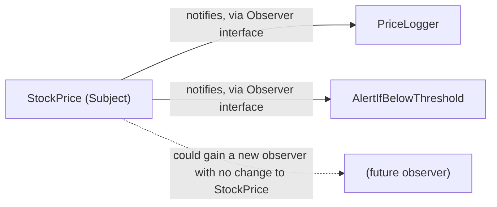

## Learning Objectives

- Define a design pattern as a named, reusable solution to a recurring design problem, not a piece of code to copy-paste.
- Explain the recurring problem the Strategy pattern solves and how it achieves low coupling by encapsulating an interchangeable algorithm behind a common interface.
- Explain the recurring problem the Observer pattern solves and how it lets one object notify several dependents without knowing their concrete types.
- Recognize when introducing a pattern is warranted by a genuine recurring problem versus when it would add needless indirection.

## Context & Motivation

Coupling and cohesion gave two dials for judging a design's quality, and a way to spot when a design was failing them — a God class, two modules reaching into each other's internals. What those concepts didn't give was a *vocabulary* for the good solutions once you find them. Two engineers who have both independently discovered "encapsulate an interchangeable algorithm behind a common interface so the caller doesn't need to know which one is running" have, in a real sense, discovered the same idea — but without a shared name for it, they'll describe it differently, argue past each other in code review, and reinvent slightly incompatible versions of it project after project.

Design patterns exist to close that gap. A design pattern is a **named, reusable solution to a problem that recurs across many different programs** — not a specific library, not a block of code to be copied in, but a *shape* of solution that gets re-implemented, in whatever way fits the language and situation at hand, every time the same underlying problem shows up again. This is the crucial distinction the term is most often misunderstood on: a pattern is not something you `import`; it's something you recognize a need for, and then write, fitted to your exact situation. The seminal reference for this vocabulary is the 1994 "Gang of Four" book (Gamma, Helm, Johnson, Vlissides), and its lasting contribution wasn't inventing these solutions from scratch — most were already in use — but giving each one a name, a clear statement of the problem it solves, and a comparison to its close alternatives, so that "let's use a Strategy here" became a sentence a whole team could understand instantly.

This concept covers exactly two patterns, in real depth, rather than surveying dozens shallowly — deliberately, because the goal here is to understand the *idea* of a pattern (recurring problem, named solution shape, applied afresh each time) well enough to recognize the next fifty patterns you encounter on the job, not to memorize a catalog. Both patterns chosen — Strategy and Observer — are also, not coincidentally, extremely direct, concrete applications of the coupling-and-cohesion principle just covered: each is a specific, well-known recipe for keeping coupling low in a particular recurring situation.

## Core Theory

### What a pattern is, and is not

A design pattern has three parts, always: (1) a **recurring problem** — a situation that shows up again and again across otherwise-unrelated programs; (2) a **named solution shape** — a description of how to structure classes and their relationships to solve that problem well; and (3) **consequences** — the trade-offs that come with using it (what gets easier, what gets harder). Crucially, a pattern is *not* a specific class, function, or file you can hand someone — it is a template for a relationship between a small number of roles (e.g., "a context," "a family of interchangeable strategies") that gets instantiated differently in every codebase that uses it. Two Strategy-pattern implementations in two different projects can share zero lines of code and still both correctly be "the Strategy pattern," because what makes something an instance of the pattern is the shape of the relationship between its parts, not its literal text — in exactly the same sense that an ADT is defined by its contract rather than by any one implementation.

### The Strategy pattern: encapsulating an interchangeable algorithm

**The recurring problem:** a piece of code needs to perform some task (sorting, computing a discount, validating input) in one of several interchangeable ways, and the specific way needs to be selectable — at configuration time, at runtime, or per call — without the calling code having to know which one it's using, and without a long chain of `if/elif` branches scattered through the caller picking between them.

**The solution shape:** define a common interface for "the algorithm" (a single method, typically), implement each interchangeable variant as its own class satisfying that interface, and have the calling code ("the context") hold a reference to *some* implementer of that interface, calling it without ever checking which concrete one it has.

```python
from abc import ABC, abstractmethod

# The common interface every strategy must satisfy
class DiscountStrategy(ABC):
    @abstractmethod
    def apply(self, price: float) -> float:
        ...

class NoDiscount(DiscountStrategy):
    def apply(self, price):
        return price

class PercentageOff(DiscountStrategy):
    def __init__(self, percent):
        self._percent = percent
    def apply(self, price):
        return price * (1 - self._percent / 100)

class FlatAmountOff(DiscountStrategy):
    def __init__(self, amount):
        self._amount = amount
    def apply(self, price):
        return max(0, price - self._amount)

# The context: holds *a* strategy, never checks which one
class Checkout:
    def __init__(self, discount_strategy: DiscountStrategy):
        self._discount_strategy = discount_strategy

    def final_price(self, price: float) -> float:
        return self._discount_strategy.apply(price)

# Selecting a strategy is the only place that names a concrete class
checkout = Checkout(PercentageOff(10))
print(checkout.final_price(100.0))   # 90.0
```

`Checkout` is coupled only to the `DiscountStrategy` interface, never to `PercentageOff` or `FlatAmountOff` specifically — a new discount rule is a new class satisfying the same interface, added without touching `Checkout` at all. This is coupling-and-cohesion made concrete: low coupling (context depends on an interface, not a concrete algorithm) and high cohesion (each strategy class has exactly one reason to change — its own rule).

### The Observer pattern: notifying dependents of a state change

**The recurring problem:** one object's state changes, and an open-ended, possibly-changing set of other objects need to react to that change — without the first object needing to know, at the time it's written, exactly who those dependents are or how many there will be.

**The solution shape:** the object whose state changes (the "subject") keeps a list of registered "observers," each satisfying a common notification interface; when the subject's state changes, it calls that same notification method on every registered observer, in turn, without knowing or caring what each one does with the notification.

```python
from abc import ABC, abstractmethod

class Observer(ABC):
    @abstractmethod
    def on_price_changed(self, new_price: float) -> None:
        ...

class Subject:
    def __init__(self):
        self._observers: list[Observer] = []

    def subscribe(self, observer: Observer) -> None:
        self._observers.append(observer)

    def _notify_all(self, new_price: float) -> None:
        for observer in self._observers:
            observer.on_price_changed(new_price)   # doesn't know or care what each does

class StockPrice(Subject):
    def __init__(self, price: float):
        super().__init__()
        self._price = price

    def set_price(self, new_price: float) -> None:
        self._price = new_price
        self._notify_all(new_price)

# Two unrelated observers, added without StockPrice's code changing
class PriceLogger(Observer):
    def on_price_changed(self, new_price):
        print(f"logged: price is now {new_price}")

class AlertIfBelowThreshold(Observer):
    def __init__(self, threshold):
        self._threshold = threshold
    def on_price_changed(self, new_price):
        if new_price < self._threshold:
            print("ALERT: price dropped below threshold!")

stock = StockPrice(100.0)
stock.subscribe(PriceLogger())
stock.subscribe(AlertIfBelowThreshold(90.0))
stock.set_price(85.0)
# logged: price is now 85.0
# ALERT: price dropped below threshold!
```

`StockPrice` never mentions `PriceLogger` or `AlertIfBelowThreshold` by name — a third observer can be added later with zero changes to `StockPrice`. This is exactly the low-coupling payoff again: the subject depends only on the `Observer` interface, and the set of concrete observers is free to grow or change independently of the subject's own code.



### Recognizing when a pattern is warranted

A pattern is warranted when the *recurring problem* it solves is genuinely present — interchangeable algorithms that really do need to vary (Strategy), or a genuinely open-ended, changing set of dependents that need notifying (Observer) — not merely because the pattern's name sounds sophisticated. Introducing a full Strategy hierarchy for a single algorithm that will never have a second variant adds a layer of indirection (an interface, a class, an injection point) that buys nothing; a single `if/else` would have been the simpler, more honest solution. Patterns are a response to a real, recurring shape of problem, not a stylistic default to reach for everywhere — this is precisely the same judgment call already required by information hiding (hide only decisions that plausibly change) applied to a slightly larger unit of design.

## Worked Examples

### Example 1 — Strategy applied to sorting order

**Problem:** A reporting tool needs to sort a list of records by different criteria (by date, by amount, by customer name) depending on which report is requested, and new sort criteria are added periodically as new report types are requested.

```python
from abc import ABC, abstractmethod

class SortStrategy(ABC):
    @abstractmethod
    def key(self, record):
        ...

class ByDate(SortStrategy):
    def key(self, record):
        return record["date"]

class ByAmount(SortStrategy):
    def key(self, record):
        return record["amount"]

class Reporter:
    def __init__(self, sort_strategy: SortStrategy):
        self._sort_strategy = sort_strategy

    def generate(self, records):
        return sorted(records, key=self._sort_strategy.key)

records = [{"date": "2026-01-01", "amount": 50}, {"date": "2025-06-01", "amount": 10}]
print(Reporter(ByDate()).generate(records))
print(Reporter(ByAmount()).generate(records))
```

**Reasoning.** `Reporter.generate` has no branch on which criterion was requested — it delegates entirely to whatever `SortStrategy` it was given. A new report sorted "by customer name" is a new `SortStrategy` subclass, added without touching `Reporter`, matching the recurring problem exactly: an interchangeable algorithm (the sort key) selected without the caller (`Reporter`) needing to know which one.

### Example 2 — Observer applied to a UI-style update

**Problem:** A `TemperatureSensor` reads a new value periodically, and both a `Display` (shows the current reading) and a `Logger` (writes every reading to a file) need to react whenever a new reading comes in, with more reactors expected later (e.g., an alert system).

```python
class Observer(ABC):
    @abstractmethod
    def on_reading(self, value):
        ...

class TemperatureSensor:
    def __init__(self):
        self._observers = []
    def subscribe(self, observer):
        self._observers.append(observer)
    def new_reading(self, value):
        for obs in self._observers:
            obs.on_reading(value)

class Display(Observer):
    def on_reading(self, value):
        print(f"Display: {value}°C")

class Logger(Observer):
    def on_reading(self, value):
        print(f"Logger: recorded {value}°C")

sensor = TemperatureSensor()
sensor.subscribe(Display())
sensor.subscribe(Logger())
sensor.new_reading(21.5)
```

**Reasoning.** `TemperatureSensor` never names `Display` or `Logger` — adding the alert system mentioned in the problem is a third `Observer` subclass and one `subscribe()` call, with zero changes to `TemperatureSensor`'s own code, which is exactly the open-ended-set-of-dependents problem Observer is meant to solve.

## Common Misconceptions & Pitfalls

- **"A design pattern is a specific library or class I import."** Strategy and Observer above are *shapes*, re-implemented from scratch in every codebase that needs them; there is no canonical "Strategy.py" to import — what's reused is the idea of the relationship between roles (context and strategy; subject and observer), not literal code.
- **"Using more patterns makes code better designed."** A pattern applied where its recurring problem doesn't actually exist adds indirection (extra classes, an interface, an injection point) without buying the flexibility that indirection is meant to purchase — reach for a pattern because the problem is present, not because the pattern is well-known.
- **"Observer and Strategy are basically the same thing since both use an interface and a class implementing it."** They solve different problems: Strategy is about *selecting one* interchangeable algorithm to run; Observer is about *notifying many* interested parties of an event. The interface-plus-implementer shape is common machinery, but the number of participants and the direction of control differ (Strategy: context picks one strategy and calls it; Observer: subject calls all subscribed observers).
- **"Since the Gang of Four book named these patterns, patterns are static and fixed forever."** New recurring problems keep producing new named patterns industry-wide (e.g., patterns specific to concurrent or distributed systems); the 1994 catalog was a snapshot of the object-oriented patterns known at that time, not an exhaustive or final list.

## Summary

A design pattern is a named, reusable solution to a problem that recurs across many programs — a shared vocabulary for a shape of solution, not code to copy-paste, since the same pattern gets independently re-implemented every time its problem recurs. Strategy solves the problem of an interchangeable algorithm needing to vary without the calling code knowing which variant is active, by putting each variant behind a common interface the caller depends on instead of any concrete implementation. Observer solves the problem of an open-ended, changing set of dependents needing to react to one object's state change, by having that object notify every registered dependent through a common interface without knowing what any of them do. Both patterns are, concretely, the coupling-and-cohesion principle applied to a specific recurring situation — which is exactly why patterns are worth learning once the two dials from that concept are already understood, and why recognizing the underlying problem, not the pattern's name, is what should drive whether to reach for one.

## Documentation Links

- [ACM/IEEE CS2013 — Software Engineering Knowledge Area](https://csed.acm.org/knowledge-areas-software-engineering-se-cs2013-version/) — doc
- [MIT 6.031 Spring 2017 — Course Site (lecture list)](http://web.mit.edu/6.031/www/sp17/) — doc
