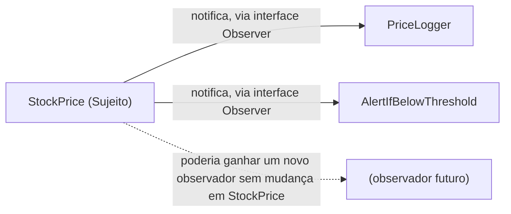

## Objetivos de Aprendizagem

- Definir um padrão de design como uma solução nomeada, reutilizável, para um problema de design recorrente, não um pedaço de código para copiar-colar.
- Explicar o problema recorrente que o padrão Strategy resolve e como alcança acoplamento baixo encapsulando um algoritmo intercambiável atrás de uma interface comum.
- Explicar o problema recorrente que o padrão Observer resolve e como permite que um objeto notifique vários dependentes sem conhecer seus tipos concretos.
- Reconhecer quando introduzir um padrão é justificado por um problema recorrente genuíno versus quando adicionaria indireção desnecessária.

## Contexto e Motivação

Acoplamento e coesão deram dois medidores para julgar a qualidade de um design, e uma forma de identificar quando um design os estava falhando, uma classe Deus, dois módulos alcançando os internos um do outro. O que esses conceitos não deram foi um *vocabulário* para as boas soluções uma vez que você as encontra. Dois engenheiros que ambos independentemente descobriram "encapsule um algoritmo intercambiável atrás de uma interface comum para que o chamador não precise saber qual está rodando" descobriram, em um sentido real, a mesma ideia, mas sem um nome compartilhado para ela, vão descrevê-la diferentemente, discordar em revisão de código sem se entender, e reinventar versões ligeiramente incompatíveis dela projeto após projeto.

Padrões de design existem para fechar essa lacuna. Um padrão de design é uma **solução nomeada, reutilizável, para um problema que recorre através de muitos programas diferentes**, não uma biblioteca específica, não um bloco de código para ser copiado, mas uma *forma* de solução que é reimplementada, de qualquer forma que se encaixe na linguagem e situação em questão, toda vez que o mesmo problema subjacente aparece de novo. Essa é a distinção crucial na qual o termo é mais frequentemente mal entendido: um padrão não é algo que você `importa`; é algo que você reconhece uma necessidade para, e depois escreve, ajustado à sua situação exata. A referência seminal para esse vocabulário é o livro "Gang of Four" de 1994 (Gamma, Helm, Johnson, Vlissides), e sua contribuição duradoura não foi inventar essas soluções do zero, a maioria já estava em uso, mas dar a cada uma um nome, um enunciado claro do problema que resolve, e uma comparação com suas alternativas próximas, para que "vamos usar um Strategy aqui" se tornasse uma frase que uma equipe inteira poderia entender instantaneamente.

Este conceito cobre exatamente dois padrões, em profundidade real, em vez de pesquisar dezenas superficialmente, deliberadamente, porque o objetivo aqui é entender a *ideia* de um padrão (problema recorrente, forma de solução nomeada, aplicada de novo cada vez) bem o suficiente para reconhecer os próximos cinquenta padrões que você encontrar no trabalho, não memorizar um catálogo. Ambos os padrões escolhidos, Strategy e Observer, também são, não por coincidência, aplicações extremamente diretas, concretas do princípio de acoplamento e coesão recém-coberto: cada um é uma receita específica, bem conhecida, para manter acoplamento baixo em uma situação recorrente particular.

## Teoria Central

### O que um padrão é, e não é

Um padrão de design tem três partes, sempre: (1) um **problema recorrente**, uma situação que aparece de novo e de novo através de programas de outra forma não relacionados; (2) uma **forma de solução nomeada**, uma descrição de como estruturar classes e suas relações para resolver bem aquele problema; e (3) **consequências**, as trocas que vêm com usá-lo (o que fica mais fácil, o que fica mais difícil). Crucialmente, um padrão *não é* uma classe, função, ou arquivo específico que você pode entregar a alguém, é um modelo para uma relação entre um pequeno número de papéis (por exemplo, "um contexto," "uma família de estratégias intercambiáveis") que é instanciado diferentemente em toda base de código que o usa. Duas implementações do padrão Strategy em dois projetos diferentes podem compartilhar zero linhas de código e ainda assim ambas corretamente serem "o padrão Strategy," porque o que torna algo uma instância do padrão é a forma da relação entre suas partes, não seu texto literal, exatamente no mesmo sentido em que um TAD é definido por seu contrato em vez de por qualquer implementação única.

### O padrão Strategy: encapsulando um algoritmo intercambiável

**O problema recorrente:** um pedaço de código precisa realizar alguma tarefa (ordenar, calcular um desconto, validar entrada) de uma entre várias formas intercambiáveis, e a forma específica precisa ser selecionável, em tempo de configuração, em tempo de execução, ou por chamada, sem que o código chamador precise saber qual está usando, e sem uma longa cadeia de ramos `if/elif` espalhados pelo chamador escolhendo entre elas.

**A forma da solução:** defina uma interface comum para "o algoritmo" (um único método, tipicamente), implemente cada variante intercambiável como sua própria classe satisfazendo aquela interface, e faça o código chamador ("o contexto") manter uma referência para *algum* implementador daquela interface, chamando-o sem jamais verificar qual concreto tem.

```python
from abc import ABC, abstractmethod

# A interface comum que toda estratégia deve satisfazer
class DiscountStrategy(ABC):
    @abstractmethod
    def apply(self, price: float) -> float:
        ...

class NoDiscount(DiscountStrategy):
    def apply(self, price):
        return price

class PercentageOff(DiscountStrategy):
    def __init__(self, percent):
        self._percent = percent
    def apply(self, price):
        return price * (1 - self._percent / 100)

class FlatAmountOff(DiscountStrategy):
    def __init__(self, amount):
        self._amount = amount
    def apply(self, price):
        return max(0, price - self._amount)

# O contexto: mantém *uma* estratégia, nunca verifica qual
class Checkout:
    def __init__(self, discount_strategy: DiscountStrategy):
        self._discount_strategy = discount_strategy

    def final_price(self, price: float) -> float:
        return self._discount_strategy.apply(price)

# Selecionar uma estratégia é o único lugar que nomeia uma classe concreta
checkout = Checkout(PercentageOff(10))
print(checkout.final_price(100.0))   # 90.0
```

`Checkout` está acoplado só à interface `DiscountStrategy`, nunca especificamente a `PercentageOff` ou `FlatAmountOff`, uma nova regra de desconto é uma nova classe satisfazendo a mesma interface, adicionada sem tocar `Checkout` de forma alguma. Isso é acoplamento e coesão tornado concreto: acoplamento baixo (contexto depende de uma interface, não de um algoritmo concreto) e coesão alta (cada classe de estratégia tem exatamente uma razão para mudar, sua própria regra).

### O padrão Observer: notificando dependentes de uma mudança de estado

**O problema recorrente:** o estado de um objeto muda, e um conjunto aberto, possivelmente mudando, de outros objetos precisa reagir àquela mudança, sem que o primeiro objeto precise saber, no momento em que é escrito, exatamente quem são esses dependentes ou quantos haverá.

**A forma da solução:** o objeto cujo estado muda (o "sujeito") mantém uma lista de "observadores" registrados, cada um satisfazendo uma interface de notificação comum; quando o estado do sujeito muda, chama aquele mesmo método de notificação em todo observador registrado, por sua vez, sem saber ou se importar com o que cada um faz com a notificação.

```python
from abc import ABC, abstractmethod

class Observer(ABC):
    @abstractmethod
    def on_price_changed(self, new_price: float) -> None:
        ...

class Subject:
    def __init__(self):
        self._observers: list[Observer] = []

    def subscribe(self, observer: Observer) -> None:
        self._observers.append(observer)

    def _notify_all(self, new_price: float) -> None:
        for observer in self._observers:
            observer.on_price_changed(new_price)   # não sabe ou não se importa com o que cada um faz

class StockPrice(Subject):
    def __init__(self, price: float):
        super().__init__()
        self._price = price

    def set_price(self, new_price: float) -> None:
        self._price = new_price
        self._notify_all(new_price)

# Dois observadores não relacionados, adicionados sem o código de StockPrice mudar
class PriceLogger(Observer):
    def on_price_changed(self, new_price):
        print(f"logged: price is now {new_price}")

class AlertIfBelowThreshold(Observer):
    def __init__(self, threshold):
        self._threshold = threshold
    def on_price_changed(self, new_price):
        if new_price < self._threshold:
            print("ALERT: price dropped below threshold!")

stock = StockPrice(100.0)
stock.subscribe(PriceLogger())
stock.subscribe(AlertIfBelowThreshold(90.0))
stock.set_price(85.0)
# logged: price is now 85.0
# ALERT: price dropped below threshold!
```

`StockPrice` nunca menciona `PriceLogger` ou `AlertIfBelowThreshold` pelo nome, um terceiro observador pode ser adicionado depois com zero mudanças em `StockPrice`. Este é exatamente o ganho de acoplamento baixo de novo: o sujeito depende só da interface `Observer`, e o conjunto de observadores concretos é livre para crescer ou mudar independentemente do próprio código do sujeito.



### Reconhecendo quando um padrão é justificado

Um padrão é justificado quando o *problema recorrente* que resolve está genuinamente presente, algoritmos intercambiáveis que realmente precisam variar (Strategy), ou um conjunto genuinamente aberto, mudando, de dependentes que precisam ser notificados (Observer), não meramente porque o nome do padrão soa sofisticado. Introduzir uma hierarquia Strategy completa para um único algoritmo que nunca terá uma segunda variante adiciona uma camada de indireção (uma interface, uma classe, um ponto de injeção) que não compra nada; um único `if/else` teria sido a solução mais simples, mais honesta. Padrões são uma resposta a uma forma real, recorrente, de problema, não um padrão estilístico para recorrer a em todo lugar, esse é precisamente o mesmo julgamento já exigido por ocultação de informação (esconda só decisões que plausivelmente mudam) aplicado a uma unidade de design um pouco maior.

## Exemplos Resolvidos

### Exemplo 1 — Strategy aplicado à ordem de ordenação

**Problema:** Uma ferramenta de relatórios precisa ordenar uma lista de registros por critérios diferentes (por data, por valor, por nome de cliente) dependendo de qual relatório é pedido, e novos critérios de ordenação são adicionados periodicamente conforme novos tipos de relatório são pedidos.

```python
from abc import ABC, abstractmethod

class SortStrategy(ABC):
    @abstractmethod
    def key(self, record):
        ...

class ByDate(SortStrategy):
    def key(self, record):
        return record["date"]

class ByAmount(SortStrategy):
    def key(self, record):
        return record["amount"]

class Reporter:
    def __init__(self, sort_strategy: SortStrategy):
        self._sort_strategy = sort_strategy

    def generate(self, records):
        return sorted(records, key=self._sort_strategy.key)

records = [{"date": "2026-01-01", "amount": 50}, {"date": "2025-06-01", "amount": 10}]
print(Reporter(ByDate()).generate(records))
print(Reporter(ByAmount()).generate(records))
```

**Raciocínio.** `Reporter.generate` não tem nenhum ramo sobre qual critério foi pedido, delega inteiramente a qualquer `SortStrategy` que recebeu. Um novo relatório ordenado "por nome de cliente" é uma nova subclasse de `SortStrategy`, adicionada sem tocar `Reporter`, combinando exatamente com o problema recorrente: um algoritmo intercambiável (a chave de ordenação) selecionado sem que o chamador (`Reporter`) precise saber qual.

### Exemplo 2 — Observer aplicado a uma atualização estilo interface de usuário

**Problema:** Um `TemperatureSensor` lê um novo valor periodicamente, e tanto um `Display` (mostra a leitura atual) quanto um `Logger` (escreve toda leitura em um arquivo) precisam reagir sempre que uma nova leitura chega, com mais reatores esperados depois (por exemplo, um sistema de alerta).

```python
class Observer(ABC):
    @abstractmethod
    def on_reading(self, value):
        ...

class TemperatureSensor:
    def __init__(self):
        self._observers = []
    def subscribe(self, observer):
        self._observers.append(observer)
    def new_reading(self, value):
        for obs in self._observers:
            obs.on_reading(value)

class Display(Observer):
    def on_reading(self, value):
        print(f"Display: {value}°C")

class Logger(Observer):
    def on_reading(self, value):
        print(f"Logger: recorded {value}°C")

sensor = TemperatureSensor()
sensor.subscribe(Display())
sensor.subscribe(Logger())
sensor.new_reading(21.5)
```

**Raciocínio.** `TemperatureSensor` nunca nomeia `Display` ou `Logger`, adicionar o sistema de alerta mencionado no problema é uma terceira subclasse de `Observer` e uma chamada `subscribe()`, com zero mudanças no próprio código de `TemperatureSensor`, que é exatamente o problema de conjunto-aberto-de-dependentes que Observer é destinado a resolver.

## Equívocos Comuns e Armadilhas

- **"Um padrão de design é uma biblioteca ou classe específica que eu importo."** Strategy e Observer acima são *formas*, reimplementadas do zero em toda base de código que precisa deles; não há um "Strategy.py" canônico para importar, o que é reutilizado é a ideia da relação entre papéis (contexto e estratégia; sujeito e observador), não código literal.
- **"Usar mais padrões torna o código melhor projetado."** Um padrão aplicado onde seu problema recorrente não de fato existe adiciona indireção (classes extras, uma interface, um ponto de injeção) sem comprar a flexibilidade que aquela indireção é destinada a comprar, recorra a um padrão porque o problema está presente, não porque o padrão é bem conhecido.
- **"Observer e Strategy são basicamente a mesma coisa já que ambos usam uma interface e uma classe implementando-a."** Resolvem problemas diferentes: Strategy é sobre *selecionar um* algoritmo intercambiável para rodar; Observer é sobre *notificar muitas* partes interessadas de um evento. A forma interface-mais-implementador é maquinário comum, mas o número de participantes e a direção do controle diferem (Strategy: contexto escolhe uma estratégia e a chama; Observer: sujeito chama todos os observadores inscritos).
- **"Já que o livro Gang of Four nomeou esses padrões, padrões são estáticos e fixos para sempre."** Novos problemas recorrentes continuam produzindo novos padrões nomeados em toda a indústria (por exemplo, padrões específicos para sistemas concorrentes ou distribuídos); o catálogo de 1994 foi um instantâneo dos padrões orientados a objetos conhecidos naquele momento, não uma lista exaustiva ou final.

## Resumo

Um padrão de design é uma solução nomeada, reutilizável, para um problema que recorre através de muitos programas, um vocabulário compartilhado para uma forma de solução, não código para copiar-colar, já que o mesmo padrão é independentemente reimplementado toda vez que seu problema recorre. Strategy resolve o problema de um algoritmo intercambiável precisando variar sem que o código chamador saiba qual variante está ativa, colocando cada variante atrás de uma interface comum da qual o chamador depende em vez de qualquer implementação concreta. Observer resolve o problema de um conjunto aberto, mudando, de dependentes precisando reagir à mudança de estado de um objeto, fazendo aquele objeto notificar todo dependente registrado através de uma interface comum sem saber o que qualquer um deles faz. Ambos os padrões são, concretamente, o princípio de acoplamento e coesão aplicado a uma situação recorrente específica, que é exatamente por que padrões valem a pena aprender uma vez que os dois medidores daquele conceito já são entendidos, e por que reconhecer o problema subjacente, não o nome do padrão, é o que deveria guiar se recorrer a um.

## Documentation Links

- [ACM/IEEE CS2013 — Software Engineering Knowledge Area](https://csed.acm.org/knowledge-areas-software-engineering-se-cs2013-version/) — doc
- [MIT 6.031 Spring 2017 — Course Site (lecture list)](http://web.mit.edu/6.031/www/sp17/) — doc
