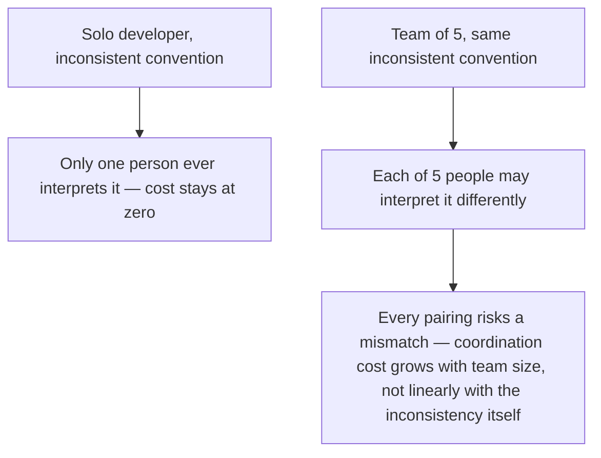

## Learning Objectives

- Explain why practices like commit hygiene, code review, and branching conventions matter more, not just proportionally more, once more than one person touches the same code.
- Identify a coordination cost that only exists at team scale, and describe why a solo developer never has to pay it.
- Trace a concrete example of an inconsistency (commit style, branch naming) from a harmless solo habit into a genuine team-level cost.
- Distinguish "keeping something in your own head" from "keeping something in a shared, explicit convention," and explain why only the latter scales past one person.
- Recognize when a small team should start investing deliberately in shared conventions, rather than waiting until coordination problems have already appeared.

## Context & Motivation

Every practice covered across this discipline so far — commit hygiene, feature branches, code review, refactoring backed by tests — has a version that a single developer, working entirely alone, can adopt or skip more or less at their own discretion, with consequences that stay contained to that one person. A solo developer who writes terse commit messages, branches inconsistently, and never has anyone review their code is not violating any rule that costs someone else anything; whatever confusion that habit causes belongs entirely to that one person, and it lives entirely inside a context they already hold in their own head.

The moment more than one person is working against the same codebase, this changes in a way that is easy to underestimate if it's framed as merely "the same practices, just scaled up." It is not simply that the same inconsistency now happens more often because there are more contributors — it's that the inconsistency now has to be reconciled *across* people who each have their own private mental model of how the project works, and no single person's head contains the whole picture anymore. A convention that one developer can keep entirely as an unstated habit works fine precisely because there's only one person who ever needs to interpret it. The instant a second person joins, that unstated habit either has to become an explicit, shared convention everyone follows the same way, or it becomes a source of friction every time someone runs into a case the previous person handled differently, for no documented reason.

This is exactly the point ACM/IEEE's CS2013 software-engineering guidelines and MIT's own construction materials make when they treat individual and team software process as genuinely distinct topics rather than the same material at different scale: the practices don't merely need to happen more often as a team grows — several of them, like clear commit messages and consistent branch naming, exist almost entirely *because* more than one person is involved, and would have comparatively little value if a project would truly never be touched by anyone but its original author.

## Core Theory

### Why team scale is a qualitative shift, not just a bigger number

A solo developer's mental model of a codebase is, in an important sense, the entire specification of how that codebase's conventions work — if they always name feature branches a certain way, they don't need that convention written down anywhere, because the one person who ever has to interpret a branch name is the same person who created it, with full context already in their head. Once a second developer starts creating branches too, this stops being true: two different people are now each relying on their own private understanding of what a branch name should mean, formed independently, with no guarantee those two understandings match. The inconsistency was always there in principle — a solo developer's naming habit might genuinely have been arbitrary or inconsistent across time — but it never had to be reconciled against anyone else's differing assumption, because there wasn't anyone else's assumption to reconcile it against.

### Coordination cost: a cost that doesn't exist at all for one person

The specific new cost that appears at team scale is coordination cost: time spent not writing code, not designing a solution, but figuring out what someone else meant, or what convention actually applies, or which of several inconsistent patterns already in the codebase should be followed for a new piece of work. This cost scales worse than linearly with team size, because it isn't just "one inconsistency, experienced by more people" — it's every pair of contributors potentially interpreting a missing convention differently, and every new contributor having to reconcile against whichever inconsistent patterns previous contributors already left behind. A team of five, each with their own slightly different assumption about how commits should be described or how branches should be named, produces a combinatorially larger space of possible mismatches than the same five inconsistencies would if only one person ever had to interpret them.



### Shared convention as the fix, and why it has to be explicit

The fix at team scale is not "everyone should just be more careful" — care doesn't resolve a case where two people genuinely, reasonably interpreted an unstated rule two different ways, since neither was wrong given what they actually had to go on. The fix is making the convention explicit and shared: written down, or enforced by tooling, so that every contributor is working from the same understanding rather than their own private inference. This is precisely why several practices already covered in this discipline — commit hygiene's insistence on a message explaining *why*, feature branches named according to an agreed pattern, code review as a checkpoint where a shared standard gets applied consistently rather than left to each author's individual judgment — matter disproportionately more at team scale: their entire value proposition is coordinating multiple independent people's understanding, which is a need that simply doesn't arise when there's only ever been one person's understanding to begin with.

### When to start investing in shared conventions

A useful, honest answer is: before the coordination cost has already become visible as friction, not after. A team of two can sometimes get away with entirely informal, unstated conventions for a while, because two people's assumptions happen to align often enough not to cause visible problems — but this tends to break down precisely at the point a team crosses from "small enough that everyone's assumptions have converged by accident" to "large enough that they haven't," and that transition rarely announces itself clearly in advance. Investing early in explicit, shared conventions — even before problems have visibly appeared — is cheaper than reconstructing consistency after several contributors have already built up their own divergent habits that now have to be reconciled retroactively.

## Worked Examples

### Example 1 — inconsistent commit messages, harmless solo, costly at team scale

**Solo developer, working alone for a year:**
```
git log --oneline
a1b2c3d fixed the bug
e4f5g6h wip
h7i8j9k added the thing
k1l2m3n more fixes
```

None of these messages explain *why* any change was made, and their style is completely inconsistent — but this developer wrote every one of them, remembers the context behind each, and has never once needed the message itself to reconstruct what happened, because their own memory has always filled in the gap. The inconsistency exists, but it costs this one person nothing measurable.

**The same habit, now on a team of five, six months in:**
```
git log --oneline
a1b2c3d fixed the bug            (Developer A)
e4f5g6h wip                        (Developer B)
h7i8j9k added the thing            (Developer C)
k1l2m3n more fixes                  (Developer A)
p5q6r7s changes                     (Developer D)
```

Developer E, newly joined, needs to understand why a specific line in the payment module looks the way it does, and turns to `git blame` and the commit history for context — exactly the situation commit-hygiene's earlier concept describes as the entire point of a good commit message. Every message here fails to answer the question. Developer E has no memory to fall back on (they weren't there when any of these changes were made), and neither, six months later, do Developers A through D reliably remember the specific reasoning behind "fixed the bug" or "more fixes" written months ago about code they've since moved on from. What cost the solo developer nothing now costs the team real time, repeatedly, every time anyone needs to understand a piece of history nobody documented clearly — and the cost compounds with every new person who joins and hits the same wall.

### Example 2 — inconsistent branch naming, and the confusion it causes across five contributors

**Scenario:** without an agreed convention, five developers on the same team each independently settle into their own personal branch-naming habit:

```
alice-fix-login-bug
bob/checkout-refactor
JIRA-4821
carla_add_search
feature/dave-notifications
```

A sixth developer, tasked with reviewing what's currently in progress across the team, has no reliable way to tell from the branch names alone which of these are feature branches, which are bug fixes, which correspond to a tracked ticket, or which are safe to delete because the work already merged. Each name made complete sense to the person who created it, in isolation — exactly the way a solo developer's own naming habit always makes sense to that one person — but nothing about any individual name communicates its category or status to anyone else looking at the list as a whole.

**After the team agrees on an explicit, shared convention** (`<type>/<ticket-id>-<short-description>`, say):

```
fix/JIRA-4821-login-bug
refactor/JIRA-4899-checkout
feature/JIRA-5012-search
feature/JIRA-5033-notifications
```

Now any of the six team members, not just the branch's own creator, can tell at a glance what kind of work each branch represents and trace it back to its tracked ticket — the convention did the coordination work that used to depend on each individual remembering, or guessing at, someone else's private naming logic.

## Common Misconceptions & Pitfalls

- **"Team process is just individual process, done by more people."** This treats the added cost as purely additive — more people doing the same slightly-inconsistent thing — when the actual cost is combinatorial: every pair of contributors can independently mismatch on an unstated convention, which is a category of cost that provably cannot exist at all when there is only one contributor to begin with.
- **"We're a small team, so we don't need explicit conventions yet."** The transition from "small enough that assumptions happen to align" to "large enough that they don't" rarely announces itself in advance — Example 2's five inconsistent branch names came from a team that never felt the need to agree on a convention until the confusion was already visible and already costly to unwind.
- **"An inconsistency that never caused a visible problem for a solo developer is harmless."** It was never harmless in principle — it just never had anyone else's differing assumption to collide with. The instant a second contributor's own reasonable interpretation diverges from the first, the same inconsistency that cost nothing before starts costing real coordination time, as in both worked examples.
- **"Fixing team-level coordination problems is mainly about hiring more careful people."** Example 1 and Example 2's problems weren't caused by carelessness — each individual contributor's habit was internally reasonable and consistent from their own point of view. The fix is a shared, explicit convention that removes the need for anyone to guess at someone else's private logic, not an appeal to individual diligence.
- **"Once a convention is agreed on, the coordination cost problem is permanently solved."** A convention only keeps working if it stays genuinely shared as the team changes — new members joining without being brought up to speed on it, or the convention itself quietly drifting without being re-documented, can reintroduce exactly the same fragmentation the convention was adopted to prevent.

## Summary

Practices that cost a solo developer little or nothing — inconsistent commit messages, ad hoc branch names, skipping a second pair of eyes on a change — become genuinely more expensive, not merely proportionally more expensive, the moment more than one person is working against the same code, because the cost is no longer one person's occasional inconvenience but a combinatorial coordination problem between every pair of contributors each holding their own private, independently formed assumptions. A solo developer's habits live entirely in that one person's head and never have to be reconciled against anyone else's; a team's habits either become explicit, shared conventions that everyone follows the same way, or they remain a standing source of friction every time two people's private assumptions turn out not to match, as both the commit-message and branch-naming examples above show directly. The practices this discipline has already covered — clear commit messages, consistent branch naming, code review as a shared checkpoint — matter as much as they do specifically because they exist to coordinate multiple people's understanding, a need with no counterpart at all in single-developer work.

## Documentation Links

- [ACM/IEEE CS2013 — Software Engineering Knowledge Area](https://csed.acm.org/knowledge-areas-software-engineering-se-cs2013-version/) — doc
- [MIT 6.031/6.005 — Course Home (OCW)](https://ocw.mit.edu/courses/6-005-software-construction-spring-2016/) — doc
