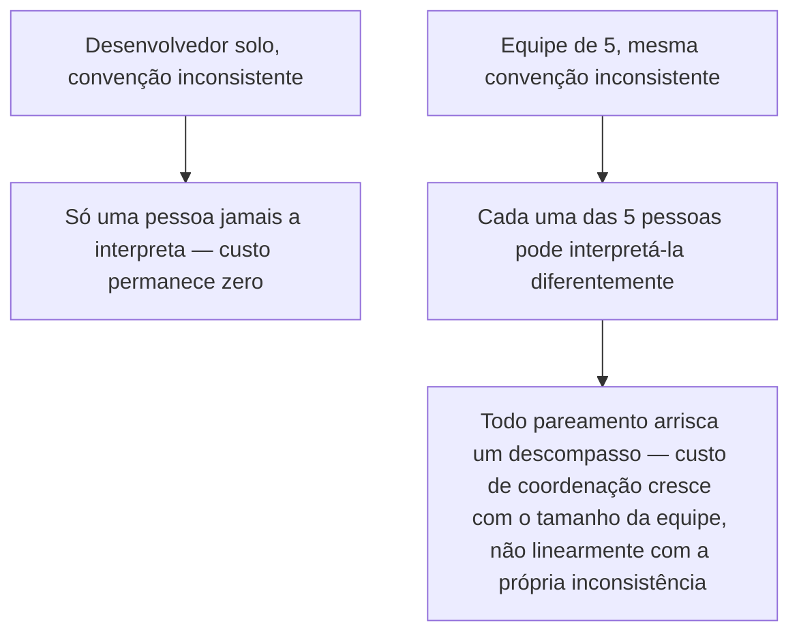

## Objetivos de Aprendizagem

- Explicar por que práticas como higiene de commit, revisão de código, e convenções de branching importam mais, não só proporcionalmente mais, uma vez que mais de uma pessoa toca o mesmo código.
- Identificar um custo de coordenação que só existe em escala de equipe, e descrever por que um desenvolvedor solo nunca tem que pagá-lo.
- Rastrear um exemplo concreto de uma inconsistência (estilo de commit, nomenclatura de branch) de um hábito solo inofensivo para um custo genuíno no nível de equipe.
- Distinguir "manter algo na sua própria cabeça" de "manter algo em uma convenção compartilhada, explícita", e explicar por que só a última escala além de uma pessoa.
- Reconhecer quando uma equipe pequena deveria começar a investir deliberadamente em convenções compartilhadas, em vez de esperar até que problemas de coordenação já tenham aparecido.

## Contexto e Motivação

Toda prática coberta através desta disciplina até agora, higiene de commit, feature branches, revisão de código, refatoração apoiada por testes, tem uma versão que um único desenvolvedor, trabalhando inteiramente sozinho, pode adotar ou pular mais ou menos a seu próprio critério, com consequências que permanecem contidas àquela única pessoa. Um desenvolvedor solo que escreve mensagens de commit curtas, faz branch inconsistentemente, e nunca tem ninguém revisando seu código não está violando nenhuma regra que custa algo a outra pessoa; qualquer confusão que aquele hábito causa pertence inteiramente a essa única pessoa, e vive inteiramente dentro de um contexto que já mantém na própria cabeça.

No momento em que mais de uma pessoa está trabalhando contra a mesma base de código, isso muda de uma forma que é fácil de subestimar se é enquadrada como meramente "as mesmas práticas, só em escala maior." Não é simplesmente que a mesma inconsistência agora acontece mais frequentemente porque há mais contribuidores, é que a inconsistência agora tem que ser reconciliada *entre* pessoas que cada uma tem seu próprio modelo mental privado de como o projeto funciona, e nenhuma única cabeça contém mais o quadro inteiro. Uma convenção que um desenvolvedor pode manter inteiramente como um hábito não enunciado funciona bem precisamente porque só há uma pessoa que jamais precisa interpretá-la. No instante em que uma segunda pessoa se junta, aquele hábito não enunciado ou tem que se tornar uma convenção explícita, compartilhada, que todo mundo segue da mesma forma, ou se torna uma fonte de atrito toda vez que alguém encontra um caso que a pessoa anterior tratou diferentemente, sem nenhuma razão documentada.

Esse é exatamente o ponto que as diretrizes de engenharia de software do CS2013 do ACM/IEEE e os próprios materiais de construção do MIT fazem quando tratam processo de software individual e de equipe como tópicos genuinamente distintos em vez do mesmo material em escala diferente: as práticas não meramente precisam acontecer com mais frequência conforme uma equipe cresce, várias delas, como mensagens de commit claras e nomenclatura de branch consistente, existem quase inteiramente *porque* mais de uma pessoa está envolvida, e teriam comparativamente pouco valor se um projeto verdadeiramente nunca fosse tocado por ninguém além de seu autor original.

## Teoria Central

### Por que escala de equipe é uma mudança qualitativa, não só um número maior

O modelo mental de um desenvolvedor solo de uma base de código é, em um sentido importante, a especificação inteira de como as convenções daquela base de código funcionam, se sempre nomeia feature branches de uma certa forma, não precisa daquela convenção escrita em lugar nenhum, porque a única pessoa que jamais tem que interpretar um nome de branch é a mesma pessoa que o criou, com contexto completo já na cabeça. Uma vez que um segundo desenvolvedor começa a criar branches também, isso para de ser verdade: duas pessoas diferentes agora cada uma confia em seu próprio entendimento privado do que um nome de branch deveria significar, formado independentemente, sem garantia de que esses dois entendimentos combinam. A inconsistência sempre esteve lá em princípio, o hábito de nomenclatura de um desenvolvedor solo poderia genuinamente ter sido arbitrário ou inconsistente através do tempo, mas nunca teve que ser reconciliada contra a suposição divergente de outra pessoa, porque não havia a suposição de outra pessoa contra a qual reconciliá-la.

### Custo de coordenação: um custo que não existe de forma alguma para uma pessoa

O novo custo específico que aparece em escala de equipe é custo de coordenação: tempo gasto não escrevendo código, não projetando uma solução, mas descobrindo o que outra pessoa quis dizer, ou qual convenção de fato se aplica, ou qual entre vários padrões inconsistentes já na base de código deveria ser seguido para um novo pedaço de trabalho. Esse custo escala pior que linearmente com o tamanho da equipe, porque não é só "uma inconsistência, experimentada por mais pessoas", é todo par de contribuidores potencialmente interpretando uma convenção faltando diferentemente, e todo novo contribuidor tendo que reconciliar contra quaisquer padrões inconsistentes que contribuidores anteriores já deixaram para trás. Uma equipe de cinco, cada um com sua própria suposição ligeiramente diferente sobre como commits deveriam ser descritos ou como branches deveriam ser nomeados, produz um espaço combinatoriamente maior de descompassos possíveis do que as mesmas cinco inconsistências produziriam se só uma pessoa jamais tivesse que interpretá-las.



### Convenção compartilhada como o conserto, e por que tem que ser explícita

O conserto em escala de equipe não é "todo mundo deveria simplesmente ser mais cuidadoso", cuidado não resolve um caso onde duas pessoas genuína, razoavelmente interpretaram uma regra não enunciada de duas formas diferentes, já que nenhuma estava errada dado o que de fato tinham para se basear. O conserto é tornar a convenção explícita e compartilhada: escrita, ou aplicada por ferramenta, para que todo contribuidor esteja trabalhando a partir do mesmo entendimento em vez de sua própria inferência privada. Isso é precisamente por que várias práticas já cobertas nesta disciplina, a insistência de higiene de commit em uma mensagem explicando *por quê*, feature branches nomeados de acordo com um padrão acordado, revisão de código como um ponto de verificação onde um padrão compartilhado é aplicado consistentemente em vez de deixado ao julgamento individual de cada autor, importam desproporcionalmente mais em escala de equipe: sua proposta de valor inteira é coordenar o entendimento de múltiplas pessoas independentes, uma necessidade que simplesmente não surge quando só jamais houve o entendimento de uma pessoa para começar.

### Quando começar a investir em convenções compartilhadas

Uma resposta útil, honesta, é: antes que o custo de coordenação já tenha se tornado visível como atrito, não depois. Uma equipe de duas às vezes pode se safar com convenções inteiramente informais, não enunciadas, por um tempo, porque as suposições de duas pessoas acontecem de se alinhar frequentemente o suficiente para não causar problemas visíveis, mas isso tende a quebrar precisamente no ponto em que uma equipe atravessa de "pequena o suficiente que as suposições de todos convergiram por acidente" para "grande o suficiente que não convergiram", e essa transição raramente se anuncia claramente antecipadamente. Investir cedo em convenções explícitas, compartilhadas, mesmo antes de problemas terem aparecido visivelmente, é mais barato que reconstruir consistência depois que vários contribuidores já acumularam seus próprios hábitos divergentes que agora têm que ser reconciliados retroativamente.

## Exemplos Resolvidos

### Exemplo 1 — mensagens de commit inconsistentes, inofensivas solo, custosas em escala de equipe

**Desenvolvedor solo, trabalhando sozinho por um ano:**
```
git log --oneline
a1b2c3d fixed the bug
e4f5g6h wip
h7i8j9k added the thing
k1l2m3n more fixes
```

Nenhuma dessas mensagens explica *por que* alguma mudança foi feita, e seu estilo é completamente inconsistente, mas esse desenvolvedor escreveu cada uma delas, lembra o contexto por trás de cada uma, e nunca uma vez precisou da própria mensagem para reconstruir o que aconteceu, porque sua própria memória sempre preencheu a lacuna. A inconsistência existe, mas não custa nada mensurável a essa única pessoa.

**O mesmo hábito, agora em uma equipe de cinco, seis meses depois:**
```
git log --oneline
a1b2c3d fixed the bug            (Desenvolvedor A)
e4f5g6h wip                        (Desenvolvedor B)
h7i8j9k added the thing            (Desenvolvedor C)
k1l2m3n more fixes                  (Desenvolvedor A)
p5q6r7s changes                     (Desenvolvedor D)
```

O Desenvolvedor E, recém-chegado, precisa entender por que uma linha específica no módulo de pagamento parece do jeito que parece, e recorre a `git blame` e o histórico de commit para contexto, exatamente a situação que o conceito anterior de higiene de commit descreve como o ponto inteiro de uma boa mensagem de commit. Toda mensagem aqui falha em responder a pergunta. O Desenvolvedor E não tem memória à qual recorrer (não estava presente quando nenhuma dessas mudanças foi feita), e nem, seis meses depois, os Desenvolvedores A a D confiavelmente lembram o raciocínio específico por trás de "fixed the bug" ou "more fixes" escrito meses atrás sobre código do qual desde então seguiram em frente. O que não custou nada ao desenvolvedor solo agora custa à equipe tempo real, repetidamente, toda vez que alguém precisa entender um pedaço de histórico que ninguém documentou claramente, e o custo se acumula com toda nova pessoa que se junta e atinge a mesma parede.

### Exemplo 2 — nomenclatura de branch inconsistente, e a confusão que causa através de cinco contribuidores

**Cenário:** sem uma convenção acordada, cinco desenvolvedores na mesma equipe cada um independentemente se estabelece em seu próprio hábito pessoal de nomenclatura de branch:

```
alice-fix-login-bug
bob/checkout-refactor
JIRA-4821
carla_add_search
feature/dave-notifications
```

Um sexto desenvolvedor, encarregado de revisar o que está atualmente em progresso através da equipe, não tem forma confiável de dizer só pelos nomes de branch quais desses são feature branches, quais são correções de bug, quais correspondem a um ticket rastreado, ou quais são seguros para deletar porque o trabalho já mesclou. Cada nome fez sentido completo para a pessoa que o criou, isoladamente, exatamente da forma que o próprio hábito de nomenclatura de um desenvolvedor solo sempre faz sentido para aquela única pessoa, mas nada sobre nenhum nome individual comunica sua categoria ou status para ninguém mais olhando a lista como um todo.

**Depois que a equipe concorda em uma convenção explícita, compartilhada** (`<tipo>/<id-do-ticket>-<descrição-curta>`, digamos):

```
fix/JIRA-4821-login-bug
refactor/JIRA-4899-checkout
feature/JIRA-5012-search
feature/JIRA-5033-notifications
```

Agora qualquer um dos seis membros da equipe, não só o próprio criador do branch, pode dizer de relance que tipo de trabalho cada branch representa e rastreá-lo de volta ao seu ticket rastreado, a convenção fez o trabalho de coordenação que costumava depender de cada indivíduo lembrando, ou adivinhando, a lógica de nomenclatura privada de outra pessoa.

## Equívocos Comuns e Armadilhas

- **"Processo de equipe é só processo individual, feito por mais pessoas."** Isso trata o custo adicionado como puramente aditivo, mais pessoas fazendo a mesma coisa ligeiramente inconsistente, quando o custo real é combinatório: todo par de contribuidores pode independentemente descompassar em uma convenção não enunciada, que é uma categoria de custo que comprovadamente não pode existir de forma alguma quando há só um contribuidor para começar.
- **"Somos uma equipe pequena, então não precisamos de convenções explícitas ainda."** A transição de "pequena o suficiente que suposições acontecem de se alinhar" para "grande o suficiente que não se alinham" raramente se anuncia antecipadamente, os cinco nomes de branch inconsistentes do Exemplo 2 vieram de uma equipe que nunca sentiu a necessidade de concordar em uma convenção até que a confusão já estivesse visível e já custosa de desfazer.
- **"Uma inconsistência que nunca causou um problema visível para um desenvolvedor solo é inofensiva."** Nunca foi inofensiva em princípio, só nunca teve a suposição divergente de outra pessoa com a qual colidir. No instante em que a própria interpretação razoável de um segundo contribuidor diverge da primeira, a mesma inconsistência que não custava nada antes começa a custar tempo de coordenação real, como em ambos os exemplos resolvidos.
- **"Consertar problemas de coordenação no nível de equipe é principalmente sobre contratar pessoas mais cuidadosas."** Os problemas do Exemplo 1 e Exemplo 2 não foram causados por descuido, o hábito de cada contribuidor individual era internamente razoável e consistente de seu próprio ponto de vista. O conserto é uma convenção compartilhada, explícita, que remove a necessidade de qualquer um adivinhar a lógica privada de outra pessoa, não um apelo à diligência individual.
- **"Uma vez que uma convenção é acordada, o problema de custo de coordenação está permanentemente resolvido."** Uma convenção só continua funcionando se permanecer genuinamente compartilhada conforme a equipe muda, novos membros se juntando sem serem atualizados sobre ela, ou a própria convenção silenciosamente derivando sem ser redocumentada, podem reintroduzir exatamente a mesma fragmentação que a convenção foi adotada para prevenir.

## Resumo

Práticas que custam pouco ou nada a um desenvolvedor solo, mensagens de commit inconsistentes, nomes de branch ad hoc, pular um segundo par de olhos em uma mudança, se tornam genuinamente mais caras, não meramente proporcionalmente mais caras, no momento em que mais de uma pessoa está trabalhando contra o mesmo código, porque o custo não é mais o inconveniente ocasional de uma pessoa mas um problema de coordenação combinatório entre todo par de contribuidores cada um mantendo suas próprias suposições privadas, independentemente formadas. Os hábitos de um desenvolvedor solo vivem inteiramente na cabeça daquela única pessoa e nunca têm que ser reconciliados contra os de outra pessoa; os hábitos de uma equipe ou se tornam convenções explícitas, compartilhadas, que todo mundo segue da mesma forma, ou permanecem uma fonte permanente de atrito toda vez que as suposições privadas de duas pessoas acabam não combinando, como tanto o exemplo de mensagem de commit quanto o de nomenclatura de branch acima mostram diretamente. As práticas que esta disciplina já cobriu, mensagens de commit claras, nomenclatura de branch consistente, revisão de código como um ponto de verificação compartilhado, importam tanto quanto importam especificamente porque existem para coordenar o entendimento de múltiplas pessoas, uma necessidade sem nenhuma contrapartida em trabalho de desenvolvedor único.

## Documentation Links

- [ACM/IEEE CS2013 — Software Engineering Knowledge Area](https://csed.acm.org/knowledge-areas-software-engineering-se-cs2013-version/) — doc
- [MIT 6.031/6.005 — Course Home (OCW)](https://ocw.mit.edu/courses/6-005-software-construction-spring-2016/) — doc
