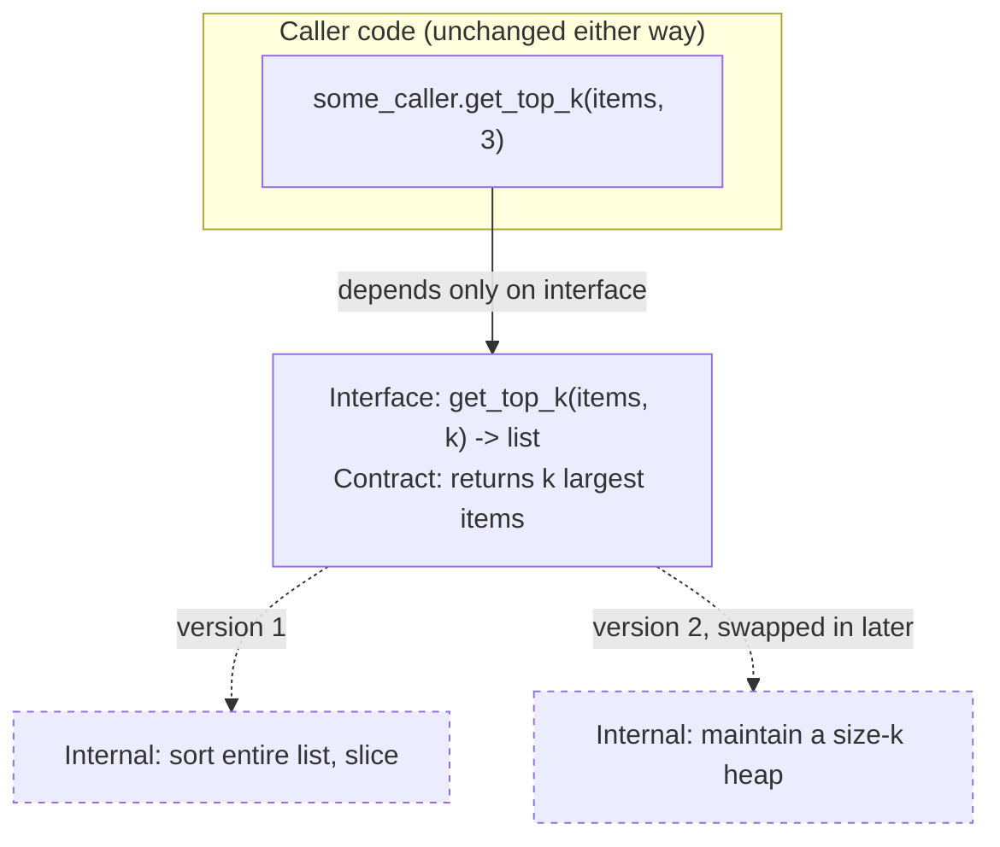

## Learning Objectives

- Distinguish a design decision that a module's interface should expose from one it should hide, and explain the criterion that separates them.
- Explain why hiding an implementation decision lets that decision change later without forcing every caller to change too.
- Identify, in a piece of code, a leaked implementation detail (e.g., a returned mutable reference to internal state) and describe the failure it causes down the line.
- Rewrite a module that leaks its representation so that its interface stays stable while its internals are free to change.

## Context & Motivation

The Abstract Data Type material earlier in this curriculum already established the mechanics of interface-versus-implementation: an ADT is a set of operations plus a behavioral contract, and a data structure is one concrete way of satisfying that contract in memory — a stack is a stack whether it's backed by an array or a linked list, as long as `push`/`pop` obey Last-In-First-Out. That earlier concept answered "what is the difference between the operations a structure supports and how it's built?" This concept asks the next question, which is a design question rather than a mechanics question: *why* does keeping that separation matter enough to organize an entire discipline of software construction around it?

The answer is information hiding, a term coined by David Parnas in his 1972 paper "On the Criteria to Be Used in Decomposing Systems into Modules," and it is worth being precise about what the idea actually claims. It is not merely "implementation details are hidden inside the module" as a matter of file organization — plenty of bad designs hide code inside a module while still exposing every decision that code makes. Information hiding is the much sharper claim that a module should be decomposed around *design decisions likely to change*, and each such decision should be hidden behind an interface that does not itself need to change when the decision does. Parnas's own example was a program that needed to hold a sequence of items — should it be a linked list or a contiguous array? Whichever way it's decided, that decision is exactly the kind of thing that later gets revisited (for performance, for memory constraints, for a new requirement), and a module boundary should be drawn so that revisiting it touches one place, not every caller in the codebase.

This is why information hiding sits downstream of the ADT material and upstream of everything else in this discipline: coupling and cohesion, covered next, are really information hiding viewed from the outside (how much does one module know about another's hidden decisions?) and from the inside (does a module's own hidden decisions belong together?) respectively. Design patterns are, in large part, named shapes for hiding particular kinds of decisions well. And architecture styles are information hiding applied at the scale of whole systems rather than single modules. Getting this one idea right early — a caller depends only on a contract, never on how that contract happens to be satisfied today — is the single habit that makes every later topic in this discipline make sense as "more of the same principle, at a different scale," rather than as a list of unrelated rules to memorize.

## Core Theory

### What counts as "a decision the caller doesn't need"

Not every internal fact about a module is a hidden secret in Parnas's sense — only the ones that are (a) genuinely internal, meaning no caller's correctness depends on knowing them, and (b) plausibly changeable, meaning a future requirement, optimization, or bug fix might need to alter them. A module's choice of which sorting algorithm it runs internally is usually such a secret: callers care that the result comes back sorted, not whether it was quicksort or mergesort. By contrast, a promise like "results are returned already sorted" is *not* a hidden secret — it is part of the interface's contract, something callers are entitled to rely on, and changing it (e.g., silently returning unsorted results) is not "changing an internal detail," it is breaking the interface.

The discipline, then, is drawing the interface line so that everything on the caller-visible side is a promise worth keeping stable, and everything on the hidden side is free to be replaced. Confusing the two — hiding something callers actually needed, or exposing something that was never meant to be relied upon — produces exactly the fragility this concept is about diagnosing.

### The mechanism: why hiding decisions enables change

The practical payoff of information hiding is a very specific one: **a module's internals can be rewritten, and the only code anywhere in the system that must also change is the module itself** — provided the interface's contract is preserved. This works because every caller was written against the contract, never against the internals, so as far as any caller can tell, nothing happened. The internal rewrite is invisible by construction, not by luck.

This is the same reasoning already seen with ADTs (an unsorted-list Bag and a sorted-list Bag are interchangeable because both satisfy the same contract), but the design-level point goes further: it is not just that *multiple* implementations can coexist behind one interface — it's that a *single* module's implementation can be replaced outright, in production, after the fact, specifically *because* nothing outside it was ever allowed to depend on how it worked. Hiding a decision is what buys the right to change your mind about it later without a system-wide rewrite.



The caller's code, and the interface it depends on, are drawn solid; the two internal strategies are drawn dashed precisely because either one can occupy that slot without the solid part ever noticing.

### The failure mode: leaking representation

The mirror image of hiding a decision well is leaking it — exposing enough of the internals that callers end up depending on facts that were never meant to be part of the contract. The single most common and most damaging way this happens in practice is a method that returns a direct, mutable reference to a module's internal state instead of a copy or a read-only view. Once that reference is in a caller's hands, the caller can — accidentally or deliberately — mutate the module's internals from outside, and worse, the caller's code now *implicitly* depends on the internal representation being exactly the mutable structure it was handed (a `list`, say), because that's the type it received and started calling methods on. If the module's maintainer later swaps that internal representation for something else, every caller holding onto the old reference's assumptions breaks — not because the *interface* changed, but because the interface was never actually protecting anything; the real boundary had already been punctured.

Information hiding, in other words, is not just about which methods a class exposes — it is also about being disciplined at every one of those method boundaries so that what crosses it is a value, or a contract-respecting view, and never a live handle into the guts of the module.

### Interfaces as the enforcement mechanism

In practice, information hiding is enforced by an explicit interface — a documented set of operations and their contracts (preconditions, postconditions, and, per the earlier ADT concept, an expected but not contractually binding complexity) — combined with language-level or convention-level access control (private fields, module boundaries, "underscore-prefixed" naming) that makes it *hard*, not merely impolite, for callers to reach past the interface into the internals. The interface is the promise; the access control is what makes the promise enforceable rather than aspirational.

## Worked Examples

### Example 1 — Swapping a representation with the interface held stable

**Problem:** A `UniqueCounter` module needs to track which items have been seen and how many unique items there are so far. Version 1 backs it with a Python list, scanning linearly for membership. Requirements later demand this scale to millions of items, so the implementation is swapped to a set — internally hashed — without changing a single caller.

```python
# --- Version 1: list-backed ---
class UniqueCounter:
    def __init__(self):
        self._seen = []          # hidden: a list, scanned linearly

    def record(self, item) -> bool:
        """Record item; return True if it was new."""
        if item in self._seen:   # O(n) membership check
            return False
        self._seen.append(item)
        return True

    def unique_count(self) -> int:
        return len(self._seen)


# --- Version 2: set-backed, same interface, same contract ---
class UniqueCounter:
    def __init__(self):
        self._seen = set()       # hidden: now a hash set, O(1) average

    def record(self, item) -> bool:
        if item in self._seen:   # O(1) average membership check
            return False
        self._seen.add(item)
        return True

    def unique_count(self) -> int:
        return len(self._seen)


# --- Caller code: identical for both versions ---
counter = UniqueCounter()
assert counter.record("apple") is True
assert counter.record("apple") is False
assert counter.unique_count() == 1
```

**Reasoning.** Every caller interacts only with `record(item)` and `unique_count()`, and both operations' contracts (record returns whether the item was new; unique_count returns how many distinct items were recorded) hold identically across both versions. The switch from a list to a set is exactly the kind of decision Parnas describes: internal, and plausibly changeable for performance reasons. Because `_seen` was never exposed, no caller anywhere needed to be touched when the representation changed — the underscore prefix is a convention signaling "this is the hidden part," and the class's only public surface is the two methods.

### Example 2 — A leak that breaks callers when the representation changes

**Problem:** The same `UniqueCounter` idea, but written to leak its internal list directly, and the consequence when that internal representation later needs to change.

```python
class LeakyCounter:
    def __init__(self):
        self.seen = []            # public attribute, not hidden at all

    def record(self, item) -> bool:
        if item in self.seen:
            return False
        self.seen.append(item)
        return True

    def unique_count(self) -> int:
        return len(self.seen)


# --- Caller code, written against the leaked list ---
counter = LeakyCounter()
counter.record("apple")
counter.record("banana")

# A caller reaches past the interface because nothing stopped it:
counter.seen.sort()                    # relies on `seen` being an ordered, sortable list
counter.seen.append("cherry")          # bypasses record()'s duplicate check entirely!
print(counter.seen[0])                 # relies on list indexing specifically
```

**Reasoning.** Three separate leaks are visible here, each fatal to a future change: the caller sorts `seen` in place (assumes it's an ordered, mutable sequence); the caller appends directly, silently corrupting the "unique" invariant `record()` was supposed to protect (now `unique_count()` may overcount, since `append` never checked for duplicates); and the caller indexes into it (assumes list semantics specifically). If `LeakyCounter` is later changed to back `seen` with a `set()` for performance — exactly the change made safely in Example 1 — every one of these caller lines breaks: sets aren't ordered the same way, don't support `.append()`, and don't support integer indexing at all. The bug is not that the internal representation changed; the bug is that the interface never actually hid it, so there was no boundary left to protect anyone.

### Example 3 — Choosing where to draw the line

**Problem:** A `Rectangle` class needs to expose its area. Two candidate designs: (A) expose `width` and `height` as public attributes and let callers compute `width * height` themselves; (B) hide `width`/`height` as internal and expose an `area()` method.

```python
# Design A: exposes the decision "area = width * height"
class RectangleA:
    def __init__(self, width, height):
        self.width = width
        self.height = height
# caller: area = rect.width * rect.height

# Design B: hides how area is computed behind an operation
class RectangleB:
    def __init__(self, width, height):
        self._width = width
        self._height = height

    def area(self):
        return self._width * self._height
# caller: area = rect.area()
```

**Reasoning.** Design A bakes the *formula* for area into every caller — harmless while the shape really is a plain rectangle, but the moment this codebase needs a `Square` subtype, a rectangle-with-rounded-corners, or a caching layer that memoizes an expensive area computation, every caller computing `width * height` inline has to be found and rewritten, because the formula was never actually the module's to own — it leaked into client code. Design B hides the formula behind `area()`; a caching version, a subtype-aware version, or a version that computes area completely differently can be substituted later, and every caller written as `rect.area()` keeps working unmodified. This is the same underlying test as Examples 1 and 2, applied to a design *choice* rather than a data-structure swap: ask "is this a decision that might change, and does the caller actually need to know it, or only need its result?" — if the caller only needs the result, hide the decision.

## Common Misconceptions & Pitfalls

- **"Information hiding just means marking fields `private`."** Access modifiers are the enforcement mechanism, not the idea itself. A class can mark every field private and still leak its representation by returning a mutable reference to that field from a public getter (`return self._items` instead of `return list(self._items)` or a read-only view) — the field is technically private, but the internal object it refers to is fully exposed the moment it's handed out.
- **"Hiding more is always better."** Hiding a decision that callers genuinely need to make correct use of the module (e.g., whether an operation is safe to call concurrently, or what its complexity is) isn't information hiding — it's an incomplete interface. The discipline is hiding decisions callers don't need, not maximizing secrecy for its own sake.
- **"This only applies to object-oriented code with classes."** Parnas's original 1972 paper predates mainstream object-oriented programming; information hiding is a module-decomposition principle that applies equally to a set of functions operating on an opaque handle in C, a package boundary, or a network service's API — "class" is just one common vehicle for it in modern languages.
- **"If I never intend to change the implementation, hiding it doesn't matter."** The value of hiding a decision is realized at the moment a change becomes necessary — a new performance requirement, a bug that needs a different algorithm, a platform change — which is very hard to predict in advance. The discipline is paid for once, up front, and cashed in exactly when it turns out to matter, which is usually not when it was written.

## Summary

Information hiding, as articulated by Parnas, is the practice of decomposing a system around decisions likely to change and hiding each such decision behind an interface that itself does not need to change when the decision does. It builds directly on the ADT material's interface-versus-implementation mechanics by supplying the design-level reason that split exists: hiding a decision the caller doesn't need is precisely what makes it possible to change that decision later — swap a list for a set, change a formula, replace an algorithm — without rewriting every caller, because callers were only ever written against the contract. The failure mode is leaking representation, most commonly by handing out a mutable reference to internal state, which quietly turns every caller into a hidden dependent of the exact internal type, so that a later, otherwise-safe change to that representation breaks code that was never supposed to know it existed. This one idea — hide the decision, expose only the contract — is the seed that the next concepts in this discipline (coupling and cohesion, design patterns, architecture styles) all grow out of at increasingly larger scales.

## Documentation Links

- [ACM/IEEE CS2013 — Software Engineering Knowledge Area](https://csed.acm.org/knowledge-areas-software-engineering-se-cs2013-version/) — doc
- [MIT 6.031 Spring 2017 — Course Site (lecture list)](http://web.mit.edu/6.031/www/sp17/) — doc
