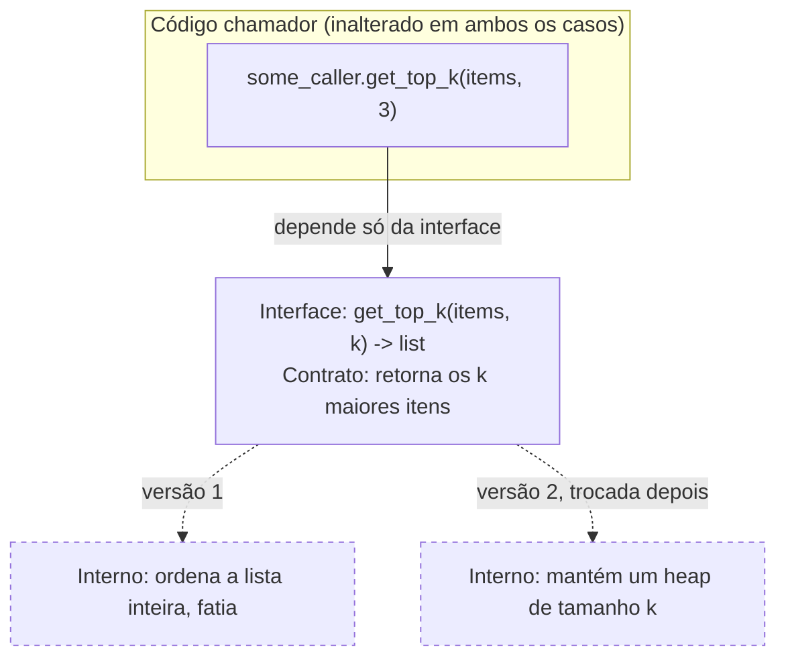

## Objetivos de Aprendizagem

- Distinguir uma decisão de design que a interface de um módulo deveria expor de uma que deveria esconder, e explicar o critério que as separa.
- Explicar por que esconder uma decisão de implementação permite que essa decisão mude depois sem forçar toda chamada a mudar também.
- Identificar, em um pedaço de código, um detalhe de implementação vazado (por exemplo, uma referência mutável retornada a estado interno) e descrever a falha que causa mais adiante.
- Reescrever um módulo que vaza sua representação de forma que sua interface permaneça estável enquanto seus internos são livres para mudar.

## Contexto e Motivação

O material de Tipo de Dado Abstrato anterior neste currículo já estabeleceu a mecânica de interface-versus-implementação: um TAD é um conjunto de operações mais um contrato comportamental, e uma estrutura de dados é uma forma concreta de satisfazer aquele contrato em memória, uma pilha é uma pilha seja apoiada por um array ou uma lista ligada, contanto que `push`/`pop` obedeçam Último-a-Entrar-Primeiro-a-Sair. Aquele conceito anterior respondeu "qual é a diferença entre as operações que uma estrutura suporta e como é construída?" Este conceito faz a próxima pergunta, que é uma pergunta de design em vez de uma pergunta de mecânica: *por que* manter essa separação importa o suficiente para organizar uma disciplina inteira de construção de software em torno dela?

A resposta é ocultação de informação, um termo cunhado por David Parnas em seu artigo de 1972 "On the Criteria to Be Used in Decomposing Systems into Modules," e vale a pena ser preciso sobre o que a ideia de fato afirma. Não é meramente "detalhes de implementação são escondidos dentro do módulo" como uma questão de organização de arquivo, muitos designs ruins escondem código dentro de um módulo enquanto ainda expõem toda decisão que aquele código faz. Ocultação de informação é a afirmação muito mais afiada de que um módulo deveria ser decomposto em torno de *decisões de design prováveis de mudar*, e cada tal decisão deveria ser escondida atrás de uma interface que ela própria não precisa mudar quando a decisão muda. O próprio exemplo de Parnas foi um programa que precisava manter uma sequência de itens, deveria ser uma lista ligada ou um array contíguo? Seja qual for a forma decidida, aquela decisão é exatamente o tipo de coisa que mais tarde é revisitada (por desempenho, por restrições de memória, por um novo requisito), e uma fronteira de módulo deveria ser traçada de forma que revisitá-la toque um lugar, não todo chamador na base de código.

É por isso que ocultação de informação fica a jusante do material de TAD e a montante de tudo mais nesta disciplina: acoplamento e coesão, cobertos em seguida, são realmente ocultação de informação vista de fora (quanto um módulo sabe sobre as decisões escondidas de outro?) e de dentro (as próprias decisões escondidas de um módulo pertencem juntas?) respectivamente. Padrões de design são, em grande parte, formatos nomeados para esconder bem tipos particulares de decisão. E estilos de arquitetura são ocultação de informação aplicada na escala de sistemas inteiros em vez de módulos únicos. Acertar essa única ideia cedo, um chamador depende só de um contrato, nunca de como aquele contrato acontece de ser satisfeito hoje, é o hábito único que faz todo tópico posterior nesta disciplina fazer sentido como "mais do mesmo princípio, em uma escala diferente", em vez de uma lista de regras não relacionadas para memorizar.

## Teoria Central

### O que conta como "uma decisão que o chamador não precisa"

Nem todo fato interno sobre um módulo é um segredo escondido no sentido de Parnas, só os que são (a) genuinamente internos, significando que a correção de nenhum chamador depende de conhecê-los, e (b) plausivelmente mudáveis, significando que um requisito futuro, otimização, ou correção de bug poderia precisar alterá-los. A escolha de um módulo de qual algoritmo de ordenação roda internamente é geralmente tal segredo: chamadores se importam que o resultado volte ordenado, não se foi quicksort ou mergesort. Em contraste, uma promessa como "resultados são retornados já ordenados" *não* é um segredo escondido, é parte do contrato da interface, algo que chamadores têm o direito de confiar, e mudá-la (por exemplo, silenciosamente retornando resultados não ordenados) não é "mudar um detalhe interno", é quebrar a interface.

A disciplina, então, é traçar a linha da interface de forma que tudo do lado visível ao chamador seja uma promessa que vale a pena manter estável, e tudo do lado escondido seja livre para ser substituído. Confundir os dois, esconder algo que chamadores de fato precisavam, ou expor algo que nunca foi destinado a ser confiado, produz exatamente a fragilidade que este conceito trata de diagnosticar.

### O mecanismo: por que esconder decisões permite mudança

O ganho prático de ocultação de informação é bem específico: **os internos de um módulo podem ser reescritos, e o único código em qualquer lugar do sistema que também deve mudar é o próprio módulo**, desde que o contrato da interface seja preservado. Isso funciona porque todo chamador foi escrito contra o contrato, nunca contra os internos, então até onde qualquer chamador pode dizer, nada aconteceu. A reescrita interna é invisível por construção, não por sorte.

Esse é o mesmo raciocínio já visto com TADs (um Bag apoiado em lista não ordenada e um Bag apoiado em lista ordenada são intercambiáveis porque ambos satisfazem o mesmo contrato), mas o ponto no nível de design vai além: não é apenas que *múltiplas* implementações podem coexistir atrás de uma interface, é que a implementação de um *único* módulo pode ser substituída completamente, em produção, depois do fato, especificamente *porque* nada fora dela foi jamais permitido depender de como funcionava. Esconder uma decisão é o que compra o direito de mudar de ideia sobre ela depois sem uma reescrita de sistema inteiro.



O código do chamador, e a interface da qual depende, são desenhados sólidos; as duas estratégias internas são desenhadas tracejadas precisamente porque qualquer uma pode ocupar aquela vaga sem que a parte sólida jamais perceba.

### O modo de falha: vazando representação

A imagem espelhada de esconder bem uma decisão é vazá-la, expor internos o suficiente para que chamadores acabem dependendo de fatos que nunca foram destinados a fazer parte do contrato. A forma única mais comum e mais danosa pela qual isso acontece na prática é um método que retorna uma referência direta, mutável, a estado interno de um módulo em vez de uma cópia ou uma visão somente leitura. Uma vez que aquela referência está nas mãos de um chamador, o chamador pode, acidental ou deliberadamente, mutar os internos do módulo de fora, e pior, o código do chamador agora *implicitamente* depende da representação interna ser exatamente a estrutura mutável que foi entregue (uma `list`, digamos), porque esse é o tipo que recebeu e começou a chamar métodos. Se o mantenedor do módulo mais tarde troca aquela representação interna por outra coisa, todo chamador segurando as suposições da referência antiga quebra, não porque a *interface* mudou, mas porque a interface nunca de fato estava protegendo nada; a fronteira real já tinha sido perfurada.

Ocultação de informação, em outras palavras, não é só sobre quais métodos uma classe expõe, é também sobre ser disciplinado em toda uma dessas fronteiras de método de forma que o que a atravessa seja um valor, ou uma visão respeitando contrato, e nunca um handle vivo para as entranhas do módulo.

### Interfaces como o mecanismo de aplicação

Na prática, ocultação de informação é aplicada por uma interface explícita, um conjunto documentado de operações e seus contratos (pré-condições, pós-condições, e, conforme o conceito de TAD anterior, uma complexidade esperada mas não contratualmente vinculante), combinado com controle de acesso no nível de linguagem ou convenção (campos privados, fronteiras de módulo, nomenclatura "prefixada com underscore") que torna *difícil*, não meramente indelicado, para chamadores alcançarem além da interface até os internos. A interface é a promessa; o controle de acesso é o que torna a promessa aplicável em vez de aspiracional.

## Exemplos Resolvidos

### Exemplo 1 — Trocando uma representação com a interface mantida estável

**Problema:** Um módulo `UniqueCounter` precisa rastrear quais itens foram vistos e quantos itens únicos existem até agora. Versão 1 o apoia com uma lista Python, varrendo linearmente por associação. Requisitos depois exigem que isso escale para milhões de itens, então a implementação é trocada para um set, internamente hasheado, sem mudar um único chamador.

```python
# --- Versão 1: apoiada em lista ---
class UniqueCounter:
    def __init__(self):
        self._seen = []          # escondido: uma lista, varrida linearmente

    def record(self, item) -> bool:
        """Registra item; retorna True se era novo."""
        if item in self._seen:   # verificação de associação O(n)
            return False
        self._seen.append(item)
        return True

    def unique_count(self) -> int:
        return len(self._seen)


# --- Versão 2: apoiada em set, mesma interface, mesmo contrato ---
class UniqueCounter:
    def __init__(self):
        self._seen = set()       # escondido: agora um hash set, O(1) em média

    def record(self, item) -> bool:
        if item in self._seen:   # verificação de associação O(1) em média
            return False
        self._seen.add(item)
        return True

    def unique_count(self) -> int:
        return len(self._seen)


# --- Código chamador: idêntico para ambas as versões ---
counter = UniqueCounter()
assert counter.record("apple") is True
assert counter.record("apple") is False
assert counter.unique_count() == 1
```

**Raciocínio.** Todo chamador interage só com `record(item)` e `unique_count()`, e os contratos de ambas as operações (record retorna se o item era novo; unique_count retorna quantos itens distintos foram registrados) valem identicamente através de ambas as versões. A troca de uma lista para um set é exatamente o tipo de decisão que Parnas descreve: interna, e plausivelmente mudável por razões de desempenho. Porque `_seen` nunca foi exposto, nenhum chamador em lugar nenhum precisou ser tocado quando a representação mudou, o prefixo underscore é uma convenção sinalizando "essa é a parte escondida", e a única superfície pública da classe são os dois métodos.

### Exemplo 2 — Um vazamento que quebra chamadores quando a representação muda

**Problema:** A mesma ideia de `UniqueCounter`, mas escrita para vazar sua lista interna diretamente, e a consequência quando aquela representação interna depois precisa mudar.

```python
class LeakyCounter:
    def __init__(self):
        self.seen = []            # atributo público, nada escondido

    def record(self, item) -> bool:
        if item in self.seen:
            return False
        self.seen.append(item)
        return True

    def unique_count(self) -> int:
        return len(self.seen)


# --- Código chamador, escrito contra a lista vazada ---
counter = LeakyCounter()
counter.record("apple")
counter.record("banana")

# Um chamador alcança além da interface porque nada o impediu:
counter.seen.sort()                    # depende de `seen` ser uma sequência ordenada, ordenável
counter.seen.append("cherry")          # contorna completamente a verificação de duplicata de record()!
print(counter.seen[0])                 # depende especificamente de indexação de lista
```

**Raciocínio.** Três vazamentos separados são visíveis aqui, cada um fatal para uma mudança futura: o chamador ordena `seen` in place (assume que é uma sequência ordenada, mutável); o chamador anexa diretamente, silenciosamente corrompendo o invariante de "único" que `record()` era pra proteger (agora `unique_count()` pode contar em excesso, já que `append` nunca verificou duplicatas); e o chamador indexa nela (assume semântica de lista especificamente). Se `LeakyCounter` é depois mudado para apoiar `seen` com um `set()` por desempenho, exatamente a mudança feita com segurança no Exemplo 1, toda uma dessas linhas de chamador quebra: sets não são ordenados da mesma forma, não suportam `.append()`, e não suportam indexação inteira de forma alguma. O bug não é que a representação interna mudou; o bug é que a interface nunca de fato a escondeu, então não sobrou nenhuma fronteira para proteger ninguém.

### Exemplo 3 — Escolhendo onde traçar a linha

**Problema:** Uma classe `Rectangle` precisa expor sua área. Dois designs candidatos: (A) expor `width` e `height` como atributos públicos e deixar chamadores calcularem `width * height` eles próprios; (B) esconder `width`/`height` como interno e expor um método `area()`.

```python
# Design A: expõe a decisão "area = width * height"
class RectangleA:
    def __init__(self, width, height):
        self.width = width
        self.height = height
# chamador: area = rect.width * rect.height

# Design B: esconde como area é calculada atrás de uma operação
class RectangleB:
    def __init__(self, width, height):
        self._width = width
        self._height = height

    def area(self):
        return self._width * self._height
# chamador: area = rect.area()
```

**Raciocínio.** Design A embute a *fórmula* para área em todo chamador, inofensivo enquanto a forma realmente é um retângulo simples, mas no momento em que esta base de código precisa de um subtipo `Square`, um retângulo-com-cantos-arredondados, ou uma camada de cache que memoiza um cálculo de área caro, todo chamador calculando `width * height` inline tem que ser encontrado e reescrito, porque a fórmula nunca foi de fato do módulo possuir, vazou para código cliente. Design B esconde a fórmula atrás de `area()`; uma versão com cache, uma versão consciente de subtipo, ou uma versão que calcula área completamente diferente pode ser substituída depois, e todo chamador escrito como `rect.area()` continua funcionando sem modificação. Esse é o mesmo teste subjacente dos Exemplos 1 e 2, aplicado a uma *escolha* de design em vez de uma troca de estrutura de dados: pergunte "isso é uma decisão que poderia mudar, e o chamador de fato precisa saber dela, ou só precisa de seu resultado?", se o chamador só precisa do resultado, esconda a decisão.

## Equívocos Comuns e Armadilhas

- **"Ocultação de informação só significa marcar campos como `private`."** Modificadores de acesso são o mecanismo de aplicação, não a ideia em si. Uma classe pode marcar todo campo como privado e ainda vazar sua representação retornando uma referência mutável àquele campo a partir de um getter público (`return self._items` em vez de `return list(self._items)` ou uma visão somente leitura), o campo é tecnicamente privado, mas o objeto interno para o qual aponta está completamente exposto no momento em que é entregue.
- **"Esconder mais é sempre melhor."** Esconder uma decisão que chamadores genuinamente precisam para fazer uso correto do módulo (por exemplo, se uma operação é segura para chamar concorrentemente, ou qual é sua complexidade) não é ocultação de informação, é uma interface incompleta. A disciplina é esconder decisões que chamadores não precisam, não maximizar sigilo por si só.
- **"Isso só se aplica a código orientado a objetos com classes."** O artigo original de Parnas de 1972 antecede a programação orientada a objetos mainstream; ocultação de informação é um princípio de decomposição de módulo que se aplica igualmente a um conjunto de funções operando sobre um handle opaco em C, uma fronteira de pacote, ou a API de um serviço de rede, "classe" é apenas um veículo comum para isso em linguagens modernas.
- **"Se eu nunca pretendo mudar a implementação, esconder não importa."** O valor de esconder uma decisão é percebido no momento em que uma mudança se torna necessária, um novo requisito de desempenho, um bug que precisa de um algoritmo diferente, uma mudança de plataforma, o que é muito difícil de prever antecipadamente. A disciplina é paga uma vez, antecipadamente, e resgatada exatamente quando de fato importa, o que geralmente não é quando foi escrita.

## Resumo

Ocultação de informação, como articulada por Parnas, é a prática de decompor um sistema em torno de decisões prováveis de mudar e esconder cada tal decisão atrás de uma interface que ela própria não precisa mudar quando a decisão muda. Se constrói diretamente sobre a mecânica de interface-versus-implementação do material de TAD fornecendo a razão no nível de design pela qual aquela divisão existe: esconder uma decisão que o chamador não precisa é precisamente o que torna possível mudar aquela decisão depois, trocar uma lista por um set, mudar uma fórmula, substituir um algoritmo, sem reescrever todo chamador, porque chamadores só jamais foram escritos contra o contrato. O modo de falha é vazar representação, mais comumente entregando uma referência mutável a estado interno, o que silenciosamente transforma todo chamador em um dependente escondido do tipo interno exato, de forma que uma mudança posterior, de outra forma segura, àquela representação quebra código que nunca era pra saber que ela existia. Essa única ideia, esconda a decisão, exponha só o contrato, é a semente da qual os próximos conceitos nesta disciplina (acoplamento e coesão, padrões de design, estilos de arquitetura) todos crescem em escalas cada vez maiores.

## Documentation Links

- [ACM/IEEE CS2013 — Software Engineering Knowledge Area](https://csed.acm.org/knowledge-areas-software-engineering-se-cs2013-version/) — doc
- [MIT 6.031 Spring 2017 — Course Site (lecture list)](http://web.mit.edu/6.031/www/sp17/) — doc
