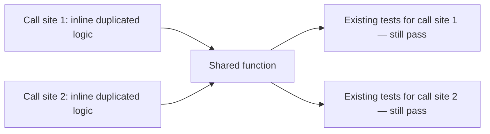

## Learning Objectives

- Define refactoring precisely: changing a program's internal structure without changing its observable behavior.
- Explain why refactoring is only safe to do with confidence when a test suite already proves the external behavior before and after the change.
- Identify a concrete refactoring opportunity — such as logic duplicated across two call sites — and describe how to eliminate it.
- Apply a refactor to a small piece of code and verify its safety by confirming existing tests still pass at every call site affected.
- Distinguish refactoring from a change that also alters behavior, even when the latter is mislabeled as "just a refactor."

## Context & Motivation

Every concept so far in this discipline that touches process — commit hygiene, code review, branching conventions — assumes the code being changed is basically working and the goal is to communicate or merge that change well. Refactoring asks a different kind of question: what happens when the code's *external* behavior is fine, but its *internal* structure has become a genuine liability — duplicated logic that has to be updated in two places every time it changes, a function that's grown so large it no longer has one clear responsibility, a design that made sense for the problem as it looked six months ago but doesn't fit how the problem actually looks now?

The precise, load-bearing definition, straight from the software-construction literature this whole discipline draws on, is this: refactoring changes a program's internal structure while leaving its observable behavior exactly the same. That second half of the definition is not a footnote — it's the entire reason refactoring is a distinct, nameable activity rather than just "rewriting code." A change that improves the internal structure but also happens to fix a bug, or add a capability, or alter what some caller receives, is not a refactor in this sense; it's a different kind of change wearing a refactor's name, and conflating the two is exactly the mistake this concept exists to prevent.

The honest, unavoidable question this definition raises is: if the behavior isn't supposed to change, how does anyone confirm that it actually didn't? The answer this discipline gives, tying directly back to the testing material covered earlier — unit, integration, and system testing, and the test suite that already proves a program's behavior against its specification — is that refactoring is only safe to do *with confidence* when a trustworthy test suite already exists covering the behavior being preserved. The tests were written, and already passed, against the code's behavior *before* the refactor; running that same suite again *after* the refactor, and seeing it still pass, is precisely the evidence that the internal restructuring didn't leak into anything externally observable. Without that pre-existing coverage, a refactor is not verifiably safe — it's a hopeful rewrite, and the two are not the same activity even when they produce identical-looking code.

## Core Theory

### Refactoring defined: internal structure, external behavior

A program's **observable behavior** is everything a caller can detect from the outside: what it returns for a given input, what side effects it has, what exceptions it raises and under what conditions. A program's **internal structure** is everything else: how many functions the logic is split across, what those functions are named, how data flows between them, whether logic is duplicated or shared. Refactoring is, by definition, a change confined entirely to the second category — the internal structure is free to be reorganized in any way at all, as long as the first category, what a caller can observe, stays provably identical.

This is a stronger and more specific claim than "the code still basically works." It means: for every input a caller might supply, the output, side effects, and exceptions after the refactor must match what they were before it, exactly — not approximately, not "close enough for the common cases." That precision is exactly what makes a pre-existing, trustworthy test suite the tool that turns "I believe this still behaves the same" into "I have specific, checkable evidence this still behaves the same."

### Why a test suite is what makes refactoring safe

Consider what happens without one. A developer restructures a function — splitting it, renaming its pieces, merging duplicated logic — believing the change is behavior-preserving because the reasoning behind it seems sound. But "the reasoning seems sound" is exactly the same kind of unverified confidence that testing, as a discipline, exists to replace with a checkable claim. Running the exact test suite that already proved the code's behavior *before* the refactor, and confirming every one of those tests still passes *after* it, is the closest thing to a formal guarantee that the observable behavior held steady across the restructuring — because those tests are, by construction, checks against exactly the behavior refactoring is supposed to preserve. If the tests were thorough enough to be trusted before the refactor, and they still pass unmodified afterward, the refactor is safe in precisely the sense this concept cares about.

This is also why a refactor attempted on code with no test suite, or a weak one, cannot be done with the same confidence: the tests that would have caught an accidental behavior change simply don't exist, so a restructuring that silently broke something has no mechanism standing between it and going unnoticed until a much later point, likely far from where the actual mistake was introduced.

### Recognizing a genuine refactoring opportunity: duplication

One of the clearest, most common refactoring opportunities is logic duplicated across two or more places — the same computation, written out independently in two functions, that has to be kept in sync by hand every time the underlying rule changes. Left alone, this kind of duplication is a standing risk: a future change to the rule applied at one call site but forgotten at the other silently produces two different behaviors where there should be one. Refactoring it means extracting the shared logic into a single implementation both call sites use, so a future change to the rule only ever needs to be made in one place — and the test suite covering both original call sites is exactly what confirms this extraction didn't alter what either of them produces.



### What refactoring is not

A change that also fixes a bug, adds a parameter, or alters what gets returned in some case is not a refactor — it's a behavior change, possibly a good one, but a different kind of change with a different safety story. Refactoring's specific guarantee — "nothing observable changed" — only applies to changes that are actually confined to internal structure; mislabeling a behavior change as "just a refactor" is exactly the mistake that undermines the confidence a test suite is supposed to provide, because now the tests passing afterward proves less than it's assumed to prove.

## Worked Examples

### Example 1 — extracting duplicated logic into a single shared implementation

**Before:** the same discount calculation is written out independently in two places — once for the web checkout flow, once for the phone-order flow.

```python
def web_checkout_total(order):
    subtotal = sum(item.price for item in order.items)
    if order.customer.is_member:
        discount = subtotal * 0.10 if subtotal > 100 else subtotal * 0.05
    else:
        discount = 0
    return subtotal - discount

def phone_order_total(order):
    subtotal = sum(item.price for item in order.items)
    if order.customer.is_member:
        discount = subtotal * 0.10 if subtotal > 100 else subtotal * 0.05
    else:
        discount = 0
    return subtotal - discount
```

**Existing tests, covering both call sites, all passing before the refactor:**
```python
assert web_checkout_total(order_member_150) == 135.0     # member, subtotal > 100 -> 10% off
assert web_checkout_total(order_member_50) == 47.5         # member, subtotal <= 100 -> 5% off
assert web_checkout_total(order_nonmember_150) == 150.0    # non-member -> no discount

assert phone_order_total(order_member_150) == 135.0
assert phone_order_total(order_member_50) == 47.5
assert phone_order_total(order_nonmember_150) == 150.0
```

**After — the shared logic extracted into one function:**
```python
def _apply_membership_discount(order):
    subtotal = sum(item.price for item in order.items)
    if not order.customer.is_member:
        return subtotal
    discount = subtotal * 0.10 if subtotal > 100 else subtotal * 0.05
    return subtotal - discount

def web_checkout_total(order):
    return _apply_membership_discount(order)

def phone_order_total(order):
    return _apply_membership_discount(order)
```

**Verifying safety:** rerunning the exact same six assertions above, unmodified, against the refactored code — all six still pass. That is the concrete evidence this was a safe refactor: both call sites, from the outside, return exactly what they returned before, for exactly the inputs already known to matter, even though the internal structure now shares one implementation instead of duplicating it. The next time the discount rule changes — say, adding a third tier — it now only needs to change inside `_apply_membership_discount`, once, instead of in two places that could silently drift apart.

### Example 2 — a change that looks like a refactor but isn't one

**Scenario:** while "refactoring" `_apply_membership_discount`, a developer notices the 5%/10% thresholds seem arbitrary and changes the lower threshold from 5% to 7%, reasoning that it's a small, reasonable improvement while they're already in the code.

```python
def _apply_membership_discount(order):
    subtotal = sum(item.price for item in order.items)
    if not order.customer.is_member:
        return subtotal
    discount = subtotal * 0.10 if subtotal > 100 else subtotal * 0.07   # was 0.05
    return subtotal - discount
```

Rerunning the existing test suite: `assert web_checkout_total(order_member_50) == 47.5` now **fails** — the function returns `46.5` instead. This failure is the test suite doing exactly its job: it caught that this was never a pure refactor to begin with, because the observable output for `order_member_50` genuinely changed. The fix here isn't to "update the test to match" without discussion — that would just be hiding a real, deliberate behavior change behind what was framed as a safe, behavior-preserving restructuring. If the discount rate genuinely should change, that's a legitimate decision, but it needs to be made and reviewed as a behavior change, with its own justification — not smuggled in under the label of a refactor, which promises the opposite.

## Common Misconceptions & Pitfalls

- **"Refactoring means rewriting the code to look better."** "Looks better" is not the criterion — the only requirement is that observable behavior stays exactly the same while internal structure changes. A rewrite that also happens to change what some caller receives, even in a way that seems like an improvement, is a different, riskier kind of change than a refactor, as Example 2 shows directly.
- **"If it still compiles and the obvious cases work, the refactor is safe."** Compiling and a few manual spot-checks are a far weaker guarantee than a full existing test suite passing unmodified — Example 2's regression would very plausibly have gone unnoticed by casual manual testing, since `order_member_50` is exactly the kind of boundary case ("subtotal <= 100") that's easy to skip when eyeballing behavior rather than running a specific, pre-written assertion against it.
- **"Refactoring without a test suite is fine as long as I'm careful."** Care is not a substitute for a checkable claim — this concept's entire premise is that "I was careful" and "I have evidence the behavior held steady" are different levels of confidence, and only the second is what makes a refactor genuinely safe rather than merely hopeful.
- **"A refactor that breaks one existing test just needs that test updated."** A failing test after a supposed refactor should first be treated as a signal that the change wasn't actually behavior-preserving — updating the test to match a new behavior without examining why it changed defeats the entire purpose of having the test catch exactly this kind of drift.
- **"Refactoring and adding a new feature can happen in the same commit, since they're both 'improving' the code."** Bundling a behavior-preserving restructuring together with an actual behavior change in one commit (echoing the commit-hygiene concept's atomic-commit principle) makes it much harder to tell, later, which part of the change was verified purely by "tests still pass" and which part was a deliberate, reviewed behavior change that needed its own scrutiny.

## Summary

Refactoring is precisely defined as changing a program's internal structure — how its logic is organized, named, and shared — while leaving its observable behavior, everything a caller can detect from the outside, exactly unchanged. That precision is what makes a pre-existing, trustworthy test suite the specific tool that turns "I believe this is still safe" into a checkable claim: running the same tests that already proved the behavior before the refactor, and seeing them all still pass afterward, is the concrete evidence the restructuring didn't leak into anything observable, as shown directly when duplicated discount logic was extracted into one shared implementation and all six existing assertions across both call sites still held. A change that also alters behavior — even a small, well-intentioned tweak made "while already in the code," as in the second worked example — is not a refactor, and a test suite catching that difference is doing exactly the job it exists to do: distinguishing a genuinely safe restructuring from a behavior change wearing a refactor's name.

## Documentation Links

- [ACM/IEEE CS2013 — Software Engineering Knowledge Area](https://csed.acm.org/knowledge-areas-software-engineering-se-cs2013-version/) — doc
- [MIT 6.031/6.005 — Course Home (OCW)](https://ocw.mit.edu/courses/6-005-software-construction-spring-2016/) — doc
