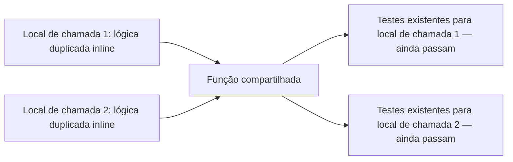

## Objetivos de Aprendizagem

- Definir refatoração precisamente: mudar a estrutura interna de um programa sem mudar seu comportamento observável.
- Explicar por que refatoração só é segura de fazer com confiança quando uma suíte de teste já prova o comportamento externo antes e depois da mudança.
- Identificar uma oportunidade de refatoração concreta, como lógica duplicada através de dois locais de chamada, e descrever como eliminá-la.
- Aplicar uma refatoração a um pequeno pedaço de código e verificar sua segurança confirmando que testes existentes ainda passam em todo local de chamada afetado.
- Distinguir refatoração de uma mudança que também altera comportamento, mesmo quando esta última é mal rotulada como "só uma refatoração."

## Contexto e Motivação

Todo conceito até agora nesta disciplina que toca em processo, higiene de commit, revisão de código, convenções de branching, assume que o código sendo mudado está basicamente funcionando e o objetivo é comunicar ou mesclar aquela mudança bem. Refatoração faz um tipo diferente de pergunta: o que acontece quando o comportamento *externo* do código está bem, mas sua estrutura *interna* se tornou uma responsabilidade genuína, lógica duplicada que tem que ser atualizada em dois lugares toda vez que muda, uma função que cresceu tão grande que não tem mais uma única responsabilidade clara, um design que fazia sentido para o problema como parecia seis meses atrás mas não combina com como o problema de fato parece agora?

A definição precisa, estrutural, direto da literatura de construção de software da qual esta disciplina inteira se baseia, é esta: refatoração muda a estrutura interna de um programa enquanto deixa seu comportamento observável exatamente o mesmo. Essa segunda metade da definição não é uma nota de rodapé, é a razão inteira pela qual refatoração é uma atividade distinta, nomeável, em vez de apenas "reescrever código." Uma mudança que melhora a estrutura interna mas também acontece de corrigir um bug, ou adicionar uma capacidade, ou alterar o que algum chamador recebe, não é uma refatoração nesse sentido; é um tipo diferente de mudança vestindo o nome de uma refatoração, e confundir os dois é exatamente o erro que este conceito existe para prevenir.

A pergunta honesta, inevitável, que essa definição levanta é: se o comportamento não é pra mudar, como alguém confirma que de fato não mudou? A resposta que esta disciplina dá, amarrando diretamente de volta ao material de teste coberto anteriormente, teste de unidade, integração, e sistema, e a suíte de teste que já prova o comportamento de um programa contra sua especificação, é que refatoração só é segura de fazer *com confiança* quando uma suíte de teste confiável já existe cobrindo o comportamento sendo preservado. Os testes foram escritos, e já passaram, contra o comportamento do código *antes* da refatoração; rodar essa mesma suíte de novo *depois* da refatoração, e vê-la ainda passar, é precisamente a evidência de que a reestruturação interna não vazou para nada externamente observável. Sem essa cobertura preexistente, uma refatoração não é comprovadamente segura, é uma reescrita esperançosa, e as duas não são a mesma atividade mesmo quando produzem código de aparência idêntica.

## Teoria Central

### Refatoração definida: estrutura interna, comportamento externo

O **comportamento observável** de um programa é tudo que um chamador pode detectar de fora: o que retorna para uma dada entrada, que efeitos colaterais tem, que exceções levanta e sob quais condições. A **estrutura interna** de um programa é tudo mais: em quantas funções a lógica é dividida, como essas funções são nomeadas, como dados fluem entre elas, se lógica é duplicada ou compartilhada. Refatoração é, por definição, uma mudança confinada inteiramente à segunda categoria, a estrutura interna é livre para ser reorganizada de qualquer forma afinal, contanto que a primeira categoria, o que um chamador pode observar, permaneça comprovadamente idêntica.

Essa é uma afirmação mais forte e mais específica que "o código ainda basicamente funciona." Significa: para toda entrada que um chamador poderia fornecer, a saída, efeitos colaterais, e exceções depois da refatoração devem combinar com o que eram antes dela, exatamente, não aproximadamente, não "próximo o suficiente para os casos comuns." Essa precisão é exatamente o que torna uma suíte de teste confiável, preexistente, a ferramenta que transforma "acredito que isso ainda se comporta da mesma forma" em "tenho evidência específica, verificável, de que isso ainda se comporta da mesma forma."

### Por que uma suíte de teste é o que torna refatoração segura

Considere o que acontece sem uma. Um desenvolvedor reestrutura uma função, dividindo-a, renomeando suas peças, mesclando lógica duplicada, acreditando que a mudança preserva comportamento porque o raciocínio por trás dela parece sólido. Mas "o raciocínio parece sólido" é exatamente o mesmo tipo de confiança não verificada que testar, como disciplina, existe para substituir por uma afirmação verificável. Rodar a exata suíte de teste que já provou o comportamento do código *antes* da refatoração, e confirmar que todo um daqueles testes ainda passa *depois* dela, é a coisa mais próxima de uma garantia formal de que o comportamento observável se manteve estável através da reestruturação, porque aqueles testes são, por construção, verificações contra exatamente o comportamento que refatoração é destinada a preservar. Se os testes eram completos o suficiente para serem confiados antes da refatoração, e ainda passam sem modificação depois, a refatoração é segura precisamente no sentido com que este conceito se importa.

Isso também é por que uma refatoração tentada em código sem nenhuma suíte de teste, ou uma fraca, não pode ser feita com a mesma confiança: os testes que teriam capturado uma mudança de comportamento acidental simplesmente não existem, então uma reestruturação que silenciosamente quebrou algo não tem nenhum mecanismo entre ela e passar despercebida até um ponto muito posterior, provavelmente longe de onde o erro real foi introduzido.

### Reconhecendo uma oportunidade de refatoração genuína: duplicação

Uma das oportunidades de refatoração mais claras, mais comuns é lógica duplicada através de dois ou mais lugares, o mesmo cálculo, escrito independentemente em duas funções, que tem que ser mantido sincronizado manualmente toda vez que a regra subjacente muda. Deixada sozinha, esse tipo de duplicação é um risco permanente: uma mudança futura na regra aplicada em um local de chamada mas esquecida no outro silenciosamente produz dois comportamentos diferentes onde deveria haver um. Refatorá-la significa extrair a lógica compartilhada em uma única implementação que ambos os locais de chamada usam, para que uma mudança futura na regra só precise ser feita em um lugar, e a suíte de teste cobrindo ambos os locais de chamada originais é exatamente o que confirma que essa extração não alterou o que qualquer um deles produz.



### O que refatoração não é

Uma mudança que também corrige um bug, adiciona um parâmetro, ou altera o que é retornado em algum caso não é uma refatoração, é uma mudança de comportamento, possivelmente uma boa, mas um tipo diferente de mudança com uma história de segurança diferente. A garantia específica de refatoração, "nada observável mudou", só se aplica a mudanças que são de fato confinadas à estrutura interna; rotular erroneamente uma mudança de comportamento como "só uma refatoração" é exatamente o erro que mina a confiança que uma suíte de teste é destinada a fornecer, porque agora os testes passando depois prova menos do que se assume que prova.

## Exemplos Resolvidos

### Exemplo 1 — extraindo lógica duplicada em uma única implementação compartilhada

**Antes:** o mesmo cálculo de desconto é escrito independentemente em dois lugares, uma vez para o fluxo de checkout web, uma vez para o fluxo de pedido por telefone.

```python
def web_checkout_total(order):
    subtotal = sum(item.price for item in order.items)
    if order.customer.is_member:
        discount = subtotal * 0.10 if subtotal > 100 else subtotal * 0.05
    else:
        discount = 0
    return subtotal - discount

def phone_order_total(order):
    subtotal = sum(item.price for item in order.items)
    if order.customer.is_member:
        discount = subtotal * 0.10 if subtotal > 100 else subtotal * 0.05
    else:
        discount = 0
    return subtotal - discount
```

**Testes existentes, cobrindo ambos os locais de chamada, todos passando antes da refatoração:**
```python
assert web_checkout_total(order_member_150) == 135.0     # membro, subtotal > 100 -> 10% off
assert web_checkout_total(order_member_50) == 47.5         # membro, subtotal <= 100 -> 5% off
assert web_checkout_total(order_nonmember_150) == 150.0    # não membro -> sem desconto

assert phone_order_total(order_member_150) == 135.0
assert phone_order_total(order_member_50) == 47.5
assert phone_order_total(order_nonmember_150) == 150.0
```

**Depois — a lógica compartilhada extraída em uma função:**
```python
def _apply_membership_discount(order):
    subtotal = sum(item.price for item in order.items)
    if not order.customer.is_member:
        return subtotal
    discount = subtotal * 0.10 if subtotal > 100 else subtotal * 0.05
    return subtotal - discount

def web_checkout_total(order):
    return _apply_membership_discount(order)

def phone_order_total(order):
    return _apply_membership_discount(order)
```

**Verificando segurança:** rerodar as mesmas exatas seis asserções acima, sem modificação, contra o código refatorado, todas as seis ainda passam. Essa é a evidência concreta de que essa foi uma refatoração segura: ambos os locais de chamada, de fora, retornam exatamente o que retornavam antes, para exatamente as entradas já conhecidas por importar, mesmo que a estrutura interna agora compartilhe uma implementação em vez de duplicá-la. Na próxima vez que a regra de desconto mudar, digamos, adicionando um terceiro nível, agora só precisa mudar dentro de `_apply_membership_discount`, uma vez, em vez de em dois lugares que poderiam silenciosamente derivar separadamente.

### Exemplo 2 — uma mudança que parece uma refatoração mas não é

**Cenário:** enquanto "refatora" `_apply_membership_discount`, um desenvolvedor nota que os limiares de 5%/10% parecem arbitrários e muda o limiar inferior de 5% para 7%, raciocinando que é uma melhoria pequena, razoável, já que está no código de qualquer forma.

```python
def _apply_membership_discount(order):
    subtotal = sum(item.price for item in order.items)
    if not order.customer.is_member:
        return subtotal
    discount = subtotal * 0.10 if subtotal > 100 else subtotal * 0.07   # era 0.05
    return subtotal - discount
```

Rerodar a suíte de teste existente: `assert web_checkout_total(order_member_50) == 47.5` agora **falha**, a função retorna `46.5` em vez disso. Essa falha é a suíte de teste fazendo exatamente seu trabalho: capturou que isso nunca foi uma refatoração pura para começar, porque a saída observável para `order_member_50` genuinamente mudou. O conserto aqui não é "atualizar o teste para combinar" sem discussão, isso seria só esconder uma mudança de comportamento real, deliberada, atrás do que foi enquadrado como uma reestruturação segura, preservando comportamento. Se a taxa de desconto genuinamente deveria mudar, essa é uma decisão legítima, mas precisa ser tomada e revisada como uma mudança de comportamento, com sua própria justificativa, não contrabandeada sob o rótulo de uma refatoração, que promete o oposto.

## Equívocos Comuns e Armadilhas

- **"Refatoração significa reescrever o código para parecer melhor."** "Parece melhor" não é o critério, o único requisito é que comportamento observável permaneça exatamente o mesmo enquanto a estrutura interna muda. Uma reescrita que também acontece de mudar o que algum chamador recebe, mesmo de uma forma que parece uma melhoria, é um tipo diferente, mais arriscado, de mudança do que uma refatoração, como o Exemplo 2 mostra diretamente.
- **"Se ainda compila e os casos óbvios funcionam, a refatoração é segura."** Compilar e algumas verificações pontuais manuais são uma garantia muito mais fraca que uma suíte de teste existente completa passando sem modificação, a regressão do Exemplo 2 muito plausivelmente teria passado despercebida por teste manual casual, já que `order_member_50` é exatamente o tipo de caso de fronteira ("subtotal <= 100") que é fácil de pular ao observar comportamento a olho em vez de rodar uma asserção específica, pré-escrita, contra ele.
- **"Refatorar sem uma suíte de teste está bem contanto que eu seja cuidadoso."** Cuidado não é substituto para uma afirmação verificável, a premissa inteira deste conceito é que "eu fui cuidadoso" e "tenho evidência de que o comportamento se manteve estável" são níveis diferentes de confiança, e só o segundo é o que torna uma refatoração genuinamente segura em vez de meramente esperançosa.
- **"Uma refatoração que quebra um teste existente só precisa que aquele teste seja atualizado."** Um teste falhando depois de uma suposta refatoração deveria primeiro ser tratado como um sinal de que a mudança não estava de fato preservando comportamento, atualizar o teste para combinar com um novo comportamento sem examinar por que mudou derrota o propósito inteiro de ter o teste capturando exatamente esse tipo de deriva.
- **"Refatorar e adicionar uma nova funcionalidade podem acontecer no mesmo commit, já que ambos estão 'melhorando' o código."** Empacotar uma reestruturação preservando comportamento junto com uma mudança de comportamento real em um commit (ecoando o princípio de commit atômico do conceito de higiene de commit) torna muito mais difícil dizer, depois, qual parte da mudança foi verificada puramente por "testes ainda passam" e qual parte foi uma mudança de comportamento deliberada, revisada, que precisava de seu próprio escrutínio.

## Resumo

Refatoração é precisamente definida como mudar a estrutura interna de um programa, como sua lógica é organizada, nomeada, e compartilhada, enquanto deixa seu comportamento observável, tudo que um chamador pode detectar de fora, exatamente inalterado. Essa precisão é o que torna uma suíte de teste confiável, preexistente, a ferramenta específica que transforma "acredito que isso ainda é seguro" em uma afirmação verificável: rodar os mesmos testes que já provaram o comportamento antes da refatoração, e vê-los todos ainda passar depois, é a evidência concreta de que a reestruturação não vazou para nada observável, como mostrado diretamente quando lógica de desconto duplicada foi extraída em uma implementação compartilhada e todas as seis asserções existentes através de ambos os locais de chamada ainda valeram. Uma mudança que também altera comportamento, mesmo um pequeno ajuste bem-intencionado feito "já que está no código", como no segundo exemplo resolvido, não é uma refatoração, e uma suíte de teste capturando essa diferença está fazendo exatamente o trabalho para o qual existe: distinguir uma reestruturação genuinamente segura de uma mudança de comportamento vestindo o nome de uma refatoração.

## Documentation Links

- [ACM/IEEE CS2013 — Software Engineering Knowledge Area](https://csed.acm.org/knowledge-areas-software-engineering-se-cs2013-version/) — doc
- [MIT 6.031/6.005 — Course Home (OCW)](https://ocw.mit.edu/courses/6-005-software-construction-spring-2016/) — doc
