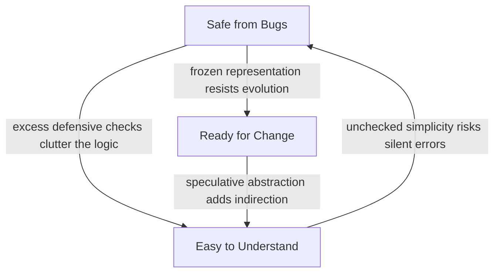

## Learning Objectives

- State MIT 6.031's three organizing objectives for software construction — Safe from Bugs (SFB), Easy to Understand (ETU), and Ready for Change (RFC) — and define each precisely.
- Evaluate a piece of code or a design decision against all three lenses simultaneously, rather than optimizing for just one.
- Explain, with a concrete example, how improving one of the three goals can actively degrade one of the others.
- Recognize that "good code" is not a single scalar quality but a balance among (at least) these three distinct, sometimes-competing dimensions.
- Apply the SFB/ETU/RFC framing as a recurring lens for evaluating design choices introduced later in this discipline.

## Context & Motivation

Every course on programming eventually has to answer the question "what makes code good?" — and most answers are vague: readable, correct, maintainable, elegant. MIT's course 6.031, *Software Construction*, refuses to leave the answer vague. From its very first lecture, the course states three explicit, named objectives that every subsequent topic — abstract data types, specifications, testing, immutability, concurrency — is deliberately calibrated against: **Safe from Bugs**, **Easy to Understand**, and **Ready for Change**. These aren't three independent checklists to satisfy one after another; they're three lenses you hold up to the same piece of code at once, and the interesting design work happens exactly where the lenses disagree.

This distinction matters because novice programmers (and plenty of experienced ones) tend to collapse "good code" into a single axis, usually "does it work right now." Code that passes today's test cases is not automatically safe from future bugs, is not automatically easy for a teammate to pick up six months from now, and is not automatically ready for the next feature request. Treating these as three separate, nameable goals — rather than one fuzzy notion of quality — makes it possible to ask sharper questions about any given piece of code: which of these three is this design choice actually serving? Which is it costing? A course built around vague notions of "good practice" produces vague intuitions; a course built around three named, examinable objectives produces engineers who can articulate *why* a particular choice is better, and along which axis.

This concept is the opening idea of the whole software-construction discipline for a reason: it is the organizing frame the rest of the material keeps returning to, the same way Jeannette Wing's four pillars of computational thinking anchor the introductory concept of that earlier discipline. Every topic that follows — writing a specification, choosing between mutable and immutable data, deciding how much defensive checking to add, designing a test suite — will be explicitly re-examined through these same three lenses. Learning to ask "safe from bugs? easy to understand? ready for change?" as a reflex, rather than memorizing isolated rules of thumb, is the single highest-leverage habit this discipline tries to install.

It's also worth being honest, up front, about what this framework is not: it is not a formula that outputs a single correct answer. It is a discipline for making the trade-offs explicit and deliberate instead of accidental. Real software construction is not about maximizing any one of the three goals in isolation — a program optimized purely for safety, with defensive checks on every input and every intermediate state independently re-verified, can become so cluttered that no one, including its author, can hold its logic in their head; a program optimized purely for flexibility, with abstraction layers anticipating every conceivable future requirement, can become so indirect that a simple change requires touching six files. The skill this framework teaches is judgment: knowing which goal matters most for a given piece of code, in a given context, and what you are willing to spend from the other two to get it.

## Core Theory

### Safe from Bugs (SFB)

A piece of code is **safe from bugs** to the extent that it behaves correctly — computing the right answer for every input it claims to handle — and continues to behave correctly as it is used, tested, and extended. Safety from bugs is not just "no known bugs today"; it is a property that comes from *how* the code is built: precise specifications that leave no ambiguity about what counts as correct behavior, defensive checks that fail loudly and immediately rather than silently corrupting state, immutable data where possible (so a value cannot be changed out from under code that's relying on it), and a test suite that actually exercises the boundaries and edge cases where bugs like to hide. Safety from bugs is as much about *preventing* future bugs — by making incorrect states impossible to represent, or immediately detectable — as it is about the absence of present ones.

### Easy to Understand (ETU)

A piece of code is **easy to understand** if another programmer — including the same programmer, returning to it after six months away — can read it and correctly reconstruct what it does and why, without needing to run it, trace through git history, or ask its author. This includes surface-level readability (naming, formatting, avoiding cleverness for its own sake) but goes well beyond it: a clear specification that states a function's contract without forcing the reader to inspect its body; a design that maps cleanly onto the problem being solved, so the code's structure mirrors the reader's mental model of the domain; comments that explain *why*, not narrate *what* the code already says. Code can be syntactically clean and still be hard to understand, if its underlying design does not match how a reader naturally thinks about the problem.

### Ready for Change (RFC)

A piece of code is **ready for change** if a reasonable, foreseeable future modification — a new feature, a changed requirement, a bug fix — can be made by touching a small, well-localized part of the system, rather than requiring a rewrite that ripples outward through everything that depends on it. Readiness for change comes from good decomposition (each module has one clear responsibility), from hiding implementation details behind stable interfaces (so callers depend on a contract, not on internals that might change), and from avoiding duplication (so a change in policy or behavior needs to be made in exactly one place). Crucially, "ready for change" does not mean "engineered to handle every conceivable future requirement" — that overreaches into speculative generality, which is its own failure mode, discussed below.

### The three goals are independent axes, and they can conflict

The genuinely important, non-obvious point MIT's own course insists on is that SFB, ETU, and RFC are not three names for the same underlying quality — they are distinct dimensions along which a design can score differently, and a choice that helps one can actively hurt another. A few concrete patterns of tension:

- **More defensive checks → safer, but sometimes harder to read.** Adding an assertion or an input-validation branch before every operation increases confidence that bugs will surface immediately rather than propagate silently — a clear win for SFB. But scatter enough of these checks through a function, especially ones re-validating conditions already guaranteed by a caller's contract, and the core logic gets buried in defensive noise, actively hurting ETU: a reader now has to mentally filter out the bookkeeping to find the actual algorithm.
- **More abstraction layers → more ready for change, but sometimes harder to read right now.** Introducing an interface with multiple implementations, or a plugin-style extension point, can make a future variation trivial to add — a win for RFC. But if that flexibility isn't needed yet, the extra indirection makes the *current*, simple case harder to trace: a reader following a single call now has to jump through an interface, a factory, and a concrete implementation to find where anything actually happens. This is the classic failure of speculative generality: optimizing RFC for a change that may never come, at a real, immediate cost to ETU.
- **Simpler, more direct code → easier to understand, but sometimes more fragile.** The most readable version of a function is often one with no defensive checks at all, doing exactly the minimal work needed — but that same simplicity can leave it exposed to silently wrong results in edge cases, at a cost to SFB.
- **Freezing a design early for stability → safer in one sense, but less ready for change.** Locking down a data representation as immutable can make it trivially safe to share across a codebase without fear of aliasing bugs (a clear SFB win), but if the domain genuinely requires that representation to evolve, immutability can make certain classes of future change more expensive to implement (a cost to RFC), since every "change" now means constructing a new value rather than mutating one in place.



None of these tensions means the three goals are opposites, or that improving one always hurts another two — plenty of design choices (writing a precise specification, for instance, previewed at the end of this section and developed fully in the next concept) genuinely serve all three goals at once with no real trade-off. The point is narrower and more useful: a designer who is only asking "is this safe?" — or only "is this readable?" — will make different, sometimes worse, decisions than one who is holding all three questions in mind and consciously choosing where the trade-off should land for this particular piece of code.

### A recurring lens, not a one-time checklist

Because these three goals recur through the rest of this discipline, it is worth previewing, briefly, how later concepts will use them. Writing a specification with an explicit precondition and postcondition (the next concept in this sequence) turns out to serve all three goals simultaneously: it is safer, because the contract becomes an explicit, testable boundary; easier to understand, because a caller can rely on the stated contract without reading the implementation; and more ready for change, because the implementation is free to change internally as long as it continues to honor the same contract. Choosing immutable data over mutable data will be evaluated the same way — what does it cost or buy along each of the three axes? Every design decision in this discipline is meant to be examined this way, not graded against a single, flattened notion of "good."

## Worked Examples

### Example 1 — a single design choice, examined through all three lenses

**Scenario.** A function computes the average of a list of numbers:

```python
def average(numbers):
    return sum(numbers) / len(numbers)
```

This is about as simple and direct as the logic can get. Examined through the three lenses:

- **Safe from Bugs?** No. If `numbers` is empty, `len(numbers)` is `0`, and the division raises `ZeroDivisionError` at runtime — a crash the caller may not have anticipated, with no advance warning in the code itself that this input is disallowed. Worse, if a caller passes a list containing a non-numeric element, the failure mode depends entirely on what `sum()` does with that element, which is not obviously signposted anywhere.
- **Easy to Understand?** Yes, almost maximally — a reader grasps the entire behavior in one line, with zero indirection.
- **Ready for Change?** Middling — the function is small enough that any future change (say, computing a weighted average) is a small, local edit. But because nothing states what `numbers` is allowed to be, a future maintainer extending this function has no documented contract to preserve; they might "fix" the empty-list case in a way that silently changes behavior for existing callers who were relying on the crash to catch a bug on their end.

Now consider a defensively rewritten version:

```python
def average(numbers):
    if numbers is None:
        raise TypeError("numbers must not be None")
    if not isinstance(numbers, list):
        raise TypeError("numbers must be a list")
    if len(numbers) == 0:
        raise ValueError("numbers must be non-empty")
    total = 0
    for n in numbers:
        if not isinstance(n, (int, float)):
            raise TypeError(f"element {n!r} is not numeric")
        total += n
    return total / len(numbers)
```

- **Safe from Bugs?** Better in one sense — every disallowed input now fails immediately and loudly, with a specific, diagnosable error, rather than propagating an ambiguous crash or a silently wrong number.
- **Easy to Understand?** Worse. The actual computation — sum divided by count — is now three lines out of eleven, buried beneath four separate validation branches. A reader has to scan past all of it to find the one line that does the real work.
- **Ready for Change?** Roughly a wash — the validation logic is itself now something a future maintainer has to keep in sync with any change to what "valid input" means, which is a small extra cost.

Neither version is unconditionally "better" — the right answer depends on context. If `average` is an internal helper called only from three places already known to pass valid, non-empty lists, the first version is the better engineering choice: the defensive checks in the second version are paying an ETU cost for an SFB benefit the calling context doesn't need. If `average` is a public function in a library used by callers the author cannot see or control, the second version's cost to ETU is worth paying for the SFB benefit of failing loudly on misuse rather than returning a wrong or crashed result somewhere far from the actual mistake. The lens doesn't hand you the answer — it makes the trade-off visible so you can decide it on purpose.

### Example 2 — readiness for change taken too far (speculative generality)

**Scenario.** A team is asked to write a function that computes sales tax for a single US state, with a flat rate.

```python
def sales_tax(price, rate=0.0825):
    return round(price * rate, 2)
```

Simple, direct, easy to understand — but a well-meaning engineer, anticipating that the company might someday operate in multiple states, multiple countries, and eventually need tiered or exempted tax categories, "future-proofs" it:

```python
class TaxStrategy:
    def compute(self, price, context):
        raise NotImplementedError

class FlatRateTaxStrategy(TaxStrategy):
    def __init__(self, rate):
        self.rate = rate
    def compute(self, price, context):
        return round(price * self.rate, 2)

class TaxStrategyFactory:
    @staticmethod
    def create(jurisdiction):
        if jurisdiction == "US-CA":
            return FlatRateTaxStrategy(0.0825)
        raise ValueError(f"unsupported jurisdiction: {jurisdiction}")

def sales_tax(price, jurisdiction="US-CA"):
    strategy = TaxStrategyFactory.create(jurisdiction)
    return strategy.compute(price, context=None)
```

- **Ready for Change?** In theory, yes — adding a new jurisdiction or a tiered tax rule now "fits" into the existing abstraction. But this is exactly the trap: none of that flexibility is needed yet, and no one knows whether the eventual real requirements (tiered rates? exemptions? rounding rules that vary by jurisdiction?) will even fit the `TaxStrategy` shape guessed at here. The abstraction was built for imagined future requirements the team cannot actually know yet.
- **Easy to Understand?** Sharply worse. A reader who wants to know "how is tax computed for a $10 item" now has to trace through a factory, an interface, and a concrete strategy class to find the one line — `price * 0.0825` — that does the actual work.
- **Safe from Bugs?** No better, and arguably worse in one respect: the `ValueError` for an unsupported jurisdiction is a new failure mode that didn't exist in the one-line version, introduced purely by the abstraction layer itself.

The lesson is not "never abstract" — it's that RFC is a goal to be spent deliberately on *known or strongly anticipated* change, not on every hypothetical future. The simple version should be preferred until an actual second jurisdiction is a real, concrete requirement — at which point the refactor is informed by real requirements rather than guesses, and far more likely to be shaped correctly.

## Common Misconceptions & Pitfalls

- **"The goal is to maximize all three simultaneously, always."** This treats SFB/ETU/RFC as a checklist to satisfy fully rather than a set of trade-offs to balance in context. Some code genuinely should sacrifice a little readability for safety (a security-critical input parser, say); other code should sacrifice a little defensive robustness for readability (a small internal helper called from exactly one place). The framework's value is in making the trade-off deliberate, not in pretending all three can always be maximized together.
- **"Adding more checks and more comments is always safer and more readable."** More validation code adds surface area that itself needs to be correct and kept in sync with the function's actual contract — and clutters the core logic a reader is trying to follow. Excess defensive code can reduce both ETU and, indirectly, SFB (a validation branch that itself has a bug is a new bug).
- **"Ready for Change means anticipating every possible future requirement."** This is the speculative-generality trap in Example 2: engineering flexibility for changes that are hypothetical, rather than for changes that are known or strongly likely, tends to cost real, immediate ETU for a hoped-for RFC benefit that may never be cashed in — and worse, may not even match the shape of whatever change actually does arrive.
- **"These three goals are really just one thing — 'quality' — described three ways."** They are measurably distinct: a function can be very easy to understand and very unsafe (the first `average` example above); very safe and very hard to change (heavily validated, deeply hard-coded logic); very ready for change and hard to understand (the tax-strategy factory). Treating them as one blurred quality obscures exactly the trade-offs this framework is designed to expose.
- **"This is just MIT's opinion — other frameworks for good code exist, so this one isn't especially rigorous."** The three goals are not a matter of personal taste; they are the explicitly documented, named organizing objective of a real course (6.031), used consistently to calibrate every subsequent topic in that course's own materials. Citing "safe/easy/ready" is citing a specific, real curricular framework, not a generic truism about clean code.

## Summary

MIT 6.031 organizes its entire treatment of software construction around three explicit, named goals: **Safe from Bugs** (the code is and stays correct), **Easy to Understand** (a reader can grasp what it does and why without running it), and **Ready for Change** (a reasonable future modification stays small and localized). These are three genuinely distinct axes, not restatements of a single "quality" — a design choice can help one while actively hurting another, as seen in defensive checks that improve safety at the cost of readability, or speculative abstraction that improves theoretical flexibility at the cost of both readability and, sometimes, safety. Good software construction is not about maximizing any one goal in isolation; it is the disciplined, deliberate practice of weighing all three for the actual context a piece of code lives in — and this three-lens habit is the frame the rest of this discipline keeps returning to, most immediately in how a precise specification turns out to serve all three goals at once.

## Documentation Links

- [MIT 6.031 — General Info & FAQ (SFB/ETU/RFC objective)](https://web.mit.edu/6.031/www/sp17/general/) — doc
- [MIT 6.031/6.005 — Course Home (OCW)](https://ocw.mit.edu/courses/6-005-software-construction-spring-2016/) — doc
