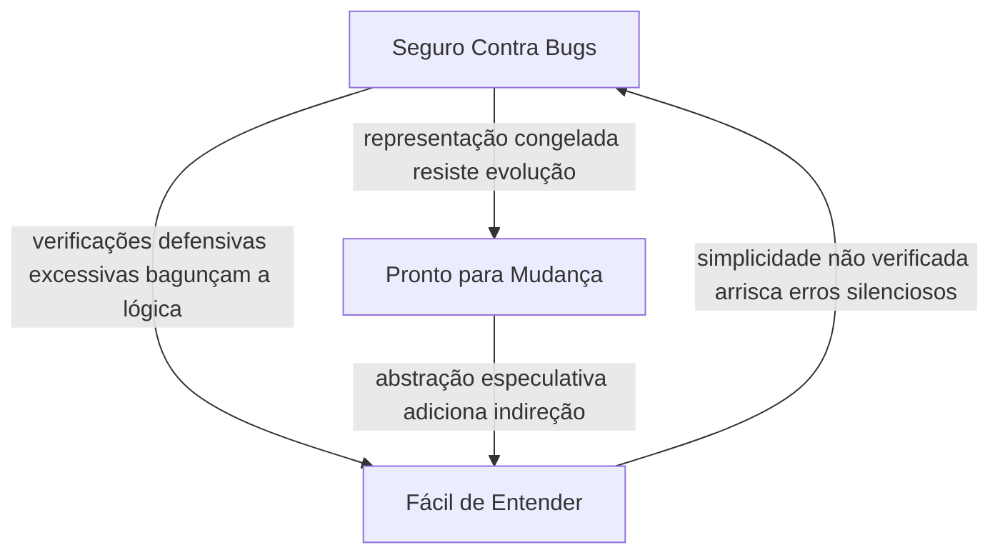

## Objetivos de Aprendizagem

- Enunciar os três objetivos organizadores do MIT 6.031 para construção de software, Seguro Contra Bugs (SFB), Fácil de Entender (ETU), e Pronto para Mudança (RFC), e definir cada um precisamente.
- Avaliar um pedaço de código ou uma decisão de design através das três lentes simultaneamente, em vez de otimizar por apenas uma.
- Explicar, com um exemplo concreto, como melhorar um dos três objetivos pode ativamente degradar um dos outros.
- Reconhecer que "código bom" não é uma única qualidade escalar mas um equilíbrio entre (pelo menos) essas três dimensões distintas, às vezes competindo.
- Aplicar o enquadramento SFB/ETU/RFC como uma lente recorrente para avaliar escolhas de design introduzidas mais tarde nesta disciplina.

## Contexto e Motivação

Todo curso sobre programação eventualmente tem que responder a pergunta "o que torna código bom?", e a maioria das respostas é vaga: legível, correto, sustentável, elegante. O curso 6.031 do MIT, *Software Construction*, se recusa a deixar a resposta vaga. Desde sua primeiríssima aula, o curso enuncia três objetivos explícitos, nomeados, contra os quais todo tópico subsequente, tipos de dados abstratos, especificações, testes, imutabilidade, concorrência, é deliberadamente calibrado: **Seguro Contra Bugs**, **Fácil de Entender**, e **Pronto para Mudança**. Esses não são três listas de verificação independentes para satisfazer uma depois da outra; são três lentes que você segura contra o mesmo pedaço de código ao mesmo tempo, e o trabalho de design interessante acontece exatamente onde as lentes discordam.

Essa distinção importa porque programadores novatos (e muitos experientes) tendem a colapsar "código bom" em um único eixo, geralmente "funciona agora mesmo." Código que passa nos casos de teste de hoje não é automaticamente seguro contra bugs futuros, não é automaticamente fácil de um colega de equipe pegar seis meses a partir de agora, e não é automaticamente pronto para o próximo pedido de funcionalidade. Tratar esses como três objetivos separados, nomeáveis, em vez de uma noção difusa de qualidade, torna possível fazer perguntas mais afiadas sobre qualquer pedaço de código dado: qual desses três essa escolha de design está de fato servindo? Qual está custando? Um curso construído em torno de noções vagas de "boa prática" produz intuições vagas; um curso construído em torno de três objetivos nomeados, examináveis, produz engenheiros que podem articular *por que* uma escolha particular é melhor, e ao longo de qual eixo.

Este conceito é a ideia de abertura da disciplina inteira de construção de software por uma razão: é o modelo organizador ao qual o resto do material continua retornando, da mesma forma que os quatro pilares de pensamento computacional de Jeannette Wing ancoram o conceito introdutório daquela disciplina anterior. Todo tópico que segue, escrever uma especificação, escolher entre dados mutáveis e imutáveis, decidir quanta verificação defensiva adicionar, projetar uma suíte de testes, será explicitamente reexaminado através dessas mesmas três lentes. Aprender a perguntar "seguro contra bugs? fácil de entender? pronto para mudança?" como um reflexo, em vez de memorizar regras práticas isoladas, é o hábito de maior alavancagem único que esta disciplina tenta instalar.

Vale a pena também ser honesto, antecipadamente, sobre o que este modelo não é: não é uma fórmula que produz uma única resposta correta. É uma disciplina para tornar as trocas explícitas e deliberadas em vez de acidentais. Construção de software real não é sobre maximizar qualquer um dos três objetivos isoladamente, um programa otimizado puramente para segurança, com verificações defensivas em toda entrada e todo estado intermediário reverificado independentemente, pode se tornar tão bagunçado que ninguém, incluindo seu autor, consegue manter sua lógica na cabeça; um programa otimizado puramente para flexibilidade, com camadas de abstração antecipando todo requisito futuro concebível, pode se tornar tão indireto que uma mudança simples exige tocar seis arquivos. A habilidade que este modelo ensina é julgamento: saber qual objetivo importa mais para um dado pedaço de código, em um dado contexto, e o que você está disposto a gastar dos outros dois para consegui-lo.

## Teoria Central

### Seguro Contra Bugs (SFB)

Um pedaço de código é **seguro contra bugs** na medida em que se comporta corretamente, calculando a resposta certa para toda entrada que afirma tratar, e continua se comportando corretamente conforme é usado, testado, e estendido. Segurança contra bugs não é apenas "nenhum bug conhecido hoje"; é uma propriedade que vem de *como* o código é construído: especificações precisas que não deixam ambiguidade sobre o que conta como comportamento correto, verificações defensivas que falham alto e imediatamente em vez de silenciosamente corromper estado, dados imutáveis onde possível (para que um valor não possa ser mudado por baixo de código que depende dele), e uma suíte de testes que de fato exercita as fronteiras e casos de borda onde bugs gostam de se esconder. Segurança contra bugs é tanto sobre *prevenir* bugs futuros, tornando estados incorretos impossíveis de representar, ou imediatamente detectáveis, quanto sobre a ausência dos presentes.

### Fácil de Entender (ETU)

Um pedaço de código é **fácil de entender** se outro programador, incluindo o mesmo programador, retornando a ele depois de seis meses ausente, pode lê-lo e reconstruir corretamente o que faz e por quê, sem precisar rodá-lo, rastrear através do histórico do git, ou perguntar ao seu autor. Isso inclui legibilidade de superfície (nomenclatura, formatação, evitar esperteza por si só) mas vai bem além disso: uma especificação clara que enuncia o contrato de uma função sem forçar o leitor a inspecionar seu corpo; um design que mapeia limpamente para o problema sendo resolvido, para que a estrutura do código espelhe o modelo mental do leitor do domínio; comentários que explicam *por quê*, não narram *o quê* o código já diz. Código pode ser sintaticamente limpo e ainda assim ser difícil de entender, se seu design subjacente não combina com como um leitor naturalmente pensa sobre o problema.

### Pronto para Mudança (RFC)

Um pedaço de código está **pronto para mudança** se uma modificação futura razoável, previsível, uma nova funcionalidade, um requisito alterado, uma correção de bug, pode ser feita tocando uma parte pequena, bem localizada do sistema, em vez de exigir uma reescrita que se propaga para fora através de tudo que depende dela. Prontidão para mudança vem de boa decomposição (cada módulo tem uma responsabilidade clara), de esconder detalhes de implementação atrás de interfaces estáveis (para que chamadores dependam de um contrato, não de internos que possam mudar), e de evitar duplicação (para que uma mudança em política ou comportamento precise ser feita em exatamente um lugar). Crucialmente, "pronto para mudança" não significa "projetado para lidar com todo requisito futuro concebível", isso ultrapassa para generalidade especulativa, que é seu próprio modo de falha, discutido abaixo.

### Os três objetivos são eixos independentes, e podem conflitar

O ponto genuinamente importante, não óbvio, que o próprio curso do MIT insiste é que SFB, ETU, e RFC não são três nomes para a mesma qualidade subjacente, são dimensões distintas ao longo das quais um design pode pontuar diferentemente, e uma escolha que ajuda uma pode ativamente prejudicar outra. Alguns padrões concretos de tensão:

- **Mais verificações defensivas → mais seguro, mas às vezes mais difícil de ler.** Adicionar uma asserção ou um ramo de validação de entrada antes de toda operação aumenta a confiança de que bugs virão à tona imediatamente em vez de se propagar silenciosamente, uma vitória clara para SFB. Mas espalhe verificações suficientes destas através de uma função, especialmente as que revalidam condições já garantidas pelo contrato de um chamador, e a lógica central fica enterrada em ruído defensivo, ativamente prejudicando ETU: um leitor agora tem que mentalmente filtrar a contabilidade para encontrar o algoritmo real.
- **Mais camadas de abstração → mais pronto para mudança, mas às vezes mais difícil de ler agora mesmo.** Introduzir uma interface com múltiplas implementações, ou um ponto de extensão estilo plugin, pode tornar uma variação futura trivial de adicionar, uma vitória para RFC. Mas se aquela flexibilidade ainda não é necessária, a indireção extra torna o caso *atual*, simples, mais difícil de rastrear: um leitor seguindo uma única chamada agora tem que pular através de uma interface, uma factory, e uma implementação concreta para encontrar onde qualquer coisa de fato acontece. Essa é a falha clássica de generalidade especulativa: otimizar RFC para uma mudança que pode nunca vir, a um custo real, imediato, para ETU.
- **Código mais simples, mais direto → mais fácil de entender, mas às vezes mais frágil.** A versão mais legível de uma função é frequentemente uma sem nenhuma verificação defensiva de forma alguma, fazendo exatamente o trabalho mínimo necessário, mas essa mesma simplicidade pode deixá-la exposta a resultados silenciosamente errados em casos de borda, a um custo para SFB.
- **Congelar um design cedo por estabilidade → mais seguro em um sentido, mas menos pronto para mudança.** Travar uma representação de dados como imutável pode torná-la trivialmente segura de compartilhar através de uma base de código sem medo de bugs de aliasing (uma vitória clara para SFB), mas se o domínio genuinamente exige que aquela representação evolua, imutabilidade pode tornar certas classes de mudança futura mais caras de implementar (um custo para RFC), já que toda "mudança" agora significa construir um novo valor em vez de mutar um in place.



Nenhuma dessas tensões significa que os três objetivos são opostos, ou que melhorar um sempre prejudica outros dois, muitas escolhas de design (escrever uma especificação precisa, por exemplo, adiantado no fim desta seção e desenvolvido por completo no próximo conceito) genuinamente servem todos os três objetivos ao mesmo tempo sem troca real. O ponto é mais estreito e mais útil: um designer que só pergunta "isso é seguro?", ou só "isso é legível?", tomará decisões diferentes, às vezes piores, do que um que mantém as três perguntas em mente e conscientemente escolhe onde a troca deveria cair para este pedaço específico de código.

### Uma lente recorrente, não uma lista de verificação única

Porque esses três objetivos recorrem através do resto desta disciplina, vale a pena adiantar, brevemente, como conceitos posteriores os usarão. Escrever uma especificação com uma pré-condição e pós-condição explícitas (o próximo conceito nesta sequência) acaba servindo aos três objetivos simultaneamente: é mais seguro, porque o contrato se torna uma fronteira explícita, testável; mais fácil de entender, porque um chamador pode confiar no contrato enunciado sem ler a implementação; e mais pronto para mudança, porque a implementação é livre para mudar internamente contanto que continue honrando o mesmo contrato. Escolher dados imutáveis sobre dados mutáveis será avaliado da mesma forma, o que isso custa ou compra ao longo de cada um dos três eixos? Toda decisão de design nesta disciplina é para ser examinada dessa forma, não classificada contra uma única noção achatada de "bom."

## Exemplos Resolvidos

### Exemplo 1 — uma única escolha de design, examinada através das três lentes

**Cenário.** Uma função calcula a média de uma lista de números:

```python
def average(numbers):
    return sum(numbers) / len(numbers)
```

Isso é tão simples e direto quanto a lógica pode ser. Examinado através das três lentes:

- **Seguro Contra Bugs?** Não. Se `numbers` está vazio, `len(numbers)` é `0`, e a divisão levanta `ZeroDivisionError` em tempo de execução, um crash que o chamador pode não ter antecipado, sem aviso antecipado no próprio código de que essa entrada é proibida. Pior, se um chamador passa uma lista contendo um elemento não numérico, o modo de falha depende inteiramente do que `sum()` faz com aquele elemento, o que não é obviamente sinalizado em lugar nenhum.
- **Fácil de Entender?** Sim, quase ao máximo, um leitor entende o comportamento inteiro em uma linha, com zero indireção.
- **Pronto para Mudança?** Mediano, a função é pequena o suficiente que qualquer mudança futura (digamos, calcular uma média ponderada) é uma edição pequena, local. Mas porque nada enuncia o que `numbers` tem permissão de ser, um futuro mantenedor estendendo esta função não tem nenhum contrato documentado para preservar; poderia "consertar" o caso de lista vazia de uma forma que silenciosamente muda comportamento para chamadores existentes que estavam confiando no crash para pegar um bug do lado deles.

Agora considere uma versão reescrita defensivamente:

```python
def average(numbers):
    if numbers is None:
        raise TypeError("numbers must not be None")
    if not isinstance(numbers, list):
        raise TypeError("numbers must be a list")
    if len(numbers) == 0:
        raise ValueError("numbers must be non-empty")
    total = 0
    for n in numbers:
        if not isinstance(n, (int, float)):
            raise TypeError(f"element {n!r} is not numeric")
        total += n
    return total / len(numbers)
```

- **Seguro Contra Bugs?** Melhor em um sentido, toda entrada proibida agora falha imediatamente e alto, com um erro específico, diagnosticável, em vez de propagar um crash ambíguo ou um número silenciosamente errado.
- **Fácil de Entender?** Pior. O cálculo real, soma dividida por contagem, agora é três linhas entre onze, enterrado sob quatro ramos de validação separados. Um leitor tem que varrer além de tudo isso para encontrar a única linha que faz o trabalho real.
- **Pronto para Mudança?** Aproximadamente empatado, a própria lógica de validação agora é algo que um futuro mantenedor tem que manter sincronizado com qualquer mudança no que "entrada válida" significa, o que é um pequeno custo extra.

Nenhuma versão é incondicionalmente "melhor", a resposta certa depende do contexto. Se `average` é um auxiliar interno chamado só de três lugares já conhecidos por passar listas válidas, não vazias, a primeira versão é a melhor escolha de engenharia: as verificações defensivas na segunda versão estão pagando um custo de ETU por um benefício de SFB que o contexto chamador não precisa. Se `average` é uma função pública em uma biblioteca usada por chamadores que o autor não pode ver ou controlar, o custo de ETU da segunda versão vale a pena pagar pelo benefício de SFB de falhar alto em mau uso em vez de retornar um resultado errado ou travado em algum lugar longe do erro real. A lente não entrega a resposta, torna a troca visível para que você a decida de propósito.

### Exemplo 2 — prontidão para mudança levada longe demais (generalidade especulativa)

**Cenário.** Uma equipe é pedida para escrever uma função que calcula imposto sobre vendas para um único estado dos EUA, com uma taxa fixa.

```python
def sales_tax(price, rate=0.0825):
    return round(price * rate, 2)
```

Simples, direto, fácil de entender, mas um engenheiro bem intencionado, antecipando que a empresa poderia algum dia operar em múltiplos estados, múltiplos países, e eventualmente precisar de categorias de imposto escalonadas ou isentas, "à prova de futuro" a torna:

```python
class TaxStrategy:
    def compute(self, price, context):
        raise NotImplementedError

class FlatRateTaxStrategy(TaxStrategy):
    def __init__(self, rate):
        self.rate = rate
    def compute(self, price, context):
        return round(price * self.rate, 2)

class TaxStrategyFactory:
    @staticmethod
    def create(jurisdiction):
        if jurisdiction == "US-CA":
            return FlatRateTaxStrategy(0.0825)
        raise ValueError(f"unsupported jurisdiction: {jurisdiction}")

def sales_tax(price, jurisdiction="US-CA"):
    strategy = TaxStrategyFactory.create(jurisdiction)
    return strategy.compute(price, context=None)
```

- **Pronto para Mudança?** Em teoria, sim, adicionar uma nova jurisdição ou uma regra de imposto escalonada agora "se encaixa" na abstração existente. Mas essa é exatamente a armadilha: nenhuma dessa flexibilidade é necessária ainda, e ninguém sabe se os eventuais requisitos reais (taxas escalonadas? isenções? regras de arredondamento que variam por jurisdição?) vão sequer se encaixar no formato `TaxStrategy` adivinhado aqui. A abstração foi construída para requisitos futuros imaginados que a equipe não pode de fato saber ainda.
- **Fácil de Entender?** Bem pior. Um leitor que quer saber "como o imposto é calculado para um item de $10" agora tem que rastrear através de uma factory, uma interface, e uma classe de estratégia concreta para encontrar a única linha, `price * 0.0825`, que faz o trabalho real.
- **Seguro Contra Bugs?** Nada melhor, e arguivelmente pior em um aspecto: o `ValueError` para uma jurisdição não suportada é um novo modo de falha que não existia na versão de uma linha, introduzido puramente pela própria camada de abstração.

A lição não é "nunca abstraia", é que RFC é um objetivo para ser gasto deliberadamente em mudança *conhecida ou fortemente antecipada*, não em toda hipótese futura. A versão simples deveria ser preferida até que uma segunda jurisdição real seja um requisito real, concreto, ponto em que o refactor é informado por requisitos reais em vez de palpites, e muito mais provável de ser moldado corretamente.

## Equívocos Comuns e Armadilhas

- **"O objetivo é maximizar os três simultaneamente, sempre."** Isso trata SFB/ETU/RFC como uma lista de verificação para satisfazer completamente em vez de um conjunto de trocas para equilibrar em contexto. Algum código genuinamente deveria sacrificar um pouco de legibilidade por segurança (um analisador de entrada crítico para segurança, digamos); outro código deveria sacrificar um pouco de robustez defensiva por legibilidade (um pequeno auxiliar interno chamado de exatamente um lugar). O valor do modelo está em tornar a troca deliberada, não em fingir que os três sempre podem ser maximizados juntos.
- **"Adicionar mais verificações e mais comentários é sempre mais seguro e mais legível."** Mais código de validação adiciona área de superfície que ele próprio precisa estar correto e mantido sincronizado com o contrato real da função, e bagunça a lógica central que um leitor está tentando seguir. Código defensivo excessivo pode reduzir tanto ETU quanto, indiretamente, SFB (um ramo de validação que ele próprio tem um bug é um novo bug).
- **"Pronto para Mudança significa antecipar todo requisito futuro possível."** Essa é a armadilha de generalidade especulativa no Exemplo 2: projetar flexibilidade para mudanças que são hipotéticas, em vez de para mudanças que são conhecidas ou fortemente prováveis, tende a custar ETU real, imediato, por um benefício de RFC esperado que pode nunca ser resgatado, e pior, pode nem combinar com o formato de qualquer mudança que de fato chega.
- **"Esses três objetivos são realmente apenas uma coisa, 'qualidade', descrita de três formas."** São mensuravelmente distintos: uma função pode ser muito fácil de entender e muito insegura (o primeiro exemplo `average` acima); muito segura e muito difícil de mudar (lógica pesadamente validada, profundamente codificada de forma fixa); muito pronta para mudança e difícil de entender (a factory de estratégia de imposto). Tratá-los como uma qualidade turva obscurece exatamente as trocas que este modelo é projetado para expor.
- **"Isso é só a opinião do MIT, outros modelos para código bom existem, então este não é especialmente rigoroso."** Os três objetivos não são uma questão de gosto pessoal; são o objetivo organizador explicitamente documentado, nomeado, de um curso real (6.031), usado consistentemente para calibrar todo tópico subsequente nos próprios materiais daquele curso. Citar "seguro/fácil/pronto" é citar um modelo curricular específico, real, não um truísmo genérico sobre código limpo.

## Resumo

O MIT 6.031 organiza seu tratamento inteiro de construção de software em torno de três objetivos explícitos, nomeados: **Seguro Contra Bugs** (o código é e permanece correto), **Fácil de Entender** (um leitor pode entender o que faz e por quê sem rodá-lo), e **Pronto para Mudança** (uma modificação futura razoável permanece pequena e localizada). Esses são três eixos genuinamente distintos, não reformulações de uma única "qualidade", uma escolha de design pode ajudar um enquanto ativamente prejudica outro, como visto em verificações defensivas que melhoram segurança ao custo de legibilidade, ou abstração especulativa que melhora flexibilidade teórica ao custo de tanto legibilidade quanto, às vezes, segurança. Boa construção de software não é sobre maximizar qualquer objetivo isoladamente; é a prática disciplinada, deliberada de pesar os três para o contexto real em que um pedaço de código vive, e esse hábito de três lentes é o modelo ao qual o resto desta disciplina continua retornando, mais imediatamente em como uma especificação precisa acaba servindo aos três objetivos ao mesmo tempo.

## Documentation Links

- [MIT 6.031 — General Info & FAQ (SFB/ETU/RFC objective)](https://web.mit.edu/6.031/www/sp17/general/) — doc
- [MIT 6.031/6.005 — Course Home (OCW)](https://ocw.mit.edu/courses/6-005-software-construction-spring-2016/) — doc
