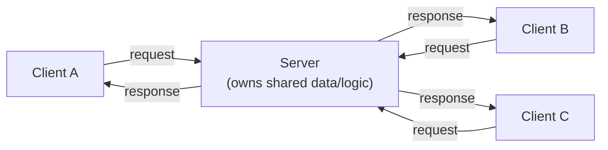
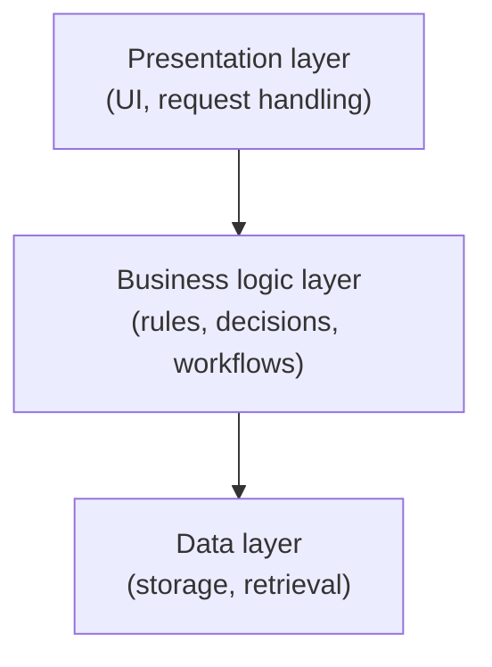

## Learning Objectives

- Explain what it means to "zoom out" from a single module's design to a whole system's shape.
- Describe the client-server style — what a client and a server each do, and what trade-off this style makes.
- Describe the layered (n-tier) style — how layers are ordered and restricted in what they may talk to, and what trade-off this style makes.
- Choose, at an introductory level, which of these two styles better fits a described system, and justify the choice.
- State explicitly why this concept stops short of distributed-systems-level architecture, and where that deeper material belongs.

## Context & Motivation

Everything covered so far in this discipline — information hiding, coupling and cohesion, design patterns — operates at the scale of a single module or a small handful of collaborating classes. Software architecture styles are the same underlying concerns (what talks to what, what depends on what, what's hidden from what) asked one level up: not "how should this one class be designed," but "what is the overall shape of this entire system, and what does that shape buy or cost."

This matters because the shape chosen at the system level constrains everything built inside it afterward, in a way that's expensive to undo. A system built as a single, request-per-connection client-server pair behaves very differently under load, under a security audit, and under a "let's add a new kind of client" requirement than a system built as several strictly ordered layers, each only allowed to depend on the one directly below it. Recognizing these shapes by name, and knowing roughly what each is good at, is a genuine, practical vocabulary need: "should this be client-server or layered" is a question working engineers actually have to answer, often early, and often before most of the module-level design decisions are even made.

This concept covers exactly two architecture styles — **client-server** and **layered (n-tier)** — because these are the two most common, most concretely teachable styles at an introductory level, and because going further (microservices, event-driven architectures, distributed consensus, service meshes) belongs to genuinely distributed-systems territory: different failure modes (partial failure, network partitions, eventual consistency), different tools, and different courses. This concept's job is narrower and more foundational than that: build the vocabulary to recognize and choose between these two common shapes, and recognize that a much larger body of architecture knowledge exists above this level, to be picked up in a later, more advanced discipline elsewhere in this curriculum, not here.

## Core Theory

### Zooming out: what "architecture" means at the system level

Where module-level design asks "what does this one class or function do, and what does it hide," architecture asks the same question about entire subsystems: what are the major, named parts of this system, what is each one responsible for, and what is each one allowed to talk to? An architecture style is a *reusable answer template* to exactly this question — much like a design pattern is a reusable answer template for a smaller, recurring class-level problem — except an architecture style constrains the shape of an entire system rather than a small group of collaborating objects.

### Client-server: one side asks, the other answers

In the **client-server** style, the system is split into two roles: a **client**, which initiates requests, and a **server**, which listens for requests and responds to them, over some agreed-upon protocol. The server typically owns a shared resource or capability (data, computation, a service) that many clients want access to; clients do not talk to each other directly, and the server does not initiate contact with clients on its own.

**What it's good at:** centralizing a shared resource in one place makes it far easier to keep that resource consistent, secure, and under one team's control — a single server enforcing one set of validation rules is simpler to reason about and audit than the same logic duplicated across every client. It also cleanly supports many different, even wildly different, clients (a web browser, a mobile app, a command-line tool) sharing one server without any client needing to know about the others.

**What it trades away:** every client depends on the server being reachable and responsive — if the server is down, slow, or overloaded, every client feels it, all at once. The server also becomes a natural bottleneck as the number of clients grows, and the client/server split itself says nothing about *how* the server is internally organized, which is exactly the gap the layered style fills for the server side.

### Layered (n-tier): each layer only talks to the one below it

In the **layered** (or **n-tier**) style, a system's internal responsibilities are stacked into an ordered sequence of layers — commonly **presentation** (handles user interaction — what's shown, what's clicked), **business logic** (implements the actual rules and decisions of the application), and **data** (stores and retrieves persistent information) — with a strict rule: each layer is only allowed to call the layer immediately below it, never skip a layer, and never call upward.

**What it's good at:** the strict "only talk downward, one level at a time" rule is a direct, system-scale application of the coupling principle already covered — the presentation layer never depends on how data is stored, only on the business layer's interface, so the data layer can be swapped (a new database, a new storage format) without the presentation layer changing at all. It also makes a large system's responsibilities easier to divide across teams: one team can own presentation, another business rules, another data, each mostly insulated from the others' internal churn as long as the layer contracts hold.

**What it trades away:** the strict layering can add overhead when a request genuinely needs to pass straight through several layers with little transformation at each — a request bounces from presentation to business logic to data and back, even for something conceptually simple, purely because the rule says no skipping. It also means a change that conceptually belongs to more than one layer (a new feature that affects both a UI element and how data is stored) still has to be threaded correctly through every layer in between.

### The two styles are not mutually exclusive

Client-server describes *how many independent parties talk to a shared resource*; layered describes *how one of those parties (very often the server) is organized internally*. In practice, the two are frequently combined: a web application is commonly client-server at the outermost level (a browser talking to a server over HTTP) *and* layered inside the server (the server's own code organized into presentation, business logic, and data layers). Recognizing this lets the choice be made independently at each scale, rather than treating the two styles as competitors for the same decision.

### Where this stops, deliberately

Both styles above describe systems that can, and very often do, run as a single process or a tightly controlled pair of processes on one machine or a small number of machines under one team's control. Real distributed systems — many independent services, owned by different teams, communicating over an unreliable network, needing to keep working (in some degraded form) when parts of the network or some of the services fail — introduce a genuinely different set of concerns: partial failure, eventual consistency, service discovery, and coordination across machines that don't share memory or a clock. Those concerns, and the architecture styles built to address them (microservices, event-driven architectures, and so on), are real and important, but they are out of scope here on purpose — this concept's job is the introductory vocabulary of recognizing and choosing between client-server and layered architecture; deeper, distributed-systems-level architecture is deliberately left to a later, more advanced discipline elsewhere in this curriculum.

## Worked Examples

### Example 1 — Recognizing client-server in a familiar system

**Problem:** A weather app on a phone shows the current forecast. The app itself has no weather data built in; it sends a request to a weather company's servers each time it's opened and displays whatever comes back. Identify the architecture style and its trade-off in this scenario.

**Reasoning.** The phone app is the **client**: it initiates the request and does not itself hold the authoritative weather data. The weather company's servers are the **server**: they own the shared resource (current weather data, gathered from many sources) and respond to requests from potentially millions of client apps at once. This is client-server, and its trade-off is visible immediately: if the weather company's servers go down, every phone app showing that company's forecast is affected simultaneously — none of them can independently produce a forecast on their own, because the forecast data was never theirs to begin with, only the server's.

### Example 2 — Recognizing layering inside one service

**Problem:** An online bookstore's backend handles a "search for a book" request as follows: an HTTP handler receives the request and parses it; a `SearchService` class applies business rules (e.g., excluding out-of-stock books from top results); a `BookRepository` class queries the actual database and returns raw rows. The HTTP handler never queries the database directly, and the `BookRepository` never applies business rules. Identify the layers and explain what the strict layering buys.

**Reasoning.** Three layers are visible: the HTTP handler is the **presentation layer** (parses the incoming request, formats the outgoing response); `SearchService` is the **business logic layer** (applies the store's actual rules about what counts as a good search result); `BookRepository` is the **data layer** (talks to the database, nothing more). Because the HTTP handler never queries the database directly, the *data layer can be swapped* — moving from one database engine to another, or adding a cache in front of it — by changing only `BookRepository`, with no change needed in the HTTP handler or `SearchService`. Because `BookRepository` never applies business rules, a change to the out-of-stock exclusion policy touches only `SearchService`. Each layer has exactly one reason to change, and each depends only on the layer directly below it — the same discipline as coupling and cohesion, now applied at the scale of a whole backend.

### Example 3 — Choosing between (or combining) the two styles

**Problem:** A team is building a note-taking application that must support a web browser client, a mobile app client, and (later) a desktop client, all sharing the same notes, kept in sync. Internally, the backend needs input validation, note-organization rules (folders, tags), and storage. Propose an architecture.

**Reasoning.** The requirement that three different client types share the same, synchronized notes points directly at **client-server**: a single server owns the authoritative notes, and each client type (web, mobile, desktop) talks to it as an independent client, never to each other — this is exactly the "many different clients sharing one resource" strength of client-server. Internally, the server's own responsibilities — parsing incoming requests, applying note-organization rules, and storing notes — map cleanly onto **layered** architecture: a presentation layer per client-facing endpoint, a business logic layer for folder/tag rules, and a data layer for storage, each only talking to the one below it. The two styles are chosen independently, at two different scales of the same system, exactly as Core Theory describes — client-server for "how many parties share what," layered for "how the server organizes its own work."

## Common Misconceptions & Pitfalls

- **"Client-server means a web browser and a website, specifically."** Client-server is a general role split — a client-initiates, server-responds relationship — that applies to a phone app and a weather API, a command-line tool and a remote build service, or even two programs on the same machine talking over a local socket. HTTP and browsers are one common instance of it, not the definition.
- **"More layers is always a more professional design."** Layering adds real value only when the strict discipline (only talk downward, never skip a layer) is actually followed and actually buys something — a system with three layers that constantly bypass each other for "simple" cases isn't really layered, it's a layered *diagram* wrapping a tangled implementation, and gets none of the swap-one-layer-freely benefit described in Core Theory.
- **"Client-server and layered are competing choices — pick one."** As Example 3 shows, they usually answer different questions at different scales and combine naturally: client-server for how independent parties share a resource, layered for how one of those parties (typically the server) organizes its own internal work.
- **"This concept's two styles are the only architecture styles that exist."** They are the two most common, most introductory ones, chosen deliberately as the vocabulary foundation — real systems, especially distributed ones spanning many independently-owned services, use additional styles (microservices, event-driven architectures, and others) with their own distinct trade-offs, covered in a later, more advanced discipline, not here.

## Summary

Software architecture styles zoom out from a single module's design to a whole system's shape, asking what the major parts of a system are and what each is allowed to talk to. Client-server splits a system into a resource-owning server and one or more requesting clients, buying centralized, consistent control of a shared resource at the cost of clients depending on that one server's availability. Layered (n-tier) architecture stacks a system's responsibilities — typically presentation, business logic, and data — into an ordered sequence where each layer talks only to the one below it, buying the same low-coupling benefit already seen at the module level (any one layer, especially data, can be swapped without touching the layers above it) at the cost of some overhead when a request must pass through every layer regardless of how simple it conceptually is. The two styles are not competitors and are routinely combined, as in a client-server web application whose server is itself organized into layers. This concept deliberately stops at these two common, introductory styles; deeper, distributed-systems-level architecture belongs to a later, more advanced discipline in this curriculum.

## Documentation Links

- [ACM/IEEE CS2013 — Software Engineering Knowledge Area](https://csed.acm.org/knowledge-areas-software-engineering-se-cs2013-version/) — doc
- [MIT 6.031/6.005 — Course Home (OCW)](https://ocw.mit.edu/courses/6-005-software-construction-spring-2016/) — doc
