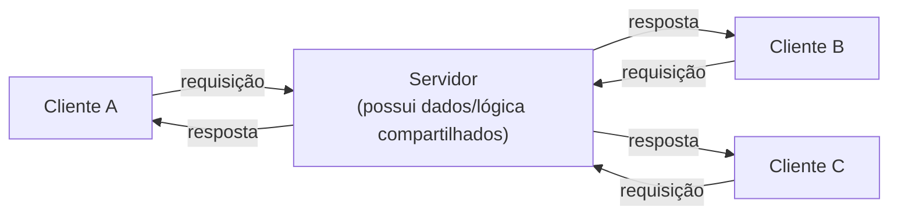
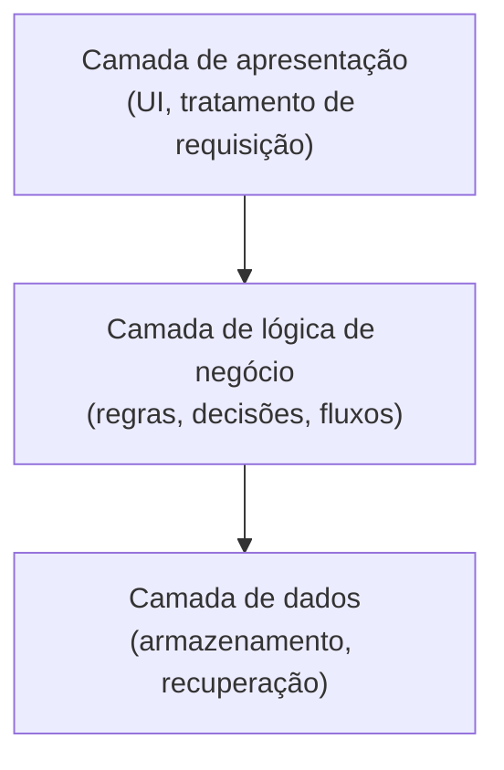

## Objetivos de Aprendizagem

- Explicar o que significa "afastar o zoom" do design de um único módulo para a forma de um sistema inteiro.
- Descrever o estilo cliente-servidor, o que um cliente e um servidor cada um faz, e qual troca esse estilo faz.
- Descrever o estilo em camadas (n-tier), como as camadas são ordenadas e restritas em com quem podem falar, e qual troca esse estilo faz.
- Escolher, em um nível introdutório, qual desses dois estilos combina melhor com um sistema descrito, e justificar a escolha.
- Enunciar explicitamente por que este conceito para antes de arquitetura no nível de sistemas distribuídos, e onde aquele material mais profundo pertence.

## Contexto e Motivação

Tudo coberto até agora nesta disciplina, ocultação de informação, acoplamento e coesão, padrões de design, opera na escala de um único módulo ou um pequeno punhado de classes colaborando. Estilos de arquitetura de software são as mesmas preocupações subjacentes (o que fala com o quê, o que depende do quê, o que está escondido do quê) perguntadas um nível acima: não "como esta única classe deveria ser projetada," mas "qual é a forma geral deste sistema inteiro, e o que essa forma compra ou custa."

Isso importa porque a forma escolhida no nível de sistema restringe tudo construído dentro dela depois, de uma forma que é cara de desfazer. Um sistema construído como um único par cliente-servidor, requisição-por-conexão, se comporta muito diferentemente sob carga, sob uma auditoria de segurança, e sob um requisito de "vamos adicionar um novo tipo de cliente" do que um sistema construído como várias camadas estritamente ordenadas, cada uma só permitida depender daquela diretamente abaixo. Reconhecer essas formas pelo nome, e saber aproximadamente no que cada uma é boa, é uma necessidade de vocabulário genuína, prática: "isso deveria ser cliente-servidor ou em camadas" é uma pergunta que engenheiros em atuação de fato têm que responder, frequentemente cedo, e frequentemente antes que a maioria das decisões de design no nível de módulo sejam sequer tomadas.

Este conceito cobre exatamente dois estilos de arquitetura, **cliente-servidor** e **em camadas (n-tier)**, porque são os dois estilos mais comuns, mais concretamente ensináveis em nível introdutório, e porque ir além (microsserviços, arquiteturas orientadas a eventos, consenso distribuído, service meshes) pertence a território genuinamente de sistemas distribuídos: modos de falha diferentes (falha parcial, partições de rede, consistência eventual), ferramentas diferentes, e cursos diferentes. O trabalho deste conceito é mais estreito e mais fundamental que isso: construir o vocabulário para reconhecer e escolher entre essas duas formas comuns, e reconhecer que um corpo muito maior de conhecimento de arquitetura existe acima deste nível, para ser retomado em uma disciplina posterior, mais avançada, em outro lugar neste currículo, não aqui.

## Teoria Central

### Afastando o zoom: o que "arquitetura" significa no nível de sistema

Onde design no nível de módulo pergunta "o que esta única classe ou função faz, e o que esconde," arquitetura faz a mesma pergunta sobre subsistemas inteiros: quais são as partes principais, nomeadas, deste sistema, pelo que cada uma é responsável, e com quem cada uma tem permissão de falar? Um estilo de arquitetura é um *modelo de resposta reutilizável* para exatamente essa pergunta, muito como um padrão de design é um modelo de resposta reutilizável para um problema menor, recorrente, no nível de classe, exceto que um estilo de arquitetura restringe a forma de um sistema inteiro em vez de um pequeno grupo de objetos colaborando.

### Cliente-servidor: um lado pergunta, o outro responde

No estilo **cliente-servidor**, o sistema é dividido em dois papéis: um **cliente**, que inicia requisições, e um **servidor**, que escuta por requisições e responde a elas, sobre algum protocolo acordado. O servidor tipicamente possui um recurso ou capacidade compartilhado (dados, computação, um serviço) ao qual muitos clientes querem acesso; clientes não falam diretamente entre si, e o servidor não inicia contato com clientes por conta própria.

**No que é bom:** centralizar um recurso compartilhado em um lugar torna muito mais fácil manter aquele recurso consistente, seguro, e sob o controle de uma equipe, um único servidor aplicando um conjunto de regras de validação é mais simples de raciocinar sobre e auditar do que a mesma lógica duplicada através de todo cliente. Também suporta limpamente muitos clientes diferentes, até radicalmente diferentes (um navegador web, um app móvel, uma ferramenta de linha de comando) compartilhando um servidor sem que qualquer cliente precise saber sobre os outros.

**O que sacrifica:** todo cliente depende do servidor estar alcançável e responsivo, se o servidor está fora do ar, lento, ou sobrecarregado, todo cliente sente isso, todos de uma vez. O servidor também se torna um gargalo natural conforme o número de clientes cresce, e a própria divisão cliente/servidor não diz nada sobre *como* o servidor é organizado internamente, que é exatamente a lacuna que o estilo em camadas preenche para o lado do servidor.

### Em camadas (n-tier): cada camada só fala com a de baixo

No estilo **em camadas** (ou **n-tier**), as responsabilidades internas de um sistema são empilhadas em uma sequência ordenada de camadas, comumente **apresentação** (trata interação do usuário, o que é mostrado, o que é clicado), **lógica de negócio** (implementa as regras e decisões reais da aplicação), e **dados** (armazena e recupera informação persistente), com uma regra estrita: cada camada só tem permissão de chamar a camada imediatamente abaixo dela, nunca pular uma camada, e nunca chamar para cima.

**No que é bom:** a regra estrita de "só fale para baixo, um nível de cada vez" é uma aplicação direta, na escala de sistema, do princípio de acoplamento já coberto, a camada de apresentação nunca depende de como dados são armazenados, só da interface da camada de negócio, então a camada de dados pode ser trocada (um novo banco de dados, um novo formato de armazenamento) sem que a camada de apresentação mude de forma alguma. Também torna as responsabilidades de um sistema grande mais fáceis de dividir entre equipes: uma equipe pode possuir apresentação, outra regras de negócio, outra dados, cada uma majoritariamente isolada da agitação interna das outras contanto que os contratos de camada valham.

**O que sacrifica:** o empilhamento estrito pode adicionar sobrecarga quando uma requisição genuinamente precisa passar direto através de várias camadas com pouca transformação em cada uma, uma requisição salta de apresentação para lógica de negócio para dados e volta, mesmo para algo conceitualmente simples, puramente porque a regra diz nada de pular. Também significa que uma mudança que conceitualmente pertence a mais de uma camada (uma nova funcionalidade que afeta tanto um elemento de UI quanto como dados são armazenados) ainda tem que ser costurada corretamente através de toda camada intermediária.

### Os dois estilos não são mutuamente exclusivos

Cliente-servidor descreve *quantas partes independentes falam com um recurso compartilhado*; em camadas descreve *como uma dessas partes (frequentemente o servidor) é organizada internamente*. Na prática, os dois são frequentemente combinados: uma aplicação web é comumente cliente-servidor no nível mais externo (um navegador falando com um servidor sobre HTTP) *e* em camadas dentro do servidor (o próprio código do servidor organizado em camadas de apresentação, lógica de negócio, e dados). Reconhecer isso permite que a escolha seja feita independentemente em cada escala, em vez de tratar os dois estilos como competidores pela mesma decisão.

### Onde isso para, deliberadamente

Ambos os estilos acima descrevem sistemas que podem, e muito frequentemente rodam, como um único processo ou um par de processos estritamente controlado em uma máquina ou um pequeno número de máquinas sob o controle de uma equipe. Sistemas distribuídos reais, muitos serviços independentes, possuídos por equipes diferentes, se comunicando sobre uma rede não confiável, precisando continuar funcionando (em alguma forma degradada) quando partes da rede ou alguns dos serviços falham, introduzem um conjunto genuinamente diferente de preocupações: falha parcial, consistência eventual, descoberta de serviço, e coordenação através de máquinas que não compartilham memória ou um relógio. Essas preocupações, e os estilos de arquitetura construídos para abordá-las (microsserviços, arquiteturas orientadas a eventos, e assim por diante), são reais e importantes, mas estão fora do escopo aqui de propósito, o trabalho deste conceito é o vocabulário introdutório de reconhecer e escolher entre arquitetura cliente-servidor e em camadas; arquitetura mais profunda, no nível de sistemas distribuídos, é deliberadamente deixada para uma disciplina posterior, mais avançada, em outro lugar neste currículo.

## Exemplos Resolvidos

### Exemplo 1 — Reconhecendo cliente-servidor em um sistema familiar

**Problema:** Um app de previsão do tempo em um celular mostra a previsão atual. O próprio app não tem dados meteorológicos embutidos; envia uma requisição aos servidores de uma empresa de meteorologia toda vez que é aberto e exibe o que quer que volte. Identifique o estilo de arquitetura e sua troca neste cenário.

**Raciocínio.** O app do celular é o **cliente**: inicia a requisição e não possui em si os dados meteorológicos autoritativos. Os servidores da empresa de meteorologia são o **servidor**: possuem o recurso compartilhado (dados meteorológicos atuais, coletados de muitas fontes) e respondem a requisições de potencialmente milhões de apps clientes de uma vez. Isso é cliente-servidor, e sua troca é visível imediatamente: se os servidores da empresa de meteorologia caem, todo app de celular mostrando a previsão daquela empresa é afetado simultaneamente, nenhum deles pode produzir uma previsão independentemente por conta própria, porque os dados de previsão nunca foram deles para começar, só do servidor.

### Exemplo 2 — Reconhecendo camadas dentro de um serviço

**Problema:** O backend de uma livraria online trata uma requisição de "buscar por um livro" da seguinte forma: um manipulador HTTP recebe a requisição e a analisa; uma classe `SearchService` aplica regras de negócio (por exemplo, excluindo livros fora de estoque dos resultados principais); uma classe `BookRepository` consulta o banco de dados real e retorna linhas brutas. O manipulador HTTP nunca consulta o banco de dados diretamente, e o `BookRepository` nunca aplica regras de negócio. Identifique as camadas e explique o que o empilhamento estrito compra.

**Raciocínio.** Três camadas são visíveis: o manipulador HTTP é a **camada de apresentação** (analisa a requisição recebida, formata a resposta enviada); `SearchService` é a **camada de lógica de negócio** (aplica as regras reais da loja sobre o que conta como um bom resultado de busca); `BookRepository` é a **camada de dados** (fala com o banco de dados, nada mais). Porque o manipulador HTTP nunca consulta o banco de dados diretamente, a *camada de dados pode ser trocada*, migrando de um mecanismo de banco de dados para outro, ou adicionando um cache na frente dele, mudando só `BookRepository`, sem nenhuma mudança necessária no manipulador HTTP ou `SearchService`. Porque `BookRepository` nunca aplica regras de negócio, uma mudança na política de exclusão de fora-de-estoque toca só `SearchService`. Cada camada tem exatamente uma razão para mudar, e cada uma depende só da camada diretamente abaixo dela, a mesma disciplina de acoplamento e coesão, agora aplicada na escala de um backend inteiro.

### Exemplo 3 — Escolhendo entre (ou combinando) os dois estilos

**Problema:** Uma equipe está construindo uma aplicação de anotações que deve suportar um cliente de navegador web, um cliente de app móvel, e (depois) um cliente desktop, todos compartilhando as mesmas anotações, mantidas sincronizadas. Internamente, o backend precisa de validação de entrada, regras de organização de anotação (pastas, tags), e armazenamento. Proponha uma arquitetura.

**Raciocínio.** O requisito de que três tipos de cliente diferentes compartilhem as mesmas anotações sincronizadas aponta diretamente para **cliente-servidor**: um único servidor possui as anotações autoritativas, e cada tipo de cliente (web, móvel, desktop) fala com ele como um cliente independente, nunca entre si, essa é exatamente a força de "muitos clientes diferentes compartilhando um recurso" do cliente-servidor. Internamente, as próprias responsabilidades do servidor, analisar requisições recebidas, aplicar regras de organização de anotação, e armazenar anotações, mapeiam limpamente para arquitetura **em camadas**: uma camada de apresentação por endpoint voltado ao cliente, uma camada de lógica de negócio para regras de pasta/tag, e uma camada de dados para armazenamento, cada uma só falando com aquela abaixo dela. Os dois estilos são escolhidos independentemente, em duas escalas diferentes do mesmo sistema, exatamente como a Teoria Central descreve, cliente-servidor para "quantas partes compartilham o quê," em camadas para "como o servidor organiza seu próprio trabalho."

## Equívocos Comuns e Armadilhas

- **"Cliente-servidor significa um navegador web e um site, especificamente."** Cliente-servidor é uma divisão de papel geral, uma relação cliente-inicia, servidor-responde, que se aplica a um app de celular e uma API de meteorologia, uma ferramenta de linha de comando e um serviço de build remoto, ou até dois programas na mesma máquina falando por um socket local. HTTP e navegadores são uma instância comum disso, não a definição.
- **"Mais camadas é sempre um design mais profissional."** Empilhamento só adiciona valor real quando a disciplina estrita (só fale para baixo, nunca pule uma camada) é de fato seguida e de fato compra algo, um sistema com três camadas que constantemente se contornam para casos "simples" não está realmente em camadas, é um *diagrama* em camadas envolvendo uma implementação emaranhada, e não obtém nenhum do benefício de trocar-uma-camada-livremente descrito na Teoria Central.
- **"Cliente-servidor e em camadas são escolhas competindo, escolha uma."** Como o Exemplo 3 mostra, geralmente respondem perguntas diferentes em escalas diferentes e se combinam naturalmente: cliente-servidor para como partes independentes compartilham um recurso, em camadas para como uma dessas partes (tipicamente o servidor) organiza seu próprio trabalho interno.
- **"Os dois estilos deste conceito são os únicos estilos de arquitetura que existem."** São os dois mais comuns, mais introdutórios, escolhidos deliberadamente como a fundação de vocabulário, sistemas reais, especialmente distribuídos abrangendo muitos serviços possuídos independentemente, usam estilos adicionais (microsserviços, arquiteturas orientadas a eventos, e outros) com suas próprias trocas distintas, cobertos em uma disciplina posterior, mais avançada, não aqui.

## Resumo

Estilos de arquitetura de software afastam o zoom do design de um único módulo para a forma de um sistema inteiro, perguntando quais são as partes principais de um sistema e com quem cada uma tem permissão de falar. Cliente-servidor divide um sistema em um servidor possuindo um recurso e um ou mais clientes requisitando, comprando controle centralizado, consistente, de um recurso compartilhado ao custo de clientes dependerem da disponibilidade daquele único servidor. Arquitetura em camadas (n-tier) empilha as responsabilidades de um sistema, tipicamente apresentação, lógica de negócio, e dados, em uma sequência ordenada onde cada camada só fala com aquela abaixo dela, comprando o mesmo benefício de acoplamento baixo já visto no nível de módulo (qualquer camada, especialmente dados, pode ser trocada sem tocar as camadas acima dela) ao custo de alguma sobrecarga quando uma requisição deve passar através de toda camada independentemente de quão simples é conceitualmente. Os dois estilos não são competidores e são rotineiramente combinados, como em uma aplicação web cliente-servidor cujo servidor é ele próprio organizado em camadas. Este conceito deliberadamente para nesses dois estilos comuns, introdutórios; arquitetura mais profunda, no nível de sistemas distribuídos, pertence a uma disciplina posterior, mais avançada, neste currículo.

## Documentation Links

- [ACM/IEEE CS2013 — Software Engineering Knowledge Area](https://csed.acm.org/knowledge-areas-software-engineering-se-cs2013-version/) — doc
- [MIT 6.031/6.005 — Course Home (OCW)](https://ocw.mit.edu/courses/6-005-software-construction-spring-2016/) — doc
