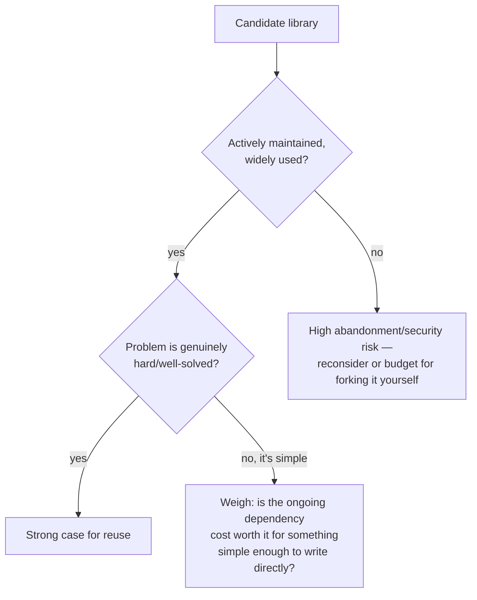

## Learning Objectives

- Explain the case for software reuse: building on an existing library or component instead of writing equivalent new code.
- Articulate the real, ongoing cost of a dependency — its bugs, its security vulnerabilities, and its potential abandonment all become the reusing project's problem too.
- Apply concrete criteria (maintenance activity, community size, problem complexity) to judge whether a specific reuse decision is sound.
- Distinguish a clearly-worth-it reuse decision from a genuinely risky one, using real, contrasting scenarios rather than a blanket rule.
- Recognize that "should I write this myself or reuse something" is a case-by-case judgment call, not a decision with one universally correct answer.

## Context & Motivation

Almost nothing built today starts from nothing. A web application built without ever pulling in an HTTP library, a JSON parser, a cryptography routine, or a date-handling library would represent an enormous, and enormously wasteful, amount of redundant effort — these are extraordinarily well-solved problems, solved already, correctly, by libraries used and battle-tested by millions of other programs. Software reuse — building on an existing library, framework, or component instead of writing new code to do the same job — is not a shortcut to feel slightly guilty about; for a huge fraction of what software actually needs to do, it is simply the correct engineering decision, and CS2013's software-engineering guidelines treat the ability to make this judgment well as a core professional skill, not an afterthought.

But this discipline's honesty about trade-offs, carried over from the SFB/ETU/RFC framework that opens it, applies here with unusual force, because the cost of reuse is real and easy to underweight in the moment a dependency is added. A library a team didn't write is, quite literally, a piece of the team's own system that the team does not fully control. Every bug that exists in that library is now a bug in the team's own product, discoverable by the team's own users, regardless of whose fault it originally was. Every security vulnerability discovered in that library becomes a vulnerability the team now has to track, patch, and potentially explain to their own customers — the team inherits the library's entire threat surface as their own. And if that library's maintainers eventually stop maintaining it — a startup shuts down, a solo maintainer moves on, a project quietly stops receiving updates — the team is left either forking and maintaining it themselves (taking on exactly the maintenance burden reuse was meant to avoid) or facing a migration to something else, on a timeline they didn't choose.

None of this is an argument against reuse in general — it's an argument for treating the decision as a real cost-benefit judgment rather than an automatic default in either direction. A well-maintained, widely-used library solving a genuinely hard, well-understood problem is usually a clear win. A barely-maintained package solving something simple enough to write correctly in an afternoon is often a real, avoidable risk dressed up as a convenience. The skill this concept develops is telling those two situations apart.

## Core Theory

### The case for reuse

Reuse's core benefit is straightforward: a problem that has already been solved correctly, and solved by people who have spent far more time on it than any one team reasonably could, does not need to be solved again. This is especially true for problems that are deceptively hard to get exactly right — cryptography, date and timezone arithmetic, HTTP protocol handling, parsing formats with many edge cases — where a homegrown implementation is far more likely to have subtle correctness or security bugs than a library that has been exercised across millions of real-world uses and had years to have its edge cases found and fixed by a wide community. Reuse also frees a team's own effort to go toward whatever is actually distinctive about their product, rather than toward re-solving a problem that offers no competitive advantage in being solved slightly differently.

### The real cost: a dependency you don't fully control

Adopting a dependency means accepting several concrete, ongoing costs, not a one-time convenience:

- **Its bugs become your bugs.** A defect inside a dependency shows up as a defect in the product built on top of it, discovered by that product's own users, regardless of who actually wrote the faulty code.
- **Its security vulnerabilities become your vulnerabilities.** A dependency with a newly discovered exploit is an exploit against every system that includes it, whether or not that system's own team was even aware the vulnerable code path was being exercised.
- **Its abandonment becomes your maintenance burden.** A dependency that stops being maintained doesn't stop being used — it just stops receiving fixes, leaving the reusing team with the choice of maintaining it themselves, replacing it (often on an unplanned timeline forced by some new incompatibility or vulnerability), or continuing to rely on something that will only accumulate more unaddressed problems over time.
- **It constrains what you can change.** Any dependency's own design decisions, update cadence, and breaking-change policy become constraints the reusing project has to live inside, whether or not those constraints match what the project actually needs.

### Criteria for judging a candidate dependency

These costs are not equally likely for every candidate library, which is exactly why the decision has to be case-by-case rather than a blanket rule. Concrete signals worth weighing directly:

- **How actively is it maintained?** Recent commits, a responsive issue tracker, and a track record of timely security patches all reduce the abandonment risk; a project with no commits in years and a pile of unanswered issues raises it sharply.
- **How widely is it used?** A library depended on by a huge number of other projects tends to have its bugs found and reported quickly, and tends to attract enough attention that abandonment, if it happens, is noticed and addressed by the wider community (a fork, a successor project) rather than silently leaving every user stranded.
- **How well-solved and how hard is the actual problem?** A well-understood, hard-to-get-right problem (parsing dates across timezones, implementing a cryptographic primitive correctly) strongly favors reuse, since a homegrown version is disproportionately likely to have subtle bugs a mature library has already had shaken out. A genuinely simple problem — one that could be written correctly, tested, and understood in a few lines — weakens the case for reuse substantially, since the dependency now carries real ongoing cost for a problem that didn't need much solving in the first place.
- **What's the actual footprint of what's being reused?** Pulling in a large, general-purpose framework to use one small piece of its functionality imports the maintenance and security surface of the *entire* dependency, not just the part actually being used.

## Worked Examples

### Example 1 — a clearly worthwhile reuse decision

**Scenario:** a team building a web service needs to correctly parse and validate ISO 8601 timestamps arriving from client requests, across time zones, including edge cases like leap seconds and daylight-saving transitions.

**Weighing the decision:** date and time arithmetic is a textbook example of a problem that is far harder to get right than it looks — time zone rules change (countries alter their own daylight-saving policies with little notice), leap seconds are irregular, and countless subtle off-by-one errors are easy to introduce silently. A well-established, actively maintained date-time library, used by a huge number of other projects and specifically designed to encode exactly these rules correctly, has almost certainly already had these edge cases found and fixed by a far larger and more diverse set of real-world uses than this one team could replicate through their own testing.

**Conclusion:** this is a clear case for reuse. The dependency does carry real ongoing cost — it needs to be kept updated as time-zone rule data changes, and its own bugs would become this team's bugs — but that cost is small and well-understood next to the near-certainty that a homegrown timestamp parser would ship with subtle correctness bugs a mature library has already resolved.

### Example 2 — a genuinely risky reuse decision

**Scenario:** a team needs a function that checks whether a given integer is even, and instead of writing `n % 2 == 0` — a one-line, trivially correct, thoroughly understandable check — someone proposes pulling in a small, barely-maintained third-party package that exposes exactly this as its entire functionality: an `is_even(n)` function and nothing else.

**Weighing the decision:** the problem here is about as simple and well-understood as a problem can be — there is no hidden subtlety, no accumulated edge-case knowledge a specialized library could plausibly be contributing that a single line of arithmetic doesn't already handle correctly. Meanwhile, every cost from Core Theory still applies in full: this dependency, however small, is still a piece of the supply chain that has to be tracked for security advisories, still a package that could stop being maintained, still one more entry a future audit of the project's dependencies has to account for — all in exchange for avoiding a computation simpler than importing the package to call it.

**Conclusion:** this is a case where reuse is a real, avoidable risk rather than a convenience. The "solved problem" being reused here was never actually hard to solve directly, so none of reuse's genuine benefits — avoiding subtle bugs in a hard problem, avoiding re-deriving expert-level correctness — apply, while every one of its costs (bugs, security surface, abandonment risk) still does.

### Example 3 — a decision genuinely in between, worked through the criteria

**Scenario:** a team needs to parse and generate PDF files with moderately complex formatting (embedded images, custom fonts, tables). A candidate library exists: reasonably popular, but maintained by a single volunteer, with a handful of open issues that have sat unanswered for over a year.

**Weighing the decision:** the underlying problem — the PDF format's specification — is genuinely complex enough that writing a correct implementation from scratch would be a significant, multi-week undertaking with its own high risk of subtle bugs, which argues for reuse on the "how hard is the problem" axis. But the maintenance signal is mixed: reasonable popularity is a point in favor, but a single-maintainer project with unanswered issues for over a year is a real abandonment risk, not a hypothetical one.

**Conclusion, reasoned rather than templated:** the team could reasonably proceed with this library while explicitly budgeting for the risk they're accepting — pinning a specific version, monitoring the project's activity going forward, and having a documented contingency plan (a fallback library, or an internal fork) if the maintainer does eventually stop responding altogether. This is the realistic middle case the criteria are meant to surface: not every reuse decision resolves as cleanly as Examples 1 and 2, and the honest answer is sometimes "yes, but go in aware of the specific risk being accepted, not blind to it."

## Common Misconceptions & Pitfalls

- **"Using a library is always safer than writing it yourself."** Safer specifically depends on how hard the underlying problem is and how well-maintained the candidate library actually is — Example 2 shows a case where reusing a library for a genuinely trivial problem adds risk (security surface, abandonment exposure) without buying back any real correctness benefit in return.
- **"A library's current popularity guarantees it will keep being maintained."** Popularity reduces abandonment risk but doesn't eliminate it — plenty of once-widely-used packages have been effectively abandoned by their maintainers while remaining heavily depended on, exactly the situation Example 3's PDF library risks becoming if its lone maintainer stops responding.
- **"Open source means it's free, with no ongoing cost."** The license cost may be zero, but the ongoing cost is real: tracking security advisories, testing against new releases, and — in the worst case — maintaining a fork if the upstream project is abandoned, none of which is free in engineering time even when no money changes hands.
- **"If the problem is simple, writing it yourself is always the safer choice."** This cuts both ways with the previous misconception — for a genuinely simple, well-understood problem (Example 2), yes; but for a problem that only looks simple on the surface (timestamp parsing across time zones, in Example 1, looks like "just subtract two dates" until leap seconds and DST transitions are considered), assuming it's simple enough to write correctly from scratch is itself a common and costly mistake.
- **"Reuse and cost don't need to be reconsidered once a decision is made."** A library that was well-maintained and widely used at the time it was adopted can still become the abandoned, risky dependency of Example 3's cautionary shape years later — the criteria in Core Theory are worth periodically revisiting for existing dependencies, not just applying once at the moment a new one is added.

## Summary

Software reuse — building on an existing library instead of writing equivalent new code — is, for a large class of well-understood, genuinely hard problems, simply the correct engineering decision: a mature, widely-used library has almost certainly already had its edge cases found and fixed by far more real-world use than any one team could replicate on its own. But reuse is never free: a dependency's bugs, security vulnerabilities, and eventual abandonment all become the reusing project's own problems, in direct proportion to how much of the system that dependency actually touches. Judging any specific reuse decision well means weighing concrete signals — how actively maintained and widely used the candidate is, and how genuinely hard the problem it solves actually is — against each other, which is why a well-maintained library solving a hard, well-solved problem (Example 1) and a barely-maintained package solving something trivial (Example 2) can look, on the surface, like the same kind of decision, while actually sitting at opposite ends of the risk-versus-benefit trade-off this concept exists to make explicit.

## Documentation Links

- [ACM/IEEE CS2013 — Software Engineering Knowledge Area](https://csed.acm.org/knowledge-areas-software-engineering-se-cs2013-version/) — doc
- [MIT 6.031 Spring 2017 — Course Site (lecture list)](http://web.mit.edu/6.031/www/sp17/) — doc
