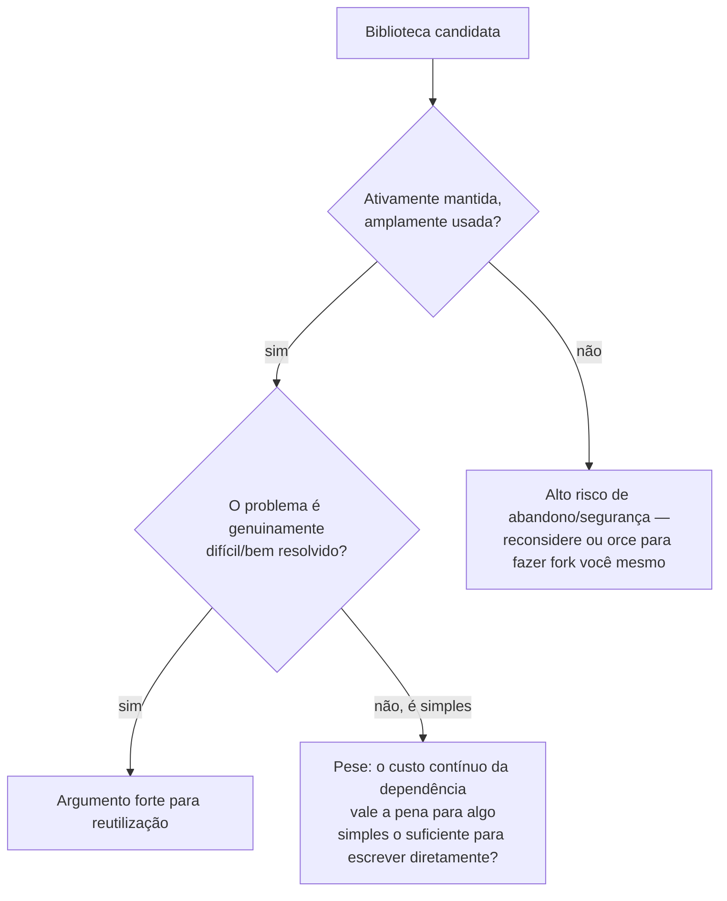

## Objetivos de Aprendizagem

- Explicar o argumento para reutilização de software: construir sobre uma biblioteca ou componente existente em vez de escrever código novo equivalente.
- Articular o custo real, contínuo, de uma dependência, seus bugs, suas vulnerabilidades de segurança, e seu potencial abandono todos se tornam problema do projeto reutilizador também.
- Aplicar critérios concretos (atividade de manutenção, tamanho da comunidade, complexidade do problema) para julgar se uma decisão de reutilização específica é sólida.
- Distinguir uma decisão de reutilização claramente valendo a pena de uma genuinamente arriscada, usando cenários reais, contrastantes, em vez de uma regra geral.
- Reconhecer que "devo escrever isso eu mesmo ou reutilizar algo" é um julgamento caso a caso, não uma decisão com uma única resposta universalmente correta.

## Contexto e Motivação

Quase nada construído hoje começa do zero. Uma aplicação web construída sem jamais puxar uma biblioteca HTTP, um analisador JSON, uma rotina de criptografia, ou uma biblioteca de tratamento de data representaria uma quantidade enorme, e enormemente desperdiçadora, de esforço redundante, esses são problemas extraordinariamente bem resolvidos, já resolvidos, corretamente, por bibliotecas usadas e testadas em batalha por milhões de outros programas. Reutilização de software, construir sobre uma biblioteca, framework, ou componente existente em vez de escrever código novo para fazer o mesmo trabalho, não é um atalho pelo qual se sentir levemente culpado; para uma fração enorme do que software de fato precisa fazer, é simplesmente a decisão de engenharia correta, e as diretrizes de engenharia de software do CS2013 tratam a capacidade de fazer esse julgamento bem como uma habilidade profissional central, não uma reflexão tardia.

Mas a honestidade desta disciplina sobre trocas, carregada do modelo SFB/ETU/RFC que a abre, se aplica aqui com força incomum, porque o custo de reutilização é real e fácil de subestimar no momento em que uma dependência é adicionada. Uma biblioteca que uma equipe não escreveu é, bem literalmente, um pedaço do próprio sistema da equipe que a equipe não controla completamente. Todo bug que existe naquela biblioteca agora é um bug no próprio produto da equipe, descobrível pelos próprios usuários da equipe, independentemente de quem originalmente era a culpa. Toda vulnerabilidade de segurança descoberta naquela biblioteca se torna uma vulnerabilidade que a equipe agora tem que rastrear, corrigir, e potencialmente explicar aos próprios clientes, a equipe herda a superfície de ameaça inteira da biblioteca como sua própria. E se os mantenedores daquela biblioteca eventualmente pararem de mantê-la, uma startup fecha, um mantenedor solo segue em frente, um projeto silenciosamente para de receber atualizações, a equipe fica ou fazendo fork e mantendo-a eles próprios (assumindo exatamente o fardo de manutenção que reutilização era pra evitar) ou enfrentando uma migração para outra coisa, em um cronograma que não escolheram.

Nada disso é um argumento contra reutilização em geral, é um argumento para tratar a decisão como um julgamento real de custo-benefício em vez de um padrão automático em qualquer direção. Uma biblioteca bem mantida, amplamente usada, resolvendo um problema genuinamente difícil, bem entendido, é geralmente uma vitória clara. Um pacote mal mantido resolvendo algo simples o suficiente para escrever corretamente em uma tarde é frequentemente um risco real, evitável, disfarçado de conveniência. A habilidade que este conceito desenvolve é distinguir essas duas situações.

## Teoria Central

### O argumento para reutilização

O benefício central de reutilização é direto: um problema que já foi resolvido corretamente, e resolvido por pessoas que gastaram muito mais tempo nele do que qualquer equipe única razoavelmente poderia, não precisa ser resolvido de novo. Isso é especialmente verdadeiro para problemas que são enganosamente difíceis de acertar exatamente, criptografia, aritmética de data e fuso horário, tratamento de protocolo HTTP, análise de formatos com muitos casos de borda, onde uma implementação caseira é muito mais provável de ter bugs sutis de correção ou segurança do que uma biblioteca que foi exercitada através de milhões de usos do mundo real e teve anos para ter seus casos de borda encontrados e corrigidos por uma comunidade ampla. Reutilização também libera o próprio esforço de uma equipe para ir em direção ao que de fato é distintivo sobre seu produto, em vez de em direção a resolver de novo um problema que não oferece nenhuma vantagem competitiva em ser resolvido ligeiramente diferente.

### O custo real: uma dependência que você não controla completamente

Adotar uma dependência significa aceitar vários custos concretos, contínuos, não uma conveniência de uma vez:

- **Os bugs dela se tornam seus bugs.** Um defeito dentro de uma dependência aparece como um defeito no produto construído em cima dela, descoberto pelos próprios usuários daquele produto, independentemente de quem de fato escreveu o código com falha.
- **As vulnerabilidades de segurança dela se tornam suas vulnerabilidades.** Uma dependência com um exploit recém-descoberto é um exploit contra todo sistema que a inclui, quer a própria equipe daquele sistema estivesse ciente ou não de que o caminho de código vulnerável estava sendo exercitado.
- **O abandono dela se torna seu fardo de manutenção.** Uma dependência que para de ser mantida não para de ser usada, só para de receber correções, deixando a equipe reutilizadora com a escolha de mantê-la eles próprios, substituí-la (frequentemente em um cronograma não planejado forçado por alguma nova incompatibilidade ou vulnerabilidade), ou continuar confiando em algo que só vai acumular mais problemas não abordados ao longo do tempo.
- **Isso restringe o que você pode mudar.** As próprias decisões de design de qualquer dependência, cadência de atualização, e política de mudança que quebra se tornam restrições dentro das quais o projeto reutilizador tem que viver, quer essas restrições combinem ou não com o que o projeto de fato precisa.

### Critérios para julgar uma dependência candidata

Esses custos não são igualmente prováveis para toda biblioteca candidata, que é exatamente por que a decisão tem que ser caso a caso em vez de uma regra geral. Sinais concretos que valem a pena pesar diretamente:

- **Quão ativamente é mantida?** Commits recentes, um rastreador de issue responsivo, e um histórico de correções de segurança pontuais todos reduzem o risco de abandono; um projeto sem commits há anos e uma pilha de issues não respondidas o aumenta drasticamente.
- **Quão amplamente é usada?** Uma biblioteca da qual um número enorme de outros projetos depende tende a ter seus bugs encontrados e relatados rapidamente, e tende a atrair atenção suficiente que abandono, se acontecer, é notado e abordado pela comunidade mais ampla (um fork, um projeto sucessor) em vez de silenciosamente deixar todo usuário abandonado.
- **Quão bem resolvido e quão difícil é o problema real?** Um problema bem entendido, difícil de acertar (analisar datas através de fusos horários, implementar uma primitiva criptográfica corretamente) fortemente favorece reutilização, já que uma versão caseira é desproporcionalmente provável de ter bugs sutis que uma biblioteca madura já teve eliminados. Um problema genuinamente simples, um que poderia ser escrito corretamente, testado, e entendido em poucas linhas, enfraquece o argumento para reutilização substancialmente, já que a dependência agora carrega custo real, contínuo, para um problema que não precisava de muita resolução para começar.
- **Qual é a pegada real do que está sendo reutilizado?** Puxar um framework grande, de propósito geral, para usar um pequeno pedaço de sua funcionalidade importa a superfície de manutenção e segurança da dependência *inteira*, não só a parte de fato sendo usada.

## Exemplos Resolvidos

### Exemplo 1 — uma decisão de reutilização claramente valendo a pena

**Cenário:** uma equipe construindo um serviço web precisa analisar e validar corretamente timestamps ISO 8601 chegando de requisições de cliente, através de fusos horários, incluindo casos de borda como segundos bissextos e transições de horário de verão.

**Pesando a decisão:** aritmética de data e hora é um exemplo de livro-texto de um problema que é muito mais difícil de acertar do que parece, regras de fuso horário mudam (países alteram suas próprias políticas de horário de verão com pouco aviso), segundos bissextos são irregulares, e inúmeros erros sutis fora-por-um são fáceis de introduzir silenciosamente. Uma biblioteca de data-hora bem estabelecida, ativamente mantida, usada por um número enorme de outros projetos e especificamente projetada para codificar exatamente essas regras corretamente, quase certamente já teve esses casos de borda encontrados e corrigidos por um conjunto muito maior e mais diverso de usos do mundo real do que esta única equipe poderia replicar através de seus próprios testes.

**Conclusão:** este é um caso claro para reutilização. A dependência de fato carrega custo real, contínuo, precisa ser mantida atualizada conforme dados de regra de fuso horário mudam, e seus próprios bugs se tornariam bugs desta equipe, mas esse custo é pequeno e bem entendido ao lado da quase certeza de que um analisador de timestamp caseiro embarcaria com bugs sutis de correção que uma biblioteca madura já resolveu.

### Exemplo 2 — uma decisão de reutilização genuinamente arriscada

**Cenário:** uma equipe precisa de uma função que verifica se um dado inteiro é par, e em vez de escrever `n % 2 == 0`, uma verificação de uma linha, trivialmente correta, completamente compreensível, alguém propõe puxar um pequeno pacote de terceiro, mal mantido, que expõe exatamente isso como sua funcionalidade inteira: uma função `is_even(n)` e nada mais.

**Pesando a decisão:** o problema aqui é tão simples e bem entendido quanto um problema pode ser, não há nenhuma sutileza escondida, nenhum conhecimento de caso de borda acumulado que uma biblioteca especializada poderia plausivelmente estar contribuindo que uma única linha de aritmética já não trate corretamente. Enquanto isso, todo custo da Teoria Central ainda se aplica completamente: essa dependência, por menor que seja, ainda é um pedaço da cadeia de suprimento que tem que ser rastreado por avisos de segurança, ainda um pacote que poderia parar de ser mantido, ainda mais uma entrada que uma futura auditoria das dependências do projeto tem que contabilizar, tudo em troca de evitar um cálculo mais simples que importar o pacote para chamá-lo.

**Conclusão:** este é um caso onde reutilização é um risco real, evitável, em vez de uma conveniência. O "problema resolvido" sendo reutilizado aqui nunca de fato foi difícil de resolver diretamente, então nenhum dos benefícios genuínos de reutilização, evitar bugs sutis em um problema difícil, evitar rederivar correção de nível especialista, se aplica, enquanto todo um de seus custos (bugs, superfície de segurança, risco de abandono) ainda se aplica.

### Exemplo 3 — uma decisão genuinamente intermediária, trabalhada através dos critérios

**Cenário:** uma equipe precisa analisar e gerar arquivos PDF com formatação moderadamente complexa (imagens incorporadas, fontes customizadas, tabelas). Uma biblioteca candidata existe: razoavelmente popular, mas mantida por um único voluntário, com um punhado de issues abertas que ficaram sem resposta por mais de um ano.

**Pesando a decisão:** o problema subjacente, a especificação do formato PDF, é genuinamente complexo o suficiente que escrever uma implementação correta do zero seria um empreendimento significativo, de várias semanas, com seu próprio alto risco de bugs sutis, o que argumenta para reutilização no eixo de "quão difícil é o problema." Mas o sinal de manutenção é misto: popularidade razoável é um ponto a favor, mas um projeto de único mantenedor com issues sem resposta por mais de um ano é um risco de abandono real, não hipotético.

**Conclusão, raciocinada em vez de modelada:** a equipe poderia razoavelmente prosseguir com essa biblioteca enquanto explicitamente orça para o risco que está aceitando, fixando uma versão específica, monitorando a atividade do projeto no futuro, e tendo um plano de contingência documentado (uma biblioteca de fallback, ou um fork interno) se o mantenedor eventualmente parar de responder completamente. Esse é o caso intermediário realista que os critérios são destinados a trazer à tona: nem toda decisão de reutilização se resolve tão limpamente quanto os Exemplos 1 e 2, e a resposta honesta às vezes é "sim, mas entre ciente do risco específico sendo aceito, não cego a ele."

## Equívocos Comuns e Armadilhas

- **"Usar uma biblioteca é sempre mais seguro que escrevê-la você mesmo."** Mais seguro depende especificamente de quão difícil o problema subjacente é e quão bem mantida a biblioteca candidata de fato é, o Exemplo 2 mostra um caso onde reutilizar uma biblioteca para um problema genuinamente trivial adiciona risco (superfície de segurança, exposição a abandono) sem comprar de volta nenhum benefício de correção real em troca.
- **"A popularidade atual de uma biblioteca garante que continuará sendo mantida."** Popularidade reduz risco de abandono mas não o elimina, muitos pacotes antes amplamente usados foram efetivamente abandonados por seus mantenedores enquanto permanecem fortemente dependidos, exatamente a situação que a biblioteca de PDF do Exemplo 3 arrisca se tornar se seu único mantenedor parar de responder.
- **"Código aberto significa que é grátis, sem custo contínuo."** O custo de licença pode ser zero, mas o custo contínuo é real: rastrear avisos de segurança, testar contra novos lançamentos, e, no pior caso, manter um fork se o projeto upstream é abandonado, nada disso é grátis em tempo de engenharia mesmo quando nenhum dinheiro muda de mãos.
- **"Se o problema é simples, escrevê-lo você mesmo é sempre a escolha mais segura."** Isso corta em ambas as direções com o equívoco anterior, para um problema genuinamente simples, bem entendido (Exemplo 2), sim; mas para um problema que só parece simples na superfície (análise de timestamp através de fusos horários, no Exemplo 1, parece "só subtrair duas datas" até que segundos bissextos e transições de horário de verão sejam considerados), assumir que é simples o suficiente para escrever corretamente do zero é em si um erro comum e caro.
- **"Reutilização e custo não precisam ser reconsiderados uma vez que uma decisão é tomada."** Uma biblioteca que era bem mantida e amplamente usada no momento em que foi adotada ainda pode se tornar a dependência abandonada, arriscada, do formato cautelar do Exemplo 3 anos depois, os critérios na Teoria Central valem a pena revisitar periodicamente para dependências existentes, não só aplicar uma vez no momento em que uma nova é adicionada.

## Resumo

Reutilização de software, construir sobre uma biblioteca existente em vez de escrever código novo equivalente, é, para uma classe grande de problemas bem entendidos, genuinamente difíceis, simplesmente a decisão de engenharia correta: uma biblioteca madura, amplamente usada, quase certamente já teve seus casos de borda encontrados e corrigidos por muito mais uso do mundo real do que qualquer equipe única poderia replicar por conta própria. Mas reutilização nunca é grátis: os bugs, vulnerabilidades de segurança, e eventual abandono de uma dependência todos se tornam problemas do próprio projeto reutilizador, em proporção direta a quanto do sistema aquela dependência de fato toca. Julgar bem qualquer decisão de reutilização específica significa pesar sinais concretos, quão ativamente mantida e amplamente usada a candidata é, e quão genuinamente difícil o problema que resolve de fato é, um contra o outro, que é por que uma biblioteca bem mantida resolvendo um problema difícil, bem resolvido (Exemplo 1) e um pacote mal mantido resolvendo algo trivial (Exemplo 2) podem parecer, na superfície, o mesmo tipo de decisão, enquanto de fato ficam em extremos opostos da troca risco-versus-benefício que este conceito existe para tornar explícita.

## Documentation Links

- [ACM/IEEE CS2013 — Software Engineering Knowledge Area](https://csed.acm.org/knowledge-areas-software-engineering-se-cs2013-version/) — doc
- [MIT 6.031 Spring 2017 — Course Site (lecture list)](http://web.mit.edu/6.031/www/sp17/) — doc
