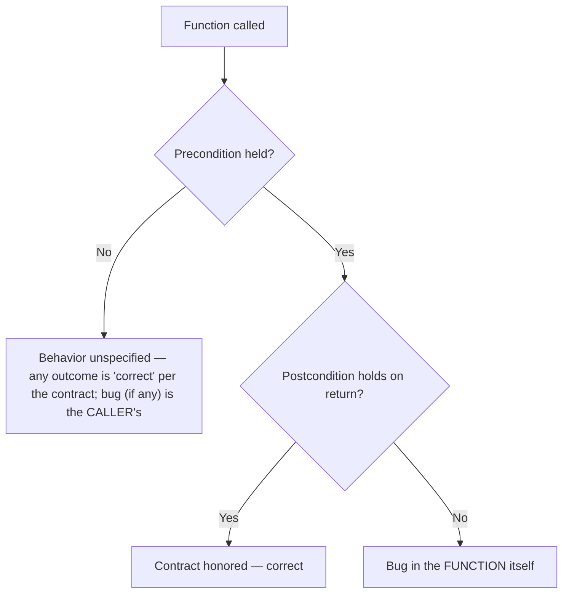

## Learning Objectives

- Define a specification as a contract between a function and its callers, distinguishing the precondition (the caller's obligation) from the postcondition (the function's obligation).
- Identify the specific ambiguities an underspecified function leaves open, and explain how those ambiguities cause real bugs when different callers assume different things.
- Write a precise, unambiguous specification — including precondition, postcondition, and behavior on invalid input — for a given function signature.
- Distinguish a precondition violation (undefined behavior, caller's fault) from a postcondition the function itself fails to establish (a bug, the function's fault).
- Explain how a precise specification simultaneously advances all three goals from the Safe/Easy/Ready framework — safety, understandability, and readiness for change.

## Context & Motivation

A function's code tells you *how* it computes something; a specification tells you *what* it computes, and under what conditions — and the two are not the same document, nor should they be read as substitutes for one another. MIT's 6.031 treats writing a specification as an act that happens, ideally, before a single line of a function's body is written: a specification is a promise made to future callers, stated precisely enough that those callers never need to open the implementation to know what to expect, and precisely enough that the implementation is free to change internally as long as the promise still holds. This is the core discipline this concept introduces — separating the *contract* a function offers from the *mechanism* it happens to use to fulfill that contract.

The motivating problem is that code without a written specification still has behavior — every function does something for every input, whether or not anyone wrote down what that something is supposed to be. The absence of a specification does not mean the absence of a contract; it means the contract is implicit, unstated, and up to each caller's guess. Two different callers of the same underspecified function will often guess differently, and both guesses can be locally reasonable — which is exactly how bugs of this kind get introduced: not because either caller misread the code, but because neither caller could have known, from the function's signature and name alone, which of several plausible behaviors was the intended one.

A specification, in the precise sense this concept develops, has two named halves. The **precondition** states what must be true about the function's arguments and any relevant state at the moment it is called — this is the caller's obligation to satisfy; if the precondition is violated, the function's behavior is entirely unconstrained (it might crash, might return garbage, might loop forever) and none of that is the function's fault. The **postcondition** states what the function guarantees will be true when it returns, *provided the precondition held at the call* — this is the function's obligation, and its violation, when the precondition was met, is a genuine bug in the function. Splitting a contract this cleanly — caller's job here, function's job there — is what makes it possible to reason about a large program one function call at a time: a caller who has met the precondition can rely on the postcondition without ever looking inside the function, and a function's implementer can assume the precondition holds without re-checking it (or can choose to check it defensively — a design decision this concept will return to).

This concept requires the Safe/Easy/Ready framework from the previous concept because a precise specification is the single clearest example in this discipline of a design choice that advances all three goals at once, with little genuine tension between them — which makes it worth understanding in detail before moving on to topics (defensive programming, immutability, testing) where the three goals pull in more openly conflicting directions.

## Core Theory

### Specification as contract: obligations on both sides

A **specification** for a function or method states, precisely, the relationship the implementer promises to maintain between the function's inputs and its outputs — and, crucially, states this relationship in terms a caller can read and act on *without inspecting the implementation*. A specification is standardly broken into (at least) two clauses:

- The **precondition** (often written `requires`) — a condition on the arguments (and any relevant object or global state) that must hold at the moment the function is invoked. The precondition is entirely the caller's responsibility to satisfy.
- The **postcondition** (often written `effects` or `returns`) — a condition on the return value (and any state changes) that the function guarantees will hold when it returns *normally*, but **only if the precondition held at the call**. If the precondition did not hold, the postcondition carries no guarantee whatsoever — the function's behavior is, by definition, unspecified in that case, not merely "unlikely to work as intended."

This asymmetry is the whole point: a specification is not a description of everything the function might do, but a conditional promise — *if you (the caller) uphold your half, I (the function) will uphold mine.* A caller who has verified the precondition holds can trust the postcondition without reading a single line of the function's body; an implementer, in turn, is permitted to assume the precondition holds (rather than being obligated to re-verify it) when reasoning about correctness, though a defensive implementation may choose to check it anyway and fail loudly — a separate design decision layered on top of the specification, not part of what the specification itself states.

### Where the ambiguity hides: unstated preconditions and postconditions

Nearly every real specification bug traces back to one of two shapes of omission:

1. **An unstated precondition.** The function's signature and docstring don't say what inputs are actually assumed — so a caller passes something the implementer never intended to handle, and gets behavior the implementer never designed for (a crash, silent wrong output, or worse, output that looks plausible but is wrong).
2. **An underspecified postcondition.** The function's documented behavior leaves a real behavioral choice unstated — so two callers, each reading the same documentation, form two different, incompatible mental models of what the function does, and each writes calling code that is correct under their own assumption and silently wrong under the other's.

Both failure modes share the same root cause: the specification did not pin down a decision that the implementation necessarily *does* make, one way or another, whether or not it was written down. Code always behaves some particular way for every input; a specification's job is to make that way a promise rather than an accident.

### Precondition violation versus postcondition failure — whose bug is it?

A precise specification also settles a question that matters enormously for debugging and blame: when a function misbehaves, is that the function's fault, or the caller's? The rule follows directly from the conditional structure of the contract:

- If the precondition was **not** met at the call, and the function does something wrong (crashes, returns nonsense) — this is **not a bug in the function**. The function made no promise for this case; the caller violated the contract, and the caller's code is at fault.
- If the precondition **was** met at the call, and the postcondition does not hold when the function returns — this **is** a bug in the function, full stop, regardless of how the implementation got there.

This distinction is what makes specifications actionable during debugging: instead of staring at a stack trace and guessing where the fault lies, the question becomes mechanical — check the precondition first. If it wasn't satisfied, look at the caller. If it was, look at the function.



### How a precise specification serves all three goals of Safe/Easy/Ready at once

A specification that precisely states precondition and postcondition is one of the rare design choices in this discipline that advances all three goals from the previous concept simultaneously, with little real trade-off between them:

- **Safe from Bugs.** The contract becomes explicit and, crucially, *testable* — a test suite can assert the postcondition holds for every input satisfying the precondition, and can separately assert that behavior is (by design) unconstrained outside it, rather than accidentally testing against an assumption no one wrote down. Bugs caused by two parts of a system silently disagreeing about behavior become far less likely once the agreement is written down and checkable.
- **Easy to Understand.** A caller who wants to use the function correctly needs to read only the specification, not the implementation — the whole point of a contract is that it lets a reader reason about a function's effect without tracing through its body. This is a direct, first-order readability win: understanding "what this does" no longer requires understanding "how this works."
- **Ready for Change.** Because callers depend only on the stated contract and not on implementation details, the implementer is free to change *how* the function computes its result — swap an algorithm, change a data structure, optimize a loop — as long as the same precondition/postcondition pair still holds. The specification is the stable surface that change can happen safely behind.

## Worked Examples

### Example 1 — `remove_first`: an ambiguous specification versus a precise one

**Scenario.** A function is meant to remove the first occurrence of a value from a list.

**Underspecified version:**

```python
def remove_first(items, value):
    """Removes the first occurrence of value from items."""
    items.remove(value)
```

This one-line docstring looks reasonable, but it leaves at least two real behavioral questions completely open:

1. **What happens if `value` is not present in `items` at all?** Nothing in the docstring says. In this actual implementation, `list.remove` raises `ValueError` when the value isn't found — but nothing in the *specification* (the docstring) told a caller to expect that. A caller who read only the docstring, not the implementation, has no way to know whether to wrap this call in a `try/except`.
2. **Does the function modify `items` in place, or return a new list?** The implementation mutates `items` and returns `None` — but "removes" is ambiguous between "mutates in place" and "returns a modified copy." A caller who writes `result = remove_first(my_list, 5)` and then uses `result` has just introduced a bug: `result` is `None`.

**Two callers, two incompatible assumptions:**

```python
# Caller A assumes: raises if not found, mutates in place
def process_a(cart, sku):
    try:
        remove_first(cart, sku)
    except ValueError:
        print("item not in cart")

# Caller B assumes: silently no-ops if not found, returns a new list
def process_b(cart, sku):
    updated_cart = remove_first(cart, sku)
    return updated_cart  # bug: this is always None
```

Caller A happens to be right about the exception behavior (by luck, or by having read the implementation) but is not told this by the specification. Caller B is simply wrong about both the return-value behavior and the not-found behavior, and nothing in the one-line docstring would have warned them — the bug in `process_b` (silently propagating `None` as if it were the updated cart) is a direct, traceable consequence of the missing specification, not of careless coding.

**Precise version:**

```python
def remove_first(items, value):
    """Removes the first occurrence of value from items, in place.

    Requires:
        items is a list; value is comparable to items' elements
        using ==.

    Effects:
        If value occurs in items, removes the first (leftmost)
        occurrence, mutating items in place, and returns True.
        If value does not occur in items, items is left unchanged
        and the function returns False. Never raises for a
        value that is simply absent.
    """
    for i, x in enumerate(items):
        if x == value:
            del items[i]
            return True
    return False
```

Now both the mutation behavior and the not-found behavior are pinned down as explicit postcondition clauses. Caller A's `try/except` is now visibly wrong (the function never raises for an absent value) and would be caught the moment they read the spec, rather than discovered later as a dead `except` branch that never fires; Caller B's assumption that a new list is returned is now visibly wrong too, and the fix — checking the boolean return value instead of assigning `items` to a new variable — is dictated directly by the postcondition rather than guessed at:

```python
def process_b_fixed(cart, sku):
    removed = remove_first(cart, sku)
    if not removed:
        print("item not in cart")
    return cart
```

### Example 2 — a precondition that resolves an "impossible" edge case

**Scenario.** A function is meant to find the index of the smallest element in a list.

```python
def index_of_min(numbers):
    smallest_index = 0
    for i in range(1, len(numbers)):
        if numbers[i] < numbers[smallest_index]:
            smallest_index = i
    return smallest_index
```

Called with `numbers = []`, this returns `0` — a valid-looking integer, but `0` is not a valid index into an empty list, so any caller that goes on to use this result (e.g., `numbers[index_of_min(numbers)]`) gets an `IndexError` far away from the actual root cause. Is this a bug in `index_of_min`? Without a specification, the question can't even be asked precisely — "should it work on an empty list" is a real design decision the code above made silently (by returning `0`, a specific, wrong-looking answer, rather than raising or documenting anything).

**Precise specification:**

```python
def index_of_min(numbers):
    """Finds the index of the smallest element.

    Requires:
        numbers is a non-empty list of comparable elements.

    Effects:
        Returns the index i such that numbers[i] <= numbers[j]
        for all valid j. If multiple elements tie for smallest,
        returns the index of the first (leftmost) such element.
    """
    smallest_index = 0
    for i in range(1, len(numbers)):
        if numbers[i] < numbers[smallest_index]:
            smallest_index = i
    return smallest_index
```

With the precondition `numbers is non-empty` now stated, calling this function on `[]` is a **precondition violation** — whatever the function happens to return (here, the arguably nonsensical `0`) is not a bug in `index_of_min` at all; the bug, if there is one, is in whichever caller failed to check for an empty list before calling. This reframes the earlier "is this a bug?" question into an answerable one: check the precondition first. A caller who needs to handle empty lists must now do so explicitly, before calling — the specification has made an implicit assumption visible and enforceable rather than silently assumed.

### Example 3 — the same specification, two different (both correct) implementations

**Scenario.** This example demonstrates the "Ready for Change" payoff directly: two implementations of the same specification, differing entirely in mechanism, are both correct because both honor the same contract.

```python
def contains_duplicate(numbers):
    """Determines whether any value appears more than once.

    Requires:
        numbers is a list of hashable elements.

    Effects:
        Returns True if some value occurs at two or more distinct
        indices in numbers, False otherwise. Does not modify numbers.
    """
```

**Implementation A (set-based, O(n) time, O(n) space):**

```python
def contains_duplicate(numbers):
    seen = set()
    for n in numbers:
        if n in seen:
            return True
        seen.add(n)
    return False
```

**Implementation B (sort-based, O(n log n) time, O(1) extra space beyond the sort):**

```python
def contains_duplicate(numbers):
    sorted_copy = sorted(numbers)
    for i in range(1, len(sorted_copy)):
        if sorted_copy[i] == sorted_copy[i - 1]:
            return True
    return False
```

Both implementations honor the identical precondition and postcondition; no caller written against the specification can tell, or needs to care, which one is running underneath. A team could ship Implementation A, discover a memory constraint later, and swap in Implementation B — a pure internal change that requires touching zero calling code, precisely because every caller depended on the specification, never on the mechanism. This is Ready for Change realized concretely: the contract is the stable surface, and the mechanism behind it is free to change.

## Common Misconceptions & Pitfalls

- **"A docstring that describes what the code does IS a specification."** A specification must describe behavior in terms independent of the implementation, precisely enough that a caller never needs to read the body — a docstring that just narrates the code line-by-line ("loops through the list and removes the value") is documentation of mechanism, not a contract, and typically fails to state the precondition or the edge-case postcondition at all (see Example 1).
- **"If the precondition is violated and the function crashes, that's a bug in the function."** By definition, a precondition violation puts the function's behavior outside the contract entirely — crashing, returning garbage, or anything else is equally "correct" per the (non-)promise made for that case. The bug, if it's useful to call it that, belongs to the caller who failed to check the precondition, not to the function. (A function *may choose*, as a design decision, to check its precondition defensively and fail with a clear error rather than behave arbitrarily — but that's an added safety feature layered on top of the spec, not a requirement the spec itself imposes.)
- **"A stronger (more restrictive) precondition is always better because it gives the implementer more freedom."** A stronger precondition does give the implementer more freedom, but it also shifts more of the burden onto every caller, who now must verify a more restrictive condition before every call — potentially at a real cost to Easy to Understand and Ready for Change if that burden turns out to be awkward to satisfy in most real call sites. Choosing how strong to make a precondition is itself a trade-off, not a free win.
- **"Two implementations that behave differently on inputs outside the stated precondition are inconsistent with each other."** They are not — since the specification makes no promise for inputs violating the precondition, two conforming implementations are free to disagree on exactly that region (see Implementation A returning `False` versus a hypothetical Implementation C raising `TypeError` on an unhashable element — both are consistent with a spec requiring hashable elements, since an unhashable element violates the precondition either way).
- **"Writing the specification is a formality to do after the code works, mostly for documentation's sake."** Treating the specification as an afterthought defeats its main purpose: deciding the precondition and postcondition *before* writing the body is what forces the ambiguous decisions (what happens on empty input? does it mutate or copy? what about duplicates?) to be made deliberately, rather than accidentally baked in by whatever the first draft of the code happened to do.

## Summary

A specification is a contract, split into a **precondition** (the condition the caller must guarantee before calling — violating it puts behavior outside the contract entirely, fault of the caller) and a **postcondition** (the guarantee the function makes on return, but only when the precondition held — violating it, when the precondition did hold, is unambiguously a bug in the function). Most real-world bugs attributed to "unclear" functions trace back to an unstated precondition or an underspecified postcondition — a behavioral decision the implementation necessarily makes one way, silently, that different callers then guess about differently and incompatibly, as in the `remove_first` example's not-found and mutation ambiguities. A precise specification is one of the few design choices in this discipline that advances all three Safe/Easy/Ready goals at once: it makes the contract explicit and testable (Safe from Bugs), lets a caller reason about behavior without reading the implementation (Easy to Understand), and lets the implementation change freely behind a stable contract, as the two `contains_duplicate` implementations demonstrate (Ready for Change).

## Documentation Links

- [MIT 6.031 Spring 2017 — Course Site (lecture list)](http://web.mit.edu/6.031/www/sp17/) — doc
- [ACM/IEEE CS2013 — Software Engineering Knowledge Area](https://csed.acm.org/knowledge-areas-software-engineering-se-cs2013-version/) — doc
