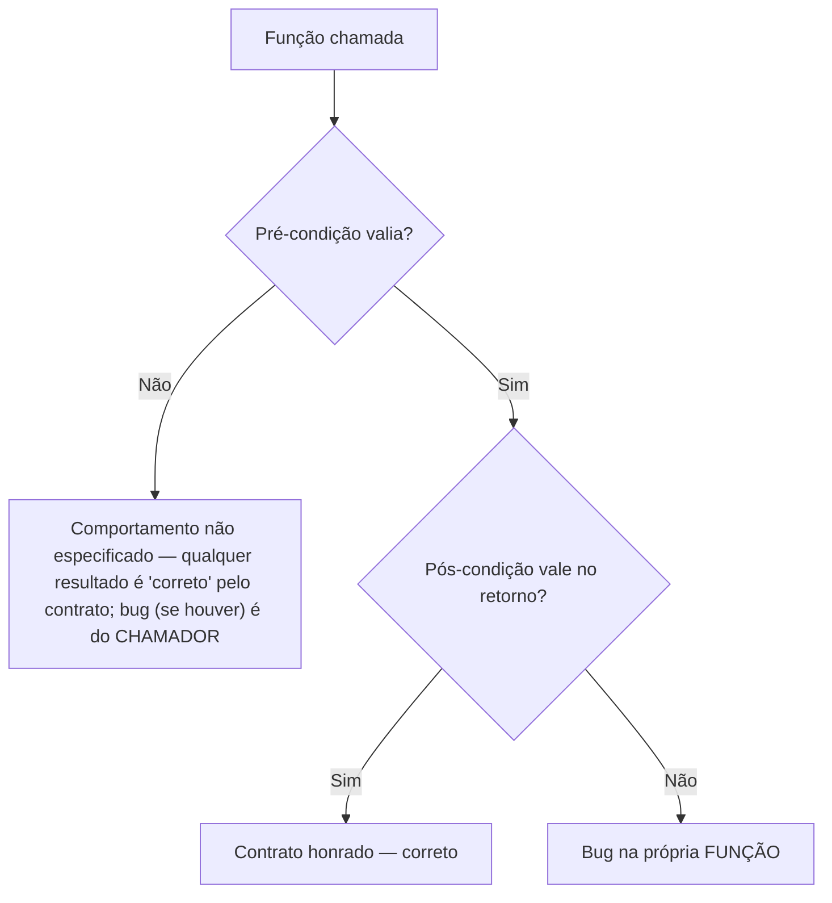

## Objetivos de Aprendizagem

- Definir uma especificação como um contrato entre uma função e seus chamadores, distinguindo a pré-condição (a obrigação do chamador) da pós-condição (a obrigação da função).
- Identificar as ambiguidades específicas que uma função sub-especificada deixa em aberto, e explicar como essas ambiguidades causam bugs reais quando chamadores diferentes assumem coisas diferentes.
- Escrever uma especificação precisa, não ambígua, incluindo pré-condição, pós-condição, e comportamento em entrada inválida, para uma dada assinatura de função.
- Distinguir uma violação de pré-condição (comportamento indefinido, culpa do chamador) de uma pós-condição que a própria função falha em estabelecer (um bug, culpa da função).
- Explicar como uma especificação precisa avança simultaneamente os três objetivos do modelo Seguro/Fácil/Pronto, segurança, compreensibilidade, e prontidão para mudança.

## Contexto e Motivação

O código de uma função diz a você *como* ela calcula algo; uma especificação diz a você *o que* ela calcula, e sob quais condições, e as duas não são o mesmo documento, nem deveriam ser lidas como substitutas uma da outra. O 6.031 do MIT trata escrever uma especificação como um ato que acontece, idealmente, antes de uma única linha do corpo de uma função ser escrita: uma especificação é uma promessa feita a futuros chamadores, enunciada precisamente o suficiente para que aqueles chamadores nunca precisem abrir a implementação para saber o que esperar, e precisamente o suficiente para que a implementação seja livre para mudar internamente contanto que a promessa ainda valha. Essa é a disciplina central que este conceito introduz, separar o *contrato* que uma função oferece do *mecanismo* que ela acontece de usar para cumprir aquele contrato.

O problema motivador é que código sem uma especificação escrita ainda tem comportamento, toda função faz algo para toda entrada, quer alguém tenha escrito ou não o que aquele algo deveria ser. A ausência de uma especificação não significa a ausência de um contrato; significa que o contrato é implícito, não enunciado, e deixado ao palpite de cada chamador. Dois chamadores diferentes da mesma função sub-especificada frequentemente vão palpitar diferentemente, e ambos os palpites podem ser localmente razoáveis, que é exatamente como bugs desse tipo são introduzidos: não porque qualquer chamador leu mal o código, mas porque nenhum chamador poderia ter sabido, só pela assinatura e nome da função, qual entre vários comportamentos plausíveis era o pretendido.

Uma especificação, no sentido preciso que este conceito desenvolve, tem duas metades nomeadas. A **pré-condição** enuncia o que deve ser verdadeiro sobre os argumentos da função e qualquer estado relevante no momento em que é chamada, essa é a obrigação do chamador de satisfazer; se a pré-condição é violada, o comportamento da função é inteiramente irrestrito (pode travar, pode retornar lixo, pode entrar em loop infinito) e nada disso é culpa da função. A **pós-condição** enuncia o que a função garante que será verdadeiro quando retornar, *desde que a pré-condição valesse na chamada*, essa é a obrigação da função, e sua violação, quando a pré-condição foi atendida, é um bug genuíno na função. Dividir um contrato tão limpamente, o trabalho do chamador aqui, o trabalho da função ali, é o que torna possível raciocinar sobre um programa grande uma chamada de função de cada vez: um chamador que atendeu a pré-condição pode confiar na pós-condição sem jamais olhar dentro da função, e o implementador de uma função pode assumir que a pré-condição vale sem reverificá-la (ou pode escolher verificá-la defensivamente, uma decisão de design à qual este conceito retornará).

Este conceito exige o modelo Seguro/Fácil/Pronto do conceito anterior porque uma especificação precisa é o exemplo mais claro único nesta disciplina de uma escolha de design que avança os três objetivos ao mesmo tempo, com pouca tensão genuína entre eles, o que torna vale a pena entendê-la em detalhe antes de seguir para tópicos (programação defensiva, imutabilidade, testes) onde os três objetivos puxam em direções mais abertamente conflitantes.

## Teoria Central

### Especificação como contrato: obrigações de ambos os lados

Uma **especificação** para uma função ou método enuncia, precisamente, a relação que o implementador promete manter entre as entradas da função e suas saídas, e, crucialmente, enuncia essa relação em termos que um chamador pode ler e agir sobre *sem inspecionar a implementação*. Uma especificação é padronizadamente dividida em (pelo menos) duas cláusulas:

- A **pré-condição** (frequentemente escrita `requires`), uma condição sobre os argumentos (e qualquer estado de objeto ou global relevante) que deve valer no momento em que a função é invocada. A pré-condição é inteiramente responsabilidade do chamador satisfazer.
- A **pós-condição** (frequentemente escrita `effects` ou `returns`), uma condição sobre o valor de retorno (e quaisquer mudanças de estado) que a função garante que valerá quando retornar *normalmente*, mas **só se a pré-condição valesse na chamada**. Se a pré-condição não valesse, a pós-condição não carrega nenhuma garantia, o comportamento da função é, por definição, não especificado nesse caso, não meramente "improvável de funcionar como pretendido."

Essa assimetria é o ponto inteiro: uma especificação não é uma descrição de tudo que a função poderia fazer, mas uma promessa condicional, *se você (o chamador) cumpre sua metade, eu (a função) cumpro a minha.* Um chamador que verificou que a pré-condição vale pode confiar na pós-condição sem ler uma única linha do corpo da função; um implementador, por sua vez, tem permissão de assumir que a pré-condição vale (em vez de ser obrigado a reverificá-la) ao raciocinar sobre correção, embora uma implementação defensiva possa escolher verificá-la mesmo assim e falhar alto, uma decisão de design separada sobreposta à especificação, não parte do que a própria especificação enuncia.

### Onde a ambiguidade se esconde: pré-condições e pós-condições não enunciadas

Quase todo bug real de especificação remonta a um de dois formatos de omissão:

1. **Uma pré-condição não enunciada.** A assinatura e docstring da função não dizem quais entradas de fato são assumidas, então um chamador passa algo que o implementador nunca pretendeu tratar, e recebe comportamento que o implementador nunca projetou (um crash, saída silenciosamente errada, ou pior, saída que parece plausível mas está errada).
2. **Uma pós-condição sub-especificada.** O comportamento documentado da função deixa uma escolha comportamental real não enunciada, então dois chamadores, cada um lendo a mesma documentação, formam dois modelos mentais diferentes, incompatíveis, do que a função faz, e cada um escreve código chamador que é correto sob sua própria suposição e silenciosamente errado sob a do outro.

Ambos os modos de falha compartilham a mesma causa raiz: a especificação não fixou uma decisão que a implementação necessariamente *toma*, de uma forma ou de outra, tenha sido escrita ou não. Código sempre se comporta de alguma forma particular para toda entrada; o trabalho de uma especificação é tornar aquela forma uma promessa em vez de um acidente.

### Violação de pré-condição versus falha de pós-condição, de quem é o bug?

Uma especificação precisa também resolve uma pergunta que importa enormemente para depuração e culpa: quando uma função se comporta mal, isso é culpa da função, ou do chamador? A regra decorre diretamente da estrutura condicional do contrato:

- Se a pré-condição **não** foi atendida na chamada, e a função faz algo errado (trava, retorna absurdo), isso **não é um bug na função**. A função não fez nenhuma promessa para este caso; o chamador violou o contrato, e o código do chamador está com a culpa.
- Se a pré-condição **foi** atendida na chamada, e a pós-condição não vale quando a função retorna, isso **é** um bug na função, ponto final, independentemente de como a implementação chegou lá.

Essa distinção é o que torna especificações acionáveis durante depuração: em vez de encarar um stack trace e adivinhar onde está a falha, a pergunta se torna mecânica, verifique a pré-condição primeiro. Se não foi satisfeita, olhe para o chamador. Se foi, olhe para a função.



### Como uma especificação precisa serve os três objetivos de Seguro/Fácil/Pronto ao mesmo tempo

Uma especificação que enuncia precisamente pré-condição e pós-condição é uma das raras escolhas de design nesta disciplina que avança os três objetivos do conceito anterior simultaneamente, com pouca troca real entre eles:

- **Seguro Contra Bugs.** O contrato se torna explícito e, crucialmente, *testável*, uma suíte de testes pode afirmar que a pós-condição vale para toda entrada satisfazendo a pré-condição, e pode separadamente afirmar que o comportamento é (por design) irrestrito fora dela, em vez de acidentalmente testar contra uma suposição que ninguém escreveu. Bugs causados por duas partes de um sistema silenciosamente discordando sobre comportamento se tornam muito menos prováveis uma vez que o acordo é escrito e verificável.
- **Fácil de Entender.** Um chamador que quer usar a função corretamente só precisa ler a especificação, não a implementação, o ponto inteiro de um contrato é que permite a um leitor raciocinar sobre o efeito de uma função sem rastrear através de seu corpo. Isso é uma vitória de legibilidade direta, de primeira ordem: entender "o que isso faz" não exige mais entender "como isso funciona."
- **Pronto para Mudança.** Porque chamadores dependem só do contrato enunciado e não de detalhes de implementação, o implementador é livre para mudar *como* a função calcula seu resultado, trocar um algoritmo, mudar uma estrutura de dados, otimizar um laço, contanto que o mesmo par pré-condição/pós-condição ainda valha. A especificação é a superfície estável atrás da qual mudança pode acontecer com segurança.

## Exemplos Resolvidos

### Exemplo 1 — `remove_first`: uma especificação ambígua versus uma precisa

**Cenário.** Uma função é destinada a remover a primeira ocorrência de um valor de uma lista.

**Versão sub-especificada:**

```python
def remove_first(items, value):
    """Remove a primeira ocorrência de value em items."""
    items.remove(value)
```

Essa docstring de uma linha parece razoável, mas deixa pelo menos duas perguntas comportamentais reais completamente em aberto:

1. **O que acontece se `value` não está presente em `items` de forma alguma?** Nada na docstring diz. Nesta implementação real, `list.remove` levanta `ValueError` quando o valor não é encontrado, mas nada na *especificação* (a docstring) disse a um chamador para esperar isso. Um chamador que leu só a docstring, não a implementação, não tem como saber se deveria envolver essa chamada em um `try/except`.
2. **A função modifica `items` in place, ou retorna uma nova lista?** A implementação muta `items` e retorna `None`, mas "remove" é ambíguo entre "muta in place" e "retorna uma cópia modificada." Um chamador que escreve `result = remove_first(my_list, 5)` e depois usa `result` acabou de introduzir um bug: `result` é `None`.

**Dois chamadores, duas suposições incompatíveis:**

```python
# Chamador A assume: levanta se não encontrado, muta in place
def process_a(cart, sku):
    try:
        remove_first(cart, sku)
    except ValueError:
        print("item not in cart")

# Chamador B assume: no-op silencioso se não encontrado, retorna nova lista
def process_b(cart, sku):
    updated_cart = remove_first(cart, sku)
    return updated_cart  # bug: isso é sempre None
```

O Chamador A acontece de estar certo sobre o comportamento da exceção (por sorte, ou por ter lido a implementação) mas isso não é dito pela especificação. O Chamador B está simplesmente errado tanto sobre o comportamento de valor de retorno quanto sobre o comportamento de não encontrado, e nada na docstring de uma linha o teria avisado, o bug em `process_b` (propagando silenciosamente `None` como se fosse o carrinho atualizado) é uma consequência direta, rastreável, da especificação faltando, não de codificação descuidada.

**Versão precisa:**

```python
def remove_first(items, value):
    """Remove a primeira ocorrência de value em items, in place.

    Requires:
        items é uma lista; value é comparável aos elementos de
        items usando ==.

    Effects:
        Se value ocorre em items, remove a primeira (mais à
        esquerda) ocorrência, mutando items in place, e retorna
        True. Se value não ocorre em items, items permanece
        inalterado e a função retorna False. Nunca levanta para
        um value simplesmente ausente.
    """
    for i, x in enumerate(items):
        if x == value:
            del items[i]
            return True
    return False
```

Agora tanto o comportamento de mutação quanto o comportamento de não encontrado estão fixados como cláusulas de pós-condição explícitas. O `try/except` do Chamador A agora está visivelmente errado (a função nunca levanta para um valor ausente) e seria pego no momento em que lessem a especificação, em vez de descoberto mais tarde como um ramo `except` morto que nunca dispara; a suposição do Chamador B de que uma nova lista é retornada agora também está visivelmente errada, e o conserto, verificar o valor de retorno booleano em vez de atribuir `items` a uma nova variável, é ditado diretamente pela pós-condição em vez de adivinhado:

```python
def process_b_fixed(cart, sku):
    removed = remove_first(cart, sku)
    if not removed:
        print("item not in cart")
    return cart
```

### Exemplo 2 — uma pré-condição que resolve um caso de borda "impossível"

**Cenário.** Uma função é destinada a encontrar o índice do menor elemento em uma lista.

```python
def index_of_min(numbers):
    smallest_index = 0
    for i in range(1, len(numbers)):
        if numbers[i] < numbers[smallest_index]:
            smallest_index = i
    return smallest_index
```

Chamada com `numbers = []`, isso retorna `0`, um inteiro de aparência válida, mas `0` não é um índice válido em uma lista vazia, então qualquer chamador que segue usando esse resultado (por exemplo, `numbers[index_of_min(numbers)]`) recebe um `IndexError` longe da causa raiz real. Isso é um bug em `index_of_min`? Sem uma especificação, a pergunta nem pode ser feita precisamente, "deveria funcionar em uma lista vazia" é uma decisão de design real que o código acima tomou silenciosamente (retornando `0`, uma resposta específica, de aparência errada, em vez de levantar ou documentar qualquer coisa).

**Especificação precisa:**

```python
def index_of_min(numbers):
    """Encontra o índice do menor elemento.

    Requires:
        numbers é uma lista não vazia de elementos comparáveis.

    Effects:
        Retorna o índice i tal que numbers[i] <= numbers[j]
        para todo j válido. Se múltiplos elementos empatam como
        menores, retorna o índice do primeiro (mais à esquerda)
        tal elemento.
    """
    smallest_index = 0
    for i in range(1, len(numbers)):
        if numbers[i] < numbers[smallest_index]:
            smallest_index = i
    return smallest_index
```

Com a pré-condição `numbers não é vazio` agora enunciada, chamar essa função em `[]` é uma **violação de pré-condição**, o que quer que a função aconteça de retornar (aqui, o `0` arguivelmente sem sentido) não é um bug em `index_of_min` de forma alguma; o bug, se há um, está em qualquer chamador que falhou em verificar por uma lista vazia antes de chamar. Isso reformula a pergunta anterior de "isso é um bug?" em uma respondível: verifique a pré-condição primeiro. Um chamador que precisa tratar listas vazias agora deve fazê-lo explicitamente, antes de chamar, a especificação tornou uma suposição implícita visível e aplicável em vez de silenciosamente assumida.

### Exemplo 3 — a mesma especificação, duas implementações diferentes (ambas corretas)

**Cenário.** Este exemplo demonstra o ganho de "Pronto para Mudança" diretamente: duas implementações da mesma especificação, diferindo inteiramente em mecanismo, são ambas corretas porque ambas honram o mesmo contrato.

```python
def contains_duplicate(numbers):
    """Determina se algum valor aparece mais de uma vez.

    Requires:
        numbers é uma lista de elementos hasheáveis.

    Effects:
        Retorna True se algum valor ocorre em dois ou mais
        índices distintos em numbers, False caso contrário.
        Não modifica numbers.
    """
```

**Implementação A (baseada em set, tempo O(n), espaço O(n)):**

```python
def contains_duplicate(numbers):
    seen = set()
    for n in numbers:
        if n in seen:
            return True
        seen.add(n)
    return False
```

**Implementação B (baseada em ordenação, tempo O(n log n), espaço extra O(1) além da ordenação):**

```python
def contains_duplicate(numbers):
    sorted_copy = sorted(numbers)
    for i in range(1, len(sorted_copy)):
        if sorted_copy[i] == sorted_copy[i - 1]:
            return True
    return False
```

Ambas as implementações honram a pré-condição e pós-condição idênticas; nenhum chamador escrito contra a especificação consegue dizer, ou precisa se importar, qual está rodando por baixo. Uma equipe poderia lançar a Implementação A, descobrir uma restrição de memória mais tarde, e trocar para a Implementação B, uma mudança interna pura que exige tocar zero código chamador, precisamente porque todo chamador dependia da especificação, nunca do mecanismo. Isso é Pronto para Mudança realizado concretamente: o contrato é a superfície estável, e o mecanismo por trás dele é livre para mudar.

## Equívocos Comuns e Armadilhas

- **"Uma docstring que descreve o que o código faz É uma especificação."** Uma especificação deve descrever comportamento em termos independentes da implementação, precisamente o suficiente para que um chamador nunca precise ler o corpo, uma docstring que só narra o código linha por linha ("percorre a lista e remove o valor") é documentação de mecanismo, não um contrato, e tipicamente falha em enunciar a pré-condição ou a pós-condição de caso de borda de forma alguma (veja o Exemplo 1).
- **"Se a pré-condição é violada e a função trava, isso é um bug na função."** Por definição, uma violação de pré-condição coloca o comportamento da função inteiramente fora do contrato, travar, retornar lixo, ou qualquer outra coisa é igualmente "correto" pela (não-)promessa feita para aquele caso. O bug, se é útil chamá-lo assim, pertence ao chamador que falhou em verificar a pré-condição, não à função. (Uma função *pode escolher*, como uma decisão de design, verificar sua pré-condição defensivamente e falhar com um erro claro em vez de se comportar arbitrariamente, mas isso é um recurso de segurança adicionado sobreposto à especificação, não um requisito que a própria especificação impõe.)
- **"Uma pré-condição mais forte (mais restritiva) é sempre melhor porque dá ao implementador mais liberdade."** Uma pré-condição mais forte de fato dá ao implementador mais liberdade, mas também transfere mais do fardo para todo chamador, que agora deve verificar uma condição mais restritiva antes de toda chamada, potencialmente a um custo real para Fácil de Entender e Pronto para Mudança se esse fardo acaba sendo incômodo de satisfazer na maioria dos locais de chamada reais. Escolher quão forte tornar uma pré-condição é em si uma troca, não uma vitória gratuita.
- **"Duas implementações que se comportam diferentemente em entradas fora da pré-condição enunciada são inconsistentes uma com a outra."** Não são, já que a especificação não faz nenhuma promessa para entradas violando a pré-condição, duas implementações conformes são livres para discordar exatamente naquela região (veja a Implementação A retornando `False` versus uma hipotética Implementação C levantando `TypeError` em um elemento não hasheável, ambas são consistentes com uma especificação exigindo elementos hasheáveis, já que um elemento não hasheável viola a pré-condição de qualquer forma).
- **"Escrever a especificação é uma formalidade a fazer depois que o código funciona, principalmente por causa da documentação."** Tratar a especificação como uma reflexão tardia derrota seu propósito principal: decidir a pré-condição e pós-condição *antes* de escrever o corpo é o que força as decisões ambíguas (o que acontece em entrada vazia? muta ou copia? e duplicatas?) a serem tomadas deliberadamente, em vez de acidentalmente embutidas por qualquer que seja o primeiro rascunho do código que aconteceu de fazer.

## Resumo

Uma especificação é um contrato, dividido em uma **pré-condição** (a condição que o chamador deve garantir antes de chamar, violá-la coloca o comportamento inteiramente fora do contrato, culpa do chamador) e uma **pós-condição** (a garantia que a função faz no retorno, mas só quando a pré-condição valia, violá-la, quando a pré-condição valia, é inequivocamente um bug na função). A maioria dos bugs do mundo real atribuídos a funções "pouco claras" remontam a uma pré-condição não enunciada ou uma pós-condição sub-especificada, uma decisão comportamental que a implementação necessariamente toma de uma forma, silenciosamente, que chamadores diferentes então palpitam de formas diferentes e incompatíveis, como nas ambiguidades de não-encontrado e mutação do exemplo `remove_first`. Uma especificação precisa é uma das poucas escolhas de design nesta disciplina que avança os três objetivos de Seguro/Fácil/Pronto ao mesmo tempo: torna o contrato explícito e testável (Seguro Contra Bugs), permite que um chamador raciocine sobre comportamento sem ler a implementação (Fácil de Entender), e permite que a implementação mude livremente atrás de um contrato estável, como as duas implementações de `contains_duplicate` demonstram (Pronto para Mudança).

## Documentation Links

- [MIT 6.031 Spring 2017 — Course Site (lecture list)](http://web.mit.edu/6.031/www/sp17/) — doc
- [ACM/IEEE CS2013 — Software Engineering Knowledge Area](https://csed.acm.org/knowledge-areas-software-engineering-se-cs2013-version/) — doc
