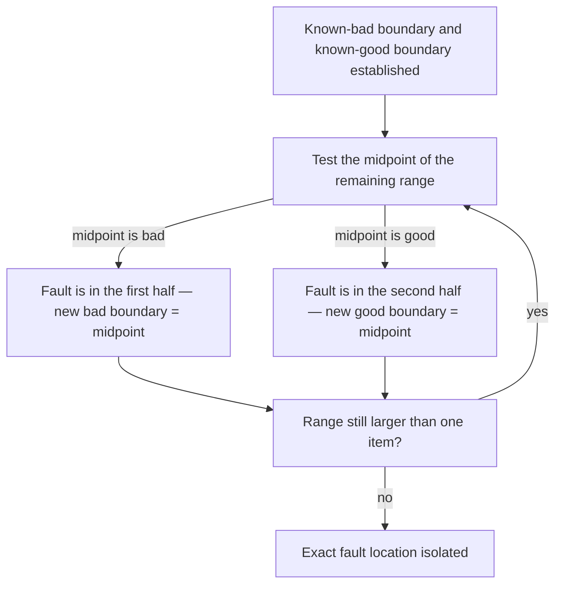

## Learning Objectives

- Explain why reliably reproducing a bug on demand is a prerequisite to fixing it, not an optional first step.
- Apply bisection — the same divide-and-conquer idea used to search a sorted list — to localize a fault within a large input or a large range of source history.
- Distinguish bisecting over program state (checking a value at a midpoint) from bisecting over project history (checking a past revision), and recognize both as instances of the same underlying technique.
- Use `git bisect` by name as the tool that automates history-bisection across a project's commits, and describe what it needs from the developer to run.
- Judge when a bug is bisectable at all, and recognize the conditions (a reliable reproduction, a monotonic boundary between "good" and "bad") that make bisection valid.

## Context & Motivation

The introductory treatment of debugging already covers the basic shape of the process: form a hypothesis about where a bug lives, check a value at some point in the computation, and narrow toward whichever half of the program looks inconsistent with what was expected. That version of the idea is exactly right as far as it goes, and it is usually enough for a bug living inside a single function call, in a program small enough to hold in one's head. It starts to fall short the moment either of two things happens: the bug doesn't reproduce reliably — it shows up "sometimes," or only on a specific large input, or only after the program has been running for a while — or the search space is no longer a handful of function calls but something much larger: a dataset with tens of thousands of records, or months of project history spanning hundreds of commits, any one of which might be where things went wrong.

Both of those situations demand the same two-part discipline, applied more deliberately than before. The first part is reproduction: before spending any effort trying to understand or fix a bug, get it to fail on command, every time, ideally on the smallest input that still triggers it. A bug that fails four times out of five for reasons no one understands cannot be confirmed fixed later, because "it didn't fail this time" is not distinguishable from "it's fixed" when the failure was already inconsistent to begin with. The second part is bisection: once a fault reproduces reliably, treat the space it could be hiding in — a large input, a long stretch of commit history, a big intermediate data structure — as something to be searched by repeatedly testing its midpoint and discarding whichever half turns out to be uninvolved, exactly the way a sorted list is searched by binary search rather than by scanning it left to right. This is the same divide-and-conquer principle covered in the algorithms material, aimed here at a different kind of target: not "where is this value in a sorted array" but "where, in this much larger space, does the fault first appear."

MIT's 6.031 materials on debugging and the Missing Semester of Your CS Education both treat this pairing — reliable reproduction, then bisection — as the load-bearing technique that separates systematic fault-finding from the trial-and-error of changing code and hoping the symptom goes away. Missing Semester in particular exists because tools exactly like this — the actual mechanics of finding a regression across a large commit history, for instance — are almost never taught explicitly in a CS curriculum, despite being some of the most reliably useful skills a working programmer has. The tool it highlights for automating history-bisection, `git bisect`, is worth knowing by name here specifically because it is the same idea this concept develops manually, applied automatically to a project's commit history — a natural bridge to the version-control concepts that follow this one.

## Core Theory

### Reproducing a bug reliably before touching anything

The single most common way debugging effort gets wasted is by attempting a fix before the bug can be triggered on demand. If a change is made and the symptom doesn't recur, there are two possible explanations: the fix worked, or the bug simply didn't happen to trigger this particular run, exactly as it sometimes doesn't. Without a reliable reproduction, these two explanations are indistinguishable, and "I made a change and it seems fixed" is not a claim that can be trusted.

Reproducing reliably usually means shrinking: if a failure shows up somewhere inside a 50,000-row dataset, the goal is not to keep re-running the full dataset while investigating, but to find the smallest subset — ideally a single row, or a handful — that still triggers the exact same failure. The same applies to a failure that depends on a sequence of operations: the goal is the shortest sequence that still reproduces it. A large, slow, unreliable reproduction makes every subsequent experiment expensive and its result ambiguous; a small, fast, reliable one makes every subsequent experiment cheap and its result trustworthy. Only once a bug reproduces reliably does it make sense to start narrowing down where it lives — bisection depends entirely on being able to re-test the same failure repeatedly and get a consistent yes-or-no answer each time.

### Bisection: divide-and-conquer applied to fault localization

Bisection assumes a search space with a specific structure: a point that is known-good, a point that is known-bad, and a way of testing any point in between to classify it as one or the other. Given that structure, the algorithm is exactly binary search — check the midpoint; if it's bad, the fault lies in the first half (or is that midpoint itself); if it's good, the fault lies in the second half; recurse into whichever half remains, discarding the other entirely. Each test halves the remaining space, so a space of size *n* is fully localized in about log₂(*n*) tests rather than the *n* tests a linear scan through every point would need — the same efficiency argument that makes binary search preferable to scanning a sorted array one element at a time.



The technique works over any search space that has this "good on one side, bad on the other, no scrambling in between" shape — a large input broken into chunks, a sequence of recent code changes ordered by suspicion, or, most concretely, a project's commit history ordered by time. What bisection needs to be *valid*, not merely fast, is that the boundary between good and bad is monotonic across the space being searched: once something is bad, everything further in that direction stays bad, with no good points hiding on the far side of a bad one. A search space that flips back and forth between good and bad unpredictably cannot be bisected correctly, because the midpoint's classification would no longer reliably tell you which half to discard.

### Bisecting a large input

When a fault is triggered by some large piece of data — a big file, a long list, a large batch of records — and only part of that data is actually responsible, the same idea applies directly: split the data roughly in half, test each half independently against the same reproduction, and keep whichever half still triggers the failure (discarding the other, which is now known to be innocent). Repeating this against the remaining half, over and over, converges on the smallest culpable fragment far faster than inspecting the data one record at a time.

### Bisecting a project's history: `git bisect`

The identical idea, applied to a sequence of commits instead of a sequence of data records, is exactly what `git bisect` automates. Given a commit known to be good (the fault wasn't present) and a commit known to be bad (the fault is present now), `git bisect` checks out the commit roughly halfway between them and asks the developer — or an automated test script — to classify it as good or bad; based on the answer, it narrows to the corresponding half and checks out the new midpoint, repeating until exactly one commit remains: the one that introduced the fault. This concept does not need the exact command sequence to make the point (that mechanical detail belongs to version control itself); what matters here is recognizing `git bisect` as the direct, well-known, tool-level embodiment of the same bisection principle this concept is teaching by hand — proof that this is not a toy idea invented for a classroom, but a technique real engineering teams rely on constantly to find exactly when something broke across potentially thousands of commits.

## Worked Examples

### Example 1 — bisecting a large input to find the record that breaks a parser

**Problem:** A CSV-parsing function crashes partway through a 100,000-row file with a cryptic error. Running the whole file and reading the stack trace hasn't pinpointed which row is malformed.

**Step 1 — reproduce reliably.** Confirm the crash happens every time on this exact file (it does — it's not intermittent), so bisection is valid.

**Step 2 — bisect the input.** Split the file into rows 1–50,000 and 50,001–100,000. Run the parser on each half independently.
- Rows 1–50,000: parses cleanly.
- Rows 50,001–100,000: crashes with the same error.

The fault is somewhere in the second half; the first half is now known-innocent and can be set aside entirely.

**Step 3 — repeat.** Split rows 50,001–100,000 into 50,001–75,000 and 75,001–100,000.
- 50,001–75,000: parses cleanly.
- 75,001–100,000: crashes.

**Step 4 — keep halving.** After roughly 17 rounds of halving (since 2^17 ≈ 131,000, comfortably covering 100,000 rows), the remaining range shrinks to a single row: row 82,419. Inspecting that one row directly shows an unescaped comma inside a quoted field — the actual cause.

**Why this beat a linear scan:** checking every row one at a time until the crash reappeared could have taken up to 100,000 individual checks in the worst case; bisection found the exact row in about 17. The same reduction — from *n* checks down to roughly log₂(*n*) — is the same efficiency argument that makes binary search preferable to a linear scan of a sorted list.

### Example 2 — bisecting a list of recent changes ranked by suspicion

**Problem:** A previously working report started producing a wrong total sometime in the last 20 changes made to the codebase, but nobody knows which one, and the changes touch several unrelated files.

**Step 1 — reproduce reliably.** Confirm the wrong total reproduces every time the report is generated against the same fixed input dataset — it does, so the boundary is stable enough to bisect.

**Step 2 — establish the boundary.** Change #1 (oldest) is known-good — the report was correct back then. Change #20 (current) is known-bad — the report is wrong now.

**Step 3 — test the midpoint.** Revert the codebase to the state right after change #10 and regenerate the report. It's correct. So changes #1–#10 are innocent; the fault lies somewhere in #11–#20.

**Step 4 — narrow again.** Test the state after change #15: report is wrong. Fault is in #11–#15.

**Step 5 — narrow again.** Test the state after change #13: report is correct. Fault is in #14–#15.

**Step 6 — final step.** Test the state after change #14: report is wrong. Since #13 was good and #14 is bad, change #14 itself is the culprit.

Five tests (#10, #15, #13, #14, plus the initial boundary check) localized the fault out of 20 candidate changes — again roughly log₂(20) ≈ 4–5 tests, versus up to 20 if each change had been inspected one at a time in isolation, from oldest to newest, hoping to spot the mistake by eye.

### Example 3 — the same idea, automated: `git bisect`

**Problem:** Same scenario as Example 2, but the 20 changes are 20 real commits in a git repository, and there's an automated test that returns a nonzero exit code when the report total is wrong.

```bash
git bisect start
git bisect bad                      # current commit (HEAD) is known-bad
git bisect good v1.4-report-correct  # a tag/commit 20 commits back, known-good
# git checks out the midpoint commit automatically
./run_report_test.sh                # exits nonzero -> this midpoint is bad
git bisect bad
# git checks out the next midpoint automatically
./run_report_test.sh                # exits zero -> this midpoint is good
git bisect good
# ... git continues narrowing on its own after each good/bad ...
git bisect good                     # last step: narrows to exactly one commit
# git reports: <commit-hash> is the first bad commit
git bisect reset                    # return to the original HEAD when done
```

This is mechanically identical to Example 2's manual process — check the midpoint, classify it, narrow into the corresponding half, repeat — except `git bisect` handles the checkout of each midpoint commit automatically, and `git bisect run ./run_report_test.sh` can even drive the whole loop unattended if a script can classify each commit without a human in the loop. The developer's job shrinks to two things: define the good and bad boundary, and provide a reliable, automatable test — which is exactly the reliable-reproduction requirement from earlier in this concept, expressed as a script instead of a manual check.

## Common Misconceptions & Pitfalls

- **"Debugging is just repeatedly guessing a fix and re-running."** This approach is seductive because it sometimes works by accident, but a fix arrived at without knowing *why* the bug happened can just as easily mask the same fault elsewhere or introduce a new one. Systematic debugging — reproduce, then bisect — replaces guessing with a search that provably converges on the actual cause.
- **"If a bug only happens rarely, there's no way to narrow it down."** An intermittent bug is exactly the case where the reproduction step matters most: the goal is to first find *some* set of conditions — often a specific input, a specific ordering, a specific load — under which the failure becomes reliable, even if that means it was originally masked by something like timing or a rare data value. Bisection cannot begin until the failure can be triggered on demand.
- **"Bisection tells you the exact line that's wrong."** It tells you the exact *unit* under test — a row, a commit, a chunk — where the fault first appears or was first introduced, not necessarily the precise line inside that unit. A bisected commit still needs to be read to find the actual faulty line within its diff; bisection narrows the search space dramatically, but the final inspection step is still required.
- **"Bisection works on any range of good and bad points."** It requires the good/bad boundary to be monotonic — once something is bad, everything further in that direction must stay bad. A flaky test that sometimes reports "good" for a commit that's actually bad (or vice versa) breaks this assumption and can make `git bisect`, or a manual bisection, converge on the wrong point entirely; a genuinely non-deterministic failure has to be made reliable first, exactly as the reproduction step insists.
- **"Bisecting a commit range is only useful for crashes."** Any consistently checkable condition works — a wrong output value, a performance regression past a threshold, a test that now fails when it used to pass. `git bisect` doesn't care what the check verifies, only that it returns a consistent good/bad answer for a given commit.

## Summary

The introductory isolate-and-fix process — check a value at a midpoint, narrow into whichever half looks wrong — scales up to two harder situations by adding one discipline in front of it and one refinement inside it. The discipline in front is reliable reproduction: get the bug to fail on command, on the smallest input or shortest sequence that still triggers it, before spending effort trying to fix anything a fix can't yet be verified against. The refinement is bisection proper: treat a large input, or a long stretch of project history, as a search space with a known-good side and a known-bad side, and repeatedly test the midpoint to discard whichever half is uninvolved — the same divide-and-conquer principle that makes binary search efficient, aimed here at localizing a fault instead of finding a value in a sorted array. `git bisect` is the real, well-known tool that automates exactly this idea across a project's commit history, needing only a good/bad boundary and a reliable test to run unattended — a direct, practical bridge into the version-control material that follows.

## Documentation Links

- [MIT 6.031 Spring 2017 — Course Site (lecture list)](http://web.mit.edu/6.031/www/sp17/) — doc
- [The Missing Semester of Your CS Education (MIT)](https://missing.csail.mit.edu/) — doc
