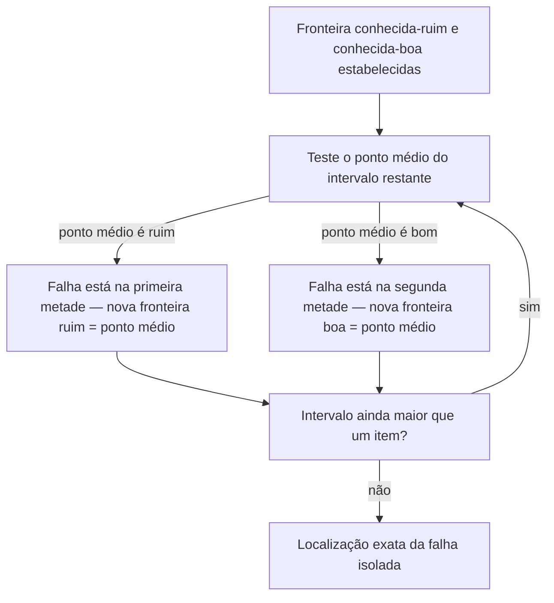

## Objetivos de Aprendizagem

- Explicar por que reproduzir um bug confiavelmente sob demanda é um pré-requisito para consertá-lo, não um primeiro passo opcional.
- Aplicar bissecção, a mesma ideia de dividir para conquistar usada para buscar em uma lista ordenada, para localizar uma falha dentro de uma entrada grande ou um grande intervalo de histórico do projeto.
- Distinguir bisseccionar sobre estado do programa (verificando um valor em um ponto médio) de bisseccionar sobre histórico do projeto (verificando uma revisão passada), e reconhecer ambos como instâncias da mesma técnica subjacente.
- Usar `git bisect` pelo nome como a ferramenta que automatiza bissecção de histórico através dos commits de um projeto, e descrever o que precisa do desenvolvedor para rodar.
- Julgar quando um bug é bisseccionável afinal, e reconhecer as condições (uma reprodução confiável, uma fronteira monotônica entre "bom" e "ruim") que tornam bissecção válida.

## Contexto e Motivação

O tratamento introdutório de depuração já cobre o formato básico do processo: forme uma hipótese sobre onde um bug vive, verifique um valor em algum ponto da computação, e estreite em direção a qualquer metade do programa que pareça inconsistente com o que era esperado. Essa versão da ideia está exatamente certa até onde vai, e geralmente é suficiente para um bug vivendo dentro de uma única chamada de função, em um programa pequeno o suficiente para manter na cabeça. Começa a falhar no momento em que uma de duas coisas acontece: o bug não reproduz confiavelmente, aparece "às vezes", ou só em uma entrada grande específica, ou só depois que o programa está rodando há um tempo, ou o espaço de busca não é mais um punhado de chamadas de função mas algo muito maior: um conjunto de dados com dezenas de milhares de registros, ou meses de histórico de projeto abrangendo centenas de commits, qualquer um dos quais poderia ser onde as coisas deram errado.

Ambas as situações exigem a mesma disciplina de duas partes, aplicada mais deliberadamente que antes. A primeira parte é reprodução: antes de gastar qualquer esforço tentando entender ou consertar um bug, faça-o falhar sob comando, toda vez, idealmente na menor entrada que ainda o dispara. Um bug que falha quatro vezes em cinco por razões que ninguém entende não pode ser confirmado consertado depois, porque "não falhou dessa vez" não é distinguível de "está consertado" quando a falha já era inconsistente para começar. A segunda parte é bissecção: uma vez que uma falha reproduz confiavelmente, trate o espaço em que poderia estar escondida, uma entrada grande, um longo trecho de histórico de commit, uma grande estrutura de dados intermediária, como algo para ser buscado testando repetidamente seu ponto médio e descartando qualquer metade que acabe não envolvida, exatamente da forma que uma lista ordenada é buscada por busca binária em vez de varrê-la da esquerda para a direita. Esse é o mesmo princípio de dividir para conquistar coberto no material de algoritmos, mirado aqui a um tipo diferente de alvo: não "onde está esse valor em um array ordenado" mas "onde, nesse espaço muito maior, a falha primeiro aparece."

Os materiais 6.031 do MIT sobre depuração e o Missing Semester of Your CS Education ambos tratam esse par, reprodução confiável, depois bissecção, como a técnica estrutural que separa localização de falha sistemática de tentativa-e-erro de mudar código e esperar que o sintoma vá embora. Missing Semester em particular existe porque ferramentas exatamente como essa, a mecânica real de encontrar uma regressão através de um grande histórico de commit, por exemplo, quase nunca são ensinadas explicitamente em um currículo de CC, apesar de serem algumas das habilidades mais confiavelmente úteis que um programador em atuação tem. A ferramenta que destaca para automatizar bissecção de histórico, `git bisect`, vale a pena conhecer pelo nome aqui especificamente porque é a mesma ideia que este conceito desenvolve manualmente, aplicada automaticamente ao histórico de commit de um projeto, uma ponte natural para os conceitos de controle de versão que seguem este.

## Teoria Central

### Reproduzindo um bug confiavelmente antes de tocar em qualquer coisa

A forma única mais comum pela qual esforço de depuração é desperdiçado é tentando um conserto antes que o bug possa ser disparado sob demanda. Se uma mudança é feita e o sintoma não recorre, há duas explicações possíveis: o conserto funcionou, ou o bug simplesmente não aconteceu de disparar nesta execução particular, exatamente como às vezes não dispara. Sem uma reprodução confiável, essas duas explicações são indistinguíveis, e "fiz uma mudança e parece consertado" não é uma afirmação que pode ser confiada.

Reproduzir confiavelmente geralmente significa encolher: se uma falha aparece em algum lugar dentro de um conjunto de dados de 50.000 linhas, o objetivo não é continuar rerodando o conjunto de dados completo enquanto investiga, mas encontrar o menor subconjunto, idealmente uma única linha, ou um punhado, que ainda dispara a mesma exata falha. O mesmo se aplica a uma falha que depende de uma sequência de operações: o objetivo é a sequência mais curta que ainda a reproduz. Uma reprodução grande, lenta, não confiável torna todo experimento subsequente caro e seu resultado ambíguo; uma pequena, rápida, confiável torna todo experimento subsequente barato e seu resultado confiável. Só uma vez que um bug reproduz confiavelmente faz sentido começar a estreitar onde vive, bissecção depende inteiramente de poder retestar a mesma falha repetidamente e obter uma resposta sim-ou-não consistente cada vez.

### Bissecção: dividir para conquistar aplicado a localização de falha

Bissecção assume um espaço de busca com uma estrutura específica: um ponto conhecido-bom, um ponto conhecido-ruim, e uma forma de testar qualquer ponto entre eles para classificá-lo como um ou outro. Dada essa estrutura, o algoritmo é exatamente busca binária: verifique o ponto médio; se é ruim, a falha está na primeira metade (ou é aquele próprio ponto médio); se é bom, a falha está na segunda metade; recurse na metade que resta, descartando a outra inteiramente. Todo teste divide pela metade o espaço restante, então um espaço de tamanho *n* é completamente localizado em aproximadamente log₂(*n*) testes em vez dos *n* testes que uma varredura linear através de todo ponto precisaria, o mesmo argumento de eficiência que torna busca binária preferível a varrer um array ordenado um elemento de cada vez.



A técnica funciona sobre qualquer espaço de busca que tenha esse formato "bom de um lado, ruim do outro, sem embaralhamento no meio", uma entrada grande dividida em pedaços, uma sequência de mudanças de código recentes ordenadas por suspeita, ou, mais concretamente, o histórico de commit de um projeto ordenado por tempo. O que bissecção precisa para ser *válida*, não meramente rápida, é que a fronteira entre bom e ruim seja monotônica através do espaço sendo buscado: uma vez que algo é ruim, tudo mais adiante naquela direção permanece ruim, sem nenhum ponto bom escondido do outro lado de um ruim. Um espaço de busca que alterna entre bom e ruim imprevisivelmente não pode ser bisseccionado corretamente, porque a classificação do ponto médio não mais diria confiavelmente qual metade descartar.

### Bisseccionando uma entrada grande

Quando uma falha é disparada por algum pedaço grande de dado, um arquivo grande, uma lista longa, um lote grande de registros, e só parte daqueles dados é de fato responsável, a mesma ideia se aplica diretamente: divida os dados aproximadamente pela metade, teste cada metade independentemente contra a mesma reprodução, e mantenha qualquer metade que ainda dispare a falha (descartando a outra, que agora é conhecida como inocente). Repetir isso contra a metade restante, de novo e de novo, converge no menor fragmento culpado muito mais rápido do que inspecionar os dados um registro de cada vez.

### Bisseccionando o histórico de um projeto: `git bisect`

A ideia idêntica, aplicada a uma sequência de commits em vez de uma sequência de registros de dado, é exatamente o que `git bisect` automatiza. Dado um commit conhecido bom (a falha não estava presente) e um commit conhecido ruim (a falha está presente agora), `git bisect` faz checkout do commit aproximadamente no meio entre eles e pergunta ao desenvolvedor, ou a um script de teste automatizado, para classificá-lo como bom ou ruim; baseado na resposta, estreita para a metade correspondente e faz checkout do novo ponto médio, repetindo até que exatamente um commit reste: aquele que introduziu a falha. Este conceito não precisa da sequência de comando exata para fazer o ponto (aquele detalhe mecânico pertence ao próprio controle de versão); o que importa aqui é reconhecer `git bisect` como a incorporação direta, bem conhecida, no nível de ferramenta, do mesmo princípio de bissecção que este conceito está ensinando manualmente, prova de que essa não é uma ideia de brinquedo inventada para uma sala de aula, mas uma técnica na qual equipes de engenharia reais confiam constantemente para encontrar exatamente quando algo quebrou através de potencialmente milhares de commits.

## Exemplos Resolvidos

### Exemplo 1 — bisseccionando uma entrada grande para encontrar o registro que quebra um analisador

**Problema:** Uma função de análise de CSV trava no meio de um arquivo de 100.000 linhas com um erro críptico. Rodar o arquivo inteiro e ler o stack trace não identificou qual linha está malformada.

**Passo 1 — reproduza confiavelmente.** Confirme que o travamento acontece toda vez neste exato arquivo (acontece, não é intermitente), então bissecção é válida.

**Passo 2 — bisseccione a entrada.** Divida o arquivo em linhas 1–50.000 e 50.001–100.000. Rode o analisador em cada metade independentemente.
- Linhas 1–50.000: analisa limpamente.
- Linhas 50.001–100.000: trava com o mesmo erro.

A falha está em algum lugar na segunda metade; a primeira metade agora é conhecida-inocente e pode ser deixada de lado inteiramente.

**Passo 3 — repita.** Divida linhas 50.001–100.000 em 50.001–75.000 e 75.001–100.000.
- 50.001–75.000: analisa limpamente.
- 75.001–100.000: trava.

**Passo 4 — continue dividindo pela metade.** Depois de aproximadamente 17 rodadas de dividir pela metade (já que 2^17 ≈ 131.000, confortavelmente cobrindo 100.000 linhas), o intervalo restante encolhe para uma única linha: linha 82.419. Inspecionar essa única linha diretamente mostra uma vírgula não escapada dentro de um campo entre aspas, a causa real.

**Por que isso venceu uma varredura linear:** verificar toda linha uma de cada vez até o travamento reaparecer poderia ter levado até 100.000 verificações individuais no pior caso; bissecção encontrou a linha exata em aproximadamente 17. A mesma redução, de *n* verificações para aproximadamente log₂(*n*), é o mesmo argumento de eficiência que torna busca binária preferível a uma varredura linear de uma lista ordenada.

### Exemplo 2 — bisseccionando uma lista de mudanças recentes ranqueadas por suspeita

**Problema:** Um relatório anteriormente funcionando começou a produzir um total errado em algum momento nas últimas 20 mudanças feitas na base de código, mas ninguém sabe qual, e as mudanças tocam vários arquivos não relacionados.

**Passo 1 — reproduza confiavelmente.** Confirme que o total errado reproduz toda vez que o relatório é gerado contra o mesmo conjunto de dados fixo de entrada, reproduz, então a fronteira é estável o suficiente para bisseccionar.

**Passo 2 — estabeleça a fronteira.** Mudança #1 (mais antiga) é conhecida-boa, o relatório estava correto naquela época. Mudança #20 (atual) é conhecida-ruim, o relatório está errado agora.

**Passo 3 — teste o ponto médio.** Reverta a base de código para o estado logo depois da mudança #10 e regenere o relatório. Está correto. Então mudanças #1–#10 são inocentes; a falha está em algum lugar em #11–#20.

**Passo 4 — estreite de novo.** Teste o estado depois da mudança #15: relatório está errado. Falha está em #11–#15.

**Passo 5 — estreite de novo.** Teste o estado depois da mudança #13: relatório está correto. Falha está em #14–#15.

**Passo 6 — passo final.** Teste o estado depois da mudança #14: relatório está errado. Já que #13 era boa e #14 é ruim, a própria mudança #14 é a culpada.

Cinco testes (#10, #15, #13, #14, mais a verificação de fronteira inicial) localizaram a falha entre 20 mudanças candidatas, de novo aproximadamente log₂(20) ≈ 4–5 testes, versus até 20 se cada mudança tivesse sido inspecionada uma de cada vez isoladamente, da mais antiga para a mais nova, esperando identificar o erro a olho.

### Exemplo 3 — a mesma ideia, automatizada: `git bisect`

**Problema:** Mesmo cenário do Exemplo 2, mas as 20 mudanças são 20 commits reais em um repositório git, e há um teste automatizado que retorna um código de saída não zero quando o total do relatório está errado.

```bash
git bisect start
git bisect bad                      # commit atual (HEAD) é conhecido-ruim
git bisect good v1.4-report-correct  # uma tag/commit 20 commits atrás, conhecido-bom
# git faz checkout do commit do ponto médio automaticamente
./run_report_test.sh                # sai não zero -> este ponto médio é ruim
git bisect bad
# git faz checkout do próximo ponto médio automaticamente
./run_report_test.sh                # sai zero -> este ponto médio é bom
git bisect good
# ... git continua estreitando por conta própria depois de todo bom/ruim ...
git bisect good                     # último passo: estreita para exatamente um commit
# git relata: <commit-hash> é o primeiro commit ruim
git bisect reset                    # retorna ao HEAD original quando terminado
```

Isso é mecanicamente idêntico ao processo manual do Exemplo 2, verifique o ponto médio, classifique-o, estreite na metade correspondente, repita, exceto que `git bisect` trata o checkout de cada commit do ponto médio automaticamente, e `git bisect run ./run_report_test.sh` pode até guiar o laço inteiro sem supervisão se um script pode classificar cada commit sem um humano no laço. O trabalho do desenvolvedor encolhe para duas coisas: definir a fronteira boa e ruim, e fornecer um teste confiável, automatizável, que é exatamente o requisito de reprodução confiável de anteriormente neste conceito, expresso como um script em vez de uma verificação manual.

## Equívocos Comuns e Armadilhas

- **"Depuração é só adivinhar repetidamente um conserto e rerodar."** Essa abordagem é sedutora porque às vezes funciona por acidente, mas um conserto alcançado sem saber *por que* o bug aconteceu pode igualmente mascarar a mesma falha em outro lugar ou introduzir uma nova. Depuração sistemática, reproduza, depois bisseccione, substitui adivinhação por uma busca que comprovadamente converge na causa real.
- **"Se um bug só acontece raramente, não há forma de estreitá-lo."** Um bug intermitente é exatamente o caso onde o passo de reprodução mais importa: o objetivo é primeiro encontrar *algum* conjunto de condições, frequentemente uma entrada específica, uma ordem específica, uma carga específica, sob as quais a falha se torna confiável, mesmo que isso signifique que originalmente era mascarada por algo como timing ou um valor de dado raro. Bissecção não pode começar até que a falha possa ser disparada sob demanda.
- **"Bissecção diz a linha exata que está errada."** Diz a *unidade* exata sob teste, uma linha, um commit, um pedaço, onde a falha primeiro aparece ou foi primeiro introduzida, não necessariamente a linha precisa dentro daquela unidade. Um commit bisseccionado ainda precisa ser lido para encontrar a linha realmente com bug dentro de seu diff; bissecção estreita o espaço de busca dramaticamente, mas o passo de inspeção final ainda é necessário.
- **"Bissecção funciona em qualquer intervalo de pontos bons e ruins."** Exige que a fronteira bom/ruim seja monotônica, uma vez que algo é ruim, tudo mais adiante naquela direção deve permanecer ruim. Um teste instável que às vezes relata "bom" para um commit que na verdade é ruim (ou vice-versa) quebra essa suposição e pode fazer `git bisect`, ou uma bissecção manual, convergir no ponto errado inteiramente; uma falha genuinamente não determinística tem que ser tornada confiável primeiro, exatamente como o passo de reprodução insiste.
- **"Bisseccionar um intervalo de commit só é útil para travamentos."** Qualquer condição consistentemente verificável funciona, um valor de saída errado, uma regressão de desempenho além de um limiar, um teste que agora falha quando costumava passar. `git bisect` não se importa com o que a verificação verifica, só que retorna uma resposta bom/ruim consistente para um dado commit.

## Resumo

O processo introdutório de isolar-e-consertar, verifique um valor em um ponto médio, estreite em qualquer metade que pareça errada, escala para duas situações mais difíceis adicionando uma disciplina na frente dele e um refinamento dentro dele. A disciplina na frente é reprodução confiável: faça o bug falhar sob comando, na menor entrada ou sequência mais curta que ainda o dispara, antes de gastar esforço tentando consertar qualquer coisa contra a qual um conserto ainda não pode ser verificado. O refinamento é bissecção propriamente dita: trate uma entrada grande, ou um longo trecho de histórico de projeto, como um espaço de busca com um lado conhecido-bom e um lado conhecido-ruim, e teste repetidamente o ponto médio para descartar qualquer metade que não esteja envolvida, o mesmo princípio de dividir para conquistar que torna busca binária eficiente, mirado aqui a localizar uma falha em vez de encontrar um valor em um array ordenado. `git bisect` é a ferramenta real, bem conhecida, que automatiza exatamente essa ideia através do histórico de commit de um projeto, precisando apenas de uma fronteira bom/ruim e um teste confiável para rodar sem supervisão, uma ponte direta, prática, para o material de controle de versão que segue.

## Documentation Links

- [MIT 6.031 Spring 2017 — Course Site (lecture list)](http://web.mit.edu/6.031/www/sp17/) — doc
- [The Missing Semester of Your CS Education (MIT)](https://missing.csail.mit.edu/) — doc
