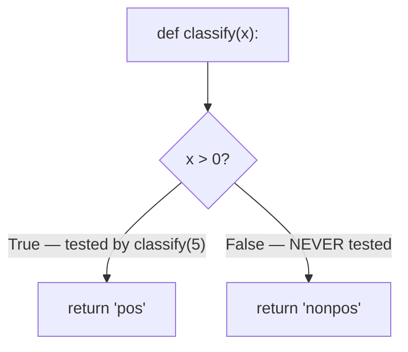

## Learning Objectives

- Define line coverage and branch coverage as measurable percentages, and compute them by hand for a small function and test suite.
- Explain precisely what a coverage percentage does and does not certify about a test suite.
- Construct a concrete example of a fully-covered function that still contains an uncaught bug, and explain why coverage alone missed it.
- Relate coverage measurement to the black-box/white-box distinction, and explain why coverage is fundamentally a white-box-style metric.
- Use a coverage report as a targeting tool for writing new tests, rather than as a correctness certificate.

## Context & Motivation

White-box testing calls for exercising every branch and every loop boundary in a function's code — but "make sure every branch gets exercised" is a discipline that is easy to state and, for anything beyond a small function, hard to verify by eye. A function with five nested conditionals has more branches than a human can reliably track through a growing test suite by memory. **Test coverage** answers this with a tool rather than a habit: instrument the code so that running the test suite records exactly which lines, and exactly which branches, actually executed, and report that as a measurable percentage — 87% line coverage means 87% of the function's executable lines ran during some test; 100% branch coverage means every `if` and every `else` was taken at least once, in both directions.

This measurability is genuinely valuable — it turns "did I test the branches thoroughly" from a guess into a number a tool computes automatically, and a coverage report can point directly at the specific lines nobody has tested yet, which is an excellent way to find gaps in a growing test suite. But the same measurability creates a trap that this concept exists specifically to name and defend against: a coverage percentage measures whether a line of code *ran*, not whether anything about what it *did* while running was actually checked. A test that calls a function and asserts nothing at all makes every line that function executes count as "covered" — 100%, if the test happens to touch every line — while verifying literally nothing about whether any of those lines behaved correctly. MIT's 6.005/6.031 software construction materials are explicit that coverage is a floor on confidence (a low number means real gaps definitely exist) but never a ceiling proving correctness (a high number does not mean the code is right, only that it ran). Confusing "every line ran" with "every line's behavior was checked" is exactly the mistake this concept is built to prevent.

## Core Theory

### Line coverage: a measurable percentage of lines executed

**Line coverage** is the fraction of a program's executable lines that ran at least once during a test suite's execution, expressed as a percentage. A coverage tool instruments the code (or observes it at runtime) to record, per line, whether it executed during the run; after the whole test suite finishes, "lines executed at least once" divided by "total executable lines" gives the line coverage percentage. This is the coarsest and most widely reported coverage metric, and it is entirely mechanical to compute — no judgment about correctness enters into it at all, only whether a line's machine code was reached.

### Branch coverage: a finer, structure-aware metric

**Branch coverage** refines line coverage by tracking not just whether a line containing a conditional executed, but whether *each direction* the conditional could take was actually exercised. A single `if x > 0: return "pos"` line can be reached (counting toward line coverage) by a test suite that only ever calls it with positive `x` — but the `else` path (falling through when `x <= 0`) might never be taken by any test, even though the line itself is "covered." Branch coverage requires both directions of every conditional to execute at least once across the whole test suite; it is a strictly more demanding, and more informative, requirement than line coverage, because it is possible to reach 100% line coverage while several branches remain completely untested.



In this diagram, calling `classify(5)` alone gives 100% line coverage (every line in the function ran) but only 50% branch coverage (only the `True` branch of the conditional was ever taken) — a gap line coverage alone cannot reveal, since it only tracks whether the `if` line itself executed, not which way it branched.

### The central, non-obvious point: coverage measures execution, not verification

The crucial fact this concept is built around: a coverage tool records that a line *ran*; it has no way to know, and makes no claim about, whether the test that ran it actually *checked* the result was correct. Consider:

```python
def add(a, b):
    return a + b

def test_add():
    add(2, 3)     # no assertion at all
```

`test_add` calls `add(2, 3)`, which executes both lines of `add` (the `def` line and the `return` line) — 100% line coverage, and since `add` has no conditionals, 100% branch coverage too, vacuously. But `test_add` contains no `assert` whatsoever: if `add` had a bug and actually returned `6` instead of `5`, this test would still pass, because nothing in it ever compares the result to anything. Coverage is 100%, and the test suite has verified precisely nothing. This is not a contrived edge case; it is the direct, mechanical consequence of what a coverage tool measures — execution, not verification — and it is the reason coverage percentages must never be read as a proxy for "how well-tested is this code."

### Coverage as a targeting tool, not a certificate

Used correctly, a coverage report is a way to find gaps — "these specific lines never ran during any test" is exactly the kind of information a white-box tester wants, because an untested line or untested branch is a place a bug could hide undetected. This is coverage's legitimate, valuable role: it converts "I hope I tested all the branches" into a specific, actionable list of exactly which ones weren't. What it cannot do is confirm that the lines which *did* run were checked against the right expected values — that responsibility belongs entirely to the quality of the assertions in each test, which no coverage tool measures at all.

## Worked Examples

### Example 1 — computing line and branch coverage by hand

**Function:**

```python
def sign(x):
    if x > 0:
        return "positive"
    elif x < 0:
        return "negative"
    else:
        return "zero"
```

**Test suite:**

```python
assert sign(5) == "positive"
assert sign(-3) == "negative"
```

**Line coverage.** Lines: `def sign(x):`, `if x > 0:`, `return "positive"`, `elif x < 0:`, `return "negative"`, `else:`, `return "zero"` — 7 lines total (counting the `def` line). Running `sign(5)` executes the `def`, `if`, and first `return` lines. Running `sign(-3)` executes `def`, `if` (evaluated, took the `elif` path), `elif`, and its `return`. The `else:` and `return "zero"` lines never run under either test. That's 5 of 7 lines executed at least once ≈ 71% line coverage.

**Branch coverage.** Three possible outcomes for this conditional chain: `x > 0` true, `x > 0` false and `x < 0` true, both false (the `else`). The test suite exercises the first two but never the third — 2 of 3 branches ≈ 67% branch coverage.

**Filling the gap.** Adding `assert sign(0) == "zero"` exercises the missing branch, bringing both line and branch coverage to 100%.

### Example 2 — a fully-covered function with an uncaught bug

**Function**, intended to return the larger of two numbers:

```python
def maximum(a, b):
    if a >= b:
        return a
    else:
        return a    # bug: should return b, but returns a instead
```

**Test suite**, written to reach both branches:

```python
def test_maximum():
    maximum(5, 3)    # exercises the `a >= b` True branch — no assertion
    maximum(3, 5)    # exercises the `a >= b` False branch — no assertion
```

**Coverage result.** Both branches of the `if a >= b` conditional are exercised — `maximum(5, 3)` takes the `True` path, `maximum(3, 5)` takes the `False` path — so this test suite reports 100% line coverage and 100% branch coverage. But neither call has an assertion, so the bug (the `else` branch incorrectly returns `a` instead of `b`) is completely invisible: `maximum(3, 5)` actually returns `3`, which is wrong (it should return `5`), and the test suite, despite touching every line and every branch, never once checks this. Coverage reached 100% while catching nothing, precisely because the metric only recorded that the buggy line *ran*, never that its *return value* was wrong. Adding the missing assertions —

```python
def test_maximum():
    assert maximum(5, 3) == 5    # a >= b branch, checked
    assert maximum(3, 5) == 5    # a < b branch — this assertion FAILS, exposing the bug
```

— reaches the exact same 100% coverage as before, but this time the second assertion fails immediately, because `maximum(3, 5)` returns `3` instead of the correct `5`. The coverage percentage did not change at all between the two versions of the test suite; what changed, and what actually mattered, was whether the tests checked the right expected value once they got there.

### Example 3 — reading a coverage report to target new tests

**Scenario:** a coverage tool reports that a `discount_calculator` module has 92% line coverage overall, but flags lines 14–17 (an `elif` branch handling a "bulk discount ≥ 100 units" case) as never executed by any test.

**Using this correctly:** the report is treated as a to-do list — write a test that supplies 100 or more units specifically to exercise lines 14–17, since that is a real, identified gap where a defect could be hiding completely unnoticed. **Using this incorrectly** would be to treat 92% as "the module is basically fine" and stop there, without asking whether the 92% that *did* run was ever checked against correct expected values in the first place — which the coverage number itself has no way to indicate one way or the other.

## Common Misconceptions & Pitfalls

- **"100% coverage means the code is correct."** Example 2 demonstrates this directly and concretely: a function with a genuine, returns-the-wrong-value bug can have every line and every branch reported as 100% covered, while the test suite that achieved that number contains no assertion capable of ever catching the bug.
- **"A test that doesn't assert anything doesn't count toward coverage."** It does — coverage tools only track whether a line *executed*, which happens regardless of whether the calling test bothered to check the result. `maximum(3, 5)` with no assertion still counts as having exercised that branch.
- **"Higher coverage always means a better test suite."** Coverage can be inflated by tests that touch a lot of code while checking little of it — a test suite that adds many assertion-free calls to boost line coverage without ever comparing an actual result to an expected one is, in the sense that matters, not a better test suite at all, only a higher-scoring one.
- **"Branch coverage and line coverage measure basically the same thing."** Example 1 shows a case where line coverage (71%) and branch coverage (67%) diverge, and in general branch coverage is strictly more demanding — a single line containing a conditional can be "covered" by exercising only one of its possible directions, which line coverage cannot detect as incomplete but branch coverage can.
- **"A coverage report tells you what to test next in full."** It tells you which lines or branches never ran — a genuinely useful and specific gap to close — but it says nothing about whether the tests that already reach 100%-covered lines are checking them against correct expected values; closing every gap a coverage report identifies can still leave a test suite that verifies nothing, as Example 2's fully-covered-but-assertion-free suite shows.

## Summary

Line coverage and branch coverage are measurable percentages — the fraction of a function's lines, or of its conditional branches in each direction, that actually executed during a test suite's run — computed mechanically by an instrumentation tool, with no judgment about correctness involved. The crucial, non-obvious fact is that a coverage percentage certifies only that code *ran*, never that its behavior was *checked*: a test that calls a function and asserts nothing at all drives coverage to 100% while verifying nothing whatsoever, and a function with a genuine, wrong-return-value bug can be fully covered by a test suite that happens to reach the buggy line without ever comparing its output to the correct expected value, exactly as in the `maximum` example. Used correctly, coverage is a targeting tool — it identifies specific untested lines or branches worth writing a test for — but it is a floor on confidence, never a ceiling proving correctness, and closing every gap a coverage report shows still leaves open whether the tests that reach 100% actually assert the right things.

## Documentation Links

- [ACM/IEEE CS2013 — Software Engineering Knowledge Area](https://csed.acm.org/knowledge-areas-software-engineering-se-cs2013-version/) — doc
- [MIT 6.031/6.005 — Course Home (OCW)](https://ocw.mit.edu/courses/6-005-software-construction-spring-2016/) — doc
