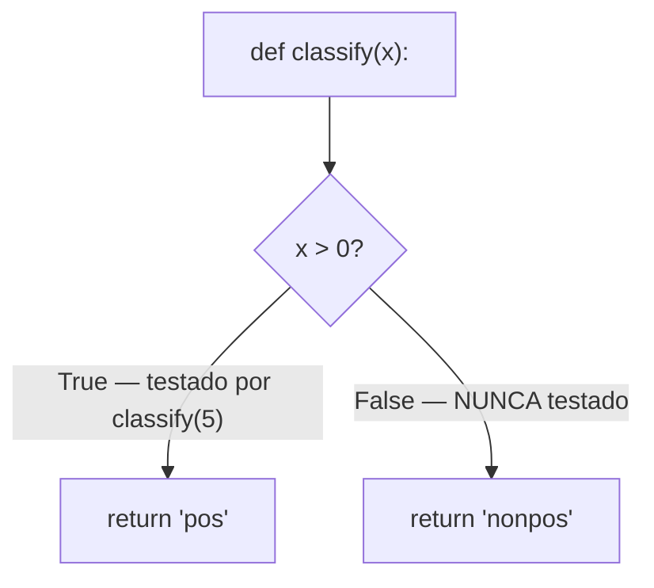

## Objetivos de Aprendizagem

- Definir cobertura de linha e cobertura de ramo como porcentagens mensuráveis, e calculá-las manualmente para uma função pequena e uma suíte de teste.
- Explicar precisamente o que uma porcentagem de cobertura certifica e não certifica sobre uma suíte de teste.
- Construir um exemplo concreto de uma função completamente coberta que ainda assim contém um bug não capturado, e explicar por que cobertura sozinha o perdeu.
- Relacionar medição de cobertura à distinção caixa-preta/caixa-branca, e explicar por que cobertura é fundamentalmente uma métrica estilo caixa-branca.
- Usar um relatório de cobertura como uma ferramenta de mira para escrever novos testes, em vez de como um certificado de correção.

## Contexto e Motivação

Teste caixa-branca pede exercitar todo ramo e toda fronteira de laço no código de uma função, mas "garanta que todo ramo seja exercitado" é uma disciplina fácil de enunciar e, para qualquer coisa além de uma função pequena, difícil de verificar a olho. Uma função com cinco condicionais aninhados tem mais ramos do que um humano pode confiavelmente rastrear através de uma suíte de teste crescente de memória. **Cobertura de teste** responde a isso com uma ferramenta em vez de um hábito: instrumente o código para que rodar a suíte de teste registre exatamente quais linhas, e exatamente quais ramos, de fato executaram, e relate isso como uma porcentagem mensurável, 87% de cobertura de linha significa que 87% das linhas executáveis da função rodaram durante algum teste; 100% de cobertura de ramo significa que todo `if` e todo `else` foi tomado pelo menos uma vez, em ambas as direções.

Essa mensurabilidade é genuinamente valiosa, transforma "testei os ramos completamente" de um palpite em um número que uma ferramenta calcula automaticamente, e um relatório de cobertura pode apontar diretamente para as linhas específicas que ninguém testou ainda, que é uma excelente forma de encontrar lacunas em uma suíte de teste crescente. Mas a mesma mensurabilidade cria uma armadilha que este conceito existe especificamente para nomear e defender contra: uma porcentagem de cobertura mede se uma linha de código *rodou*, não se algo sobre o que ela *fez* enquanto rodava foi de fato verificado. Um teste que chama uma função e não afirma absolutamente nada faz toda linha que aquela função executa contar como "coberta", 100%, se o teste acontece de tocar toda linha, enquanto verifica literalmente nada sobre se qualquer uma dessas linhas se comportou corretamente. Os materiais de construção de software 6.005/6.031 do MIT são explícitos que cobertura é um piso de confiança (um número baixo significa que lacunas reais definitivamente existem) mas nunca um teto provando correção (um número alto não significa que o código está certo, só que rodou). Confundir "toda linha rodou" com "o comportamento de toda linha foi verificado" é exatamente o erro que este conceito é construído para prevenir.

## Teoria Central

### Cobertura de linha: uma porcentagem mensurável de linhas executadas

**Cobertura de linha** é a fração das linhas executáveis de um programa que rodaram pelo menos uma vez durante a execução de uma suíte de teste, expressa como uma porcentagem. Uma ferramenta de cobertura instrumenta o código (ou o observa em tempo de execução) para registrar, por linha, se executou durante a execução; depois que a suíte de teste inteira termina, "linhas executadas pelo menos uma vez" dividido por "linhas executáveis totais" dá a porcentagem de cobertura de linha. Essa é a métrica de cobertura mais grosseira e mais amplamente relatada, e é inteiramente mecânica de calcular, nenhum julgamento sobre correção entra nela de forma alguma, só se o código de máquina de uma linha foi alcançado.

### Cobertura de ramo: uma métrica mais fina, ciente de estrutura

**Cobertura de ramo** refina cobertura de linha rastreando não só se uma linha contendo um condicional executou, mas se *cada direção* que o condicional poderia tomar foi de fato exercitada. Uma única linha `if x > 0: return "pos"` pode ser alcançada (contando para cobertura de linha) por uma suíte de teste que só a chama com `x` positivo, mas o caminho `else` (caindo através quando `x <= 0`) pode nunca ser tomado por nenhum teste, mesmo que a própria linha esteja "coberta." Cobertura de ramo exige que ambas as direções de todo condicional executem pelo menos uma vez através da suíte de teste inteira; é um requisito estritamente mais exigente, e mais informativo, que cobertura de linha, porque é possível alcançar 100% de cobertura de linha enquanto vários ramos permanecem completamente não testados.



Neste diagrama, chamar `classify(5)` sozinho dá 100% de cobertura de linha (toda linha na função rodou) mas só 50% de cobertura de ramo (só o ramo `True` do condicional foi jamais tomado), uma lacuna que cobertura de linha sozinha não pode revelar, já que só rastreia se a própria linha `if` executou, não para qual lado ramificou.

### O ponto central, não óbvio: cobertura mede execução, não verificação

O fato crucial em torno do qual este conceito é construído: uma ferramenta de cobertura registra que uma linha *rodou*; não tem como saber, e não faz nenhuma afirmação sobre, se o teste que a rodou de fato *verificou* que o resultado estava correto. Considere:

```python
def add(a, b):
    return a + b

def test_add():
    add(2, 3)     # nenhuma asserção de forma alguma
```

`test_add` chama `add(2, 3)`, que executa ambas as linhas de `add` (a linha `def` e a linha `return`), 100% de cobertura de linha, e já que `add` não tem condicionais, 100% de cobertura de ramo também, vacuamente. Mas `test_add` não contém nenhum `assert` de forma alguma: se `add` tivesse um bug e de fato retornasse `6` em vez de `5`, este teste ainda passaria, porque nada nele jamais compara o resultado a qualquer coisa. Cobertura é 100%, e a suíte de teste verificou precisamente nada. Este não é um caso de borda artificial; é a consequência direta, mecânica do que uma ferramenta de cobertura mede, execução, não verificação, e é a razão pela qual porcentagens de cobertura nunca devem ser lidas como um substituto para "quão bem testado este código está."

### Cobertura como uma ferramenta de mira, não um certificado

Usado corretamente, um relatório de cobertura é uma forma de encontrar lacunas, "essas linhas específicas nunca rodaram durante nenhum teste" é exatamente o tipo de informação que um testador caixa-branca quer, porque uma linha ou ramo não testado é um lugar onde um bug poderia se esconder não detectado. Esse é o papel legítimo, valioso, de cobertura: transforma "espero ter testado todos os ramos" em uma lista específica, acionável, de exatamente quais não foram. O que não pode fazer é confirmar que as linhas que de fato rodaram foram verificadas contra os valores esperados corretos, essa responsabilidade pertence inteiramente à qualidade das asserções em cada teste, que nenhuma ferramenta de cobertura mede de forma alguma.

## Exemplos Resolvidos

### Exemplo 1 — calculando cobertura de linha e ramo manualmente

**Função:**

```python
def sign(x):
    if x > 0:
        return "positive"
    elif x < 0:
        return "negative"
    else:
        return "zero"
```

**Suíte de teste:**

```python
assert sign(5) == "positive"
assert sign(-3) == "negative"
```

**Cobertura de linha.** Linhas: `def sign(x):`, `if x > 0:`, `return "positive"`, `elif x < 0:`, `return "negative"`, `else:`, `return "zero"`, 7 linhas totais (contando a linha `def`). Rodar `sign(5)` executa as linhas `def`, `if`, e o primeiro `return`. Rodar `sign(-3)` executa `def`, `if` (avaliado, tomou o caminho `elif`), `elif`, e seu `return`. As linhas `else:` e `return "zero"` nunca rodam sob nenhum dos dois testes. Isso é 5 de 7 linhas executadas pelo menos uma vez ≈ 71% de cobertura de linha.

**Cobertura de ramo.** Três resultados possíveis para essa cadeia condicional: `x > 0` verdadeiro, `x > 0` falso e `x < 0` verdadeiro, ambos falsos (o `else`). A suíte de teste exercita os dois primeiros mas nunca o terceiro, 2 de 3 ramos ≈ 67% de cobertura de ramo.

**Preenchendo a lacuna.** Adicionar `assert sign(0) == "zero"` exercita o ramo faltando, trazendo tanto cobertura de linha quanto de ramo para 100%.

### Exemplo 2 — uma função completamente coberta com um bug não capturado

**Função**, destinada a retornar o maior de dois números:

```python
def maximum(a, b):
    if a >= b:
        return a
    else:
        return a    # bug: deveria retornar b, mas retorna a em vez disso
```

**Suíte de teste**, escrita para alcançar ambos os ramos:

```python
def test_maximum():
    maximum(5, 3)    # exercita o ramo True de `a >= b` — nenhuma asserção
    maximum(3, 5)    # exercita o ramo False de `a >= b` — nenhuma asserção
```

**Resultado de cobertura.** Ambos os ramos do condicional `if a >= b` são exercitados, `maximum(5, 3)` toma o caminho `True`, `maximum(3, 5)` toma o caminho `False`, então essa suíte de teste relata 100% de cobertura de linha e 100% de cobertura de ramo. Mas nenhuma das chamadas tem uma asserção, então o bug (o ramo `else` incorretamente retorna `a` em vez de `b`) é completamente invisível: `maximum(3, 5)` de fato retorna `3`, que está errado (deveria retornar `5`), e a suíte de teste, apesar de tocar toda linha e todo ramo, nunca uma vez verifica isso. Cobertura alcançou 100% enquanto capturava nada, precisamente porque a métrica só registrou que a linha com bug *rodou*, nunca que seu *valor de retorno* estava errado. Adicionar as asserções faltando:

```python
def test_maximum():
    assert maximum(5, 3) == 5    # ramo a >= b, verificado
    assert maximum(3, 5) == 5    # ramo a < b — essa asserção FALHA, expondo o bug
```

alcança a mesma exata cobertura de 100% de antes, mas dessa vez a segunda asserção falha imediatamente, porque `maximum(3, 5)` retorna `3` em vez do correto `5`. A porcentagem de cobertura não mudou nada entre as duas versões da suíte de teste; o que mudou, e o que de fato importou, foi se os testes verificaram o valor esperado certo uma vez que chegaram lá.

### Exemplo 3 — lendo um relatório de cobertura para mirar novos testes

**Cenário:** uma ferramenta de cobertura relata que um módulo `discount_calculator` tem 92% de cobertura de linha no geral, mas sinaliza as linhas 14–17 (um ramo `elif` tratando um caso de "desconto por volume ≥ 100 unidades") como nunca executadas por nenhum teste.

**Usando isso corretamente:** o relatório é tratado como uma lista de tarefas, escreva um teste que forneça 100 ou mais unidades especificamente para exercitar as linhas 14–17, já que essa é uma lacuna real, identificada, onde um defeito poderia estar se escondendo completamente despercebido. **Usando isso incorretamente** seria tratar 92% como "o módulo está basicamente bem" e parar ali, sem perguntar se os 92% que de fato rodaram foram jamais verificados contra valores esperados corretos em primeiro lugar, o que o próprio número de cobertura não tem como indicar de nenhuma forma.

## Equívocos Comuns e Armadilhas

- **"100% de cobertura significa que o código está correto."** O Exemplo 2 demonstra isso direta e concretamente: uma função com um bug genuíno, retornando-o-valor-errado, pode ter toda linha e todo ramo relatado como 100% coberto, enquanto a suíte de teste que alcançou aquele número não contém nenhuma asserção capaz de jamais capturar o bug.
- **"Um teste que não afirma nada não conta para cobertura."** Conta, ferramentas de cobertura só rastreiam se uma linha *executou*, o que acontece independentemente de o teste chamador ter se incomodado em verificar o resultado. `maximum(3, 5)` sem nenhuma asserção ainda conta como tendo exercitado aquele ramo.
- **"Cobertura mais alta sempre significa uma suíte de teste melhor."** Cobertura pode ser inflada por testes que tocam muito código enquanto verificam pouco dele, uma suíte de teste que adiciona muitas chamadas sem asserção para aumentar cobertura de linha sem jamais comparar um resultado real a um esperado é, no sentido que importa, de forma alguma uma suíte de teste melhor, só uma pontuando mais alto.
- **"Cobertura de ramo e cobertura de linha medem basicamente a mesma coisa."** O Exemplo 1 mostra um caso onde cobertura de linha (71%) e cobertura de ramo (67%) divergem, e em geral cobertura de ramo é estritamente mais exigente, uma única linha contendo um condicional pode ser "coberta" exercitando só uma de suas direções possíveis, o que cobertura de linha não pode detectar como incompleta mas cobertura de ramo pode.
- **"Um relatório de cobertura diz o que testar em seguida por completo."** Diz quais linhas ou ramos nunca rodaram, uma lacuna genuinamente útil e específica para fechar, mas não diz nada sobre se os testes que já alcançam linhas 100%-cobertas as estão verificando contra valores esperados corretos; fechar toda lacuna que um relatório de cobertura identifica ainda pode deixar uma suíte de teste que verifica nada, como a suíte completamente-coberta-mas-sem-asserção do Exemplo 2 mostra.

## Resumo

Cobertura de linha e cobertura de ramo são porcentagens mensuráveis, a fração das linhas de uma função, ou de seus ramos condicionais em cada direção, que de fato executaram durante a execução de uma suíte de teste, calculadas mecanicamente por uma ferramenta de instrumentação, sem nenhum julgamento sobre correção envolvido. O fato crucial, não óbvio, é que uma porcentagem de cobertura certifica só que código *rodou*, nunca que seu comportamento foi *verificado*: um teste que chama uma função e não afirma absolutamente nada leva cobertura a 100% enquanto verifica absolutamente nada, e uma função com um bug genuíno, de valor-de-retorno-errado, pode ser completamente coberta por uma suíte de teste que acontece de alcançar a linha com bug sem jamais comparar sua saída ao valor esperado correto, exatamente como no exemplo `maximum`. Usada corretamente, cobertura é uma ferramenta de mira, identifica linhas ou ramos específicos não testados que valem a pena um teste, mas é um piso de confiança, nunca um teto provando correção, e fechar toda lacuna que um relatório de cobertura mostra ainda deixa em aberto se os testes que alcançam 100% de fato afirmam as coisas certas.

## Documentation Links

- [ACM/IEEE CS2013 — Software Engineering Knowledge Area](https://csed.acm.org/knowledge-areas-software-engineering-se-cs2013-version/) — doc
- [MIT 6.031/6.005 — Course Home (OCW)](https://ocw.mit.edu/courses/6-005-software-construction-spring-2016/) — doc
