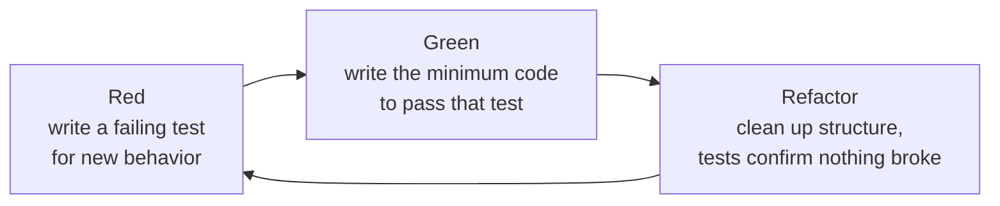

## Learning Objectives

- Explain the red-green-refactor cycle and what each of its three steps requires and forbids.
- Write a failing test before any implementation exists, and explain why the test must fail for the right reason before proceeding.
- Implement the minimum code needed to pass a specific failing test, resisting the urge to build more than that test demands.
- Refactor a passing implementation using the existing test suite as a safety net, without changing observable behavior.
- Contrast test-driven development with writing tests after the implementation, and identify what each order does and does not guarantee.

## Context & Motivation

Every testing idea covered so far — unit tests, integration tests, black-box and white-box test design, coverage as a way to find gaps — has assumed an order: code gets written first, and tests get written to check it afterward. **Test-driven development (TDD)** inverts that order deliberately, on the theory that the order itself changes what testing accomplishes. Writing a test *before* the code it tests exist forces a concrete answer to "what, exactly, should this function do?" before any implementation choices can bias the answer — there is no code yet to peek at, no temptation to write a test that merely confirms whatever the code already happens to do.

The discipline is organized around a short, repeating cycle: **red** (write a test for a small piece of not-yet-existing behavior, and watch it fail, since the behavior doesn't exist yet), **green** (write the smallest, most direct implementation that makes that specific test pass — no more), and **refactor** (clean up the implementation's internal structure, with the now-passing test suite standing guard to confirm that cleanup didn't change any observable behavior). MIT's 6.031 materials present this cycle as a genuine discipline, not a superstition: each step has a specific purpose, and skipping any one of them gives up something real. Skipping red means never confirming the test can actually fail — a test that passes trivially, even without the intended implementation, isn't testing anything. Skipping green's "minimum" constraint means building speculative functionality nothing has demanded yet. Skipping refactor means every implementation, once merely working, stays exactly as ugly as it was when it first turned green, since nothing afterward forces a second look.

TDD's relationship to a concept covered elsewhere in this discipline — refactoring — is direct and load-bearing: refactoring is only safe to do confidently when there is a trustworthy test suite to catch any accidental behavior change, and TDD's cycle guarantees that safety net exists *before* refactoring is ever attempted, because the test for the behavior being refactored was written first, as part of red, and passed as part of green, well before any cleanup begins.

## Core Theory

### The red step: a failing test for behavior that doesn't exist yet

Red means writing one small, specific test for one small, specific piece of behavior — before any code implementing that behavior exists — and running it to confirm it actually fails. Confirming the failure is not a formality: a test that "passes" even though the intended implementation doesn't exist yet is not testing what it claims to test (perhaps it has a typo, or asserts something trivially true regardless of the code), and building on top of a test that can't actually fail gives no real safety net at all. The test at this stage should fail for an *expected* reason — typically because the function it calls doesn't exist yet, or raises `NameError`/`AttributeError` — confirming the test is actually wired up to check the thing it's supposed to check.

### The green step: the minimum code to pass, and nothing more

Green means writing the smallest, most direct implementation that makes the one failing test pass — deliberately not more than that. This constraint feels counterintuitive at first (why not just write the "real," general solution immediately?) but it serves a specific purpose: it keeps every line of production code traceable to a specific test that demanded it, which means nothing ends up in the codebase that isn't backed by a test confirming it's needed and confirming what it should do. A famous, deliberately extreme version of this discipline is writing `return 4` to pass a single test case that only ever calls the function with inputs whose correct answer is `4` — obviously not a general solution, but a legitimate, if very small, green step, on the theory that the *next* failing test (with a different expected answer) will force the implementation to generalize.

### The refactor step: cleaning up with tests as a safety net

Refactor means improving the internal structure of code that is already passing its tests — renaming things, removing duplication, simplifying logic — without changing what it does from the outside. This is exactly the step that depends on the tests already written during red and passed during green: without them, "clean this up" carries real risk of silently changing behavior; with a passing test suite already in place, refactoring can proceed and then be checked immediately by re-running the same tests, confirming nothing observable moved. This dependency runs in one direction only — refactoring needs tests as its safety net, but writing tests first (red) does not, by itself, require any refactoring to have happened; the two ideas connect only through this one shared mechanism, and refactoring itself is developed as its own concept elsewhere in this discipline.



### Why the order matters, not just the presence of tests

A test suite written entirely after an implementation already exists can still be thorough, and can still catch real bugs — but it is written with the implementation already visible, which creates exactly the risk black-box testing is designed to avoid: a test author who has already seen the code can unconsciously write tests that match what the code happens to do, rather than what it was actually supposed to do. Writing the test first removes this risk structurally, not just by good intention — there is nothing yet to look at, so the test can only be derived from the intended specification. This is TDD's deeper connection to the black-box/white-box distinction: a test written strictly before any implementation is, by construction, a black-box test, because no implementation exists yet for it to be biased by.

## Worked Examples

### Example — TDD for `is_prime(n)`, one full cycle at a time

**Goal:** write a function `is_prime(n)` that returns `True` if `n` is a prime number (an integer greater than 1 with no positive divisors other than 1 and itself), `False` otherwise.

**Cycle 1 — red.** Write the smallest useful failing test first, before `is_prime` exists at all:

```python
def test_is_prime_smallest_prime():
    assert is_prime(2) is True
```

Running this fails immediately with `NameError: name 'is_prime' is not defined` — confirming the test actually exercises something that doesn't exist yet, which is exactly the expected, correct kind of failure at this stage.

**Cycle 1 — green.** Write the minimum code to make just this one test pass:

```python
def is_prime(n):
    return True
```

This is a deliberately trivial, non-general implementation — but it makes the one existing test pass, and nothing more has been claimed or built than that single test demands.

**Cycle 1 — refactor.** Nothing meaningful to clean up yet in a one-line function; skip refactor for this cycle and move to the next red step, which will supply the pressure that forces real logic to appear.

**Cycle 2 — red.** Add a test the current trivial implementation cannot possibly pass:

```python
def test_is_prime_smallest_prime():
    assert is_prime(2) is True

def test_is_prime_rejects_a_composite():
    assert is_prime(4) is False
```

Running the suite: the first test still passes (trivially), but `test_is_prime_rejects_a_composite` fails — `is_prime(4)` returns `True` from the current stub, but the test expects `False`. A genuine, expected red.

**Cycle 2 — green.** The trivial `return True` can no longer survive; write the minimum real logic that satisfies both current tests:

```python
def is_prime(n):
    if n < 2:
        return False
    for i in range(2, n):
        if n % i == 0:
            return False
    return True
```

Both tests now pass: `is_prime(2)` finds no divisor in `range(2, 2)` (empty, since the loop never runs) and correctly returns `True`; `is_prime(4)` finds `2` divides it evenly and returns `False`.

**Cycle 3 — red.** Add a boundary case this implementation hasn't been checked against — `n = 1`, which is explicitly excluded from primality by definition but is a case a careless implementation could get wrong:

```python
def test_is_prime_rejects_one():
    assert is_prime(1) is False
```

Running it: this already passes, because the `if n < 2: return False` branch, added in cycle 2's green step, already handles it — a genuine green on the first try, which is a legitimate outcome (not every new test forces new production code; sometimes existing code already generalizes correctly, and the new test simply documents and locks in that fact).

**Cycle 3 — refactor.** With three tests passing and standing as a safety net, the current implementation's `for i in range(2, n)` loop is correct but does more work than necessary — it can check divisors only up to `n`'s square root, since any factor larger than the square root would have a matching factor smaller than it already found:

```python
def is_prime(n):
    if n < 2:
        return False
    i = 2
    while i * i <= n:
        if n % i == 0:
            return False
        i += 1
    return True
```

Re-running all three existing tests confirms this refactor changed nothing observable — `is_prime(2)`, `is_prime(4)`, and `is_prime(1)` all still return exactly what they did before — while the implementation's internal efficiency improved. This is precisely refactoring's dependency on TDD's earlier steps made concrete: the change was made with confidence specifically because a trustworthy set of tests, written before this refactor and already passing, could immediately confirm nothing broke.

## Common Misconceptions & Pitfalls

- **"TDD means writing all the tests first, then all the implementation."** The cycle is one small test, then one small implementation increment, repeated — not a large upfront test suite followed by a large implementation phase; each red step targets one new piece of behavior, immediately followed by its own green step.
- **"The green step should just write the correct, general solution immediately."** The `is_prime` example's cycle 1 deliberately writes `return True` — an obviously non-general stub — because the discipline's value comes from every piece of generality being demanded by a specific failing test (as cycle 2 demands real logic), not supplied speculatively ahead of any test requiring it.
- **"If a new test passes without changing any code, TDD has failed somehow."** Cycle 3 shows a legitimate green-on-first-try: `is_prime(1)` already worked because of logic added for an earlier test. A new test passing immediately is a genuine, useful outcome — it confirms and locks in a case the existing implementation already handles, rather than signaling anything went wrong.
- **"Refactoring is a separate, optional step that can be skipped safely."** Skipping refactor doesn't break anything immediately, but it means an implementation that first worked as a hasty stub (or, as generalized, an inefficient loop) stays that way indefinitely, since nothing about the red-green cycle by itself forces a second look at internal structure — refactor is the step that actually uses the safety net red and green built.
- **"Writing tests after the code, if done carefully, is exactly as good as TDD."** A careful post-hoc test suite can still be thorough — but it is written by someone who has already seen the implementation, which risks a test unconsciously shaped to match what the code does rather than what it was supposed to do; a test written strictly before any implementation exists cannot have this particular bias, by construction, since there is no implementation yet to be influenced by.

## Summary

Test-driven development structures work as a short, repeating cycle: red (a new test, written before its behavior exists, confirmed to fail for the right reason), green (the minimum implementation that makes just that test pass, no more), and refactor (cleaning up the now-passing implementation's structure, with the existing tests standing guard to confirm nothing observable changed). The `is_prime` example walks all three steps concretely across several small cycles — a trivial stub forced to generalize by a new failing test, and a later efficiency improvement made confidently because a trustworthy test suite, built by the cycle itself, could immediately verify the refactor changed nothing. TDD's order — test before code — is what gives it a structural, not just intentional, resistance to the bias a post-hoc test author risks by having already seen the implementation; and its refactor step is the direct, load-bearing link to refactoring as a concept elsewhere in this discipline, which depends entirely on a trustworthy test suite existing first.

## Documentation Links

- [MIT 6.031 Spring 2017 — Course Site (lecture list)](http://web.mit.edu/6.031/www/sp17/) — doc
- [ACM/IEEE CS2013 — Software Engineering Knowledge Area](https://csed.acm.org/knowledge-areas-software-engineering-se-cs2013-version/) — doc
