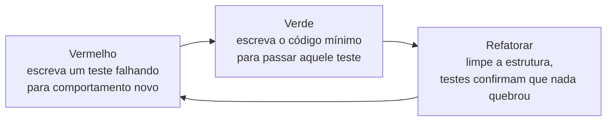

## Objetivos de Aprendizagem

- Explicar o ciclo vermelho-verde-refatorar e o que cada um de seus três passos exige e proíbe.
- Escrever um teste falhando antes de qualquer implementação existir, e explicar por que o teste deve falhar pela razão certa antes de prosseguir.
- Implementar o código mínimo necessário para passar em um teste falhando específico, resistindo ao impulso de construir mais do que aquele teste exige.
- Refatorar uma implementação passando usando a suíte de teste existente como uma rede de segurança, sem mudar comportamento observável.
- Contrastar desenvolvimento guiado por testes com escrever testes depois da implementação, e identificar o que cada ordem garante e não garante.

## Contexto e Motivação

Toda ideia de teste coberta até agora, testes de unidade, testes de integração, design de teste caixa-preta e caixa-branca, cobertura como uma forma de encontrar lacunas, assumiu uma ordem: código é escrito primeiro, e testes são escritos para verificá-lo depois. **Desenvolvimento guiado por testes (TDD)** inverte essa ordem deliberadamente, sob a teoria de que a própria ordem muda o que testar realiza. Escrever um teste *antes* do código que testa existir força uma resposta concreta a "o que, exatamente, essa função deveria fazer?" antes que qualquer escolha de implementação possa enviesar a resposta, não há código ainda para espiar, nenhuma tentação de escrever um teste que meramente confirma o que quer que o código já aconteça de fazer.

A disciplina é organizada em torno de um ciclo curto, repetido: **vermelho** (escreva um teste para um pequeno pedaço de comportamento ainda não existente, e observe-o falhar, já que o comportamento não existe ainda), **verde** (escreva a implementação mais mínima, mais direta que faz aquele teste específico passar, nada mais), e **refatorar** (limpe a estrutura interna da implementação, com a suíte de teste agora passando fazendo guarda para confirmar que a limpeza não mudou nenhum comportamento observável). Os materiais 6.031 do MIT apresentam esse ciclo como uma disciplina genuína, não uma superstição: cada passo tem um propósito específico, e pular qualquer um deles desiste de algo real. Pular vermelho significa nunca confirmar que o teste de fato pode falhar, um teste que passa trivialmente, mesmo sem a implementação pretendida, não está testando nada. Pular a restrição de "mínimo" de verde significa construir funcionalidade especulativa que nada exigiu ainda. Pular refatorar significa que toda implementação, uma vez meramente funcionando, permanece exatamente tão feia quanto era quando primeiro ficou verde, já que nada depois força um segundo olhar.

A relação de TDD com um conceito coberto em outro lugar nesta disciplina, refatoração, é direta e estrutural: refatorar só é seguro de fazer com confiança quando há uma suíte de teste confiável para capturar qualquer mudança de comportamento acidental, e o ciclo de TDD garante que essa rede de segurança existe *antes* que refatoração seja jamais tentada, porque o teste para o comportamento sendo refatorado foi escrito primeiro, como parte de vermelho, e passou como parte de verde, bem antes que qualquer limpeza comece.

## Teoria Central

### O passo vermelho: um teste falhando para comportamento que ainda não existe

Vermelho significa escrever um teste pequeno, específico, para um pequeno pedaço específico de comportamento, antes que qualquer código implementando aquele comportamento exista, e rodá-lo para confirmar que de fato falha. Confirmar a falha não é uma formalidade: um teste que "passa" mesmo que a implementação pretendida ainda não exista não está testando o que afirma testar (talvez tenha um erro de digitação, ou afirme algo trivialmente verdadeiro independentemente do código), e construir em cima de um teste que não consegue de fato falhar não dá nenhuma rede de segurança real de forma alguma. O teste neste estágio deveria falhar por uma razão *esperada*, tipicamente porque a função que chama ainda não existe, ou levanta `NameError`/`AttributeError`, confirmando que o teste está de fato conectado para verificar a coisa que deveria verificar.

### O passo verde: o código mínimo para passar, e nada mais

Verde significa escrever a implementação mais mínima, mais direta que faz o único teste falhando passar, deliberadamente não mais que isso. Essa restrição parece contraintuitiva a princípio (por que não apenas escrever a solução "real", geral, imediatamente?) mas serve um propósito específico: mantém toda linha de código de produção rastreável para um teste específico que a exigiu, o que significa que nada acaba na base de código que não é apoiado por um teste confirmando que é necessário e confirmando o que deveria fazer. Uma versão famosa, deliberadamente extrema, dessa disciplina é escrever `return 4` para passar em um único caso de teste que só jamais chama a função com entradas cuja resposta correta é `4`, obviamente não uma solução geral, mas um passo verde legítimo, ainda que muito pequeno, sob a teoria de que o *próximo* teste falhando (com uma resposta esperada diferente) forçará a implementação a generalizar.

### O passo refatorar: limpando com testes como rede de segurança

Refatorar significa melhorar a estrutura interna de código que já está passando em seus testes, renomeando coisas, removendo duplicação, simplificando lógica, sem mudar o que faz de fora. Esse é exatamente o passo que depende dos testes já escritos durante vermelho e passados durante verde: sem eles, "limpe isso" carrega risco real de silenciosamente mudar comportamento; com uma suíte de teste passando já em vigor, refatoração pode prosseguir e depois ser verificada imediatamente rerodando os mesmos testes, confirmando que nada observável se moveu. Essa dependência corre em uma única direção, refatoração precisa de testes como sua rede de segurança, mas escrever testes primeiro (vermelho) não exige, por si só, que nenhuma refatoração tenha acontecido; as duas ideias se conectam só através desse mecanismo compartilhado, e refatoração em si é desenvolvida como seu próprio conceito em outro lugar nesta disciplina.



### Por que a ordem importa, não só a presença de testes

Uma suíte de teste escrita inteiramente depois que uma implementação já existe ainda pode ser completa, e ainda pode capturar bugs reais, mas é escrita com a implementação já visível, o que cria exatamente o risco que teste caixa-preta é projetado para evitar: um autor de teste que já viu o código pode inconscientemente escrever testes que combinam com o que o código acontece de fazer, em vez do que de fato deveria fazer. Escrever o teste primeiro remove esse risco estruturalmente, não só por boa intenção, não há nada ainda para olhar, então o teste só pode ser derivado da especificação pretendida. Essa é a conexão mais profunda de TDD com a distinção caixa-preta/caixa-branca: um teste escrito estritamente antes de qualquer implementação é, por construção, um teste caixa-preta, porque nenhuma implementação existe ainda para enviesá-lo.

## Exemplos Resolvidos

### Exemplo — TDD para `is_prime(n)`, um ciclo completo de cada vez

**Objetivo:** escreva uma função `is_prime(n)` que retorna `True` se `n` é um número primo (um inteiro maior que 1 sem divisores positivos além de 1 e ele mesmo), `False` caso contrário.

**Ciclo 1 — vermelho.** Escreva o menor teste falhando útil primeiro, antes de `is_prime` existir de forma alguma:

```python
def test_is_prime_smallest_prime():
    assert is_prime(2) is True
```

Rodar isso falha imediatamente com `NameError: name 'is_prime' is not defined`, confirmando que o teste de fato exercita algo que ainda não existe, que é exatamente o tipo de falha esperado, correto, neste estágio.

**Ciclo 1 — verde.** Escreva o código mínimo para fazer só esse único teste passar:

```python
def is_prime(n):
    return True
```

Essa é uma implementação deliberadamente trivial, não geral, mas faz o único teste existente passar, e nada mais foi afirmado ou construído além do que aquele único teste exige.

**Ciclo 1 — refatorar.** Nada significativo para limpar ainda em uma função de uma linha; pule refatorar neste ciclo e vá para o próximo passo vermelho, que fornecerá a pressão que força lógica real a aparecer.

**Ciclo 2 — vermelho.** Adicione um teste que a implementação trivial atual não pode possivelmente passar:

```python
def test_is_prime_smallest_prime():
    assert is_prime(2) is True

def test_is_prime_rejects_a_composite():
    assert is_prime(4) is False
```

Rodando a suíte: o primeiro teste ainda passa (trivialmente), mas `test_is_prime_rejects_a_composite` falha, `is_prime(4)` retorna `True` do stub atual, mas o teste espera `False`. Um vermelho genuíno, esperado.

**Ciclo 2 — verde.** O `return True` trivial não pode mais sobreviver; escreva a lógica real mínima que satisfaz ambos os testes atuais:

```python
def is_prime(n):
    if n < 2:
        return False
    for i in range(2, n):
        if n % i == 0:
            return False
    return True
```

Ambos os testes agora passam: `is_prime(2)` não encontra nenhum divisor em `range(2, 2)` (vazio, já que o laço nunca roda) e corretamente retorna `True`; `is_prime(4)` encontra que `2` a divide exatamente e retorna `False`.

**Ciclo 3 — vermelho.** Adicione um caso de fronteira contra o qual essa implementação não foi verificada, `n = 1`, que é explicitamente excluído de primalidade por definição mas é um caso que uma implementação descuidada poderia errar:

```python
def test_is_prime_rejects_one():
    assert is_prime(1) is False
```

Rodando isso: já passa, porque o ramo `if n < 2: return False`, adicionado no passo verde do ciclo 2, já o trata, um verde genuíno na primeira tentativa, que é um resultado legítimo (nem todo novo teste força novo código de produção; às vezes código existente já generaliza corretamente, e o novo teste simplesmente documenta e trava esse fato).

**Ciclo 3 — refatorar.** Com três testes passando e servindo como uma rede de segurança, o laço atual `for i in range(2, n)` da implementação está correto mas faz mais trabalho do que necessário, pode verificar divisores só até a raiz quadrada de `n`, já que qualquer fator maior que a raiz quadrada teria um fator correspondente menor que já teria sido encontrado:

```python
def is_prime(n):
    if n < 2:
        return False
    i = 2
    while i * i <= n:
        if n % i == 0:
            return False
        i += 1
    return True
```

Rerodar todos os três testes existentes confirma que essa refatoração não mudou nada observável, `is_prime(2)`, `is_prime(4)`, e `is_prime(1)` todos ainda retornam exatamente o que retornavam antes, enquanto a eficiência interna da implementação melhorou. Isso é precisamente a dependência da refatoração nos passos anteriores de TDD tornada concreta: a mudança foi feita com confiança especificamente porque um conjunto confiável de testes, escrito antes dessa refatoração e já passando, pôde confirmar imediatamente que nada quebrou.

## Equívocos Comuns e Armadilhas

- **"TDD significa escrever todos os testes primeiro, depois toda a implementação."** O ciclo é um pequeno teste, depois um pequeno incremento de implementação, repetido, não uma grande suíte de teste antecipada seguida por uma grande fase de implementação; cada passo vermelho mira um novo pedaço de comportamento, imediatamente seguido por seu próprio passo verde.
- **"O passo verde deveria apenas escrever a solução correta, geral, imediatamente."** O ciclo 1 do exemplo `is_prime` deliberadamente escreve `return True`, um stub obviamente não geral, porque o valor da disciplina vem de toda peça de generalidade ser exigida por um teste falhando específico (como o ciclo 2 exige lógica real), não fornecida especulativamente antes de qualquer teste exigi-la.
- **"Se um novo teste passa sem mudar nenhum código, TDD falhou de alguma forma."** O ciclo 3 mostra um verde-na-primeira-tentativa legítimo: `is_prime(1)` já funcionava por causa de lógica adicionada para um teste anterior. Um novo teste passando imediatamente é um resultado genuíno, útil, confirma e trava um caso que a implementação existente já trata, em vez de sinalizar que algo deu errado.
- **"Refatorar é um passo separado, opcional, que pode ser pulado com segurança."** Pular refatorar não quebra nada imediatamente, mas significa que uma implementação que primeiro funcionou como um stub apressado (ou, conforme generalizado, um laço ineficiente) permanece assim indefinidamente, já que nada sobre o ciclo vermelho-verde por si só força um segundo olhar sobre a estrutura interna, refatorar é o passo que de fato usa a rede de segurança que vermelho e verde construíram.
- **"Escrever testes depois do código, se feito cuidadosamente, é exatamente tão bom quanto TDD."** Uma suíte de teste posterior cuidadosa ainda pode ser completa, mas é escrita por alguém que já viu a implementação, o que arrisca um teste inconscientemente moldado para combinar com o que o código faz em vez do que deveria fazer; um teste escrito estritamente antes de qualquer implementação existir não pode ter esse viés particular, por construção, já que não há implementação ainda para ser influenciado por ela.

## Resumo

Desenvolvimento guiado por testes estrutura o trabalho como um ciclo curto, repetido: vermelho (um novo teste, escrito antes de seu comportamento existir, confirmado a falhar pela razão certa), verde (a implementação mínima que faz só aquele teste passar, nada mais), e refatorar (limpar a estrutura da implementação agora passando, com os testes existentes fazendo guarda para confirmar que nada observável mudou). O exemplo `is_prime` percorre os três passos concretamente através de vários pequenos ciclos, um stub trivial forçado a generalizar por um novo teste falhando, e uma melhoria de eficiência posterior feita com confiança porque uma suíte de teste confiável, construída pelo próprio ciclo, pôde verificar imediatamente que a refatoração não mudou nada. A ordem de TDD, teste antes de código, é o que dá a ele uma resistência estrutural, não só intencional, ao viés que um autor de teste posterior arrisca por já ter visto a implementação; e seu passo de refatorar é a conexão direta, estrutural, com refatoração como um conceito em outro lugar nesta disciplina, que depende inteiramente de uma suíte de teste confiável existir primeiro.

## Documentation Links

- [MIT 6.031 Spring 2017 — Course Site (lecture list)](http://web.mit.edu/6.031/www/sp17/) — doc
- [ACM/IEEE CS2013 — Software Engineering Knowledge Area](https://csed.acm.org/knowledge-areas-software-engineering-se-cs2013-version/) — doc
