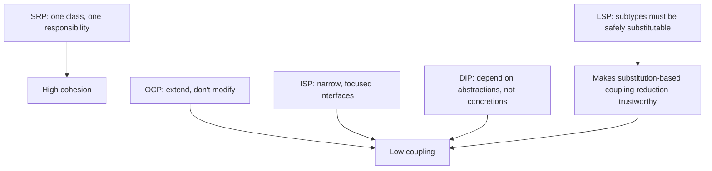

## Learning Objectives

- State the origin of the SOLID principles honestly: an industry convention first articulated by Robert C. Martin, subsequently adopted into academic teaching, not a result that originated in academic research.
- State each of the five SOLID principles by name and in one clear sentence.
- Give a concrete before/after code example illustrating the Single Responsibility Principle and the Dependency Inversion Principle.
- Explain how all five principles connect back to keeping coupling low and cohesion high, specifically in object-oriented designs.

## Context & Motivation

It matters to be precise about where SOLID actually comes from, because getting this wrong is itself a small lesson in how software engineering knowledge travels. SOLID was not the output of an academic research program — it was assembled and named by **Robert C. Martin** (widely known by the byline "Uncle Bob"), a working software consultant, who articulated the individual principles across his writing and consulting practice in the late 1990s and early 2000s (drawing in part on ideas already circulating from other practitioners, notably Bertrand Meyer for Open/Closed and Barbara Liskov for the substitution principle bearing her name), and the "SOLID" acronym itself was later coined by Michael Feathers to name the bundle of five as a memorable set. It is industry-originated, practitioner-driven guidance — a distillation of what experienced object-oriented developers had observed working, and failing, repeatedly, in real production codebases.

That said, SOLID is genuinely, widely taught in academic courses today — this is not a claim that it's absent from the classroom, only a claim about which direction the knowledge flowed. Texas A&M's CSCE 315 (Programming Studio) lecture materials on SOLID are cited here as real evidence that it's taught, not as evidence of where it came from; the university adopted an already-established industry convention into its curriculum, which is exactly the ordinary, healthy way applied engineering knowledge is supposed to move from practice into formal teaching. Being honest about this direction matters practically, too: SOLID is not a set of provable theorems in the way the tree theorems in the discrete-math material are — it is a set of hard-won heuristics, and like any heuristic, it can be misapplied or over-applied (a running theme this concept returns to in Common Misconceptions).

With the coupling-and-cohesion concept already covered, SOLID's actual content is almost immediate: all five letters are concrete techniques for achieving exactly those two things — low coupling, high cohesion — specialized to the situation of an object-oriented design, where the relevant relationships are between classes, interfaces, and inheritance hierarchies rather than modules in the abstract. Each principle below is stated plainly, and two of the five — the two most concretely illustrable in a short example — get a full before/after code walkthrough.

## Core Theory

### The five principles, named and stated

- **S — Single Responsibility Principle (SRP):** a class should have only one reason to change, i.e., one responsibility. This is cohesion, stated as a rule for classes specifically: everything inside a class's boundary should belong to the same one job.
- **O — Open/Closed Principle (OCP):** a class should be open for extension but closed for modification — new behavior should be addable without editing the existing, already-tested code of a class that already works.
- **L — Liskov Substitution Principle (LSP):** a subtype must be usable anywhere its supertype is expected, without the caller noticing a difference in correctness — named for Barbara Liskov, who first stated this substitutability requirement formally.
- **I — Interface Segregation Principle (ISP):** clients should not be forced to depend on methods they don't use — many small, focused interfaces are better than one large interface that bundles unrelated capabilities together.
- **D — Dependency Inversion Principle (DIP):** high-level modules (the ones expressing policy and business rules) should not depend on low-level modules (the ones expressing implementation detail) directly; both should depend on a shared abstraction instead.

### Why all five reduce to coupling and cohesion

SRP is cohesion by another name: one class, one reason to change, exactly the "would removing one responsibility also remove the reason the rest belong together" test from the coupling-and-cohesion concept, applied specifically to a class rather than a module in general. OCP, ISP, and DIP are all, in different ways, about coupling: OCP keeps a caller's dependency on a class *stable* even as that class's capabilities grow, by extending through new subclasses or composed strategies rather than editing shared code (echoing the Strategy pattern's shape directly); ISP keeps a caller from being coupled to methods it was never going to call, by narrowing the interface it depends on to only what it actually needs; DIP inverts the natural direction of coupling so that both a high-level policy class and a low-level detail class depend on a shared, stable abstraction, rather than the high-level policy depending directly on the low-level detail's concrete type. LSP is the correctness condition that makes all of this substitution-based coupling-reduction actually safe — if a subtype can silently violate a supertype's contract, then substituting one for another (the entire mechanism OCP, ISP, and DIP all lean on) stops being trustworthy.



### A precise reading of Open/Closed and Liskov, briefly

"Closed for modification" does not mean a class can never be edited again — it means that *once a class is working and depended upon*, adding a new variant of its behavior should be achievable by adding new code (a new subclass, a new strategy) rather than editing the class's existing, already-relied-upon logic, which risks breaking every existing caller of that logic. Liskov substitution is frequently summarized as "subclasses shouldn't break what the parent class promised" — concretely, a subclass that overrides a method must not strengthen preconditions (demanding more of the caller than the parent did) or weaken postconditions (promising less than the parent did), echoing the preconditions/postconditions vocabulary from the specifications material earlier in this discipline.

## Worked Examples

### Example 1 — Single Responsibility Principle, before and after

**Problem:** An `InvoiceProcessor` class both calculates an invoice's total and formats the invoice for printing — two unrelated reasons to change (a new tax rule vs. a new print layout) bundled into one class.

```python
# --- Before: violates SRP, two responsibilities bundled together ---
class InvoiceProcessor:
    def __init__(self, items):
        self._items = items

    def calculate_total(self):
        return sum(item.price * item.quantity for item in self._items)

    def print_invoice(self):
        total = self.calculate_total()
        lines = [f"{item.name}: {item.quantity} x {item.price}" for item in self._items]
        return "\n".join(lines) + f"\nTotal: {total}"


# --- After: split so each class has exactly one reason to change ---
class InvoiceCalculator:
    def __init__(self, items):
        self._items = items

    def total(self):
        return sum(item.price * item.quantity for item in self._items)


class InvoicePrinter:
    def __init__(self, items, calculator):
        self._items = items
        self._calculator = calculator

    def print_invoice(self):
        lines = [f"{item.name}: {item.quantity} x {item.price}" for item in self._items]
        return "\n".join(lines) + f"\nTotal: {self._calculator.total()}"
```

**Reasoning.** In the "before" version, a change to the tax/total formula and a change to the print layout both land inside `InvoiceProcessor`, so a print-layout change risks accidentally touching total-calculation code sitting right next to it in the same class (and vice versa). In the "after" version, `InvoiceCalculator` has exactly one reason to change (how totals are computed) and `InvoicePrinter` has exactly one reason to change (how invoices are displayed) — this is SRP, and it is the identical cohesion test from the coupling-and-cohesion concept, applied here specifically to class responsibilities.

### Example 2 — Dependency Inversion Principle, before and after

**Problem:** A `ReportGenerator` (high-level policy: "produce a report and save it") depends directly on a concrete `MySQLWriter` (low-level detail: how bytes get persisted) — switching storage engines later means editing `ReportGenerator` itself.

```python
# --- Before: high-level module depends directly on a low-level concrete class ---
class MySQLWriter:
    def write(self, data):
        print(f"writing to MySQL: {data}")

class ReportGenerator:
    def __init__(self):
        self._writer = MySQLWriter()          # depends on a concrete low-level class

    def generate_and_save(self, data):
        report = f"REPORT: {data}"
        self._writer.write(report)


# --- After: both sides depend on a shared abstraction ---
from abc import ABC, abstractmethod

class Writer(ABC):                            # the shared abstraction
    @abstractmethod
    def write(self, data):
        ...

class MySQLWriter(Writer):
    def write(self, data):
        print(f"writing to MySQL: {data}")

class S3Writer(Writer):
    def write(self, data):
        print(f"writing to S3: {data}")

class ReportGenerator:
    def __init__(self, writer: Writer):        # depends only on the abstraction
        self._writer = writer

    def generate_and_save(self, data):
        report = f"REPORT: {data}"
        self._writer.write(report)

# Either concrete writer can be substituted with no change to ReportGenerator
ReportGenerator(MySQLWriter()).generate_and_save("Q3 sales")
ReportGenerator(S3Writer()).generate_and_save("Q3 sales")
```

**Reasoning.** In the "before" version, `ReportGenerator` (the high-level policy of "generate and save a report") is coupled directly to `MySQLWriter` (a low-level storage detail); moving to S3 means editing `ReportGenerator`'s own code. In the "after" version, both `ReportGenerator` and every concrete writer depend only on the `Writer` abstraction — the dependency on the concrete detail has been *inverted* away from the high-level class and onto an interface that the high-level class controls the shape of. This is DIP exactly as stated: high-level and low-level modules both depend on an abstraction, and neither depends on the other directly — the same shape already seen as the Strategy pattern, now named as a SOLID principle because it's being applied specifically to a dependency between a policy class and an implementation-detail class.

## Common Misconceptions & Pitfalls

- **"SOLID came out of academic computer science research."** As stated in Context & Motivation, SOLID was assembled by Robert C. Martin from industry practice (with the individual ideas contributed variously by Meyer, Liskov, and others already working in practice), and named as a set by Michael Feathers — university courses like Texas A&M's CSCE 315 teach it because it's a widely adopted industry convention worth knowing, not because it originated as a research result there or elsewhere in academia.
- **"Every class must apply every SOLID letter, always, to be well-designed."** SOLID is a set of heuristics for keeping coupling low and cohesion high, not a checklist to satisfy unconditionally — a tiny, stable, single-use script following none of the five letters explicitly can still be perfectly good code; the principles pay off specifically when a class is likely to grow, be extended, or be substituted for variants, echoing the same "hide only decisions likely to change" judgment from information hiding.
- **"Open/Closed means a class can never be edited again once written."** As explained in Core Theory, "closed for modification" is about not needing to edit a class's already-relied-upon logic to add a new variant of behavior — genuine bug fixes and legitimate changes to a class's own responsibility are still edits to that class, not violations of OCP.
- **"Liskov Substitution is just about matching method signatures."** LSP is about behavioral substitutability — a subclass with an identical method signature can still violate LSP by strengthening preconditions or weakening postconditions (e.g., a `Bird` subclass `Penguin` overriding `fly()` to raise an exception violates LSP even though the signature matches exactly, because callers of `Bird.fly()` could previously rely on it succeeding).
- **"Dependency Inversion just means 'use dependency injection.'"** Dependency injection (passing a dependency in via a constructor, as in Example 2) is a common *mechanism* for achieving DIP, but DIP itself is the design rule that both sides should depend on a shared abstraction — one can inject a concrete dependency without inverting anything (e.g., injecting `MySQLWriter` directly with no `Writer` interface at all still couples `ReportGenerator` to that concrete class).

## Summary

SOLID is an industry-originated set of five design guidelines, first articulated by Robert C. Martin and named as a set by Michael Feathers, drawing on ideas from other practitioners (notably Meyer and Liskov) — real, widely taught in academic courses like Texas A&M's CSCE 315, but not a result that originated from academic research. Single Responsibility Principle asks that a class have one reason to change (cohesion, applied to classes); Open/Closed asks that new behavior be addable without editing existing, relied-upon code; Liskov Substitution asks that a subtype be safely usable wherever its supertype is expected; Interface Segregation asks that clients depend only on the methods they actually use; Dependency Inversion asks that both high-level and low-level modules depend on a shared abstraction rather than the high-level module depending on the low-level module's concrete details directly. All five are, in the end, concrete techniques for the same two dials introduced earlier in this discipline — keeping coupling low and cohesion high — specialized to the classes, interfaces, and inheritance relationships of object-oriented design specifically.

## Documentation Links

- [Texas A&M CSCE 315 — SOLID Principles Lecture Slides](https://people.engr.tamu.edu/choe/choe/courses/14summer/315/lectures/slide23.pdf) — doc
- [ACM/IEEE CS2013 — Software Engineering Knowledge Area](https://csed.acm.org/knowledge-areas-software-engineering-se-cs2013-version/) — doc
