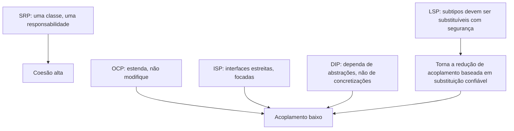

## Objetivos de Aprendizagem

- Enunciar a origem dos princípios SOLID honestamente: uma convenção de indústria primeiro articulada por Robert C. Martin, subsequentemente adotada no ensino acadêmico, não um resultado que se originou em pesquisa acadêmica.
- Enunciar cada um dos cinco princípios SOLID pelo nome e em uma frase clara.
- Dar um exemplo de código antes/depois concreto ilustrando o Princípio da Responsabilidade Única e o Princípio da Inversão de Dependência.
- Explicar como todos os cinco princípios se conectam de volta a manter acoplamento baixo e coesão alta, especificamente em designs orientados a objetos.

## Contexto e Motivação

Importa ser preciso sobre de onde SOLID de fato vem, porque errar isso é em si uma pequena lição sobre como conhecimento de engenharia de software viaja. SOLID não foi o resultado de um programa de pesquisa acadêmico, foi montado e nomeado por **Robert C. Martin** (amplamente conhecido pelo pseudônimo "Uncle Bob"), um consultor de software em atuação, que articulou os princípios individuais através de sua escrita e prática de consultoria no fim dos anos 1990 e início dos 2000 (baseando-se em parte em ideias já circulando de outros praticantes, notavelmente Bertrand Meyer para Aberto/Fechado e Barbara Liskov para o princípio de substituição que carrega seu nome), e o próprio acrônimo "SOLID" foi depois cunhado por Michael Feathers para nomear o pacote de cinco como um conjunto memorável. É orientação originada na indústria, guiada por praticante, uma destilação do que desenvolvedores orientados a objetos experientes observaram funcionar, e falhar, repetidamente, em bases de código de produção reais.

Dito isso, SOLID é genuinamente, amplamente ensinado em cursos acadêmicos hoje, isso não é uma afirmação de que está ausente da sala de aula, apenas uma afirmação sobre em qual direção o conhecimento fluiu. Os materiais de aula do CSCE 315 (Programming Studio) da Texas A&M sobre SOLID são citados aqui como evidência real de que é ensinado, não como evidência de onde veio; a universidade adotou uma convenção de indústria já estabelecida em seu currículo, que é exatamente a forma ordinária, saudável, pela qual conhecimento de engenharia aplicada deveria se mover da prática para o ensino formal. Ser honesto sobre essa direção também importa praticamente: SOLID não é um conjunto de teoremas demonstráveis da forma como os teoremas de árvore no material de matemática discreta são, é um conjunto de heurísticas conquistadas com dificuldade, e como qualquer heurística, pode ser mal aplicado ou sobre aplicado (um tema recorrente ao qual este conceito retorna em Equívocos Comuns).

Com o conceito de acoplamento e coesão já coberto, o conteúdo real de SOLID é quase imediato: todas as cinco letras são técnicas concretas para alcançar exatamente essas duas coisas, acoplamento baixo, coesão alta, especializadas para a situação de um design orientado a objetos, onde as relações relevantes são entre classes, interfaces, e hierarquias de herança em vez de módulos no abstrato. Cada princípio abaixo é enunciado diretamente, e dois dos cinco, os dois mais concretamente ilustráveis em um exemplo curto, recebem um passo a passo completo de código antes/depois.

## Teoria Central

### Os cinco princípios, nomeados e enunciados

- **S — Princípio da Responsabilidade Única (SRP):** uma classe deveria ter apenas uma razão para mudar, ou seja, uma responsabilidade. Isso é coesão, enunciada como uma regra para classes especificamente: tudo dentro da fronteira de uma classe deveria pertencer ao mesmo único trabalho.
- **O — Princípio Aberto/Fechado (OCP):** uma classe deveria ser aberta para extensão mas fechada para modificação, novo comportamento deveria ser adicionável sem editar o código existente, já testado, de uma classe que já funciona.
- **L — Princípio de Substituição de Liskov (LSP):** um subtipo deve ser usável em qualquer lugar onde seu supertipo é esperado, sem que o chamador note uma diferença em correção, nomeado por Barbara Liskov, que primeiro enunciou esse requisito de substituibilidade formalmente.
- **I — Princípio de Segregação de Interface (ISP):** clientes não deveriam ser forçados a depender de métodos que não usam, muitas interfaces pequenas, focadas, são melhores que uma interface grande que empacota capacidades não relacionadas juntas.
- **D — Princípio de Inversão de Dependência (DIP):** módulos de alto nível (os que expressam política e regras de negócio) não deveriam depender de módulos de baixo nível (os que expressam detalhe de implementação) diretamente; ambos deveriam depender de uma abstração compartilhada em vez disso.

### Por que todos os cinco se reduzem a acoplamento e coesão

SRP é coesão por outro nome: uma classe, uma razão para mudar, exatamente o teste "remover uma responsabilidade também removeria a razão pela qual o resto pertence junto" do conceito de acoplamento e coesão, aplicado especificamente a uma classe em vez de um módulo em geral. OCP, ISP, e DIP são todos, de formas diferentes, sobre acoplamento: OCP mantém a dependência de um chamador em uma classe *estável* mesmo conforme as capacidades daquela classe crescem, estendendo através de novas subclasses ou estratégias compostas em vez de editar código compartilhado (ecoando a forma do padrão Strategy diretamente); ISP mantém um chamador de ser acoplado a métodos que nunca ia chamar, estreitando a interface da qual depende para só o que de fato precisa; DIP inverte a direção natural do acoplamento para que tanto uma classe de política de alto nível quanto uma classe de detalhe de baixo nível dependam de uma abstração compartilhada, estável, em vez da política de alto nível depender diretamente do tipo concreto do detalhe de baixo nível. LSP é a condição de correção que torna toda essa redução de acoplamento baseada em substituição de fato segura, se um subtipo pode silenciosamente violar o contrato de um supertipo, então substituir um pelo outro (o mecanismo inteiro em que OCP, ISP, e DIP se apoiam) para de ser confiável.



### Uma leitura precisa de Aberto/Fechado e Liskov, brevemente

"Fechado para modificação" não significa que uma classe nunca pode ser editada de novo, significa que *uma vez que uma classe está funcionando e sendo dependida*, adicionar uma nova variante de seu comportamento deveria ser alcançável adicionando código novo (uma nova subclasse, uma nova estratégia) em vez de editar a lógica existente, já confiada, da classe, o que arrisca quebrar todo chamador existente daquela lógica. Substituição de Liskov é frequentemente resumida como "subclasses não deveriam quebrar o que a classe pai prometeu", concretamente, uma subclasse que sobrescreve um método não deve fortalecer pré-condições (exigindo mais do chamador que a pai exigia) ou enfraquecer pós-condições (prometendo menos que a pai prometia), ecoando o vocabulário de pré-condições/pós-condições do material de especificações anterior nesta disciplina.

## Exemplos Resolvidos

### Exemplo 1 — Princípio da Responsabilidade Única, antes e depois

**Problema:** Uma classe `InvoiceProcessor` tanto calcula o total de uma fatura quanto formata a fatura para impressão, duas razões não relacionadas para mudar (uma nova regra de imposto vs. um novo layout de impressão) empacotadas em uma classe.

```python
# --- Antes: viola SRP, duas responsabilidades empacotadas juntas ---
class InvoiceProcessor:
    def __init__(self, items):
        self._items = items

    def calculate_total(self):
        return sum(item.price * item.quantity for item in self._items)

    def print_invoice(self):
        total = self.calculate_total()
        lines = [f"{item.name}: {item.quantity} x {item.price}" for item in self._items]
        return "\n".join(lines) + f"\nTotal: {total}"


# --- Depois: dividido para que cada classe tenha exatamente uma razão para mudar ---
class InvoiceCalculator:
    def __init__(self, items):
        self._items = items

    def total(self):
        return sum(item.price * item.quantity for item in self._items)


class InvoicePrinter:
    def __init__(self, items, calculator):
        self._items = items
        self._calculator = calculator

    def print_invoice(self):
        lines = [f"{item.name}: {item.quantity} x {item.price}" for item in self._items]
        return "\n".join(lines) + f"\nTotal: {self._calculator.total()}"
```

**Raciocínio.** Na versão "antes", uma mudança na fórmula de imposto/total e uma mudança no layout de impressão ambas pousam dentro de `InvoiceProcessor`, então uma mudança de layout de impressão arrisca acidentalmente tocar código de cálculo de total sentado bem ao lado dele na mesma classe (e vice-versa). Na versão "depois", `InvoiceCalculator` tem exatamente uma razão para mudar (como totais são calculados) e `InvoicePrinter` tem exatamente uma razão para mudar (como faturas são exibidas), isso é SRP, e é o teste de coesão idêntico do conceito de acoplamento e coesão, aplicado aqui especificamente a responsabilidades de classe.

### Exemplo 2 — Princípio da Inversão de Dependência, antes e depois

**Problema:** Um `ReportGenerator` (política de alto nível: "produzir um relatório e salvá-lo") depende diretamente de um `MySQLWriter` concreto (detalhe de baixo nível: como bytes são persistidos), trocar mecanismos de armazenamento depois significa editar o próprio `ReportGenerator`.

```python
# --- Antes: módulo de alto nível depende diretamente de uma classe concreta de baixo nível ---
class MySQLWriter:
    def write(self, data):
        print(f"writing to MySQL: {data}")

class ReportGenerator:
    def __init__(self):
        self._writer = MySQLWriter()          # depende de uma classe concreta de baixo nível

    def generate_and_save(self, data):
        report = f"REPORT: {data}"
        self._writer.write(report)


# --- Depois: ambos os lados dependem de uma abstração compartilhada ---
from abc import ABC, abstractmethod

class Writer(ABC):                            # a abstração compartilhada
    @abstractmethod
    def write(self, data):
        ...

class MySQLWriter(Writer):
    def write(self, data):
        print(f"writing to MySQL: {data}")

class S3Writer(Writer):
    def write(self, data):
        print(f"writing to S3: {data}")

class ReportGenerator:
    def __init__(self, writer: Writer):        # depende só da abstração
        self._writer = writer

    def generate_and_save(self, data):
        report = f"REPORT: {data}"
        self._writer.write(report)

# Qualquer writer concreto pode ser substituído sem mudança em ReportGenerator
ReportGenerator(MySQLWriter()).generate_and_save("Q3 sales")
ReportGenerator(S3Writer()).generate_and_save("Q3 sales")
```

**Raciocínio.** Na versão "antes", `ReportGenerator` (a política de alto nível de "gerar e salvar um relatório") está acoplado diretamente a `MySQLWriter` (um detalhe de armazenamento de baixo nível); migrar para S3 significa editar o próprio código de `ReportGenerator`. Na versão "depois", tanto `ReportGenerator` quanto todo writer concreto dependem só da abstração `Writer`, a dependência no detalhe concreto foi *invertida* para longe da classe de alto nível e para uma interface cuja forma a classe de alto nível controla. Isso é DIP exatamente como enunciado: módulos de alto nível e de baixo nível ambos dependem de uma abstração, e nenhum depende do outro diretamente, a mesma forma já vista como o padrão Strategy, agora nomeada como um princípio SOLID porque está sendo aplicada especificamente a uma dependência entre uma classe de política e uma classe de detalhe de implementação.

## Equívocos Comuns e Armadilhas

- **"SOLID veio de pesquisa acadêmica de ciência da computação."** Como enunciado em Contexto e Motivação, SOLID foi montado por Robert C. Martin a partir da prática de indústria (com as ideias individuais contribuídas variavelmente por Meyer, Liskov, e outros já trabalhando na prática), e nomeado como um conjunto por Michael Feathers, cursos universitários como o CSCE 315 da Texas A&M o ensinam porque é uma convenção de indústria amplamente adotada que vale a pena conhecer, não porque se originou como um resultado de pesquisa ali ou em outro lugar na academia.
- **"Toda classe deve aplicar toda letra SOLID, sempre, para ser bem projetada."** SOLID é um conjunto de heurísticas para manter acoplamento baixo e coesão alta, não uma lista de verificação para satisfazer incondicionalmente, um script pequeno, estável, de uso único seguindo nenhuma das cinco letras explicitamente ainda pode ser código perfeitamente bom; os princípios compensam especificamente quando uma classe é provável de crescer, ser estendida, ou ser substituída por variantes, ecoando o mesmo julgamento de "esconda só decisões prováveis de mudar" de ocultação de informação.
- **"Aberto/Fechado significa que uma classe nunca pode ser editada de novo uma vez escrita."** Como explicado na Teoria Central, "fechado para modificação" é sobre não precisar editar a lógica já confiada de uma classe para adicionar uma nova variante de comportamento, correções de bug genuínas e mudanças legítimas na própria responsabilidade de uma classe ainda são edições àquela classe, não violações de OCP.
- **"Substituição de Liskov é só sobre combinar assinaturas de método."** LSP é sobre substituibilidade comportamental, uma subclasse com uma assinatura de método idêntica ainda pode violar LSP fortalecendo pré-condições ou enfraquecendo pós-condições (por exemplo, uma subclasse `Penguin` de `Bird` sobrescrevendo `fly()` para levantar uma exceção viola LSP mesmo que a assinatura combine exatamente, porque chamadores de `Bird.fly()` anteriormente podiam confiar que teria sucesso).
- **"Inversão de Dependência só significa 'use injeção de dependência.'"** Injeção de dependência (passar uma dependência via um construtor, como no Exemplo 2) é um *mecanismo* comum para alcançar DIP, mas o próprio DIP é a regra de design de que ambos os lados deveriam depender de uma abstração compartilhada, pode-se injetar uma dependência concreta sem inverter nada (por exemplo, injetar `MySQLWriter` diretamente sem nenhuma interface `Writer` de forma alguma ainda acopla `ReportGenerator` àquela classe concreta).

## Resumo

SOLID é um conjunto de cinco diretrizes de design originadas na indústria, primeiro articuladas por Robert C. Martin e nomeadas como um conjunto por Michael Feathers, baseando-se em ideias de outros praticantes (notavelmente Meyer e Liskov), real, amplamente ensinado em cursos acadêmicos como o CSCE 315 da Texas A&M, mas não um resultado que se originou de pesquisa acadêmica. Princípio da Responsabilidade Única pede que uma classe tenha uma razão para mudar (coesão, aplicada a classes); Aberto/Fechado pede que novo comportamento seja adicionável sem editar código existente, confiado; Substituição de Liskov pede que um subtipo seja usável com segurança em qualquer lugar onde seu supertipo é esperado; Segregação de Interface pede que clientes dependam só dos métodos que de fato usam; Inversão de Dependência pede que tanto módulos de alto nível quanto de baixo nível dependam de uma abstração compartilhada em vez do módulo de alto nível depender diretamente dos detalhes concretos do módulo de baixo nível. Todos os cinco são, no fim, técnicas concretas para os mesmos dois medidores introduzidos anteriormente nesta disciplina, manter acoplamento baixo e coesão alta, especializados para as classes, interfaces, e relações de herança do design orientado a objetos especificamente.

## Documentation Links

- [Texas A&M CSCE 315 — SOLID Principles Lecture Slides](https://people.engr.tamu.edu/choe/choe/courses/14summer/315/lectures/slide23.pdf) — doc
- [ACM/IEEE CS2013 — Software Engineering Knowledge Area](https://csed.acm.org/knowledge-areas-software-engineering-se-cs2013-version/) — doc
