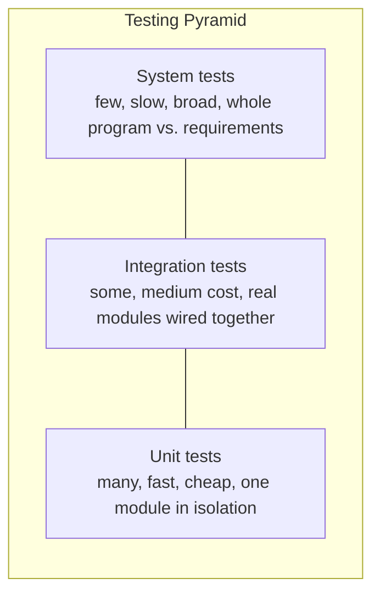

## Learning Objectives

- Define unit, integration, and system testing precisely, and identify what each level does and does not exercise.
- Construct a concrete example of a bug that passes every relevant unit test yet fails at integration.
- Explain why a specification (precondition/postcondition) is the thing two modules' unit tests must actually agree on, not just their code.
- Choose the appropriate testing level for a given defect, given a description of where and how it manifests.
- Relate the three levels to the "testing pyramid" and justify why unit tests should vastly outnumber system tests.

## Context & Motivation

You already know how to test a function. Given `average`, you wrote down `assert average([2, 4, 6]) == 4`, thought carefully about boundary conditions like the empty list, and treated a passing set of assertions as a real, checkable claim about that one function's behavior. That is exactly what **unit testing** means — testing a single unit (a function, a method, a small class) in isolation, with everything around it either genuinely present or faked out just enough to keep the test focused on that one unit's own logic. Nothing new needs to be learned to start unit testing; it needs a name, and it needs to be recognized as the *first* of three distinct levels, not the only one.

The reason a course in software construction insists on naming and separating these levels is that real programs are built from many units wired together, and a specific, common category of bug lives *only* in the wiring — never in any individual unit. Two functions can each be flawless on their own terms, each thoroughly unit-tested, and still break the moment they are connected, because "flawless on its own terms" was checked against an assumption about the other side that turned out to be wrong. MIT's 6.031 curriculum treats this as one of the central lessons of testing strategy: correctness is not purely a property of one function's code, it is also a property of the *agreements* between functions, and no amount of testing a function against itself can validate an agreement it has with something else.

**System testing** then asks a still different question, at the largest scale of all: not "does this module work," and not "do these two modules work together," but "does the entire assembled program, exercised the way an actual user or actual caller would exercise it, meet the requirements it was built to satisfy." A program can pass every unit test and every integration test between its pairs of modules and still fail system testing, if — for instance — the requirements themselves involved a longer chain of modules than any one integration test checked, or a failure mode (a crashed dependency, a slow network call, a malformed file) that only shows up when the whole system is running for real.

These three levels are not competing techniques to choose between; they are complementary, and they catch categorically different classes of defects. A course that has already taught how to unit test one function in isolation has taught the smallest, cheapest, most foundational third of a full testing strategy — this concept organizes what was already known under its formal name, and builds the other two levels on top of it.

## Core Theory

### Unit testing: one module, dependencies faked out

A unit test exercises a single function, method, or small class in isolation from the rest of the system. "Isolation" here means: any other module that the unit under test depends on is either the real thing (if it is simple and stable) or a **fake**, **stub**, or **mock** standing in for it — a fake `database` object that returns a fixed, known value instead of hitting a real database, for instance. The point of faking dependencies is precision: a unit test failure should point at the unit under test, not somewhere in whatever it happened to call. This is exactly the level covered by writing `assert clamp(5, 0, 10) == 5` and its boundary-case siblings — a unit test's job is to check the unit's own logic against its own specification, nothing more.

### Integration testing: do the real modules agree

An integration test exercises two or more *real* modules wired together exactly as they will be in production, with no fakes standing between them. Its job is not to re-check either module's internal logic — that is what their unit tests already did — but to check that the **interface** between them is honored the same way by both sides: the same data shape, the same units, the same assumptions about who validates what and when.

This distinction matters because a unit test that fakes a dependency can only be as good as the fake's fidelity to the real thing. If module A's unit tests exercise it against a fake of module B, and that fake behaves subtly differently from the real module B, then A's unit tests can pass while A and B genuinely disagree the moment the fake is swapped out for the real dependency. Nothing about unit testing, done well, catches this — by design, unit tests never touch the real other side.

A concrete example: suppose `fetch_records()` is specified to hand back a collection of records, and `summarize(records)` is specified to consume one. The team building `fetch_records` writes it to return a Python **list**, and unit-tests it thoroughly — every boundary case of "how many records come back" is covered, and all assertions pass. The team building `summarize` writes it to consume a **generator** (something it can only iterate once, with `next()`), and unit-tests *it* against a hand-written fake generator that yields a few sample records — every assertion there passes too. Both units are, individually, fully correct against their own tests. Wire them together for real — `summarize(fetch_records())` — and it still works, because a list is iterable, so a function expecting a generator-like iterable can consume a list without complaint... *unless* `summarize` were written to call `next()` directly rather than iterate with a `for` loop, or to iterate the input twice (fine for a list, an error the second time for a true generator that has already been exhausted). Reverse the mismatch — `summarize` genuinely needs a re-iterable collection, but `fetch_records` was changed later to return a one-shot generator to save memory — and now every unit test for both functions still passes untouched, while the real, wired-together program raises an exception the very first time it runs end to end. Neither module's unit tests could have caught this: each was tested against a fake standing in for the *other side's contract*, and the contract itself, not either implementation, is what broke.

### System testing: the whole program against its requirements

System testing exercises the entire assembled application, end to end, the way it will actually be run — not a function call in a test file, but the real executable or service, given real (or realistically representative) inputs, checked against the actual requirements the whole system was built to satisfy. A web application's system test might start the whole server, issue an HTTP request the way a browser would, and check the HTTP response; a command-line tool's system test might run the actual compiled binary with real arguments and check its exit code and stdout.

System testing catches defects that live above the level of any single interface: a requirement that spans five modules chained together where no integration test ever checked that particular chain; a performance requirement (does the whole pipeline complete within a time budget); a deployment or configuration issue that only exists when everything is actually running together. It is also the slowest and most expensive level to run and to diagnose — a failing system test says "something, somewhere in this large assembled system, isn't right," which is a true but much less localized statement than "this unit's return value was wrong" or "these two modules disagree on data format."

### The testing pyramid

The three levels form a strategy, not an arbitrary list, and the usual guidance is to write many unit tests, fewer integration tests, and fewer still system tests — the **testing pyramid**.



The shape reflects cost and diagnostic value together: a unit test is fast to write, fast to run, and pinpoints exactly which function is wrong; a system test is slow, expensive to set up, and — when it fails — only tells you that *somewhere* in the whole assembled system, something is wrong, leaving the actual localization to be done afterward, often by dropping back down to integration and unit tests to narrow the search. Relying on system tests alone would catch real bugs eventually but at a high cost per bug found; relying on unit tests alone, as the `fetch_records`/`summarize` example shows, leaves an entire category of interface-agreement bugs invisible no matter how many unit tests are added.

## Worked Examples

### Example 1 — a unit-tested pair that fails at integration

**Setup.** Two modules, developed and unit-tested separately.

```python
# module: inventory.py
def fetch_low_stock():
    """Returns items with quantity below the reorder threshold."""
    return [{"sku": "A1", "qty": 2}, {"sku": "B7", "qty": 0}]

def test_fetch_low_stock_unit():
    # unit test: fakes nothing here since fetch_low_stock has no dependencies to fake
    result = fetch_low_stock()
    assert isinstance(result, list)
    assert len(result) == 2
```

```python
# module: reorder.py
def build_reorder_report(items):
    """Consumes a generator of low-stock items and builds a report string."""
    lines = []
    item = next(items)
    while True:
        lines.append(f"Reorder {item['sku']} (have {item['qty']})")
        try:
            item = next(items)
        except StopIteration:
            break
    return "\n".join(lines)

def fake_items():
    yield {"sku": "A1", "qty": 2}
    yield {"sku": "B7", "qty": 0}

def test_build_reorder_report_unit():
    # unit test: fakes fetch_low_stock's output as a generator, matching what
    # the author of build_reorder_report *assumed* the caller would supply
    result = build_reorder_report(fake_items())
    assert "A1" in result
    assert "B7" in result
```

Both unit tests pass. `fetch_low_stock` is correct against its own specification (return the low-stock items as a collection); `build_reorder_report` is correct against its own specification, tested against a fake that happens to be a generator, using `next()` directly as its author assumed a generator would always be supplied.

**Integration.** Wire the real functions together:

```python
build_reorder_report(fetch_low_stock())
# TypeError: 'list' object is not an iterator
```

`fetch_low_stock` returns a real **list**; `build_reorder_report` calls `next()` on its argument, which only works on an **iterator**, not on a plain list. Neither unit test caught this, because each tested its own module against a fake that matched what *that module's own author* assumed — the two assumptions simply never agreed, and only wiring the two real modules together (integration testing) exposes the mismatch. The fix is to settle the actual interface contract explicitly — for example, specify that `fetch_low_stock` returns an iterable and have `build_reorder_report` use `for item in items:` instead of manual `next()` calls, which works correctly for both lists and generators — and then add an integration test that calls the two real functions together, so this exact class of regression cannot silently return.

### Example 2 — an integration test that passes but a system test that fails

**Setup.** A small pipeline: `parse_config` (reads settings), `connect_db` (opens a database connection using those settings), `run_report` (queries the database and formats output). Integration tests confirm `parse_config`'s output is exactly what `connect_db` expects, and that `connect_db`'s connection object is exactly what `run_report` expects — both pairwise agreements hold.

**System test.** Running the actual assembled command-line tool against the real deployment configuration file (not the small hand-written one used in the integration tests) fails, because the real configuration file has a database host that requires a network round-trip the integration tests, using a local in-memory stand-in database, never involved. No individual pairwise interface was wrong; the requirement that the *whole* program works against a real, remote deployment was never checked below the system level.

### Example 3 — choosing the right level for a bug report

**Problem:** three bug reports come in. For each, decide which testing level would most directly have caught it, and why.

1. "`calculate_discount(price, pct)` returns a negative number when `pct` is greater than 100." — This is a defect entirely within one function's own logic; a **unit test** with a boundary input (`pct=150`) targets it directly.
2. "The checkout module builds an order total in cents (an integer), but the payment module expects an amount in dollars (a float), so charges are 100x too small." — This is a disagreement about a data format *between* two real modules; each module might well be perfectly correct against its own tests. An **integration test** wiring the real checkout module to the real payment module is the level that exposes it.
3. "The whole application times out under real production load, even though every module and every pair of modules tested fine in isolation." — This is a property of the fully assembled system under realistic conditions that no smaller-scale test was ever positioned to observe. A **system test** — running the real deployed application under realistic load — is what this requires.

## Common Misconceptions & Pitfalls

- **"If every module's unit tests pass, the whole program must work."** The `fetch_low_stock` / `build_reorder_report` example shows this directly: both units passed every unit test, and the assembled program still crashed the first time it ran for real, because the bug lived in the disagreement between them, not inside either one.
- **"Integration testing means testing with mocks/fakes, just more of them."** The defining feature of an integration test is that it uses the *real* modules, wired together as they will actually run — swapping in a fake for either side turns it back into a unit test of the other side, and reintroduces exactly the risk (a fake that doesn't match the real thing) that integration testing exists to eliminate.
- **"System testing subsumes unit and integration testing, so it's enough on its own."** A system test that fails only says something, somewhere in a large assembled program, is wrong — it is far slower to run and far less specific about *where* the problem is than a failing unit or integration test would have been. Relying only on system tests trades fast, precise feedback for slow, vague feedback; the pyramid shape exists because both cost and diagnostic precision matter, not just eventual detection.
- **"More test levels always means proportionally more tests at each level."** The pyramid's shape is deliberately lopsided — many unit tests, fewer integration tests, fewer system tests still — because unit tests are cheap and pinpoint failures precisely, while system tests are expensive and diagnostically blunt; inverting the pyramid (many slow system tests, few fast unit tests) is a common and costly real-world mistake.
- **"A bug that only shows up when the real modules are wired together must mean one of the modules has a bug in it."** Often neither module is wrong on its own terms at all — as in Example 1, the bug is in an unstated or mismatched agreement about the interface between them, which is precisely the category of defect that exists at the integration level and nowhere else.

## Summary

Unit testing checks one module in isolation, faking out its dependencies as needed — exactly the skill of writing `assert` cases for a single function, now formally named and placed as the first of three levels. Integration testing wires the *real* modules together and checks that they actually agree on their shared interface — a distinct concern from either module's internal correctness, and one that unit tests, by design, cannot see, since they test against fakes rather than the real other side. System testing runs the entire assembled program the way it will really be used and checks it against its overall requirements, catching defects that live above any single interface — chains spanning many modules, performance under real load, real deployment conditions. The three levels form a pyramid: many cheap, fast, precise unit tests; fewer, more expensive integration tests targeting real interfaces; fewer still, slow, and diagnostically broad system tests — each level catching a category of defect the levels below it structurally cannot.

## Documentation Links

- [MIT 6.031 Spring 2017 — Course Site (lecture list)](http://web.mit.edu/6.031/www/sp17/) — doc
- [ACM/IEEE CS2013 — Software Engineering Knowledge Area](https://csed.acm.org/knowledge-areas-software-engineering-se-cs2013-version/) — doc
