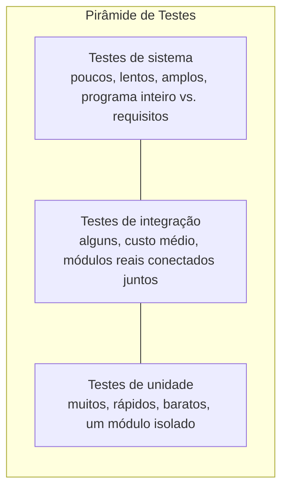

## Objetivos de Aprendizagem

- Definir teste de unidade, integração, e sistema precisamente, e identificar o que cada nível exercita e não exercita.
- Construir um exemplo concreto de um bug que passa em todo teste de unidade relevante mas falha na integração.
- Explicar por que uma especificação (pré-condição/pós-condição) é a coisa que os testes de unidade de dois módulos de fato devem concordar sobre, não só seu código.
- Escolher o nível de teste apropriado para um defeito dado, dada uma descrição de onde e como se manifesta.
- Relacionar os três níveis à "pirâmide de testes" e justificar por que testes de unidade deveriam superar em número testes de sistema vastamente.

## Contexto e Motivação

Você já sabe como testar uma função. Dado `average`, você escreveu `assert average([2, 4, 6]) == 4`, pensou cuidadosamente sobre condições de fronteira como a lista vazia, e tratou um conjunto de asserções passando como uma afirmação real, verificável, sobre o comportamento daquela única função. Isso é exatamente o que **teste de unidade** significa, testar uma única unidade (uma função, um método, uma classe pequena) isoladamente, com tudo ao redor sendo ou genuinamente presente ou falsificado o suficiente para manter o teste focado na lógica daquela única unidade. Nada novo precisa ser aprendido para começar a fazer teste de unidade; precisa de um nome, e precisa ser reconhecido como o *primeiro* de três níveis distintos, não o único.

A razão pela qual um curso em construção de software insiste em nomear e separar esses níveis é que programas reais são construídos de muitas unidades conectadas juntas, e uma categoria específica, comum, de bug vive *só* na conexão, nunca em nenhuma unidade individual. Duas funções podem cada uma ser impecável em seus próprios termos, cada uma completamente testada por unidade, e ainda quebrar no momento em que são conectadas, porque "impecável em seus próprios termos" foi verificado contra uma suposição sobre o outro lado que acabou sendo errada. O currículo 6.031 do MIT trata isso como uma das lições centrais de estratégia de teste: correção não é puramente uma propriedade do código de uma função, também é uma propriedade dos *acordos* entre funções, e nenhuma quantidade de testar uma função contra si mesma pode validar um acordo que tem com outra coisa.

**Teste de sistema** então faz uma pergunta ainda diferente, na maior escala de todas: não "esse módulo funciona," e não "esses dois módulos funcionam juntos," mas "o programa inteiro montado, exercitado da forma que um usuário real ou chamador real o exercitaria, atende aos requisitos para os quais foi construído para satisfazer." Um programa pode passar em todo teste de unidade e todo teste de integração entre seus pares de módulos e ainda falhar em teste de sistema, se, por exemplo, os próprios requisitos envolveram uma cadeia mais longa de módulos do que qualquer teste de integração verificou, ou um modo de falha (uma dependência travada, uma chamada de rede lenta, um arquivo malformado) que só aparece quando o sistema inteiro está rodando de verdade.

Esses três níveis não são técnicas competindo entre as quais escolher; são complementares, e capturam classes categoricamente diferentes de defeitos. Um curso que já ensinou como testar uma função por unidade isoladamente ensinou o terço menor, mais barato, mais fundamental de uma estratégia de teste completa, este conceito organiza o que já era conhecido sob seu nome formal, e constrói os outros dois níveis em cima dele.

## Teoria Central

### Teste de unidade: um módulo, dependências falsificadas

Um teste de unidade exercita uma única função, método, ou classe pequena isoladamente do resto do sistema. "Isolamento" aqui significa: qualquer outro módulo do qual a unidade sob teste depende é ou a coisa real (se for simples e estável) ou uma **falsa (fake)**, **stub**, ou **mock** ficando no lugar dela, um objeto `database` falso que retorna um valor fixo, conhecido, em vez de tocar um banco de dados real, por exemplo. O ponto de falsificar dependências é precisão: uma falha de teste de unidade deveria apontar para a unidade sob teste, não para algum lugar do que quer que ela tenha acontecido de chamar. Esse é exatamente o nível coberto ao escrever `assert clamp(5, 0, 10) == 5` e seus irmãos de caso de fronteira, o trabalho de um teste de unidade é verificar a própria lógica da unidade contra sua própria especificação, nada mais.

### Teste de integração: os módulos reais concordam

Um teste de integração exercita dois ou mais módulos *reais* conectados juntos exatamente como estarão em produção, sem falsos entre eles. Seu trabalho não é reverificar a lógica interna de nenhum módulo, isso é o que os testes de unidade deles já fizeram, mas verificar se a **interface** entre eles é honrada da mesma forma por ambos os lados: a mesma forma de dado, as mesmas unidades, as mesmas suposições sobre quem valida o quê e quando.

Essa distinção importa porque um teste de unidade que falsifica uma dependência só pode ser tão bom quanto a fidelidade do falso à coisa real. Se os testes de unidade do módulo A o exercitam contra um falso do módulo B, e aquele falso se comporta sutilmente diferente do módulo B real, então os testes de unidade de A podem passar enquanto A e B genuinamente discordam no momento em que o falso é trocado pela dependência real. Nada sobre teste de unidade, feito bem, captura isso, por design, testes de unidade nunca tocam o outro lado real.

Um exemplo concreto: suponha que `fetch_records()` é especificado para entregar de volta uma coleção de registros, e `summarize(records)` é especificado para consumir uma. A equipe construindo `fetch_records` a escreve para retornar uma **lista** Python, e a testa por unidade completamente, todo caso de fronteira de "quantos registros voltam" é coberto, e todas as asserções passam. A equipe construindo `summarize` a escreve para consumir um **gerador** (algo que só pode iterar uma vez, com `next()`), e a testa por unidade contra um gerador falso escrito à mão que produz alguns registros de amostra, toda asserção ali também passa. Ambas as unidades são, individualmente, completamente corretas contra seus próprios testes. Conecte-as juntas de verdade, `summarize(fetch_records())`, e ainda funciona, porque uma lista é iterável, então uma função esperando um iterável estilo gerador pode consumir uma lista sem reclamar... *a menos que* `summarize` tenha sido escrita para chamar `next()` diretamente em vez de iterar com um laço `for`, ou para iterar a entrada duas vezes (bem para uma lista, um erro na segunda vez para um gerador verdadeiro que já foi esgotado). Inverta o descompasso, `summarize` genuinamente precisa de uma coleção reiterável, mas `fetch_records` foi mudada depois para retornar um gerador de uso único para economizar memória, e agora todo teste de unidade para ambas as funções ainda passa intocado, enquanto o programa real, conectado, levanta uma exceção na primeiríssima vez que roda de ponta a ponta. Nenhum teste de unidade de nenhum módulo poderia ter pegado isso: cada um foi testado contra um falso ficando no lugar do *contrato do outro lado*, e o próprio contrato, não nenhuma implementação, é o que quebrou.

### Teste de sistema: o programa inteiro contra seus requisitos

Teste de sistema exercita a aplicação montada inteira, de ponta a ponta, da forma que de fato será rodada, não uma chamada de função em um arquivo de teste, mas o executável ou serviço real, dadas entradas reais (ou realisticamente representativas), verificado contra os requisitos reais para os quais o sistema inteiro foi construído para satisfazer. O teste de sistema de uma aplicação web pode começar o servidor inteiro, emitir uma requisição HTTP da forma que um navegador faria, e verificar a resposta HTTP; o teste de sistema de uma ferramenta de linha de comando pode rodar o binário compilado real com argumentos reais e verificar seu código de saída e stdout.

Teste de sistema captura defeitos que vivem acima do nível de qualquer interface única: um requisito que abrange cinco módulos encadeados onde nenhum teste de integração jamais verificou aquela cadeia particular; um requisito de desempenho (o pipeline inteiro completa dentro de um orçamento de tempo); um problema de implantação ou configuração que só existe quando tudo está de fato rodando junto. Também é o nível mais lento e mais caro de rodar e diagnosticar, um teste de sistema falhando diz "algo, em algum lugar neste sistema grande montado, não está certo," que é uma afirmação verdadeira mas muito menos localizada que "o valor de retorno desta unidade estava errado" ou "esses dois módulos discordam sobre formato de dado."

### A pirâmide de testes

Os três níveis formam uma estratégia, não uma lista arbitrária, e a orientação usual é escrever muitos testes de unidade, menos testes de integração, e ainda menos testes de sistema, a **pirâmide de testes**.



O formato reflete custo e valor diagnóstico juntos: um teste de unidade é rápido de escrever, rápido de rodar, e identifica exatamente qual função está errada; um teste de sistema é lento, caro de configurar, e, quando falha, só diz que *em algum lugar* no sistema montado inteiro, algo está errado, deixando a localização real para ser feita depois, frequentemente voltando para testes de integração e unidade para estreitar a busca. Confiar só em testes de sistema capturaria bugs reais eventualmente mas a um custo alto por bug encontrado; confiar só em testes de unidade, como o exemplo `fetch_records`/`summarize` mostra, deixa uma categoria inteira de bugs de acordo de interface invisível não importa quantos testes de unidade sejam adicionados.

## Exemplos Resolvidos

### Exemplo 1 — um par testado por unidade que falha na integração

**Montagem.** Dois módulos, desenvolvidos e testados por unidade separadamente.

```python
# módulo: inventory.py
def fetch_low_stock():
    """Retorna itens com quantidade abaixo do limiar de reposição."""
    return [{"sku": "A1", "qty": 2}, {"sku": "B7", "qty": 0}]

def test_fetch_low_stock_unit():
    # teste de unidade: não falsifica nada aqui já que fetch_low_stock não tem dependências para falsificar
    result = fetch_low_stock()
    assert isinstance(result, list)
    assert len(result) == 2
```

```python
# módulo: reorder.py
def build_reorder_report(items):
    """Consome um gerador de itens de estoque baixo e constrói uma string de relatório."""
    lines = []
    item = next(items)
    while True:
        lines.append(f"Reorder {item['sku']} (have {item['qty']})")
        try:
            item = next(items)
        except StopIteration:
            break
    return "\n".join(lines)

def fake_items():
    yield {"sku": "A1", "qty": 2}
    yield {"sku": "B7", "qty": 0}

def test_build_reorder_report_unit():
    # teste de unidade: falsifica a saída de fetch_low_stock como um gerador, combinando
    # com o que o autor de build_reorder_report *assumiu* que o chamador forneceria
    result = build_reorder_report(fake_items())
    assert "A1" in result
    assert "B7" in result
```

Ambos os testes de unidade passam. `fetch_low_stock` está correto contra sua própria especificação (retornar os itens de estoque baixo como uma coleção); `build_reorder_report` está correto contra sua própria especificação, testado contra um falso que acontece de ser um gerador, usando `next()` diretamente já que seu autor assumiu que um gerador sempre seria fornecido.

**Integração.** Conecte as funções reais juntas:

```python
build_reorder_report(fetch_low_stock())
# TypeError: 'list' object is not an iterator
```

`fetch_low_stock` retorna uma **lista** real; `build_reorder_report` chama `next()` em seu argumento, que só funciona em um **iterador**, não em uma lista simples. Nenhum teste de unidade pegou isso, porque cada um testou seu próprio módulo contra um falso que combinava com o que *o próprio autor daquele módulo* assumiu, as duas suposições simplesmente nunca concordaram, e só conectar os dois módulos reais juntos (teste de integração) expõe o descompasso. O conserto é resolver o contrato de interface real explicitamente, por exemplo, especificar que `fetch_low_stock` retorna um iterável e fazer `build_reorder_report` usar `for item in items:` em vez de chamadas manuais a `next()`, o que funciona corretamente tanto para listas quanto para geradores, e depois adicionar um teste de integração que chama as duas funções reais juntas, para que essa classe exata de regressão não possa silenciosamente retornar.

### Exemplo 2 — um teste de integração que passa mas um teste de sistema que falha

**Montagem.** Um pequeno pipeline: `parse_config` (lê configurações), `connect_db` (abre uma conexão de banco de dados usando essas configurações), `run_report` (consulta o banco de dados e formata saída). Testes de integração confirmam que a saída de `parse_config` é exatamente o que `connect_db` espera, e que o objeto de conexão de `connect_db` é exatamente o que `run_report` espera, ambos os acordos par a par valem.

**Teste de sistema.** Rodar a ferramenta de linha de comando montada real contra o arquivo de configuração de implantação real (não o pequeno escrito à mão usado nos testes de integração) falha, porque o arquivo de configuração real tem um host de banco de dados que exige uma viagem de ida e volta de rede que os testes de integração, usando um banco de dados substituto em memória local, nunca envolveram. Nenhuma interface par a par individual estava errada; o requisito de que o programa *inteiro* funciona contra uma implantação real, remota, nunca foi verificado abaixo do nível de sistema.

### Exemplo 3 — escolhendo o nível certo para um relatório de bug

**Problema:** três relatórios de bug chegam. Para cada um, decida qual nível de teste mais diretamente o teria capturado, e por quê.

1. "`calculate_discount(price, pct)` retorna um número negativo quando `pct` é maior que 100." — Este é um defeito inteiramente dentro da própria lógica de uma função; um **teste de unidade** com uma entrada de fronteira (`pct=150`) o mira diretamente.
2. "O módulo de checkout constrói um total de pedido em centavos (um inteiro), mas o módulo de pagamento espera um valor em dólares (um float), então cobranças ficam 100x menores." — Isso é um descompasso sobre formato de dado *entre* dois módulos reais; cada módulo pode muito bem estar perfeitamente correto contra seus próprios testes. Um **teste de integração** conectando o módulo de checkout real ao módulo de pagamento real é o nível que o expõe.
3. "A aplicação inteira dá timeout sob carga de produção real, mesmo que todo módulo e todo par de módulo tenham testado bem isoladamente." — Essa é uma propriedade do sistema completamente montado sob condições realistas que nenhum teste de escala menor jamais estava posicionado para observar. Um **teste de sistema**, rodando a aplicação implantada real sob carga realista, é o que isso exige.

## Equívocos Comuns e Armadilhas

- **"Se os testes de unidade de todo módulo passam, o programa inteiro deve funcionar."** O exemplo `fetch_low_stock` / `build_reorder_report` mostra isso diretamente: ambas as unidades passaram em todo teste de unidade, e o programa montado ainda travou na primeira vez que rodou de verdade, porque o bug vivia no descompasso entre eles, não dentro de nenhum dos dois.
- **"Teste de integração significa testar com mocks/falsos, só mais deles."** A característica definidora de um teste de integração é que usa os módulos *reais*, conectados juntos como de fato vão rodar, trocar um falso por qualquer um dos lados o transforma de volta em um teste de unidade do outro lado, e reintroduz exatamente o risco (um falso que não combina com a coisa real) que teste de integração existe para eliminar.
- **"Teste de sistema subsume teste de unidade e integração, então é suficiente sozinho."** Um teste de sistema que falha só diz que algo, em algum lugar de um programa grande montado, está errado, é muito mais lento de rodar e muito menos específico sobre *onde* o problema está do que uma unidade ou integração falhando teria sido. Confiar só em testes de sistema troca feedback rápido, preciso, por feedback lento, vago; o formato de pirâmide existe porque tanto custo quanto precisão diagnóstica importam, não só detecção eventual.
- **"Mais níveis de teste sempre significa proporcionalmente mais testes em cada nível."** O formato da pirâmide é deliberadamente desigual, muitos testes de unidade, menos testes de integração, ainda menos testes de sistema, porque testes de unidade são baratos e identificam falhas precisamente, enquanto testes de sistema são caros e diagnosticamente cegos; inverter a pirâmide (muitos testes de sistema lentos, poucos testes de unidade rápidos) é um erro comum e caro do mundo real.
- **"Um bug que só aparece quando os módulos reais são conectados juntos deve significar que um dos módulos tem um bug nele."** Frequentemente nenhum módulo está errado em seus próprios termos de forma alguma, como no Exemplo 1, o bug está em um acordo não enunciado ou descompassado sobre a interface entre eles, que é precisamente a categoria de defeito que existe no nível de integração e em nenhum outro lugar.

## Resumo

Teste de unidade verifica um módulo isoladamente, falsificando suas dependências conforme necessário, exatamente a habilidade de escrever casos `assert` para uma única função, agora formalmente nomeada e colocada como o primeiro de três níveis. Teste de integração conecta os módulos *reais* juntos e verifica se de fato concordam em sua interface compartilhada, uma preocupação distinta da correção interna de qualquer módulo, e uma que testes de unidade, por design, não conseguem ver, já que testam contra falsos em vez do outro lado real. Teste de sistema roda a aplicação inteira montada da forma que de fato será usada e a verifica contra seus requisitos gerais, capturando defeitos que vivem acima de qualquer interface única, cadeias abrangendo muitos módulos, desempenho sob carga real, condições de implantação reais. Os três níveis formam uma pirâmide: muitos testes de unidade baratos, rápidos, precisos; menos, mais caros testes de integração visando interfaces reais; ainda menos, lentos, e diagnosticamente amplos testes de sistema, cada nível capturando uma categoria de defeito que os níveis abaixo dele estruturalmente não conseguem.

## Documentation Links

- [MIT 6.031 Spring 2017 — Course Site (lecture list)](http://web.mit.edu/6.031/www/sp17/) — doc
- [ACM/IEEE CS2013 — Software Engineering Knowledge Area](https://csed.acm.org/knowledge-areas-software-engineering-se-cs2013-version/) — doc
