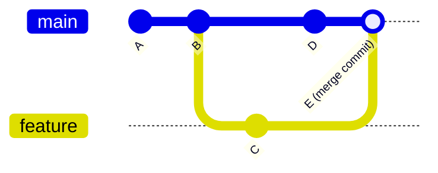

## Learning Objectives

- Describe a git repository as a sequence of commits, each a snapshot of the whole project pointing back to its parent commit.
- Explain what a branch actually is (a movable pointer to a commit, not a copy of the files) and what checking one out does.
- Perform, at a conceptual level, the three basic operations — commit, branch, and merge — and describe the resulting commit graph.
- Explain why a dedicated course exists to teach a tool like this, and what gap in a typical CS curriculum that fills.
- Predict the shape of the commit graph produced by a short sequence of commit/branch/merge operations, before running them.

## Context & Motivation

Almost every other concept in this discipline — commit hygiene, code review, branching conventions, even systematic debugging's use of `git bisect` — presupposes a working mental model of what version control actually *is*, not just which commands to type. That gap is exactly what MIT's Missing Semester of Your CS Education was built to close. Missing Semester exists because of a specific, well-documented failure mode in CS education: courses teach algorithms, data structures, and programming languages in depth, but the tools a working programmer uses every single day — the shell, version control, editors, build systems — are usually assumed to be picked up by osmosis, if they're taught at all. Git is the most consequential item on that list, because without it, working on a codebase with anyone else — or even working on one's own codebase across time, safely — is genuinely difficult.

The reason git matters this much is that software is never really "finished" — it's a sequence of changes, made by one or more people, some of which turn out to be mistakes, some of which need to be developed in parallel with other unrelated changes, and all of which need to be recoverable if something goes wrong. Without a tool built specifically for this, a team is reduced to emailing zip files of "final_v3_REALLY_FINAL.py" back and forth, or working directly on a shared copy of the code and hoping nobody's changes silently clobber anyone else's. Git replaces all of that with a precise, mathematical structure — a directed graph of snapshots — that makes it possible to isolate work, combine it deliberately, and recover any past state exactly.

What follows is the core mental model Missing Semester spends real time building deliberately, rather than assuming: a repository is not a single mutable folder of files being edited in place — it is a history of discrete, immutable snapshots, each one aware of what came before it. Every other concept about version control in this discipline — branching conventions, commit message quality, how a team's workflow scales — is a refinement layered on top of this one structural idea, so getting it right here is what makes everything that follows make sense.

## Core Theory

### A repository as a sequence of snapshots

A git repository's history is not a list of diffs applied one after another — it is a sequence of full, self-contained **snapshots**, each one called a **commit**. Every commit records the complete state of every tracked file at the moment it was made (internally, git is efficient about storing only what changed, but conceptually each commit represents the entire project as it looked at that instant) plus a pointer back to the commit that came immediately before it, called its **parent**. Following the chain of parents backward from any commit reconstructs the entire history that led to it, one snapshot at a time. This is why git can reconstruct the exact state of the project at any past point with certainty — there is no ambiguity about what the codebase looked like at commit *X*, because commit *X* itself, not a derived reconstruction, *is* that state.

### Branches: movable pointers, not copies

A **branch** is not a separate copy of the project's files — it is a lightweight, movable label (technically, a reference) pointing at one specific commit. The commit that a branch points to is understood as "the latest commit on that branch." When a new commit is made while a branch is checked out, two things happen: the new commit records the current branch tip as its parent, and the branch label itself moves forward to point at the new commit. This is why creating a branch is instantaneous and cheap regardless of how large the project is — it costs nothing more than writing down a pointer to an existing commit, not duplicating any files.

A repository can have many branches, each pointing at a different commit, and several branches can even point at the very same commit if neither has diverged yet. `main` (or `master`, depending on convention) is simply the branch name conventionally treated as the primary line of development — structurally, it is not privileged over any other branch in any special way git itself enforces.

### Merging: combining two lines of history

When work has proceeded on two different branches that have diverged from a common ancestor commit, **merging** brings that work back together: git identifies the common ancestor, examines what changed on each branch since that point, and — when the changes don't touch the same lines of the same files — combines both sets of changes automatically into a new commit that has *two* parents (the tip of each branch being merged), rather than the usual one. This merge commit is what actually joins the two lines of history back into one.

When the same lines of the same file were changed differently on both branches, git cannot decide which version is correct on its own — this is a **merge conflict**, and it requires a person to look at both versions and decide what the combined result should say. A conflict is not a sign that something went wrong with git; it's git correctly recognizing that a decision needs a human, because both changes are equally valid from its perspective.



Reading this graph: commits A and B are shared history. At B, a new branch `feature` is created (still pointing at B at that moment). Commit C is made on `feature` — `feature` now points at C, while `main` still points at B. Commit D is then made on `main` — the two branches have now genuinely diverged, each with a commit the other doesn't have. Merging `feature` into `main` produces commit E, whose two parents are D and C — the point where both lines of development rejoin into one.

### The three basic operations, together

Everything above reduces to three operations a developer performs constantly: **commit** (record the current state as a new snapshot, moving the current branch pointer forward), **branch** (create a new, cheap, movable pointer at the current commit, to develop something without moving the original branch), and **merge** (reconcile two branches that have diverged, producing a new commit that ties both histories back together). Nearly every other git operation — rebasing, cherry-picking, resetting — is a variation or refinement of combining these three ideas, not a fundamentally different structure.

## Worked Examples

### Example 1 — creating a branch, committing on it, and merging it back

**Scenario:** `main` currently has two commits, A and B. A developer wants to add a small, self-contained feature without touching `main` until it's ready.

```bash
git branch feature-x        # create a new pointer, currently at the same commit as main (B)
git checkout feature-x       # move to the new branch
# ... edit files ...
git add .
git commit -m "Add feature X"   # new commit C; feature-x now points at C, main still points at B
git checkout main
# ... optionally, someone else's independent work lands on main here as commit D ...
git merge feature-x           # combine feature-x's work into main
```

**Resulting graph, described:** before the merge, `main` points at B (or D, if other work landed there meanwhile) and `feature-x` points at C, with C's parent being B. If `main` never moved past B while `feature-x` was being worked on, the merge is a **fast-forward**: git simply moves the `main` pointer forward to C, since C already contains everything B did plus the new feature — no new merge commit is needed at all, because there was nothing on `main` to reconcile against. If `main` *did* move to D in the meantime, merging produces a genuine merge commit E with two parents (D and C), exactly as diagrammed in Core Theory — both lines of history are preserved and joined.

### Example 2 — two branches that touch the same line, producing a conflict

**Scenario:** Both `main` and a branch called `fix-typo` edit the same line of `README.md`, but each changes it to something different.

```bash
git checkout -b fix-typo
# edits README.md, line 10, to say "installaton" -> "installation"
git commit -am "Fix typo in README"
git checkout main
# meanwhile, someone else edited the same line 10 to add a link
git commit -am "Add link to docs in README"
git merge fix-typo
```

```
Auto-merging README.md
CONFLICT (content): Merge conflict in README.md
Automatic merge failed; fix conflicts and then commit the result.
```

Git marks the conflicting region directly inside `README.md` with conflict markers showing both versions side by side. Resolving it means editing the file by hand to decide what line 10 should actually say (perhaps combining both intents — the fixed spelling *and* the added link), then staging the resolved file and committing to complete the merge:

```bash
# edit README.md to resolve the conflict by hand
git add README.md
git commit -m "Merge fix-typo into main, resolving README conflict"
```

The resulting commit still has two parents, exactly like Example 1's merge commit — the only difference is that a human had to supply the content for the region both branches disagreed about, rather than git combining the changes automatically.

### Example 3 — predicting a commit graph before running it

**Scenario:** starting from a single commit A on `main`, the following sequence runs:

```bash
git checkout -b explore   # branch 'explore' created at A
git commit -m "X"          # commit B on explore
git commit -m "Y"          # commit C on explore
git checkout main
git commit -m "Z"           # commit D on main
git merge explore
```

**Prediction, reasoned from the model above:** `explore` moves from A to B to C (two sequential commits, each with the previous as parent). `main` moves from A to D (one commit, parent A) — since `explore`'s commits happened while `main` stayed at A, `main` and `explore` have genuinely diverged (D and C are both descendants of A, but neither is an ancestor of the other). Merging `explore` into `main` therefore cannot fast-forward — it produces a new commit E with parents D and C, joining both lines. The final graph has five commits total: A at the root, B and C forming the `explore` line, D forming the `main` line, and E as the merge point where both meet.

## Common Misconceptions & Pitfalls

- **"A branch is a copy of all the project's files."** A branch is only a pointer to a commit — creating one is instant and takes essentially no extra space, regardless of project size, because no files are duplicated. What changes when switching branches is which commit's snapshot is checked out into the working directory, not which "copy" is being used.
- **"Committing is the same as saving a file."** A commit records the state of the *entire tracked project* at that moment, not just the file currently being edited — and unlike a file save, it is a permanent, addressable point in history that can always be returned to later.
- **"Merging always requires manually resolving a conflict."** A merge only conflicts when both branches changed the *same lines* of the *same file* in incompatible ways. Most merges — including the fast-forward case in Example 1 — complete with no conflict and no manual intervention at all, because git can tell mechanically that the changes don't overlap.
- **"The commit graph is a straight line."** It is a directed graph, not a list — a commit can have two parents (a merge commit), and a repository at any moment can have many branch tips that haven't been merged into each other yet, each representing a different, currently-diverged line of development.
- **"`main` is structurally special to git."** `main` (or `master`) is a branch like any other — a pointer, movable the same way any branch is movable. Its status as "the primary line" is a team convention enforced by discipline and often by repository settings, not an intrinsic property git's data model gives it over any other branch name.

## Summary

Git's core model is a sequence of immutable, self-contained snapshots called commits, each pointing back to its parent, together forming a directed graph rather than a flat list. A branch is a cheap, movable pointer to a commit, not a copy of any files, which is what makes creating one essentially free. Merging reconciles two branches that have diverged from a common ancestor, producing either a fast-forward (when one branch is simply behind, with nothing to reconcile) or a genuine merge commit with two parents (when both branches have moved forward independently), with a conflict arising only when the same lines of the same file were changed incompatibly on both sides. This model — commit, branch, merge — is exactly what Missing Semester was built to teach explicitly, because it is foundational to nearly everything else in this discipline: without a reliable mental model of what a commit and a branch actually are, the branching conventions, commit-message discipline, and code-review workflows covered next have nothing solid to sit on top of.

## Documentation Links

- [The Missing Semester of Your CS Education (MIT)](https://missing.csail.mit.edu/) — doc
- [MIT 6.031 Spring 2017 — Course Site (lecture list)](http://web.mit.edu/6.031/www/sp17/) — doc
