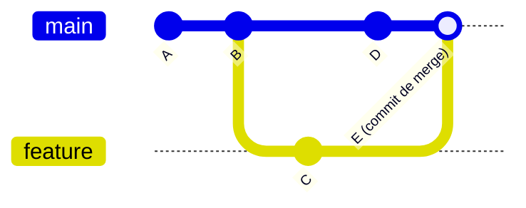

## Objetivos de Aprendizagem

- Descrever um repositório git como uma sequência de commits, cada um um snapshot do projeto inteiro apontando de volta para seu commit pai.
- Explicar o que um branch de fato é (um ponteiro móvel para um commit, não uma cópia dos arquivos) e o que fazer checkout de um faz.
- Realizar, em nível conceitual, as três operações básicas, commit, branch, e merge, e descrever o grafo de commit resultante.
- Explicar por que um curso dedicado existe para ensinar uma ferramenta como essa, e qual lacuna em um currículo típico de CC preenche.
- Prever o formato do grafo de commit produzido por uma sequência curta de operações commit/branch/merge, antes de rodá-las.

## Contexto e Motivação

Quase todo outro conceito nesta disciplina, higiene de commit, revisão de código, convenções de branching, até o uso de `git bisect` da depuração sistemática, pressupõe um modelo mental funcional do que controle de versão de fato *é*, não só quais comandos digitar. Essa lacuna é exatamente o que o Missing Semester of Your CS Education do MIT foi construído para fechar. Missing Semester existe por causa de um modo de falha específico, bem documentado, na educação em CC: cursos ensinam algoritmos, estruturas de dados, e linguagens de programação em profundidade, mas as ferramentas que um programador em atuação usa todo santo dia, o shell, controle de versão, editores, sistemas de build, geralmente são assumidas como pegas por osmose, se são ensinadas afinal. Git é o item mais consequente nessa lista, porque sem ele, trabalhar em uma base de código com qualquer outra pessoa, ou até trabalhar na própria base de código através do tempo, com segurança, é genuinamente difícil.

A razão pela qual git importa tanto é que software nunca é realmente "terminado", é uma sequência de mudanças, feitas por uma ou mais pessoas, algumas das quais acabam sendo erros, algumas das quais precisam ser desenvolvidas em paralelo com outras mudanças não relacionadas, e todas as quais precisam ser recuperáveis se algo der errado. Sem uma ferramenta construída especificamente para isso, uma equipe é reduzida a mandar por email arquivos zip de "final_v3_REALMENTE_FINAL.py" de um lado para o outro, ou trabalhar diretamente em uma cópia compartilhada do código e esperar que as mudanças de ninguém silenciosamente sobrescrevam as de outra pessoa. Git substitui tudo isso por uma estrutura precisa, matemática, um grafo direcionado de snapshots, que torna possível isolar trabalho, combiná-lo deliberadamente, e recuperar qualquer estado passado exatamente.

O que segue é o modelo mental central que Missing Semester gasta tempo real construindo deliberadamente, em vez de assumir: um repositório não é uma única pasta mutável de arquivos sendo editados no lugar, é um histórico de snapshots discretos, imutáveis, cada um ciente do que veio antes dele. Todo outro conceito sobre controle de versão nesta disciplina, convenções de branching, qualidade de mensagem de commit, como o fluxo de trabalho de uma equipe escala, é um refinamento sobreposto a essa única ideia estrutural, então acertá-la aqui é o que faz tudo que segue fazer sentido.

## Teoria Central

### Um repositório como uma sequência de snapshots

O histórico de um repositório git não é uma lista de diffs aplicados um depois do outro, é uma sequência de **snapshots** completos, autocontidos, cada um chamado um **commit**. Todo commit registra o estado completo de todo arquivo rastreado no momento em que foi feito (internamente, git é eficiente sobre armazenar só o que mudou, mas conceitualmente cada commit representa o projeto inteiro como se parecia naquele instante) mais um ponteiro de volta para o commit que veio imediatamente antes dele, chamado seu **pai**. Seguir a cadeia de pais para trás a partir de qualquer commit reconstrói o histórico inteiro que levou a ele, um snapshot de cada vez. Isso é por que git pode reconstruir o estado exato do projeto em qualquer ponto passado com certeza, não há ambiguidade sobre como a base de código se parecia no commit *X*, porque o próprio commit *X*, não uma reconstrução derivada, *é* aquele estado.

### Branches: ponteiros móveis, não cópias

Um **branch** não é uma cópia separada dos arquivos do projeto, é um rótulo leve, móvel (tecnicamente, uma referência) apontando para um commit específico. O commit para o qual um branch aponta é entendido como "o commit mais recente naquele branch." Quando um novo commit é feito enquanto um branch está com checkout feito, duas coisas acontecem: o novo commit registra a ponta do branch atual como seu pai, e o próprio rótulo do branch se move para frente para apontar para o novo commit. Isso é por que criar um branch é instantâneo e barato independentemente de quão grande o projeto seja, não custa mais que escrever um ponteiro para um commit existente, não duplica nenhum arquivo.

Um repositório pode ter muitos branches, cada um apontando para um commit diferente, e vários branches podem até apontar para o mesmíssimo commit se nenhum divergiu ainda. `main` (ou `master`, dependendo da convenção) é simplesmente o nome de branch convencionalmente tratado como a linha primária de desenvolvimento, estruturalmente, não é privilegiado sobre nenhum outro branch de nenhuma forma especial que o próprio git aplique.

### Merge: combinando duas linhas de histórico

Quando trabalho prosseguiu em dois branches diferentes que divergiram de um commit ancestral comum, **merge** traz aquele trabalho de volta junto: git identifica o ancestral comum, examina o que mudou em cada branch desde aquele ponto, e, quando as mudanças não tocam as mesmas linhas dos mesmos arquivos, combina ambos os conjuntos de mudanças automaticamente em um novo commit que tem *dois* pais (a ponta de cada branch sendo mesclado), em vez do único usual. Esse commit de merge é o que de fato junta as duas linhas de histórico de volta em uma.

Quando as mesmas linhas do mesmo arquivo foram mudadas diferentemente em ambos os branches, git não pode decidir qual versão está correta por conta própria, isso é um **conflito de merge**, e exige que uma pessoa olhe para ambas as versões e decida o que o resultado combinado deveria dizer. Um conflito não é um sinal de que algo deu errado com git; é git corretamente reconhecendo que uma decisão precisa de um humano, porque ambas as mudanças são igualmente válidas de sua perspectiva.



Lendo esse grafo: commits A e B são histórico compartilhado. Em B, um novo branch `feature` é criado (ainda apontando para B naquele momento). Commit C é feito em `feature`, `feature` agora aponta para C, enquanto `main` ainda aponta para B. Commit D é então feito em `main`, os dois branches agora genuinamente divergiram, cada um com um commit que o outro não tem. Mesclar `feature` em `main` produz commit E, cujos dois pais são D e C, o ponto onde ambas as linhas de desenvolvimento se rejuntam em uma.

### As três operações básicas, juntas

Tudo acima se reduz a três operações que um desenvolvedor realiza constantemente: **commit** (registra o estado atual como um novo snapshot, movendo o ponteiro do branch atual para frente), **branch** (cria um novo ponteiro barato, móvel, no commit atual, para desenvolver algo sem mover o branch original), e **merge** (reconcilia dois branches que divergiram, produzindo um novo commit que amarra ambos os históricos de volta juntos). Quase toda outra operação git, rebase, cherry-pick, reset, é uma variação ou refinamento de combinar essas três ideias, não uma estrutura fundamentalmente diferente.

## Exemplos Resolvidos

### Exemplo 1 — criando um branch, fazendo commit nele, e mesclando de volta

**Cenário:** `main` atualmente tem dois commits, A e B. Um desenvolvedor quer adicionar uma pequena funcionalidade autocontida sem tocar `main` até estar pronta.

```bash
git branch feature-x        # cria um novo ponteiro, atualmente no mesmo commit que main (B)
git checkout feature-x       # move para o novo branch
# ... edita arquivos ...
git add .
git commit -m "Add feature X"   # novo commit C; feature-x agora aponta para C, main ainda aponta para B
git checkout main
# ... opcionalmente, o trabalho independente de outra pessoa pousa em main aqui como commit D ...
git merge feature-x           # combina o trabalho de feature-x em main
```

**Grafo resultante, descrito:** antes do merge, `main` aponta para B (ou D, se outro trabalho pousou lá nesse meio tempo) e `feature-x` aponta para C, com o pai de C sendo B. Se `main` nunca se moveu além de B enquanto `feature-x` estava sendo trabalhado, o merge é um **fast-forward**: git simplesmente move o ponteiro `main` para frente para C, já que C já contém tudo que B tinha mais a nova funcionalidade, nenhum novo commit de merge é necessário de forma alguma, porque não havia nada em `main` para reconciliar contra. Se `main` *de fato* se moveu para D nesse meio tempo, mesclar produz um commit de merge genuíno E com dois pais (D e C), exatamente como diagramado na Teoria Central, ambas as linhas de histórico são preservadas e juntadas.

### Exemplo 2 — dois branches que tocam a mesma linha, produzindo um conflito

**Cenário:** Tanto `main` quanto um branch chamado `fix-typo` editam a mesma linha de `README.md`, mas cada um a muda para algo diferente.

```bash
git checkout -b fix-typo
# edita README.md, linha 10, para dizer "instalaçao" -> "instalação"
git commit -am "Fix typo in README"
git checkout main
# enquanto isso, outra pessoa editou a mesma linha 10 para adicionar um link
git commit -am "Add link to docs in README"
git merge fix-typo
```

```
Auto-merging README.md
CONFLICT (content): Merge conflict in README.md
Automatic merge failed; fix conflicts and then commit the result.
```

Git marca a região conflitante diretamente dentro de `README.md` com marcadores de conflito mostrando ambas as versões lado a lado. Resolvê-lo significa editar o arquivo manualmente para decidir o que a linha 10 deveria de fato dizer (talvez combinando ambas as intenções, a ortografia corrigida *e* o link adicionado), depois preparar (stage) o arquivo resolvido e fazer commit para completar o merge:

```bash
# edita README.md para resolver o conflito manualmente
git add README.md
git commit -m "Merge fix-typo into main, resolving README conflict"
```

O commit resultante ainda tem dois pais, exatamente como o commit de merge do Exemplo 1, a única diferença é que um humano teve que fornecer o conteúdo para a região sobre a qual ambos os branches discordavam, em vez de git combinar as mudanças automaticamente.

### Exemplo 3 — prevendo um grafo de commit antes de rodá-lo

**Cenário:** começando a partir de um único commit A em `main`, a seguinte sequência roda:

```bash
git checkout -b explore   # branch 'explore' criado em A
git commit -m "X"          # commit B em explore
git commit -m "Y"          # commit C em explore
git checkout main
git commit -m "Z"           # commit D em main
git merge explore
```

**Previsão, raciocinada a partir do modelo acima:** `explore` se move de A para B para C (dois commits sequenciais, cada um com o anterior como pai). `main` se move de A para D (um commit, pai A), já que os commits de `explore` aconteceram enquanto `main` permaneceu em A, `main` e `explore` genuinamente divergiram (D e C são ambos descendentes de A, mas nenhum é ancestral do outro). Mesclar `explore` em `main` portanto não pode fast-forward, produz um novo commit E com pais D e C, juntando ambas as linhas. O grafo final tem cinco commits totais: A na raiz, B e C formando a linha `explore`, D formando a linha `main`, e E como o ponto de merge onde ambos se encontram.

## Equívocos Comuns e Armadilhas

- **"Um branch é uma cópia de todos os arquivos do projeto."** Um branch é só um ponteiro para um commit, criar um é instantâneo e não usa essencialmente nenhum espaço extra, independentemente do tamanho do projeto, porque nenhum arquivo é duplicado. O que muda ao trocar de branch é qual snapshot de commit é feito checkout no diretório de trabalho, não qual "cópia" está sendo usada.
- **"Fazer commit é o mesmo que salvar um arquivo."** Um commit registra o estado do *projeto rastreado inteiro* naquele momento, não só o arquivo sendo editado atualmente, e diferente de salvar um arquivo, é um ponto permanente, endereçável no histórico ao qual sempre se pode retornar depois.
- **"Merge sempre exige resolver um conflito manualmente."** Um merge só conflita quando ambos os branches mudaram as *mesmas linhas* do *mesmo arquivo* de formas incompatíveis. A maioria dos merges, incluindo o caso de fast-forward no Exemplo 1, completa sem nenhum conflito e nenhuma intervenção manual de forma alguma, porque git pode dizer mecanicamente que as mudanças não se sobrepõem.
- **"O grafo de commit é uma linha reta."** É um grafo direcionado, não uma lista, um commit pode ter dois pais (um commit de merge), e um repositório em qualquer momento pode ter muitas pontas de branch que ainda não foram mescladas umas nas outras, cada uma representando uma linha diferente, atualmente divergente, de desenvolvimento.
- **"`main` é estruturalmente especial para git."** `main` (ou `master`) é um branch como qualquer outro, um ponteiro, móvel da mesma forma que qualquer branch é móvel. Seu status como "a linha primária" é uma convenção de equipe aplicada por disciplina e frequentemente por configurações de repositório, não uma propriedade intrínseca que o modelo de dados do próprio git dá a ele sobre qualquer outro nome de branch.

## Resumo

O modelo central do git é uma sequência de snapshots imutáveis, autocontidos, chamados commits, cada um apontando de volta para seu pai, juntos formando um grafo direcionado em vez de uma lista simples. Um branch é um ponteiro barato, móvel, para um commit, não uma cópia de nenhum arquivo, que é o que torna criar um essencialmente gratuito. Merge reconcilia dois branches que divergiram de um ancestral comum, produzindo ou um fast-forward (quando um branch está simplesmente atrás, sem nada para reconciliar) ou um commit de merge genuíno com dois pais (quando ambos os branches avançaram independentemente), com um conflito surgindo só quando as mesmas linhas do mesmo arquivo foram mudadas incompativelmente em ambos os lados. Esse modelo, commit, branch, merge, é exatamente o que Missing Semester foi construído para ensinar explicitamente, porque é fundamental para quase tudo mais nesta disciplina: sem um modelo mental confiável do que um commit e um branch de fato são, as convenções de branching, disciplina de mensagem de commit, e fluxos de trabalho de revisão de código cobertos em seguida não têm nada sólido sobre o qual se apoiar.

## Documentation Links

- [The Missing Semester of Your CS Education (MIT)](https://missing.csail.mit.edu/) — doc
- [MIT 6.031 Spring 2017 — Course Site (lecture list)](http://web.mit.edu/6.031/www/sp17/) — doc
