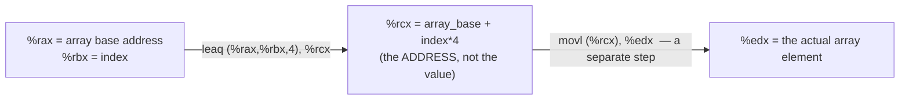

## Learning Objectives

- Read and write x86-64 arithmetic instructions (`add`, `sub`, `imul`, `neg`) and logical instructions (`and`, `or`, `xor`, `not`, shifts), correctly identifying the two-operand, source-then-destination form.
- Explain what `lea` actually does — computing an address without dereferencing it — and distinguish it clearly from `mov`.
- Use `lea` to compute a simple address expression (e.g., array-element addressing) and explain why it's useful for arithmetic unrelated to memory at all.
- Connect the instructions covered here directly to the ALU already designed in `digital-logic-computer-organization`, identifying each instruction as a specific operation that same circuit is wired to perform.
- Translate a short C arithmetic expression by hand into the equivalent sequence of x86-64 instructions.

## Context & Motivation

`digital-logic-computer-organization/designing-an-arithmetic-logic-unit` built a single circuit — the ALU — capable of performing many different operations (add, subtract, AND, OR) on two inputs, selected by a control signal choosing which operation to actually produce on a given cycle. This concept is the ISA-level vocabulary for choosing that operation: every mnemonic covered here — `add`, `sub`, `imul`, `and`, `or`, `xor` — is, in the real machine, a specific control-signal selection into exactly that same kind of ALU circuit, now given a name a programmer or compiler can write directly instead of a wire the datapath decodes internally.

This is also where the register vocabulary from `x86-64-registers-and-data-movement` starts doing real computational work rather than just moving values around. Nearly every arithmetic and logical operator available in C (`+`, `-`, `*`, `&`, `|`, `^`, `<<`, `>>`) compiles down to one of the instructions covered here, operating on the registers that hold the operands — which is exactly the mechanical link between a C expression and the machine code it becomes, one instruction at a time.

`lea` (load effective address) is included in this cluster specifically because it is one of the more genuinely surprising instructions in the ISA, and both of this discipline's primary sources treat it carefully: it looks, superficially, like a memory instruction (its syntax resembles a memory operand), but it never actually accesses memory — it computes an address expression and stores that computed number, which makes it a useful, general-purpose arithmetic instruction for expressions that have nothing to do with pointers at all, a fact compilers exploit constantly.

## Core Theory

### Arithmetic instructions: two-operand, source affects destination

x86-64's arithmetic instructions follow the same source-then-destination order as `mov`, but most of them combine the two operands into the destination, rather than simply copying:

```text
addq %rbx, %rax     ; %rax = %rax + %rbx
subq %rbx, %rax     ; %rax = %rax - %rbx
imulq %rbx, %rax    ; %rax = %rax * %rbx
negq %rax           ; %rax = -%rax  (arithmetic inverse, one operand)
```

Each of these is a direct, named instruction for an operation the ALU (already designed structurally in `designing-an-arithmetic-logic-unit`) is wired to compute — `add` and `sub` share the ALU's adder circuitry exactly as that concept described (subtraction implemented via two's-complement negation and addition), and `imul` invokes dedicated multiplication circuitry beyond the basic adder.

### Logical (bitwise) instructions

```text
andq %rbx, %rax     ; %rax = %rax & %rbx   (bitwise AND)
orq  %rbx, %rax     ; %rax = %rax | %rbx    (bitwise OR)
xorq %rbx, %rax     ; %rax = %rax ^ %rbx    (bitwise XOR)
notq %rax           ; %rax = ~%rax          (bitwise NOT, one operand)
```

These are the exact bitwise operations `digital-logic-computer-organization/logic-gates-and-truth-tables` covered as physical gate circuits, now available as instructions operating on entire 64-bit (or narrower, with the appropriate suffix) registers at once — an AND instruction is, at the hardware level, 64 individual AND gates operating in parallel, one per bit position.

`xorq %rax, %rax` deserves a specific, real note: XOR-ing a register with itself always produces 0 (any value XOR itself is 0), and this idiom is frequently used by real compilers and hand-written assembly specifically to zero a register, because it is typically faster and produces smaller machine code than `movq $0, %rax`.

### Shift instructions

```text
shlq $2, %rax    ; shift left: %rax = %rax << 2  (multiply by 4, for non-overflowing values)
shrq $2, %rax    ; shift right (logical): fills vacated high bits with 0
sarq $2, %rax    ; shift right (arithmetic): fills vacated high bits with the sign bit
```

The distinction between `shr` (logical shift right) and `sar` (arithmetic shift right) matters specifically for signed values: a logical shift always fills the freed high-order bits with 0, which would incorrectly turn a negative two's-complement number less negative in an inconsistent way, while an arithmetic shift fills them with copies of the original sign bit, correctly preserving the sign of a negative value — the same two's-complement reasoning `unsigned-and-twos-complement-integers` already established.

### `lea`: computing an address without dereferencing it

`lea` (load effective address) looks like a memory instruction, but is fundamentally different from every other instruction discussed so far: it computes an address expression and stores the *computed number itself* into the destination — it never reads from the memory that address refers to:

```text
leaq (%rax, %rbx, 4), %rcx    ; %rcx = %rax + %rbx * 4  (computed, not dereferenced)
```

This addressing-mode syntax — `base register, index register, scale` — computes exactly the scaled pointer arithmetic already covered in `pointer-arithmetic-and-array-decay`: if `%rax` holds an array's starting address and `%rbx` holds an index, `leaq (%rax, %rbx, 4)` computes the address of the `int` (4 bytes each) at that index, in a single instruction — but stores that *address*, not the value stored there. Reading the actual array element still requires a separate `mov` with that computed address.



Because `lea` only computes an address arithmetic expression and never touches memory, compilers routinely use it for plain integer arithmetic that has nothing to do with pointers at all — `leaq (%rax, %rax, 2), %rbx`, for instance, computes `%rax + %rax * 2 = %rax * 3` in a single instruction, a trick real compilers use because it's often faster than a genuine multiply instruction for small, fixed multipliers.

## Worked Examples

### Example 1: translating a C expression by hand

```c
int result = (a + b) * 2 - c;
```

Assuming `a`, `b`, and `c` are already loaded into `%eax`, `%ebx`, and `%ecx` respectively:

```text
addl %ebx, %eax     ; %eax = a + b
sall $1, %eax        ; %eax = (a + b) * 2   (shift left by 1 == multiply by 2)
subl %ecx, %eax      ; %eax = (a + b) * 2 - c
```

This is the same kind of mechanical, one-operator-at-a-time translation `translating-control-flow-if-while-for` will apply to control-flow constructs — a compiler breaks a compound expression down into a short sequence of instructions, each computing one sub-expression and leaving its result in a register the next instruction consumes. Using a shift instead of `imul` for multiplication by a small power of 2 is a real, common compiler optimization, since shifts are typically faster than a general multiply instruction.

### Example 2: `lea` for pure arithmetic, no pointers involved

```c
int x = 7;
int y = x * 5;
```

```text
; assuming x is in %eax
leal (%eax, %eax, 4), %ebx    ; %ebx = %eax + %eax*4 = %eax*5, computed with no memory access
```

There is no array or pointer anywhere in this C code — `x * 5` is ordinary integer arithmetic. A real compiler may still choose to compute it with `lea`'s address-arithmetic hardware, purely because the scaled-addition form (`base + index*scale`) happens to compute `x*5` in one instruction, faster than a general-purpose multiply. This is exactly the kind of instruction-selection decision a compiler makes that has nothing to do with the programmer's intent to use pointers.

### Example 3: `lea` versus `mov` through the same address, side by side

```text
; %rax holds the address of an int variable x, whose value is 100

leaq (%rax), %rbx     ; %rbx = the ADDRESS in %rax (just a copy of %rax's value, unchanged)
movq (%rax), %rcx     ; %rcx = the VALUE stored AT that address (100)
```

`leaq (%rax), %rbx` computes the address expression `(%rax)` — with no index or scale here, it's simply `%rax`'s value itself — and stores that address into `%rbx`, without ever reading the memory `%rax` points to. `movq (%rax), %rcx`, by contrast, dereferences: it reads the actual 8-byte value stored at that address. After both instructions, `%rbx` holds the same address `%rax` already held, while `%rcx` holds `100`, the value living there — the exact address-versus-dereference distinction from `pointers-addresses-and-dereferencing`, now visible as two different instructions choosing one behavior or the other.

## Common Misconceptions & Pitfalls

- **"`lea` reads a value from memory, like `mov` with a memory operand does."** It never does — `lea` computes an address *expression* and stores that computed number; it performs no memory access whatsoever, regardless of how memory-like its operand syntax looks.
- **"Shift-right always behaves the same way regardless of whether the value is signed."** `shr` (logical) and `sar` (arithmetic) fill the vacated high bits differently — with 0s versus copies of the sign bit — and using the wrong one on a negative two's-complement value silently produces an incorrect result rather than an error.
- **"`xorq %rax, %rax` is a strange, non-obvious way to write code that just zeroes a register."** It's a standard, deliberate real-world idiom, chosen specifically because XOR-ing a register with itself is typically faster and more compact than loading the immediate value 0.
- **"These instructions are a separate topic from the ALU covered in `digital-logic-computer-organization`."** They are named, ISA-level selections of exactly that same ALU circuit's operations — `add`, `sub`, `and`, `or` here are not new hardware, they are the vocabulary for choosing which operation that already-built circuit performs on a given cycle.

## Summary

x86-64's arithmetic (`add`, `sub`, `imul`, `neg`) and logical (`and`, `or`, `xor`, `not`, shifts) instructions are the ISA-level names for operations the ALU, already designed as a hardware circuit in `digital-logic-computer-organization`, is wired to perform — each instruction a specific, named control-signal selection into that same circuitry. `lea` is a genuinely distinct instruction that computes an address expression using the same scaled-arithmetic syntax as memory operands, but never dereferences it, which is precisely why compilers reuse it for ordinary integer arithmetic that has nothing to do with pointers, purely because its scaled-addition hardware computes certain expressions (like multiplying by 3 or 5) in a single fast instruction. Translating a compound C expression into assembly is a mechanical, one-operator-at-a-time process using exactly these instructions, each leaving its result in a register the next instruction consumes.

## Documentation Links

- [Stanford CS107 — Guide to x86-64](https://web.stanford.edu/class/cs107/guide/x86-64.html) — reference covering arithmetic, logical, and `lea` instructions in AT&T syntax.
- [Bryant & O'Hallaron — Computer Systems: A Programmer's Perspective (CS:APP)](https://csapp.cs.cmu.edu/) — textbook whose treatment of arithmetic and logical instructions, including `lea`'s dual use for addressing and general arithmetic, this discipline follows.
