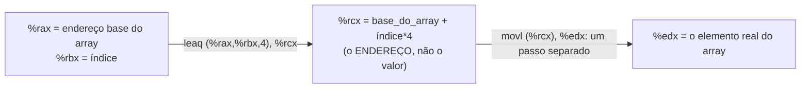

## Objetivos de Aprendizagem

- Ler e escrever instruções aritméticas do x86-64 (`add`, `sub`, `imul`, `neg`) e instruções lógicas (`and`, `or`, `xor`, `not`, deslocamentos), identificando corretamente a forma de dois operandos, fonte e depois destino.
- Explicar o que `lea` de fato faz (calcular um endereço sem desreferenciá-lo) e distingui-la claramente de `mov`.
- Usar `lea` para calcular uma expressão de endereço simples (por exemplo, o endereçamento de um elemento de array) e explicar por que ela é útil para aritmética que não tem nada a ver com memória.
- Ligar as instruções vistas aqui diretamente à ULA já projetada em `digital-logic-computer-organization`, identificando cada instrução como uma operação específica que esse mesmo circuito é ligado para executar.
- Traduzir à mão uma curta expressão aritmética em C para a sequência equivalente de instruções x86-64.

## Contexto e Motivação

`digital-logic-computer-organization/designing-an-arithmetic-logic-unit` construiu um único circuito, a ULA, capaz de executar muitas operações diferentes (somar, subtrair, AND, OR) sobre duas entradas, selecionadas por um sinal de controle que escolhe qual operação de fato produzir num dado ciclo. Este conceito é o vocabulário, no nível da ISA, para escolher essa operação: cada mnemônico visto aqui (`add`, `sub`, `imul`, `and`, `or`, `xor`) é, na máquina real, uma seleção específica de sinal de controle para exatamente esse mesmo tipo de circuito de ULA, agora com um nome que um programador ou compilador pode escrever diretamente, em vez de um fio que o datapath decodifica internamente.

É também aqui que o vocabulário de registradores de `x86-64-registers-and-data-movement` começa a fazer trabalho computacional real, em vez de só mover valores de um lado para o outro. Quase todo operador aritmético e lógico disponível em C (`+`, `-`, `*`, `&`, `|`, `^`, `<<`, `>>`) é compilado para uma das instruções vistas aqui, operando sobre os registradores que guardam os operandos. É exatamente o elo mecânico entre uma expressão em C e o código de máquina em que ela se transforma, uma instrução por vez.

`lea` (load effective address) está neste bloco especificamente porque é uma das instruções mais genuinamente surpreendentes da ISA, e as duas fontes principais desta disciplina a tratam com cuidado: superficialmente, ela parece uma instrução de memória (sua sintaxe lembra um operando de memória), mas nunca acessa a memória de fato. Ela calcula uma expressão de endereço e guarda esse número calculado, o que a torna uma instrução aritmética útil e de uso geral para expressões que não têm nada a ver com ponteiros, um fato que os compiladores exploram o tempo todo.

## Teoria Central

### Instruções aritméticas: dois operandos, a fonte afeta o destino

As instruções aritméticas do x86-64 seguem a mesma ordem fonte-depois-destino de `mov`, mas a maioria delas combina os dois operandos no destino, em vez de simplesmente copiar:

```text
addq %rbx, %rax     ; %rax = %rax + %rbx
subq %rbx, %rax     ; %rax = %rax - %rbx
imulq %rbx, %rax    ; %rax = %rax * %rbx
negq %rax           ; %rax = -%rax  (inverso aritmético, um operando)
```

Cada uma delas é uma instrução direta e nomeada para uma operação que a ULA (já projetada estruturalmente em `designing-an-arithmetic-logic-unit`) é ligada para calcular. `add` e `sub` compartilham o circuito somador da ULA exatamente como aquele conceito descreveu (a subtração implementada por negação em complemento de dois mais soma), e `imul` aciona um circuito de multiplicação dedicado, além do somador básico.

### Instruções lógicas (bit a bit)

```text
andq %rbx, %rax     ; %rax = %rax & %rbx   (AND bit a bit)
orq  %rbx, %rax     ; %rax = %rax | %rbx    (OR bit a bit)
xorq %rbx, %rax     ; %rax = %rax ^ %rbx    (XOR bit a bit)
notq %rax           ; %rax = ~%rax          (NOT bit a bit, um operando)
```

Essas são exatamente as operações bit a bit que `digital-logic-computer-organization/logic-gates-and-truth-tables` viu como circuitos físicos de portas, agora disponíveis como instruções que operam sobre registradores inteiros de 64 bits (ou mais estreitos, com o sufixo apropriado) de uma vez. Uma instrução AND é, no nível do hardware, 64 portas AND individuais operando em paralelo, uma por posição de bit.

`xorq %rax, %rax` merece uma observação específica e real: fazer XOR de um registrador com ele mesmo sempre produz 0 (qualquer valor XOR ele mesmo dá 0), e esse idioma é usado com frequência por compiladores reais e por assembly escrito à mão especificamente para zerar um registrador, porque costuma ser mais rápido e gerar código de máquina menor que `movq $0, %rax`.

### Instruções de deslocamento

```text
shlq $2, %rax    ; deslocamento à esquerda: %rax = %rax << 2  (multiplica por 4, para valores sem overflow)
shrq $2, %rax    ; deslocamento à direita (lógico): preenche os bits altos liberados com 0
sarq $2, %rax    ; deslocamento à direita (aritmético): preenche os bits altos liberados com o bit de sinal
```

A distinção entre `shr` (deslocamento lógico à direita) e `sar` (deslocamento aritmético à direita) importa especificamente para valores com sinal: um deslocamento lógico sempre preenche os bits de ordem alta liberados com 0, o que transformaria um número negativo em complemento de dois de forma incorreta e inconsistente, enquanto um deslocamento aritmético os preenche com cópias do bit de sinal original, preservando corretamente o sinal de um valor negativo. É o mesmo raciocínio de complemento de dois que `unsigned-and-twos-complement-integers` já estabeleceu.

### `lea`: calculando um endereço sem desreferenciá-lo

`lea` (load effective address) parece uma instrução de memória, mas é fundamentalmente diferente de todas as outras instruções discutidas até aqui: ela calcula uma expressão de endereço e guarda o *próprio número calculado* no destino, sem nunca ler a memória à qual esse endereço se refere:

```text
leaq (%rax, %rbx, 4), %rcx    ; %rcx = %rax + %rbx * 4  (calculado, não desreferenciado)
```

Essa sintaxe de modo de endereçamento (`registrador base, registrador índice, escala`) calcula exatamente a aritmética de ponteiros com escala já vista em `pointer-arithmetic-and-array-decay`: se `%rax` guarda o endereço inicial de um array e `%rbx` guarda um índice, `leaq (%rax, %rbx, 4)` calcula o endereço do `int` (4 bytes cada) naquele índice, numa única instrução, mas guarda esse *endereço*, e não o valor armazenado lá. Ler o elemento real do array ainda exige um `mov` separado com esse endereço calculado.



Como `lea` só calcula uma expressão aritmética de endereço e nunca toca a memória, os compiladores a usam rotineiramente para aritmética inteira comum que não tem nada a ver com ponteiros. `leaq (%rax, %rax, 2), %rbx`, por exemplo, calcula `%rax + %rax * 2 = %rax * 3` numa única instrução, um truque que compiladores reais usam porque muitas vezes é mais rápido que uma instrução de multiplicação de verdade para multiplicadores pequenos e fixos.

## Exemplos Resolvidos

### Exemplo 1: traduzindo uma expressão em C à mão

```c
int result = (a + b) * 2 - c;
```

Supondo que `a`, `b` e `c` já estejam carregados em `%eax`, `%ebx` e `%ecx`, respectivamente:

```text
addl %ebx, %eax     ; %eax = a + b
sall $1, %eax        ; %eax = (a + b) * 2   (deslocar 1 à esquerda == multiplicar por 2)
subl %ecx, %eax      ; %eax = (a + b) * 2 - c
```

É o mesmo tipo de tradução mecânica, um operador por vez, que `translating-control-flow-if-while-for` vai aplicar às construções de controle de fluxo: um compilador decompõe uma expressão composta numa curta sequência de instruções, cada uma calculando uma subexpressão e deixando o resultado num registrador que a próxima instrução consome. Usar um deslocamento em vez de `imul` para multiplicar por uma pequena potência de 2 é uma otimização de compilador real e comum, já que deslocamentos costumam ser mais rápidos que uma instrução de multiplicação geral.

### Exemplo 2: `lea` para aritmética pura, sem ponteiros envolvidos

```c
int x = 7;
int y = x * 5;
```

```text
; supondo que x está em %eax
leal (%eax, %eax, 4), %ebx    ; %ebx = %eax + %eax*4 = %eax*5, calculado sem acesso à memória
```

Não há array nem ponteiro em lugar nenhum deste código C: `x * 5` é aritmética inteira comum. Um compilador real ainda pode escolher calculá-la com o hardware de aritmética de endereços de `lea`, simplesmente porque a forma de soma com escala (`base + índice*escala`) por acaso calcula `x*5` numa instrução, mais rápido que uma multiplicação de uso geral. É exatamente o tipo de decisão de seleção de instruções que um compilador toma e que não tem nada a ver com a intenção do programador de usar ponteiros.

### Exemplo 3: `lea` versus `mov` pelo mesmo endereço, lado a lado

```text
; %rax guarda o endereço de uma variável int x, cujo valor é 100

leaq (%rax), %rbx     ; %rbx = o ENDEREÇO em %rax (só uma cópia do valor de %rax, inalterado)
movq (%rax), %rcx     ; %rcx = o VALOR armazenado NAQUELE endereço (100)
```

`leaq (%rax), %rbx` calcula a expressão de endereço `(%rax)` (sem índice nem escala aqui, é simplesmente o próprio valor de `%rax`) e guarda esse endereço em `%rbx`, sem nunca ler a memória para a qual `%rax` aponta. `movq (%rax), %rcx`, em contraste, desreferencia: lê o valor real de 8 bytes armazenado naquele endereço. Depois das duas instruções, `%rbx` guarda o mesmo endereço que `%rax` já guardava, enquanto `%rcx` guarda `100`, o valor que mora lá: exatamente a distinção entre endereço e desreferência de `pointers-addresses-and-dereferencing`, agora visível como duas instruções diferentes que escolhem um comportamento ou o outro.

## Equívocos Comuns e Armadilhas

- **"`lea` lê um valor da memória, como `mov` faz com um operando de memória."** Nunca lê: `lea` calcula uma *expressão* de endereço e guarda esse número calculado; não faz acesso nenhum à memória, por mais que a sintaxe do operando pareça de memória.
- **"O deslocamento à direita sempre se comporta igual, quer o valor tenha sinal ou não."** `shr` (lógico) e `sar` (aritmético) preenchem os bits altos liberados de forma diferente (com 0s versus cópias do bit de sinal), e usar o errado num valor negativo em complemento de dois produz silenciosamente um resultado incorreto, em vez de um erro.
- **"`xorq %rax, %rax` é um jeito estranho e nada óbvio de escrever código que só zera um registrador."** É um idioma padrão e deliberado do mundo real, escolhido especificamente porque fazer XOR de um registrador com ele mesmo costuma ser mais rápido e mais compacto que carregar o valor imediato 0.
- **"Essas instruções são um tema separado da ULA vista em `digital-logic-computer-organization`."** Elas são seleções nomeadas, no nível da ISA, exatamente das operações daquele mesmo circuito de ULA: `add`, `sub`, `and`, `or` aqui não são hardware novo, são o vocabulário para escolher qual operação aquele circuito já construído executa num dado ciclo.

## Resumo

As instruções aritméticas (`add`, `sub`, `imul`, `neg`) e lógicas (`and`, `or`, `xor`, `not`, deslocamentos) do x86-64 são os nomes, no nível da ISA, de operações que a ULA, já projetada como circuito de hardware em `digital-logic-computer-organization`, é ligada para executar; cada instrução é uma seleção específica e nomeada de sinal de controle para esse mesmo circuito. `lea` é uma instrução genuinamente distinta que calcula uma expressão de endereço usando a mesma sintaxe de aritmética com escala dos operandos de memória, mas nunca a desreferencia, e é exatamente por isso que os compiladores a reaproveitam para aritmética inteira comum que não tem nada a ver com ponteiros, simplesmente porque seu hardware de soma com escala calcula certas expressões (como multiplicar por 3 ou por 5) numa única instrução rápida. Traduzir uma expressão composta em C para assembly é um processo mecânico, um operador por vez, usando exatamente essas instruções, cada uma deixando o resultado num registrador que a próxima instrução consome.

## Documentation Links

- [Stanford CS107: Guide to x86-64](https://web.stanford.edu/class/cs107/guide/x86-64.html): referência que cobre as instruções aritméticas, lógicas e `lea` na sintaxe AT&T.
- [Bryant & O'Hallaron: Computer Systems: A Programmer's Perspective (CS:APP)](https://csapp.cs.cmu.edu/): livro-texto cujo tratamento das instruções aritméticas e lógicas, incluindo o duplo uso de `lea` para endereçamento e aritmética geral, esta disciplina segue.
