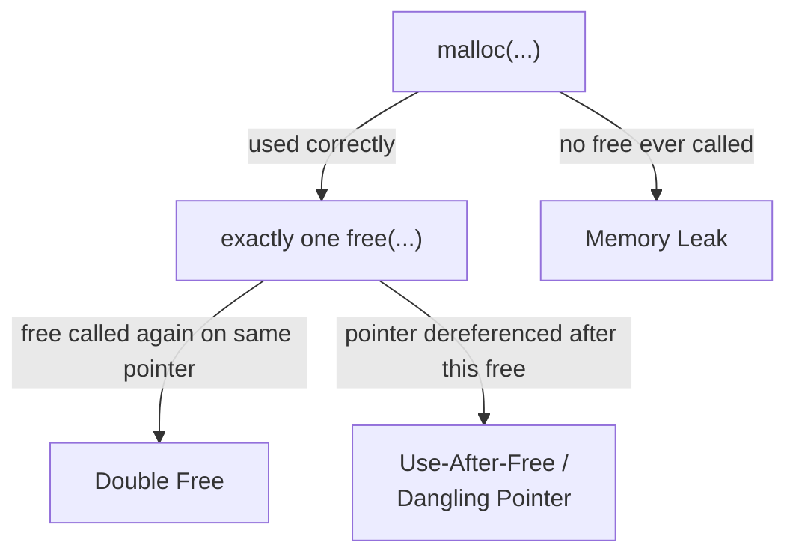

## Learning Objectives

- Distinguish three specific heap-management failures — the memory leak, the double free, and the dangling pointer / use-after-free — by exactly what invariant each one violates.
- Identify a memory leak in a short code example, and explain why a leak is a resource-exhaustion problem rather than an immediate crash.
- Identify a double free and a use-after-free in short code examples, and explain why both are undefined behavior rather than merely "using stale data."
- Explain why these three bugs are a direct, structural consequence of `malloc`/`free` requiring the programmer to track allocation and lifetime by hand.
- State, for each bug, one concrete defensive habit that prevents it (matching every `malloc` with exactly one `free`, nulling a pointer after freeing it, never storing a pointer to something already freed).

## Context & Motivation

`the-heap-and-dynamic-allocation` established the one invariant manual memory management depends on entirely: every successful `malloc` must be matched by exactly one `free` — not zero, not more than one — and a freed pointer must never be dereferenced again. This concept is the direct consequence of that invariant being violated, in each of the three distinct ways it can fail. These are not obscure edge cases; they are the most common, most studied class of bug in C and C++ code, precisely because the language provides no automatic enforcement of the invariant and no runtime check when it's broken.

Understanding these bugs precisely — not just "memory bugs happen" but which specific rule each one breaks — is what makes manual memory management tractable rather than terrifying. A memory leak (forgetting to `free`) is a resource problem: the program keeps running correctly, just with less and less available memory over time, until it eventually fails or is killed. A double free (calling `free` twice on the same pointer) and a use-after-free / dangling pointer (dereferencing memory after it's been freed) are both immediate violations of the heap allocator's own internal bookkeeping — undefined behavior the instant they occur, not merely "reading old data."

CS:APP treats these three failure modes as the standard vocabulary for reasoning about dynamic memory correctness, and Stanford CS107's dedicated "Managing the Heap" lecture builds directly toward exactly this taxonomy — not as a scare list, but as the precise, nameable ways the one invariant from the previous concept can be violated.

## Core Theory

### Memory leak: a `malloc` with no matching `free`

A leak occurs when a program allocates memory and loses every reference to it — no pointer in the program still holds that block's address — without ever calling `free` on it. The memory remains reserved, unusable by anything else, for as long as the program keeps running:

```c
void leaky(void) {
    int *data = malloc(100 * sizeof(int));
    /* ... data is used here ... */
}   /* data (the pointer, a local/stack variable) goes out of scope here —
       but the 100 ints it pointed to on the heap are never freed */
```

When `leaky` returns, the pointer variable `data` (on the stack) is reclaimed, exactly as `the-stack-and-automatic-storage` described — but the heap memory it pointed to has no other reference anywhere in the program, and is never released. Calling `leaky` repeatedly (in a loop, or across many requests in a long-running server) leaks a little more memory each time, until the process eventually exhausts available memory and fails — not immediately, but inevitably, if the leak is never fixed.

### Double free: releasing the same block twice

A double free occurs when `free` is called twice on the same pointer value, without an intervening `malloc` that reassigns it to a new, valid block:

```c
int *p = malloc(sizeof(int));
free(p);
/* ... some other code runs, possibly reusing that freed block for a new allocation ... */
free(p);   /* double free: releasing memory that may already belong to something else */
```

The heap allocator maintains its own internal bookkeeping about which blocks are free and which are in use, and calling `free` a second time on an already-freed block corrupts that bookkeeping — potentially causing the allocator to hand out the *same* block twice to two unrelated `malloc` calls later, or to crash immediately, depending on the allocator's internal implementation. This is undefined behavior specifically because nothing in the language specifies what happens; different allocators, and even the same allocator on different runs, can behave differently.

### Dangling pointer / use-after-free: dereferencing freed memory

A dangling pointer is a pointer whose pointee has already been freed (or, per `the-stack-and-automatic-storage`, whose stack-based pointee has already gone out of scope) — the pointer variable itself still holds the old address, but that address no longer refers to a valid object:

```c
int *p = malloc(sizeof(int));
*p = 42;
free(p);            /* the memory is released back to the heap allocator */

printf("%d\n", *p);  /* use-after-free: p is dangling, this dereference is undefined behavior */
```

`free(p)` does not, and cannot, change every other pointer variable that happens to hold the same address — `p` itself still contains the old address afterward, exactly as `the-heap-and-dynamic-allocation` already noted. Dereferencing it afterward might read the value that used to be there (if the memory hasn't been reused yet), might read garbage (if it has been reused for something else), or might crash — none of these outcomes is guaranteed, which is precisely what makes this bug intermittent and hard to reproduce reliably.



### Why manual management makes these bugs structural, not incidental

All three bugs trace back to the same root cause: C's `malloc`/`free` interface requires the programmer to track, entirely by hand and across however many functions and code paths a program has, exactly which blocks are currently valid and exactly one `free` call per block. There is no compiler check, no runtime enforcement, and no automatic tracking of "is this pointer still valid" — the discipline described in `the-heap-and-dynamic-allocation` (exactly one `malloc`, exactly one matching `free`) is the entire defense, and every one of these three bugs is what happens when a specific code path fails to uphold it.

## Worked Examples

### Example 1: a leak hidden inside an early return

```c
int processFile(const char *filename) {
    char *buffer = malloc(1024);
    if (buffer == NULL) return -1;

    FILE *f = fopen(filename, "r");
    if (f == NULL) {
        return -1;    /* LEAK: returns without freeing buffer */
    }

    /* ... read and process the file ... */
    fclose(f);
    free(buffer);
    return 0;
}
```

The success path correctly frees `buffer` before returning — but the early-return path, taken when `fopen` fails, returns without ever reaching `free(buffer)`. This is the single most common real-world shape a leak takes: not a function that never frees anything, but a function with *one path among several* that skips the `free` it needed. Fixing it means auditing every return statement in the function, not just the "main" one.

### Example 2: a double free triggered by sharing a pointer

```c
void cleanup(int *p) {
    free(p);
}

int main(void) {
    int *data = malloc(sizeof(int));
    cleanup(data);
    /* ... later, some other code, unaware cleanup already freed data ... */
    free(data);   /* double free: data was already released inside cleanup */
}
```

`cleanup` frees `data` correctly, from its own perspective — it has no way of knowing whether the caller will also try to free the same pointer later. The bug isn't local to either function individually; it's a violation of the *whole program's* invariant that each allocation gets exactly one `free`, once ownership (which part of the program is responsible for freeing a given pointer) isn't tracked clearly across function boundaries.

### Example 3: a dangling pointer surviving inside a struct

```c
struct Cache {
    int *data;
};

void refreshCache(struct Cache *c) {
    free(c->data);              /* release the old data */
    c->data = malloc(100 * sizeof(int));  /* allocate fresh data */
}

int readCache(struct Cache *c, int index) {
    return c->data[index];      /* safe here, since c->data was just refreshed */
}

/* elsewhere, a different pointer that was never updated: */
int *stalePointer = someCache->data;   /* saved before a refreshCache() call */
refreshCache(someCache);
printf("%d\n", stalePointer[0]);        /* dangling: stalePointer still holds the OLD, freed address */
```

`refreshCache` correctly updates `someCache->data` to point at fresh memory — but `stalePointer`, a separate variable that had earlier copied the *old* address, is never updated and has no way of knowing the memory it refers to was freed. This is exactly why "who else might be holding a copy of this address" is the real question behind every dangling-pointer bug — freeing memory only invalidates that memory; it does nothing to the (potentially many) other variables that copied its address earlier.

## Common Misconceptions & Pitfalls

- **"A memory leak crashes the program immediately."** It doesn't — a leak is a slow resource drain, not an immediate failure. A leaking program can run correctly, sometimes for a long time, before it eventually exhausts available memory and fails — which is exactly why leaks are often missed in short-lived testing and only surface in long-running production use.
- **"A double free is harmless if the freed memory hasn't been reused yet."** It's undefined behavior regardless of whether the memory has visibly been reused — it corrupts the allocator's internal bookkeeping the moment it happens, even if the visible symptom (a crash, or data corruption elsewhere) doesn't appear until much later.
- **"Setting a pointer to `NULL` after freeing it fixes every dangling-pointer bug."** It only protects that *one* pointer variable — Example 3 shows exactly why other variables holding independent copies of the same now-invalid address are completely unaffected by nulling a single one of them.
- **"These three bugs are separate, unrelated problems requiring separate fixes."** All three are violations of the exact same invariant from `the-heap-and-dynamic-allocation` — exactly one `free` per `malloc`, no dereference afterward — approached from different angles: too few frees (leak), too many frees (double free), and a dereference after the (correct number of) frees already happened (dangling pointer).

## Summary

Three distinct failure modes follow directly from `malloc`/`free`'s manual-tracking discipline: a memory leak (a `malloc` with no matching `free`, silently exhausting available memory over time), a double free (calling `free` twice on the same block, corrupting the allocator's internal bookkeeping), and a dangling pointer / use-after-free (dereferencing memory after it's already been freed, whose outcome — stale data, garbage, or a crash — is never guaranteed). All three are the structural consequence of C providing no automatic tracking of which heap blocks are currently valid, leaving the entire "exactly one `free` per `malloc`, never dereferenced afterward" invariant to the programmer, across however many functions, return paths, and shared pointers a real program has.

## Documentation Links

- [Bryant & O'Hallaron — Computer Systems: A Programmer's Perspective (CS:APP)](https://csapp.cs.cmu.edu/) — textbook establishing leaks, double frees, and dangling pointers as the standard vocabulary for reasoning about heap correctness.
- [Stanford CS107 — General Information and Syllabus](https://web.stanford.edu/class/cs107/syllabus) — course whose "Managing the Heap" lecture builds directly toward this same taxonomy of heap-management bugs.
